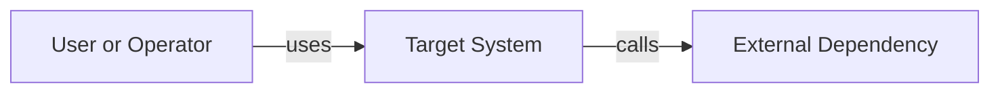
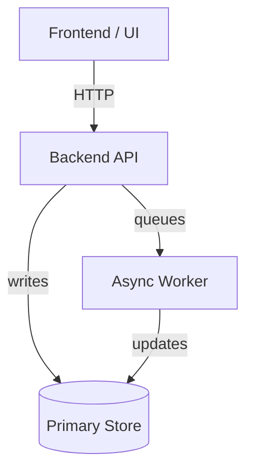
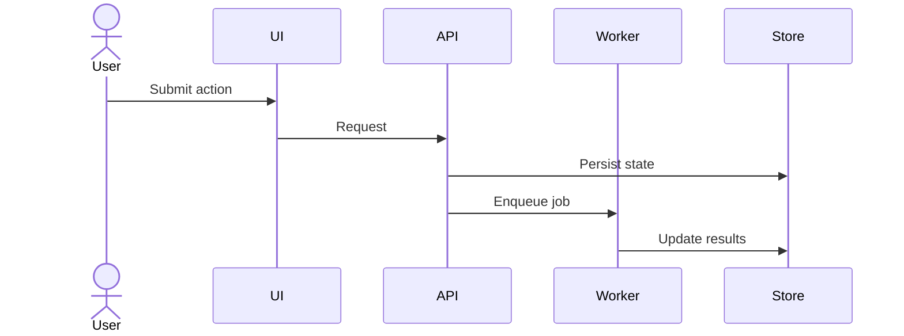
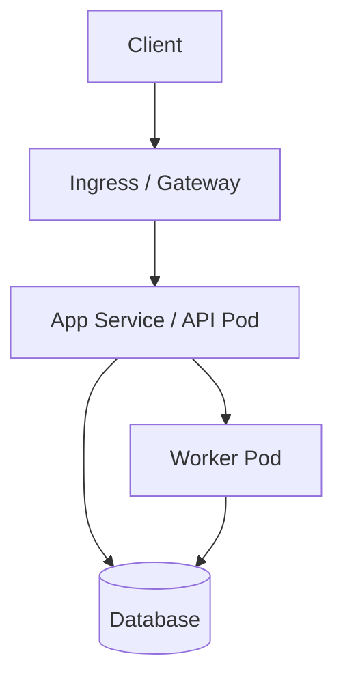

# Skill: Architecture Diagrams

Use this skill whenever a solution design needs visual communication.

## Default Output Format

Use Mermaid as the canonical diagram format.

Why:
- text-based and diff-friendly
- reliable for agent generation
- portable across VS Code, CLI, PRs, and docs

## Required Diagram Types

Choose the minimum set needed for clarity. For most solution design tasks, produce 1-3 diagrams from this set:

1. System context diagram
- External users, systems, and high-level boundaries.

2. Container or component diagram
- Major internal services/modules and their relationships.

3. Request or data flow diagram
- Key synchronous or asynchronous flow through the system.

4. Deployment diagram
- Runtime topology when infra, networking, or deployment matters.

## Canonical Mermaid Patterns

Use these Mermaid diagram families by default:

- system context: `flowchart LR`
- component/container view: `flowchart TB` or `flowchart LR`
- request or sequence flow: `sequenceDiagram` or `flowchart LR`
- deployment view: `flowchart TB`

## Required Naming Rules

- Use domain names that match the design doc and ADRs exactly.
- Name actors and systems by business meaning, not generic placeholders.
- Use short component names; put long explanations in surrounding prose.
- Keep arrow labels explicit: `calls`, `publishes`, `stores`, `reads`, `authenticates`, `indexes`.

## Required Mermaid Templates

### System Context

### Component / Container Diagram

### Request / Data Flow

### Deployment Diagram

## Diagram Rules

- Keep labels concrete and domain-specific.
- Do not overload one diagram with every component in the system.
- Prefer multiple small diagrams over one unreadable diagram.
- Match names used in the design doc and ADRs.
- If there is ambiguity, annotate it in surrounding prose instead of inventing certainty in the diagram.
- Prefer 1-3 diagrams per design package, not a diagram for every sentence in the document.
- Make trust boundaries, tenant boundaries, and external dependencies visually obvious when relevant.

## Quality Bar

- A reader should understand the main architecture in under 60 seconds.
- Each diagram should answer one question clearly.
- If a diagram requires a paragraph to decode, split it.
- Deployment diagrams are required when infra or production topology is a material part of the design.

## Optional Export Note

If the user explicitly asks for Draw.io or Excalidraw, Mermaid remains the source representation unless a separate export skill exists.
