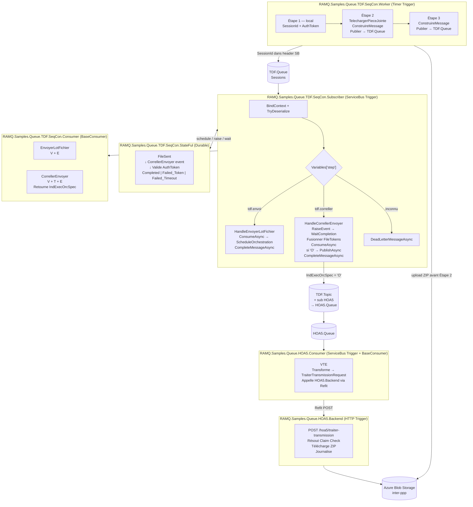

# TDF PoC — Spécification du Proof of Concept

**Projet :** Remplacement de BizTalk HOA5/TDF par Azure Functions + EMT
**Version :** 2.0
**Référence architecture :** [`target-state-hoa5-fr.md`](../target-state-hoa5-fr.md)
**Périmètre :** Proof of Concept — flux entrant TDF complet (3 étapes) jusqu'au HOA5 Backend

---

## 1. Objectif du PoC

Valider end-to-end que le protocole TDF en 3 étapes — actuellement géré par BizTalk Server
(`TDF_OOA2` + `MEC_HOA5`) — peut être implémenté avec **Azure Functions .NET 8 isolated worker**
et la librairie **EnterpriseMessageTransit (EMT)**.

Les six projets de code du PoC :

| # | Projet | Type | Rôle |
|---|--------|------|------|
| 1 | `RAMQ.Samples.Queue.TDF.SeqCon.Worker` | Azure Function — **Timer Trigger** | Simule le TDF Frontend : publie 3 étapes dans `TDF.Queue` via EMT |
| 2 | `RAMQ.Samples.Queue.TDF.SeqCon.Subscriber` | Azure Function — **ServiceBus Trigger** | Orchestrateur mince : route par étape, coordonne StateFul, Consumer, Producer |
| 3 | `RAMQ.Samples.Queue.TDF.SeqCon.Consumer` | Librairie — **EMT BaseConsumer** | Logique métier des Étapes 2 et 3 (VTE) |
| 4 | `RAMQ.Samples.Queue.TDF.SeqCon.StateFul` | Azure Function — **Durable** | Corrélation d'état inter-étapes + validation token |
| 5 | `RAMQ.Samples.Queue.HOA5.Consumer` | Azure Function — **ServiceBus Trigger** | Logique HOA5 : VTE + appel HTTP vers HOA5 Backend |
| 6 | `RAMQ.Samples.Queue.HOA5.Backend` | Azure Function — **HTTP Trigger** | Backend HOA5 : reçoit requête, résout Claim Check Blob |

> **Infrastructure hors périmètre :** `TDF.Queue`, `TDF.Topic`, `HOA5.Queue`, l'abonnement HOA5,
> et la règle `ForwardTo` sont gérés par l'équipe infrastructure. Ces ressources sont
> supposées **pré-provisionnées**. Le code ne crée aucune ressource Service Bus.

---

## 2. Protocole TDF — Rappel

| Étape | `Variables["step"]` | Pièce jointe | Description |
|-------|---------------------|--------------|-------------|
| 1 — InitierEnvoi | *(jamais publié)* | Non | Entièrement local dans le Worker : génère `SessionId` + `AuthorizationToken`. Aucun message Service Bus. |
| 2 — EnvoyerLotFichier | `"tdf.envoi"` | **Oui (ZIP)** | Upload ZIP → Blob. Publie `TdfTransactionCommand` dans `TDF.Queue`. |
| 3 — CorrellerEnvoyer | `"tdf.correller"` | Non | Corrélation finale. Retourne `IndExecOrcSpec`. Routage conditionnel → `TDF.Topic` si `"O"`. |

> **Invariant critique :** `Variables["step"]` est le seul discriminateur d'étape.
> `CurrentStage` n'est pas utilisé (patron **Sequential Convoy**, non Saga EMT).

---

## 3. Contrat de message

### 3.1 Record de domaine partagé

```csharp
// Projet : RAMQ.Samples.Queue.TDF.SeqCon.Consumer / Messages/TdfTransactionCommand.cs
public sealed record TdfTransactionCommand(
    string  AuthorizationToken,
    string  NumeroEchange,
    string? BlobReference   = null,   // référence relative blob — Étape 2 uniquement
    string? AccuseReception = null);  // accusé de réception — Étape 3 uniquement
```

### 3.2 Règles sur `SessionId`

- Format PoC : `"POC-" + Guid.NewGuid().ToString("N")`
  ex. `"POC-a1b2c3d4e5f641a28b3c4d5e6f7a8b9c"`
- **Obligatoire.** Si absent avec sessions activées, EMT lève `ArgumentNullException`.
- Identique aux Étapes 2 et 3 — double rôle : clé de corrélation Service Bus + `InstanceId` Durable.

### 3.3 Règles sur les Tokens (Claim Check)

- `TokenMessage.Reference` = **chemin relatif uniquement**.
  Format : `"tdf/echgfich/poc/{sessionId}/{yyyyMMddHHmmss}/payload.bin"`
  **Jamais une URL absolue, jamais un SAS token.**
- Étape 2 : au moins un `TokenKind.File` (Kind = 1) — référence vers le ZIP uploadé.
- Étape 3 : **aucun token** dans le message entrant. Le Subscriber fusionne les `FileTokens`
  depuis le résultat de l'orchestration Durable **avant** d'invoquer le Consumer.

### 3.4 Enveloppe JSON — Étape 2 (référence)

```json
{
  "MessageType":  "TdfTransactionCommand",
  "MessageId":    "9c4f7f9c2f5f4cd49f767eb86ec2397a",
  "SessionId":    "POC-a1b2c3d4e5f641a28b3c4d5e6f7a8b9c",
  "CurrentStage": null,
  "Variables": { "step": "tdf.envoi" },
  "Tokens": [
    {
      "Kind":        1,
      "ContentType": "application/octet-stream",
      "Reference":   "tdf/echgfich/poc/POC-a1b2c3d4/20260526143025/payload.bin",
      "SizeBytes":   65536
    }
  ],
  "Message": {
    "AuthorizationToken": "auth-poc-a1b2c3d4",
    "NumeroEchange":      "POC-a1b2c3d4e5f641a28b3c4d5e6f7a8b9c",
    "BlobReference":      "tdf/echgfich/poc/POC-a1b2c3d4/20260526143025/payload.bin",
    "AccuseReception":    null
  }
}
```

### 3.5 Enveloppe JSON — Étape 3 (référence)

```json
{
  "MessageType":  "TdfTransactionCommand",
  "MessageId":    "3e7c1b9a4d2f4e8c9a0b1c2d3e4f5a6b",
  "SessionId":    "POC-a1b2c3d4e5f641a28b3c4d5e6f7a8b9c",
  "CurrentStage": null,
  "Variables": { "step": "tdf.correller" },
  "Tokens":   [],
  "Message": {
    "AuthorizationToken": "auth-poc-a1b2c3d4",
    "NumeroEchange":      "POC-a1b2c3d4e5f641a28b3c4d5e6f7a8b9c",
    "BlobReference":      null,
    "AccuseReception":    "ACK-POC-OK"
  }
}
```

---

## 4. Architecture du PoC



---

## 5. Composants — Design détaillé

---

### 5.1 RAMQ.Samples.Queue.TDF.SeqCon.Worker

**Type :** Azure Function — Timer Trigger
**Déclenchement :** `"0 */2 * * * *"` (toutes les 2 minutes — configurable)
**Rôle :** Simuler le TDF Frontend. Exécute un cycle TDF complet à chaque déclenchement.

Le Worker expose **quatre méthodes** correspondant aux quatre responsabilités distinctes :

| Méthode | Responsabilité |
|---------|----------------|
| `Run` | Point d'entrée Timer Trigger — délègue à `ExecuterTransactionTroisEtapesAsync` |
| `ExecuterTransactionTroisEtapesAsync` | Orchestre les 3 étapes TDF dans l'ordre |
| `TelechargerPieceJointeAsync` | Génère le ZIP de test + upload Claim Check → Blob Storage |
| `ConstruireMessage` | Construit le `MessageTransitContext<TdfTransactionCommand>` complet |
| `PublierAsync` | Appelle `IMessageProducer<T>.PublishAsync` + journalise |

#### 5.1.1 Point d'entrée

```csharp
public class TdfSeqConWorkerFunction
{
    private readonly IMessageProducer<TdfTransactionCommand> _producer;
    private readonly BlobContainerClient _blobContainer;
    private readonly WorkerOptions _options;
    private readonly ILogger<TdfSeqConWorkerFunction> _logger;

    public TdfSeqConWorkerFunction(
        IMessageProducer<TdfTransactionCommand> producer,
        BlobContainerClient blobContainer,
        IOptions<WorkerOptions> options,
        ILogger<TdfSeqConWorkerFunction> logger)
    {
        _producer      = producer;
        _blobContainer = blobContainer;
        _options       = options.Value;
        _logger        = logger;
    }

    [Function("TdfSeqConWorker")]
    public async Task Run(
        [TimerTrigger("%Worker:TimerSchedule%")] TimerInfo timer,
        CancellationToken cancellationToken)
    {
        _logger.LogInformation("Worker TDF démarré. {Timestamp}", DateTimeOffset.UtcNow);
        await ExecuterTransactionTroisEtapesAsync(cancellationToken);
    }
```

#### 5.1.2 Transaction 3 étapes

```csharp
    // ─────────────────────────────────────────────────────────────────────
    //  3 ÉTAPES : Étape 1 (local) → Étape 2 (PièceJointe + Message + Publier)
    //             → Étape 3 (Message + Publier)
    // ─────────────────────────────────────────────────────────────────────
    private async Task ExecuterTransactionTroisEtapesAsync(CancellationToken ct)
    {
        // ── ÉTAPE 1 — InitierEnvoi (entièrement local, aucun message Service Bus) ──────
        var sessionId     = "POC-" + Guid.NewGuid().ToString("N");
        var authToken     = "auth-poc-" + Guid.NewGuid().ToString("N")[..12];
        var numeroEchange = sessionId;

        _logger.LogInformation(
            "Étape 1 (local). SessionId={S}, AuthToken={A}", sessionId, authToken);

        // ── ÉTAPE 2 — EnvoyerLotFichier ─────────────────────────────────────────────
        var (blobPath, sizeBytes) = await TelechargerPieceJointeAsync(sessionId, ct);

        var ctxEtape2 = ConstruireMessage(
            step           : "tdf.envoi",
            sessionId      : sessionId,
            authToken      : authToken,
            numeroEchange  : numeroEchange,
            blobPath       : blobPath,
            sizeBytes      : sizeBytes,
            accuseReception: null);

        await PublierAsync(ctxEtape2, ct);
        _logger.LogInformation("Étape 2 publiée. SessionId={S}, BlobPath={B}", sessionId, blobPath);

        // ── ÉTAPE 3 — CorrellerEnvoyer (après délai configurable) ────────────────────
        await Task.Delay(TimeSpan.FromSeconds(_options.Step3DelaySeconds), ct);

        var ctxEtape3 = ConstruireMessage(
            step           : "tdf.correller",
            sessionId      : sessionId,
            authToken      : authToken,    // DOIT correspondre — l'orchestrateur valide
            numeroEchange  : numeroEchange,
            blobPath       : null,         // aucune pièce jointe à l'Étape 3
            sizeBytes      : 0,
            accuseReception: "ACK-POC-OK");

        await PublierAsync(ctxEtape3, ct);
        _logger.LogInformation("Étape 3 publiée. SessionId={S}", sessionId);
    }
```

#### 5.1.3 Pièce jointe — Téléversement Claim Check

```csharp
    // ─────────────────────────────────────────────────────────────────────
    //  PIÈCE JOINTE : génère un ZIP de test et l'uploade dans Blob Storage.
    //  Retourne (blobPath, sizeBytes). Ne retourne jamais d'URL absolue.
    // ─────────────────────────────────────────────────────────────────────
    private async Task<(string BlobPath, long SizeBytes)> TelechargerPieceJointeAsync(
        string sessionId, CancellationToken ct)
    {
        var timestamp = DateTime.UtcNow.ToString("yyyyMMddHHmmss");
        var blobPath  = $"tdf/echgfich/poc/{sessionId}/{timestamp}/payload.bin";

        // Contenu de test : 64 Ko de données aléatoires simulant un ZIP
        var zipBytes = new byte[64 * 1024];
        Random.Shared.NextBytes(zipBytes);

        var blobClient = _blobContainer.GetBlobClient(blobPath);
        await blobClient.UploadAsync(
            content   : new BinaryData(zipBytes),
            overwrite : false,            // idempotence — ne jamais écraser
            cancellationToken: ct);

        _logger.LogInformation(
            "Pièce jointe téléversée. BlobPath={P}, Size={S} octets", blobPath, zipBytes.Length);

        // Retourne le chemin RELATIF — jamais d'URL absolue ni de SAS token
        return (blobPath, zipBytes.Length);
    }
```

#### 5.1.4 Construction du message EMT

```csharp
    // ─────────────────────────────────────────────────────────────────────
    //  MESSAGE : construit le MessageTransitContext<TdfTransactionCommand>
    //  complet pour l'étape demandée.
    //  — Étape 2 : ajoute un TokenKind.File avec la référence relative blob.
    //  — Étape 3 : aucun token (le Subscriber fusionnera les FileTokens Étape 2).
    // ─────────────────────────────────────────────────────────────────────
    private static MessageTransitContext<TdfTransactionCommand> ConstruireMessage(
        string  step,
        string  sessionId,
        string  authToken,
        string  numeroEchange,
        string? blobPath,
        long    sizeBytes,
        string? accuseReception)
    {
        var tokens = new List<TokenMessage>();

        if (step == "tdf.envoi" && !string.IsNullOrWhiteSpace(blobPath))
        {
            tokens.Add(new TokenMessage
            {
                Kind        = TokenKind.File,           // Kind = 1
                ContentType = "application/octet-stream",
                Reference   = blobPath,                 // chemin RELATIF — jamais d'URL
                SizeBytes   = sizeBytes
            });
        }

        return new MessageTransitContext<TdfTransactionCommand>
        {
            MessageType  = nameof(TdfTransactionCommand),
            MessageId    = Guid.NewGuid().ToString("N"),
            SessionId    = sessionId,       // OBLIGATOIRE — EMT lève ArgumentNullException si absent
            CurrentStage = null,            // non utilisé — patron Sequential Convoy
            Variables    = new Dictionary<string, object> { ["step"] = step },
            Tokens       = tokens,
            Message      = new TdfTransactionCommand(
                AuthorizationToken : authToken,
                NumeroEchange      : numeroEchange,
                BlobReference      : blobPath,
                AccuseReception    : accuseReception)
        };
    }
```

#### 5.1.5 Publication EMT

```csharp
    // ─────────────────────────────────────────────────────────────────────
    //  PUBLIER : délègue à IMessageProducer<TdfTransactionCommand>.PublishAsync.
    //  C'est la SEULE voie autorisée pour envoyer un message Service Bus.
    //  SessionId est propagé automatiquement par EMT dans l'en-tête Service Bus.
    // ─────────────────────────────────────────────────────────────────────
    private async Task PublierAsync(
        MessageTransitContext<TdfTransactionCommand> context,
        CancellationToken ct)
    {
        await _producer.PublishAsync(context, ct);

        _logger.LogInformation(
            "Message publié. Step={Step}, SessionId={S}, MessageId={Id}",
            context.Variables["step"], context.SessionId, context.MessageId);
    }
}
```

#### 5.1.6 Configuration DI (`Program.cs`)

```csharp
var builder = new HostBuilder().ConfigureFunctionsWorkerDefaults();

builder.Services
    .AddProducer<TdfTransactionCommand>(opts =>
    {
        opts.Endpoint.EntityName    = builder.Configuration["AppSettings:Queue:EntityName"];
        opts.Endpoint.EnableSession = true;   // TDF.Queue — sessions obligatoires
    })
    .AddSingleton(_ =>
        new BlobServiceClient(builder.Configuration["BlobStorage:ConnectionString"])
            .GetBlobContainerClient("inter-ppp"))
    .Configure<WorkerOptions>(builder.Configuration.GetSection("Worker"));

builder.Build().Run();
```

#### 5.1.7 Configuration `appsettings.json`

```json
{
  "ServiceBusConnection": "<connection string ou Managed Identity endpoint>",
  "BlobStorage": {
    "ConnectionString": "<connection string ou Managed Identity>"
  },
  "AppSettings": {
    "Queue": { "EntityName": "TDF.Queue" }
  },
  "Worker": {
    "TimerSchedule":   "0 */2 * * * *",
    "Step3DelaySeconds": 5
  }
}
```

**`host.json` :**

```json
{
  "version": "2.0",
  "logging": {
    "logLevel": { "RAMQ": "Information" }
  }
}
```

**Options :**

```csharp
public sealed class WorkerOptions
{
    public string TimerSchedule    { get; set; } = "0 */2 * * * *";
    public int    Step3DelaySeconds { get; set; } = 5;
}
```

---

### 5.2 RAMQ.Samples.Queue.TDF.SeqCon.Subscriber

**Type :** Azure Function — ServiceBus Trigger
**Rôle :** Couche d'orchestration mince sur `TDF.Queue`. **Aucune logique métier.**
Coordonne `StateFul`, `Consumer`, et `IMessageProducer`. Seul responsable
du `PublishAsync` vers `TDF.Topic`.

#### Règles absolues

| Règle | Description |
|-------|-------------|
| `AutoCompleteMessages = false` | EMT contrôle le cycle de vie du message |
| `IsSessionsEnabled = true` | Sequential Convoy — une session par échange |
| Jamais `ServiceBusMessageActions` directement | Toujours via `_consumer.CompleteMessageAsync` / `DeadLetterMessageAsync` |
| Complétion différée | `_consumer.CompleteMessageAsync` est **toujours le dernier appel** |
| Pas de logique métier | Tout le VTE délégué au Consumer |
| `PublishAsync` dans le Subscriber | Le Consumer retourne `IndExecOrcSpec` — c'est le Subscriber qui publie vers `TDF.Topic` |

#### Structure de classe

```csharp
public class TdfSeqConSubscriberFunction
{
    private readonly TdfSeqConConsumer _consumer;
    private readonly IMessageProducer<TdfTransactionCommand> _topicProducer;
    private readonly ILogger<TdfSeqConSubscriberFunction> _logger;

    public TdfSeqConSubscriberFunction(
        TdfSeqConConsumer consumer,
        IMessageProducer<TdfTransactionCommand> topicProducer,
        ILogger<TdfSeqConSubscriberFunction> logger)
    { /* ... */ }

    [Function("TdfSeqConSubscriber")]
    public async Task RunAsync(
        [ServiceBusTrigger(
            "%AppSettings:Queue:EntityName%",
            Connection          = "ServiceBusConnection",
            AutoCompleteMessages = false,
            IsSessionsEnabled   = true)]
        ServiceBusReceivedMessage message,
        ServiceBusMessageActions  actions,
        [DurableClient] DurableTaskClient durableClient,
        CancellationToken cancellationToken)
    {
        _consumer.BindContext(message, actions);

        if (!_consumer.TryDeserializeMessage<TdfTransactionCommand>(out var context))
        {
            await _consumer.DeadLetterMessageAsync(
                new InvalidOperationException("Format de message invalide."),
                cancellationToken);
            return;
        }

        var step = context.Variables.GetValueOrDefault("step") as string;
        _logger.LogInformation("Reçu. Step={S}, SessionId={Id}", step, context.SessionId);

        switch (step)
        {
            case "tdf.envoi":
                await HandleEnvoyerLotFichierAsync(context, durableClient, cancellationToken);
                break;

            case "tdf.correller":
                await HandleCorrellerEnvoyerAsync(context, durableClient, cancellationToken);
                break;

            default:
                await _consumer.DeadLetterMessageAsync(
                    new InvalidOperationException($"Variables['step'] inconnu : '{step}'"),
                    cancellationToken);
                break;
        }
    }
```

#### Handler Étape 2

```csharp
    private async Task HandleEnvoyerLotFichierAsync(
        MessageTransitContext<TdfTransactionCommand> context,
        DurableTaskClient durableClient, CancellationToken ct)
    {
        // 1. Consumer V+E — valide enveloppe + tokens, pas d'appel API
        await _consumer.ConsumeAsync(context, ct);

        // 2. Démarrer orchestration (InstanceId = SessionId — corrélation 1:1)
        var instanceId = context.SessionId
            ?? throw new InvalidOperationException("SessionId manquant.");

        await durableClient.ScheduleNewOrchestrationInstanceAsync(
            "TdfTransactionOrchestrator",
            new EnvoyerLotFichierEvent
            {
                SessionId          = context.SessionId,
                NumeroEchange      = context.Message.NumeroEchange,
                AuthorizationToken = context.Message.AuthorizationToken,
                BlobReference      = context.Message.BlobReference,
                FileTokens         = context.Tokens?.ToList(),
                MessageId          = context.MessageId
            },
            new StartOrchestrationOptions { InstanceId = instanceId },
            ct);

        _logger.LogInformation("Orchestration démarrée. InstanceId={Id}", instanceId);

        // 3. Complétion différée — TOUJOURS en dernier
        await _consumer.CompleteMessageAsync(ct);
    }
```

#### Handler Étape 3

```csharp
    private async Task HandleCorrellerEnvoyerAsync(
        MessageTransitContext<TdfTransactionCommand> context,
        DurableTaskClient durableClient, CancellationToken ct)
    {
        var instanceId = context.SessionId
            ?? throw new InvalidOperationException("SessionId manquant.");

        // 1. Notifier l'orchestrateur de l'arrivée de l'Étape 3
        await durableClient.RaiseEventAsync(
            instanceId,
            "CorrellerEnvoyer",
            new CorrellerEnvoyerEvent
            {
                AuthorizationToken = context.Message.AuthorizationToken,
                MessageId          = context.MessageId
            },
            ct);

        // 2. Attendre la complétion (validation token + récupération données Étape 2)
        var result = await durableClient.WaitForInstanceCompletionAsync(instanceId, ct);

        // 3. Échec orchestration → DLQ immédiate, pas de replay
        if (result.RuntimeStatus != OrchestrationRuntimeStatus.Completed)
        {
            _logger.LogWarning("Orchestration échouée. Status={S}", result.RuntimeStatus);
            await _consumer.DeadLetterMessageAsync(
                new InvalidOperationException(
                    $"Orchestration {instanceId} : {result.RuntimeStatus}. NonReplayable."),
                ct);
            return;
        }

        // 4. Récupérer résultat Étape 2 depuis l'orchestration
        var correlation = result.ReadOutputAs<TransactionCorrelationResult>();

        // 5. Fusionner FileTokens de l'Étape 2 dans le contexte courant
        //    L'Étape 3 n'a pas de tokens — ils ont été transportés via l'orchestration.
        if (correlation.FileTokens?.Count > 0)
        {
            context.Tokens ??= [];
            context.Tokens.AddRange(correlation.FileTokens);
        }

        // 6. Consumer VTE complet avec contexte enrichi
        var consumerResult = await _consumer.ConsumeAsync(context, ct);

        // 7. Publication conditionnelle vers TDF.Topic
        //    IMPORTANT : le Subscriber orchestre — pas le Consumer.
        if (consumerResult?.IndExecOrcSpec == "O")
        {
            await _topicProducer.PublishAsync(
                new MessageTransitContext<TdfTransactionCommand>
                {
                    MessageType  = nameof(TdfTransactionCommand),
                    MessageId    = Guid.NewGuid().ToString("N"),
                    SessionId    = context.SessionId,
                    CurrentStage = null,
                    Variables    = new() { ["step"] = "tdf.hoa5" },
                    Tokens       = context.Tokens,
                    Message      = context.Message
                },
                properties: new Dictionary<string, object>
                {
                    ["Consumer"] = "All",
                    ["Action"]   = "http://RAMQ.HO.HOA5_ServTransmPrel_bt.SchFichCHSpec"
                },
                ct);

            _logger.LogInformation("Publié vers TDF.Topic. SessionId={S}", context.SessionId);
        }

        // 8. Complétion différée — TOUJOURS en dernier
        await _consumer.CompleteMessageAsync(ct);
    }
}
```

#### Configuration DI (`Program.cs`)

```csharp
builder.Services
    .AddConsumer<TdfTransactionCommand, TdfSeqConConsumer>()
    .AddProducer<TdfTransactionCommand>(name: "queue", opts =>
    {
        opts.Endpoint.EntityName    = config["AppSettings:Queue:EntityName"];  // TDF.Queue
        opts.Endpoint.EnableSession = true;
    })
    .AddProducer<TdfTransactionCommand>(name: "topic", opts =>
    {
        opts.Endpoint.EntityName = config["AppSettings:Topic:EntityName"];     // TDF.Topic
    });
```

**`host.json` :**

```json
{
  "version": "2.0",
  "extensions": {
    "serviceBus": {
      "prefetchCount": 0,
      "messageHandlerOptions": {
        "maxConcurrentCalls": 2,
        "autoComplete": false,
        "maxAutoRenewDuration": "00:05:00"
      }
    },
    "durableTask": {
      "storageProvider": { "type": "azure" }
    }
  }
}
```

---

### 5.3 RAMQ.Samples.Queue.TDF.SeqCon.Consumer

**Type :** Librairie .NET 8 — `BaseConsumer<TdfTransactionCommand>` (EMT)
**Rôle :** Logique métier des Étapes 2 et 3.
**Contraintes :** Aucune référence à Service Bus. Pas de `IMessageProducer`. Pas de `CompleteMessageAsync`.

```csharp
public class TdfSeqConConsumer : BaseConsumer<TdfTransactionCommand>
{
    private readonly IHoa5BackendApi _api;    // Refit — appelé à l'Étape 3 uniquement
    private readonly ILogger<TdfSeqConConsumer> _logger;

    protected override async Task<ConsumeResult> ConsumeAsync(
        MessageTransitContext<TdfTransactionCommand> context,
        CancellationToken ct)
    {
        var step = context.Variables.GetValueOrDefault("step") as string;
        return step switch
        {
            "tdf.envoi"     => await ConsumeEnvoyerLotFichierAsync(context, ct),
            "tdf.correller" => await ConsumeCorrellerEnvoyerAsync(context, ct),
            _               => throw new InvalidOperationException($"Step inconnu : '{step}'")
        };
    }
```

#### Consumer Étape 2 — V + E

```csharp
    // Validate + Enrich uniquement. Pas d'appel API. Pas de résolution Claim Check.
    private Task<ConsumeResult> ConsumeEnvoyerLotFichierAsync(
        MessageTransitContext<TdfTransactionCommand> context, CancellationToken _)
    {
        // ── VALIDATE ────────────────────────────────────────────────────
        ArgumentNullException.ThrowIfNull(context.Message);

        if (string.IsNullOrWhiteSpace(context.Message.NumeroEchange))
            throw new InvalidOperationException("NumeroEchange manquant.");

        if (string.IsNullOrWhiteSpace(context.Message.AuthorizationToken))
            throw new InvalidOperationException("AuthorizationToken manquant.");

        var fileToken = context.Tokens?.FirstOrDefault(t => t.Kind == TokenKind.File)
            ?? throw new InvalidOperationException("Token fichier (Kind=File) manquant.");

        if (string.IsNullOrWhiteSpace(fileToken.Reference))
            throw new InvalidOperationException("Token.Reference vide.");

        if (fileToken.Reference.StartsWith("https://", StringComparison.OrdinalIgnoreCase)
         || fileToken.Reference.Contains('?'))
            throw new InvalidOperationException(
                "Token.Reference ne doit pas être une URL absolue. Chemin relatif uniquement.");

        // ── ENRICH ──────────────────────────────────────────────────────
        // Le fichier reste dans Blob Storage — résolution par HOA5.Backend.
        _logger.LogInformation(
            "Étape 2 validée. NumeroEchange={N}, TokenRef={R}",
            context.Message.NumeroEchange, fileToken.Reference);

        return Task.FromResult(new ConsumeResult());
    }
```

#### Consumer Étape 3 — V + T + E

```csharp
    // Validate + Transform + Enrich. Appelle HOA5.Backend. Retourne IndExecOrcSpec.
    private async Task<ConsumeResult> ConsumeCorrellerEnvoyerAsync(
        MessageTransitContext<TdfTransactionCommand> context, CancellationToken ct)
    {
        // ── VALIDATE ────────────────────────────────────────────────────
        ArgumentNullException.ThrowIfNull(context.Message);

        if (string.IsNullOrWhiteSpace(context.Message.AccuseReception))
            throw new InvalidOperationException("AccuseReception manquant.");

        if (string.IsNullOrWhiteSpace(context.Message.NumeroEchange))
            throw new InvalidOperationException("NumeroEchange manquant.");

        // ── TRANSFORM ───────────────────────────────────────────────────
        // Remplace la map BizTalk InscrireSuiviFich → contrat OOA2
        var request = new InscrireSuiviFichCorlnRequest
        {
            NoEchg          = context.Message.NumeroEchange,
            AccuseReception = context.Message.AccuseReception,
            Erreur          = "0"
        };

        // ── ENRICH ──────────────────────────────────────────────────────
        // Idempotency-Key = MessageId → protège contre les replays Service Bus
        // X-Correlation-Id = SessionId → traçabilité bout-en-bout
        var response = await _api.InscrireSuiviFichCorlnAsync(
            idempotencyKey : context.MessageId,
            correlationId  : context.SessionId,
            request        : request,
            ct);

        _logger.LogInformation(
            "Étape 3 traitée. NumeroEchange={N}, IndExecOrcSpec={I}",
            context.Message.NumeroEchange, response.IndExecOrcSpec);

        // Retourne IndExecOrcSpec au Subscriber — c'est lui qui décide de PublishAsync
        return new ConsumeResult { IndExecOrcSpec = response.IndExecOrcSpec };
    }
}
```

#### Contrats et interface Refit

```csharp
// IHoa5BackendApi.cs
[Headers("Content-Type: application/json")]
public interface IHoa5BackendApi
{
    [Post("/hoa5/inscrire-suivi-fich")]
    Task<InscrireSuiviFichCorlnResponse> InscrireSuiviFichCorlnAsync(
        [Header("Idempotency-Key")] string idempotencyKey,
        [Header("X-Correlation-Id")] string correlationId,
        [Body] InscrireSuiviFichCorlnRequest request,
        CancellationToken cancellationToken = default);
}

public record InscrireSuiviFichCorlnRequest
{
    public required string NoEchg          { get; init; }
    public required string AccuseReception { get; init; }
    public required string Erreur          { get; init; }
}

public record InscrireSuiviFichCorlnResponse
{
    public required string IndExecOrcSpec { get; init; }   // "O" ou "N"
    public required string NoEchg         { get; init; }
    public required string Erreur         { get; init; }
}

public record ConsumeResult
{
    public string? IndExecOrcSpec { get; init; }
}
```

---

### 5.4 RAMQ.Samples.Queue.TDF.SeqCon.StateFul

**Type :** Azure Durable Function
**Rôle :** Machine à états inter-étapes. Valide le `AuthorizationToken`. Aucun appel API.

#### Modèles

```csharp
// Input (depuis Subscriber après Étape 2)
public record EnvoyerLotFichierEvent
{
    public required string             SessionId          { get; init; }
    public required string             NumeroEchange      { get; init; }
    public required string             AuthorizationToken { get; init; }
    public string?                     BlobReference      { get; init; }
    public List<TokenMessage>?         FileTokens         { get; init; }
    public required string             MessageId          { get; init; }
}

// Événement externe (depuis Subscriber après Étape 3)
public record CorrellerEnvoyerEvent
{
    public required string AuthorizationToken { get; init; }
    public required string MessageId          { get; init; }
}

// Output (retourné au Subscriber)
public record TransactionCorrelationResult
{
    public required string             AuthorizationToken { get; init; }
    public string?                     BlobReference      { get; init; }
    public required string             NumeroEchange      { get; init; }
    public List<TokenMessage>?         FileTokens         { get; init; }
}
```

#### Orchestrateur

```csharp
public class TdfTransactionOrchestrator
{
    [Function("TdfTransactionOrchestrator")]
    public async Task<TransactionCorrelationResult> RunAsync(
        [OrchestrationTrigger] TaskOrchestrationContext ctx)
    {
        var input = ctx.GetInput<EnvoyerLotFichierEvent>()
            ?? throw new InvalidOperationException("Input orchestration null.");

        ctx.SetCustomStatus("FileSent");

        // Minuteur : 30 s en PoC (pour valider le chemin d'erreur timeout),
        // 24 h en production. Configurable via variable d'env DURABLE_TIMEOUT_SECONDS.
        var timeout = ctx.GetInput<int?>() is { } secs
            ? TimeSpan.FromSeconds(secs)
            : TimeSpan.FromSeconds(30);   // PoC par défaut

        using var timerCts = new CancellationTokenSource();
        var correlerTask   = ctx.WaitForExternalEvent<CorrellerEnvoyerEvent>("CorrellerEnvoyer");
        var timerTask      = ctx.CreateTimer(ctx.CurrentUtcDateTime.Add(timeout), timerCts.Token);

        // Utilise CreateTimer (persisté) — JAMAIS Task.Delay (non persisté, non rejouable)
        var winner = await Task.WhenAny(correlerTask, timerTask);

        if (winner == timerTask)
        {
            ctx.SetCustomStatus("Failed_Timeout");
            throw new TimeoutException(
                $"Étape 3 non reçue dans le délai imparti. SessionId={input.SessionId}");
        }

        timerCts.Cancel();
        var correlEvent = await correlerTask;

        // Valide que l'AuthorizationToken de l'Étape 3 correspond à celui de l'Étape 2
        if (correlEvent.AuthorizationToken != input.AuthorizationToken)
        {
            ctx.SetCustomStatus("Failed_Token");
            throw new InvalidOperationException(
                $"AuthorizationToken invalide à l'Étape 3. SessionId={input.SessionId}");
        }

        ctx.SetCustomStatus("Completed");

        return new TransactionCorrelationResult
        {
            AuthorizationToken = input.AuthorizationToken,
            BlobReference      = input.BlobReference,
            NumeroEchange      = input.NumeroEchange,
            FileTokens         = input.FileTokens
        };
    }
}
```

**Machine à états :**

```
[*] ──► FileSent
FileSent ──► Completed      (Étape 3 reçue + AuthToken valide)
FileSent ──► Failed_Token   (AuthToken Étape 3 ≠ AuthToken Étape 2)
FileSent ──► Failed_Timeout (30 s PoC / 24 h prod sans Étape 3)
```

---

### 5.5 RAMQ.Samples.Queue.HOA5.Consumer

**Type :** Azure Function — ServiceBus Trigger + `BaseConsumer<TdfTransactionCommand>` (EMT)
**Rôle :** Réception sur `HOA5.Queue`. VTE : transforme TDF → contrat HOA5 Backend + appel Refit.

#### Subscriber HOA5

```csharp
[Function("Hoa5Subscriber")]
public async Task RunAsync(
    [ServiceBusTrigger(
        "%AppSettings:Queue:EntityName%",
        Connection          = "ServiceBusConnection",
        AutoCompleteMessages = false)]   // autoComplete: false dans host.json aussi
    ServiceBusReceivedMessage message,
    ServiceBusMessageActions  actions,
    CancellationToken cancellationToken)
{
    _consumer.BindContext(message, actions);

    if (!_consumer.TryDeserializeMessage<TdfTransactionCommand>(out var context))
    {
        await _consumer.DeadLetterMessageAsync(
            new InvalidOperationException("Désérialisation échouée."), cancellationToken);
        return;
    }

    await _consumer.ConsumeAsync(context, cancellationToken);
    await _consumer.CompleteMessageAsync(cancellationToken);   // DERNIER appel
}
```

#### Consumer HOA5 (VTE)

```csharp
public class Hoa5Consumer : BaseConsumer<TdfTransactionCommand>
{
    protected override async Task<ConsumeResult> ConsumeAsync(
        MessageTransitContext<TdfTransactionCommand> context, CancellationToken ct)
    {
        // ── VALIDATE ────────────────────────────────────────────────────
        ArgumentNullException.ThrowIfNull(context.Message);
        if (string.IsNullOrWhiteSpace(context.Message.NumeroEchange))
            throw new InvalidOperationException("NumeroEchange manquant.");

        var fileToken = context.Tokens?.FirstOrDefault(t => t.Kind == TokenKind.File);

        // ── TRANSFORM ───────────────────────────────────────────────────
        // Remplace la map BizTalk transformerMsgFichCHToMsgSVC.btm
        var request = new TraiterTransmissionRequest
        {
            NumeroEchange        = context.Message.NumeroEchange,
            AuthorizationToken   = context.Message.AuthorizationToken,
            AccuseReception      = context.Message.AccuseReception,
            FileTokenReference   = fileToken?.Reference,     // chemin relatif UNIQUEMENT
            FileTokenContentType = fileToken?.ContentType,
            FileTokenSizeBytes   = fileToken?.SizeBytes
        };

        // ── ENRICH ──────────────────────────────────────────────────────
        await _backendClient.TraiterTransmissionAsync(
            idempotencyKey : context.MessageId,
            correlationId  : context.SessionId,
            request        : request,
            ct);

        _logger.LogInformation(
            "HOA5 Backend appelé. NumeroEchange={N}, TokenRef={R}",
            context.Message.NumeroEchange, fileToken?.Reference);

        return new ConsumeResult();
    }
}
```

#### Interface Refit vers HOA5.Backend

```csharp
[Headers("Content-Type: application/json")]
public interface IHoa5BackendClient
{
    [Post("/hoa5/traiter-transmission")]
    Task TraiterTransmissionAsync(
        [Header("Idempotency-Key")] string idempotencyKey,
        [Header("X-Correlation-Id")] string correlationId,
        [Body] TraiterTransmissionRequest request,
        CancellationToken cancellationToken = default);
}

public record TraiterTransmissionRequest
{
    public required string  NumeroEchange        { get; init; }
    public required string  AuthorizationToken   { get; init; }
    public string?          AccuseReception      { get; init; }
    public string?          FileTokenReference   { get; init; }   // chemin relatif blob
    public string?          FileTokenContentType { get; init; }
    public long?            FileTokenSizeBytes   { get; init; }
}
```

---

### 5.6 RAMQ.Samples.Queue.HOA5.Backend

**Type :** Azure Function — HTTP Trigger
**Rôle :** Backend HOA5. Reçoit `TraiterTransmissionRequest`, résout le Claim Check
(téléchargement blob), journalise, retourne `200 OK`.

```csharp
[Function("TraiterTransmission")]
public async Task<HttpResponseData> RunAsync(
    [HttpTrigger(AuthorizationLevel.Function, "post", Route = "hoa5/traiter-transmission")]
    HttpRequestData req, CancellationToken ct)
{
    var idempotencyKey = req.Headers.TryGetValues("Idempotency-Key", out var keys)
        ? keys.FirstOrDefault() : null;
    var correlationId  = req.Headers.TryGetValues("X-Correlation-Id", out var ids)
        ? ids.FirstOrDefault() : null;

    var request = await req.ReadFromJsonAsync<TraiterTransmissionRequest>(ct);

    if (string.IsNullOrWhiteSpace(request?.NumeroEchange))
        return req.CreateResponse(HttpStatusCode.BadRequest);

    _logger.LogInformation(
        "HOA5 Backend. Key={K}, NumeroEchange={N}, TokenRef={R}",
        idempotencyKey, request.NumeroEchange, request.FileTokenReference);

    // Résolution Claim Check — télécharge le ZIP si token présent
    if (!string.IsNullOrWhiteSpace(request.FileTokenReference))
    {
        var blob     = _blobContainer.GetBlobClient(request.FileTokenReference);
        var download = await blob.DownloadContentAsync(ct);
        var content  = download.Value.Content.ToArray();

        // PoC : journalisation uniquement.
        // Production : décompresser ZIP, parser XML, insérer Oracle.
        _logger.LogInformation(
            "Claim Check résolu. Taille={S} octets, ContentType={C}",
            content.Length, request.FileTokenContentType);
    }

    var response = req.CreateResponse(HttpStatusCode.OK);
    await response.WriteAsJsonAsync(
        new { Status = "OK", NumeroEchange = request.NumeroEchange }, ct);
    return response;
}
```

---

## 6. Structure de la solution

```
RAMQ.Samples.Queue.TDF.SeqCon/
│
├── RAMQ.Samples.Queue.TDF.SeqCon.sln
│
├── RAMQ.Samples.Queue.TDF.SeqCon.Worker/
│   ├── *.csproj                           # net8.0, Functions.Worker, Storage.Blobs
│   ├── Program.cs                         # AddProducer<TdfTransactionCommand>
│   ├── host.json
│   ├── appsettings.json
│   ├── Options/WorkerOptions.cs
│   └── Functions/
│       └── TdfSeqConWorkerFunction.cs     # TimerTrigger + 4 méthodes
│
├── RAMQ.Samples.Queue.TDF.SeqCon.Subscriber/
│   ├── *.csproj                           # net8.0, Functions.Worker, DurableTask.Client
│   ├── Program.cs                         # AddConsumer + AddProducer (queue + topic)
│   ├── host.json                          # autoComplete: false, maxConcurrentCalls: 2
│   ├── appsettings.json
│   └── Functions/
│       └── TdfSeqConSubscriberFunction.cs # ServiceBusTrigger + DurableClient
│
├── RAMQ.Samples.Queue.TDF.SeqCon.Consumer/
│   ├── *.csproj                           # net8.0, classlib, Refit
│   ├── TdfSeqConConsumer.cs               # BaseConsumer<TdfTransactionCommand>
│   ├── Api/
│   │   ├── IHoa5BackendApi.cs             # Refit interface
│   │   └── InscrireSuiviFichCorln*.cs
│   └── Messages/
│       ├── TdfTransactionCommand.cs
│       └── ConsumeResult.cs
│
├── RAMQ.Samples.Queue.TDF.SeqCon.StateFul/
│   ├── *.csproj                           # net8.0, Functions.Worker, DurableTask.Worker
│   ├── Program.cs
│   ├── host.json
│   └── Orchestrators/
│       ├── TdfTransactionOrchestrator.cs
│       └── Events/
│           ├── EnvoyerLotFichierEvent.cs
│           ├── CorrellerEnvoyerEvent.cs
│           └── TransactionCorrelationResult.cs
│
├── RAMQ.Samples.Queue.HOA5.Consumer/
│   ├── *.csproj                           # net8.0, Functions.Worker, Refit
│   ├── Program.cs                         # AddConsumer<TdfTransactionCommand, Hoa5Consumer>
│   ├── host.json                          # autoComplete: false
│   ├── appsettings.json
│   ├── Functions/
│   │   └── Hoa5SubscriberFunction.cs      # ServiceBusTrigger
│   ├── Hoa5Consumer.cs                    # BaseConsumer<TdfTransactionCommand>
│   └── Api/
│       ├── IHoa5BackendClient.cs          # Refit interface
│       └── TraiterTransmissionRequest.cs
│
└── RAMQ.Samples.Queue.HOA5.Backend/
    ├── *.csproj                           # net8.0, Functions.Worker, Storage.Blobs
    ├── Program.cs
    ├── host.json
    ├── appsettings.json
    └── Functions/
        └── TraiterTransmissionFunction.cs # HttpTrigger POST /hoa5/traiter-transmission
```

---

## 7. Critères de succès

| # | Critère | Indicateur observable |
|---|---------|----------------------|
| 1 | Worker publie Étape 2 | Log Worker : ZIP uploadé + `PublishAsync` OK. Message visible dans `TDF.Queue` (sessionId correct). |
| 2 | Worker publie Étape 3 | Log Worker : `PublishAsync` OK pour `tdf.correller` avec **même** `SessionId`. |
| 3 | Subscriber route Étape 2 | Log Subscriber : `HandleEnvoyerLotFichierAsync` invoqué. |
| 4 | Consumer V+E Étape 2 | Log Consumer : validation OK, aucun appel API. |
| 5 | Orchestration Durable démarrée | Instance visible, état `FileSent`, `InstanceId` = `SessionId`. |
| 6 | Subscriber route Étape 3 | Log Subscriber : événement `CorrellerEnvoyer` envoyé à l'orchestration. |
| 7 | Orchestration Completed | État `Completed`. `TransactionCorrelationResult` contient `FileTokens` de l'Étape 2. |
| 8 | FileTokens fusionnés | `context.Tokens` enrichi des `FileTokens` Étape 2 avant appel Consumer Étape 3. |
| 9 | Consumer VTE Étape 3 | Log Consumer : `InscrireSuiviFichCorln` appelé, `IndExecOrcSpec = "O"` reçu. |
| 10 | Publication vers TDF.Topic | Log Subscriber : `PublishAsync` avec `Consumer='All'`, `Action=HOA5_ServTransmPrel_bt`. |
| 11 | HOA5 Consumer invoqué | Log HOA5 Subscriber : Consumer VTE exécuté sur `HOA5.Queue`. |
| 12 | HOA5 Backend résout le blob | Log Backend : blob téléchargé, taille et contentType journalisés. |
| 13 | Erreur — token invalide | Étape 3 avec `AuthToken` différent → orchestration `Failed_Token` → DLQ. |
| 14 | Erreur — timeout (30 s) | Pas d'Étape 3 dans le délai → orchestration `Failed_Timeout` → DLQ. |
| 15 | Complétion différée | Erreur avant `CompleteMessageAsync` → message redistribué par Service Bus → rejoué sans perte. |

---

## 8. Dépendances NuGet

| Package | Projet(s) | Usage |
|---------|-----------|-------|
| `RAMQ.COM.EnterpriseMessageTransit` | Worker, Subscriber, Consumer, HOA5.Consumer | Producer, BaseConsumer |
| `Microsoft.Azure.Functions.Worker` | Tous les projets Function | Runtime isolated |
| `Microsoft.Azure.Functions.Worker.Extensions.ServiceBus` | Subscriber, HOA5.Consumer | ServiceBusTrigger |
| `Microsoft.DurableTask.Client` | Subscriber | schedule / raise / wait |
| `Microsoft.DurableTask.Worker` | StateFul | Orchestrator |
| `Azure.Storage.Blobs` | Worker, HOA5.Backend | Upload / résolution Claim Check |
| `Refit.HttpClientFactory` | Consumer, HOA5.Consumer | Appels HTTP typés |
| `Microsoft.Extensions.Http.Resilience` | Consumer, HOA5.Consumer | Retry policy HTTP |

---

## 9. Décisions de conception

| ID | Décision | Justification |
|----|----------|---------------|
| D-001 | `Variables["step"]` discrimine les étapes (pas `CurrentStage`) | `CurrentStage` est lié au mécanisme Saga EMT — non applicable au Sequential Convoy |
| D-002 | `SessionId` = `InstanceId` Durable | Corrélation 1:1 session Service Bus / instance orchestration, idempotence naturelle |
| D-003 | 4 méthodes distinctes dans le Worker | Responsabilités isolées : transaction, message, pièce jointe, publication — testabilité maximale |
| D-004 | `CompleteMessageAsync` toujours en dernier | Garantie at-least-once : tout échec avant complétion → redistribution Service Bus |
| D-005 | Consumer sans `IMessageProducer` | Patron Subscriber-orchestre : seul le Subscriber évalue `IndExecOrcSpec` et publie vers `TDF.Topic` |
| D-006 | `Token.Reference` = chemin relatif uniquement | Sécurité : ne jamais exposer le nom de compte de stockage ni de SAS token dans les messages |
| D-007 | `AutoCompleteMessages = false` + `autoComplete: false` dans `host.json` | Obligation EMT — double garde contre la complétion automatique |
| D-008 | `ctx.CreateTimer` (Durable) — jamais `Task.Delay` | Persisté et rejouable ; `Task.Delay` est détruit au redémarrage du Function Host |
| D-009 | `Idempotency-Key = MessageId` sur tous les appels API | Protection contre les replays Service Bus — les APIs doivent ignorer les doublons |

---

## 10. Références

| Document | Lien |
|----------|------|
| Architecture cible HOA5/TDF | [`target-state-hoa5-fr.md`](../target-state-hoa5-fr.md) |
| Exemples EMT (référence implémentation) | [`Exemples/`](../Exemples/) |
| Changelog EMT | [`EnterpriseMessageTransit/CHANGELOG.md`](../EnterpriseMessageTransit/CHANGELOG.md) |
