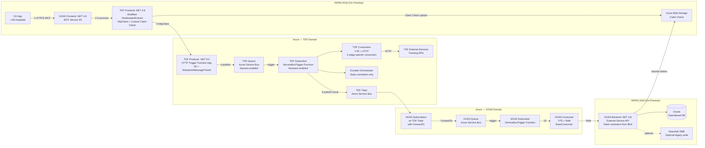
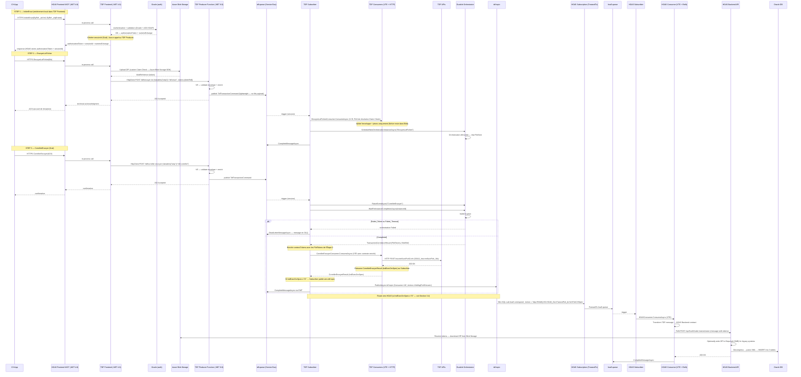
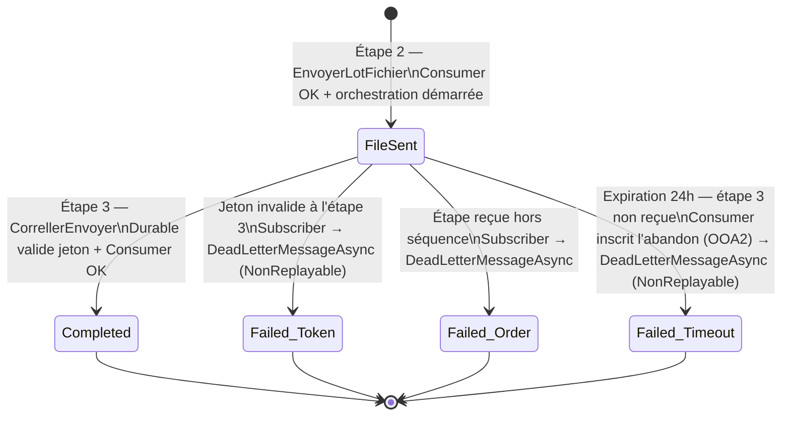
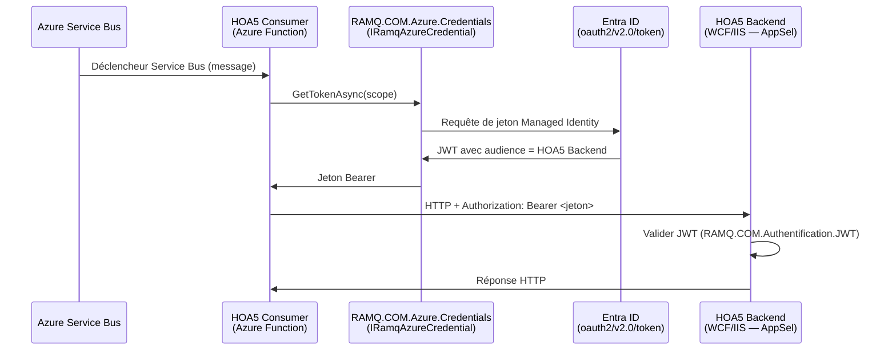
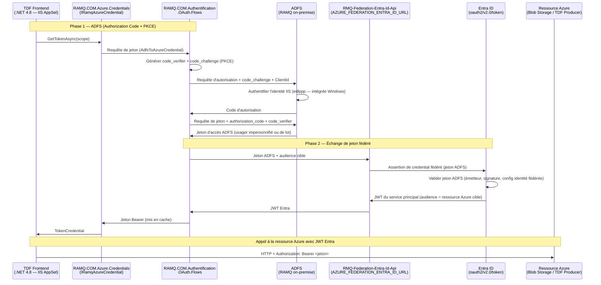

# HOA5 — Architecture cible d'intégration — Migration Azure via EnterpriseMessageTransit

> **Objectif :** Définir l'architecture cible Azure pour HOA5, en remplaçant BizTalk Server par Azure Service Bus et Azure Functions à l'aide de la bibliothèque d'entreprise **EnterpriseMessageTransit (EMT)**.  
> **Prérequis :** Lire [current-state-hoa5-fr.md](current-state-hoa5-fr.md) pour la documentation complète de l'architecture actuelle.  
> **Audience :** Architecture d'entreprise, Équipe d'intégration, Équipe TDF, Opérations, Sécurité et outils assistés par IA (ex. : GitHub Copilot).  
> **Statut :** Ébauche v0.1 (à valider avec les experts fonctionnels et le Comité d'architecture).  
> **Propriétaire :** Bureau d'architecture

---

## 1. Objectif et portée de la migration

### 1.1 Contexte stratégique

BizTalk Server approche de sa fin de support. L'organisation RAMQ migre l'ensemble de ses intégrations BizTalk vers **Azure** en utilisant **EnterpriseMessageTransit (EMT)** — une bibliothèque interne .NET (NuGet d'entreprise) qui standardise l'accès à Azure Service Bus, Blob Storage, Durable Functions, et fournit des patrons intégrés (Claim Check, Sequential Convoy, Saga, réessai/DLQ).

**Objectif principal de la migration :** Remplacer les deux applications BizTalk (`MEC_HOA5` et `TDF_OOA2`) par des services natifs Azure tout en préservant le comportement fonctionnel et les contrats de message du flux de transmission préliminaire HOA5.

### 1.2 Portée de ce document

| Dans la portée | Hors portée |
|----------------|-------------|
| Architecture cible Azure pour le flux de transmission préliminaire HOA5 | Flux de transmission régulier (HOA1/HOB1) |
| Remplacement de TDF Integration (Azure Functions + Service Bus) | Flux sortant TDF (`OOA2_TrnsmFichSortant_bt`) |
| Remplacement de HOA5 Integration (Azure Functions + Service Bus) | Autres flux MEC (HOA3, HOA6, HOA7) |
| Modification du TDF Frontend (.NET 4.8, adaptateur entre WCF et Azure) | Modifications de l'application CH (hypothèse projet : CH App est verrouillée) |
| Modification du HOA5 Backend (résolution de jetons via Azure Blob Storage) | Détails de provisionnement d'infrastructure (Bicep/Terraform) |
| Topologie Azure Service Bus (files d'attente, rubriques, abonnements, transfert) | Estimation des coûts |
| Orchestration Durable Functions pour le protocole TDF en 3 étapes | |

### 1.3 Principes de migration

1. **Le contrat CH App est VERROUILLÉ** — l'interface WCF `IDestinataireEntrant` (`InitierEnvoi`, `EnvoyerLotFichier`, `CorrellerEnvoyer`) doit être préservée. Les ~140 hôpitaux ne seront pas modifiés.
2. **HOA5 Frontend (.NET 4.8) est préservé** — le service WCF sur IIS (INFRA 2016) continue de recevoir les appels de l'application CH.
3. **TDF Frontend (.NET 4.8) est modifié, pas remplacé** — la classe de base `DestinataireEntrant` est adaptée pour faire le pont entre WCF et Azure. Elle implémente un Claim Check personnalisé à l'aide du SDK Azure Blob Storage et appelle la fonction TDF Producer (.NET 8.0) via `HttpClient`. Elle doit se conformer au **même contrat de sérialisation `MessageTransitContext`** qu'EnterpriseMessageTransit.
4. **BizTalk est entièrement remplacé** — les deux applications BizTalk `TDF_OOA2` (TDF Integration) et `MEC_HOA5` (HOA5 Integration) sont décommissionnées.
5. **EnterpriseMessageTransit (.NET 8.0) est obligatoire** — toute la messagerie utilise la bibliothèque EMT pour la standardisation, l'observabilité et la gouvernance. La fonction TDF Producer et toutes les Azure Functions utilisent EMT nativement.
6. **Les fichiers ne transitent jamais par Azure Service Bus** — tous les contenus de fichiers sont stockés dans Azure Blob Storage via le patron Claim Check. Seules des références légères (jetons) transitent par Service Bus.
7. **HOA5 Backend est modifié** — reçoit des messages contenant des jetons (références blob) au lieu de fichiers bruts. Résout les jetons en interrogeant Azure Blob Storage. Peut **optionnellement** écrire le fichier dans DepoApli pour les systèmes hérités qui en ont encore besoin.
8. **Modèle de sécurité amélioré** — Managed Identity remplace les chaînes de connexion et les ponts d'authentification déployés dans le GAC. Aucun secret partagé.
9. **Utiliser Sequential Convoy au lieu de Parallel Activating Convoy** — le patron BizTalk actuel (3 branches recevant des messages en parallèle) est remplacé par un modèle de traitement séquentiel des messages utilisant les sessions Azure Service Bus et Durable Functions. Voir la **Section 1.5** pour la motivation complète.

### 1.4 Architecture en un coup d'œil — État actuel vs. État cible

> **Guide de lecture :** Cette section fournit une vue simplifiée de bout en bout des **deux** architectures pour orienter le lecteur. Les descriptions détaillées des composants, les contrats de message et le pseudo-code suivent dans les sections ultérieures.
>
> **Rappel d'infrastructure pour l'état actuel :** Dans l'état actuel, les composants applicatifs legacy comparés ici — **HOA5 Frontend, TDF Frontend, TDF Integration, HOA5 Integration et HOA5 Backend** — sont tous **déployés sur des machines virtuelles Azure IaaS**. La distinction entre les composants **hébergés sur IIS** et **hébergés dans BizTalk** correspond à une **frontière d'exécution**, et non à une plateforme d'infrastructure différente.
>
> **Remarque de normalisation — noms des composants :** Pour assurer la cohérence entre les versions anglaise et française, les **noms canoniques des composants** sont conservés en anglais dans tout le document : **HOA5 Frontend, TDF Frontend, TDF Integration, HOA5 Integration et HOA5 Backend**.

#### 1.4.1 État actuel — Intégration BizTalk

```mermaid
flowchart LR
    CH["CH App\n~140 hôpitaux\nHTTPS/WCF"]
    HOA5F["HOA5 Frontend\n.NET 4.8 — WCF IIS\nVM Azure IaaS\nHéberge TDF Frontend"]
    TDFF["TDF Frontend\n.NET 4.8 — DestinataireEntrant\nVM Azure IaaS\n3 méthodes vers BizTalk"]
    BTZT["TDF Integration\nBizTalk — TDF_OOA2\nVM Azure IaaS\nParallel Activating Convoy"]
    BTZH["HOA5 Integration\nBizTalk — MEC_HOA5\nVM Azure IaaS\nBizTalk map + WCF-Custom"]
    HOA5B["HOA5 Backend\n.NET 4.8 — WCF IIS\nVM Azure IaaS\nOracle + DepoApli"]

    CH -->|"HTTPS\nIDestinataireEntrant"| HOA5F
    HOA5F -->|"in-process\nhéritage de classe"| TDFF
    TDFF -->|"① HTTP POST\nfichier en Base64-dans-XML\njusqu'à 20 Mo en ligne"| BTZT
    TDFF -->|"② SOAP\nsuivi"| BTZT
    TDFF -->|"③ SOAP\ncorrélation"| BTZT
    BTZT -->|"MessageBox\nroutage pub/sub"| BTZH
    BTZH -->|"WCF-Custom\n+ TranfBasic2IntegBehaviorExtn\npont auth GAC"| HOA5B

    style BTZT fill:#f9d6d6,stroke:#c00,stroke-width:2px,color:#4a0000
    style BTZH fill:#f9d6d6,stroke:#c00,stroke-width:2px,color:#4a0000
    style TDFF fill:#fff3cd,stroke:#856404,color:#3d2e00
```



> **Rouge** = composants BizTalk (cibles de migration). **Jaune** = TDF Frontend (modifié).
>
> **Points de friction visibles :** Le fichier (jusqu'à 20 Mo) transite en Base64-dans-XML à travers le MessageBox BizTalk. **Preuve vérifiée dans le code source :**
> - `DestinataireEntrant.svc.vb` (TDF Frontend, ligne ~800) : `objMessageFormatte.Append(Convert.ToBase64String(bytContFich))` — le TDF Frontend encode explicitement les octets du fichier en Base64 avant de construire le message XML envoyé à BizTalk.
> - `IDestinataireEntrant.vb` (contrat WCF) : `ByVal _bytContFich() As Byte` — le contrat WCF transporte le fichier en `Byte()`, sérialisé comme Base64 en SOAP/XML.
> - `MessageFichierEntrantCH.vb` (HOA5 Frontend, ligne ~72) : commentaire XML `Contenu du lot de fichier encodé en Base64`.
> - `TraiterTransmPrel.vb` (HOA5 Backend, ligne ~98) : `Utilitaires.ConvertirChaineBase64EnTableau(_strContenuFichier)` — le Backend décode le Base64 pour obtenir les octets du fichier.
> - `ParamEntree.vb` (HOA5 Backend, ligne ~55) : `Public Property ContenuFichZip() As String` — commentaire : *« Le contenu du fichier zip en Base64 »*.
> - `SchFichCHSpec.xsd` : `<xs:element name="Contenu" type="xs:string" />` — le contenu Base64 est stocké comme `xs:string` dans le schéma BizTalk.
>
> Trois protocoles distincts (HTTP, SOAP×2) connectent le TDF Frontend à BizTalk. Le pont d'authentification `TranfBasic2IntegBehaviorExtn` déployé dans le GAC est une dépendance non documentée à RISQUE ÉLEVÉ.

#### 1.4.2 État cible — Intégration Azure

```mermaid
flowchart LR
    CH["CH App\n~140 hôpitaux\nHTTPS/WCF\nVERROUILLÉ — aucun changement"]
    HOA5F["HOA5 Frontend\n.NET 4.8 — WCF IIS\nPréservé"]
    TDFF["TDF Frontend\n.NET 4.8 — DestinataireEntrant\nHttpClient + Claim Check\nModifié"]
    BLOB[("Azure Blob Storage\nClaim Check\npayloads de fichiers")]
    TDFP["TDF Producer\n.NET 8.0 — Azure Function\nHTTP Trigger + EMT\nNOUVEAU"]
    SBQ["Azure Service Bus\ntdf-queue sessions\ntdf-topic ForwardTo"]
    TDFI["TDF Integration\n.NET 8.0 — Azure Functions\nSubscriber + Consumers VTE\nDurable Orchestrator\nRemplace BizTalk TDF_OOA2"]
    HOA5I["HOA5 Integration\n.NET 8.0 — Azure Functions\nSubscriber + Consumer VTE\nRemplace BizTalk MEC_HOA5"]
    HOA5B["HOA5 Backend\n.NET 4.8 — WCF IIS\nRésolution de jetons depuis Blob\nModifié"]

    CH -->|"HTTPS\nIDestinataireEntrant\ninchangé"| HOA5F
    HOA5F -->|"in-process\nhéritage de classe"| TDFF
    TDFF -->|"Claim Check\ntéléversement fichier dans Blob"| BLOB
    TDFF -->|"HttpClient POST\nJSON MessageTransitContext\nléger — sans fichier"| TDFP
    TDFP -->|"EMT publish\ntdf-queue"| SBQ
    SBQ -->|"Service Bus trigger\nsession-aware"| TDFI
    TDFI -->|"HTTP\nAPIs TDF"| TDFI
    SBQ -->|"tdf-topic\nForwardTo hoa5-queue"| HOA5I
    HOA5I -->|"Refit\nAPI HOA5 Backend"| HOA5B
    HOA5B -->|"résolution de jetons\ntéléchargement fichier"| BLOB

    style TDFI fill:#d4edda,stroke:#155724,stroke-width:2px,color:#0a2e14
    style HOA5I fill:#d4edda,stroke:#155724,stroke-width:2px,color:#0a2e14
    style TDFP fill:#d4edda,stroke:#155724,stroke-width:2px,color:#0a2e14
    style TDFF fill:#fff3cd,stroke:#856404,color:#3d2e00
    style SBQ fill:#cce5ff,stroke:#004085,color:#002244
    style BLOB fill:#cce5ff,stroke:#004085,color:#002244
```



> **Vert** = nouveaux composants Azure. **Jaune** = modifié. **Bleu** = services de la plateforme Azure.
>
> **Améliorations clés visibles :**
> - **Protocole simplifié** — L'Étape 1 (InitierEnvoi) reste entièrement locale dans le TDF Frontend (validation Oracle + AGS, retour du jeton — aucun appel vers BizTalk ni vers le TDF Producer). Les Étapes 2 et 3 utilisent `HttpClient` POST vers un seul endpoint TDF Producer avec des valeurs `Variables["step"]` distinctes, remplaçant les 3 appels HTTP/SOAP séparés vers BizTalk (`EnvoyerMessageServCourtage`, `EnvoyerSuiviServCourtage`, `EnvoyerCorrellerServCourtage`).
> - **Les fichiers n'entrent jamais dans Service Bus** — Le Claim Check téléverse vers Blob Storage ; seules des références JSON légères transitent par la file.
> - **Aucun pont d'authentification GAC** — Managed Identity remplace `TranfBasic2IntegBehaviorExtn`.
> - **VTE dans les Consumers** — toute la logique métier (validation, transformation, enrichissement) réside dans du code C# testable, pas dans des maps/orchestrations BizTalk.
> - **Refit pour les appels en aval** — des clients HTTP typés remplacent les adaptateurs WCF-Custom/SOAP de BizTalk pour les composants spécifiques (HOA5 Consumer). Les composants TDF génériques sont libres d’utiliser Refit, `HttpClient`, ou autre librairie HTTP.

#### 1.4.3 Correspondance des composants — État actuel vers État cible

| Composant état actuel | Remplacement état cible | Ce qui change |
|----------------------|------------------------|--------------|
| **CH App** | CH App | Rien — VERROUILLÉ |
| **HOA5 Frontend** (WCF, IIS) | HOA5 Frontend (WCF, IIS) | Référence d'assemblage échangée (D-011) |
| **TDF Frontend** (`DestinataireEntrant`) | TDF Frontend (modifié) | `HttpClient` + Claim Check remplacent 3 appels BizTalk (D-002) |
| `EnvoyerMessageServCourtage()` — HTTP POST fichier Base64 vers BizTalk | `HttpClient` POST + upload Blob Storage | **Claim Check** : le fichier est téléversé dans Azure Blob Storage ; seule une référence de jeton légère (quelques octets) transite par Service Bus. Élimine la charge Base64-dans-XML (~20 Mo en ligne dans le MessageBox BizTalk) et permet la gestion de fichiers de taille arbitraire. |
| `EnvoyerSuiviServCourtage()` — SOAP suivi vers BizTalk | **TDF Consumer appelle `OOA2_InscrireSuiviFich_Ws` (HTTP)** + EMT Message Transit Journal | Le suivi métier vers Oracle TDF est **préservé** — le TDF Consumer appelle le même service via HTTP. EMT ajoute une journalisation d'infrastructure automatique en complément (D-008). |
| `EnvoyerCorrellerServCourtage()` — SOAP corrélation vers BizTalk | `HttpClient` POST avec `Variables["step"]` | Corrélation via Service Bus `SessionId` |
| **TDF Integration** (BizTalk `TDF_OOA2`) | TDF Subscriber + TDF Consumers + Durable Orchestrator | Azure Functions + sessions Service Bus |
| **HOA5 Integration** (BizTalk `MEC_HOA5`) | HOA5 Subscriber + HOA5 Consumer | Azure Function + `hoa5-queue` |
| BizTalk map `transformerMsgFichCHToMsgSVC.btm` | HOA5 Consumer VTE Transform | Code C# — agnostique au format (Section 4.5) |
| `TranfBasic2IntegBehaviorExtn` (pont d'auth. GAC) | Managed Identity + Refit | Éliminé — zéro secret partagé (D-009, D-015) |
| **HOA5 Backend** (WCF, IIS) | HOA5 Backend (modifié) | Résolution de jetons depuis Blob Storage (D-007) |

### 1.5 Motivation de la décision d'architecture — Sequential Convoy vs. Parallel Activating Convoy

Cette section fournit la justification détaillée du remplacement du Parallel Activating Convoy de BizTalk par le patron Sequential Convoy d'Azure. Chaque sous-décision est fondée sur des preuves issues de l'analyse du code source de l'orchestration BizTalk actuelle (`orcTrnsmFichEntrant.odx`) et de la bibliothèque EnterpriseMessageTransit.

#### 1.5.1 Patron de l'état actuel : Parallel Activating Convoy (BizTalk)

L'orchestration BizTalk `orcTrnsmFichEntrant.odx` utilise un **Parallel Activating Convoy** — le patron de corrélation le plus complexe disponible dans BizTalk Server :

- **3 formes de réception activantes** (`Activate=True`) existent à l'intérieur d'une seule forme `Parallel` (`parallActEtapeRecptFichEntrant`).
- **N'IMPORTE LEQUEL des 3 messages** (fichier, suivi, corrélation) peut arriver en premier et créer l'instance d'orchestration.
- La forme `Parallel` **bloque jusqu'à ce que les 3 branches se terminent** (reçues ou expirées).
- La corrélation utilise la propriété promue `NoEchg` dans `PropertySchema.xsd` avec `Initializing = True` sur les 3 réceptions.
- Chaque branche a un **délai d'expiration de 9 minutes** (forme listen). À l'expiration, BizTalk construit un **message factice** (ex. : `<Root/>`, `<Fichier/>`) et positionne un drapeau booléen à `false`.
- Après la complétion des 3 branches, une **forme de décision** (`decideTransaction`) évalue les 3 drapeaux pour déterminer le résultat : chemin nominal, abandonné ou rejeté.

#### 1.5.2 Problèmes du Parallel Activating Convoy

| # | Problème | Impact | Preuve (current-state-hoa5.md) |
|---|----------|--------|-------------------------------|
| 1 | **Patron BizTalk le plus complexe** | Difficile à comprendre, maintenir et tester. Documenté comme *« le patron le plus complexe de la solution »*. | → Feature \#3 (§1.5.2.1 ci-dessous) |
| 2 | **Risque de messages zombies** | Si 2 messages avec le même `NoEchg` arrivent quasi simultanément, les deux peuvent déclencher `Activate=True` avant que la première instance crée ses abonnements → condition de course → les messages d'une instance deviennent des **zombies non routables** bloqués dans la MessageBox sans abonné. | §1.5.6, limitation inhérente du convoy BizTalk |
| 3 | **Zombies par expiration + arrivée tardive** | Si une branche expire (9 min) et que le message arrive peu après, BizTalk a déjà fermé l'abonnement → le message tardif n'a pas d'abonné → zombie dans la MessageBox. | → Feature \#7 (§1.5.2.1 ci-dessous) |
| 4 | **Échecs silencieux** | Les orchestrations suspendues ne génèrent pas d'alertes efficaces. Les défaillances peuvent passer inaperçues pendant des jours. | §9 (Aperçu opérationnel), current-state-hoa5 |
| 5 | **Réessai de 41 jours sur le port SOAP de suivi** | Le port d'envoi SOAP `sndPoOOA2_poInscrireSuiviFich_Entrant` (appel vers `OOA2_InscrireSuiviFich_Ws.FichEntrant.asmx`) est configuré avec **deux niveaux de réessai** dans les liaisons BizTalk (bindings) : un réessai **primaire** de 3 tentatives à 5 minutes d'intervalle (15 min au total), puis un réessai **secondaire** de 1 000 tentatives à 60 minutes d'intervalle (≈ **41,7 jours**). Si `OOA2_InscrireSuiviFich_Ws` retourne une erreur transitoire (timeout, HTTP 500, indisponibilité réseau), BizTalk **réessaie pendant plus d'un mois** avant de suspendre le port. Pendant toute cette période, l'instance d'orchestration reste active dans la MessageBox, consommant des ressources SQL Server (verrous, lignes d'abonnement, journaux de suivi). De plus, l'orchestration elle-même ajoute une couche de résilience supplémentaire via `loopResilience` (boucle interne avec Suspend/Resume) — ce qui signifie qu'une seule erreur transitoire peut bloquer l'orchestration pendant des **semaines** sans intervention opérationnelle, avec un impact cumulatif sur la performance globale de la MessageBox. | §1.5.6 Features \#11 + \#14, current-state-hoa5 |
| 6 | **Récupération manuelle uniquement** | La forme Suspend de BizTalk nécessite une intervention manuelle de l'opérateur. Aucune récupération automatisée. | → Feature \#12 (§1.5.2.1 ci-dessous) |
| 7 | **Goulot d'étranglement MessageBox central** | Tout le routage dépend d'une base de données SQL Server unique. Aucune mise à l'échelle horizontale. | §11, current-state-hoa5 |
| 8 | **Sur-ingénierie pour le protocole réel** | La sémantique « n'importe lequel peut arriver en premier » n'est jamais exercée en pratique — le TDF Frontend (`DestinataireEntrant`) envoie toujours les messages dans un **ordre déterministe** : Étape 1 → Étape 2 → Étape 3. La capacité d'activation parallèle est de la complexité inutilisée. | Code source de `FichDestinataireEntrant.svc` |

#### 1.5.2.1 Features BizTalk référencées (source : §1.5.6, current-state-hoa5)

Les trois lignes ci-dessous sont extraites verbatim du tableau d'inventaire des features BizTalk de la Section 1.5.6 de `current-state-hoa5-fr.md`, couvrant chaque feature BizTalk Server utilisée par l'orchestration TDF Integration (`orcTrnsmFichEntrant.odx`).

| \# | Feature BizTalk | Utilisation dans TDF Integration | Ce que ça fait | Risque |
|----|----------------|----------------------------------|----------------|--------|
| \#3 | **Parallel Activating Convoy** | 3 formes de réception avec `Activate=True` dans une forme Parallel, toutes initialisant le même ensemble de corrélation `corNoEchg` | Un patron BizTalk spécifique où plusieurs réceptions concurrentes peuvent chacune démarrer l'orchestration. Le premier message crée l'instance ; les autres branches attendent leurs messages. Intégré dans BizTalk — aucun code personnalisé requis. | C'est le patron le plus complexe de la solution. Doit gérer la sémantique « n'importe lequel des 3 peut arriver en premier » et corréler 3 messages indépendants en un seul échange. |
| \#7 | **Délai d'expiration au niveau du scope** | Chacune des 3 branches : `scopeCorln` (9 min), `scopeFichMsg` (9 min), `scopeSuivi` (9 min). Le délai lance une `TimeoutException`. | Chaque branche a sa propre échéance. Si le message attendu n'arrive pas dans les 9 minutes, BizTalk lance une exception de timeout dans cette branche. Le gestionnaire d'exceptions positionne le drapeau booléen à `false`. | Définit le couplage temporel — si un message est en retard de >9 min, l'échange passe à l'état abandonné ou partiel. |
| \#12 | **Forme Suspend** | `suspResilience` — suspend l'instance d'orchestration après un échec d'appel SOAP. L'instance reste dans la base de données MessageBox avec son état intact. | « Suspend » = mettre en pause le workflow et alerter un opérateur. L'instance d'orchestration n'est PAS supprimée — elle peut être reprise manuellement. C'est la manière de BizTalk de gérer les défaillances transitoires irrécupérables. | Comportement clé : l'échange ne doit PAS être perdu en cas d'échec répété ; il doit pouvoir être récupéré. Les instances suspendues nécessitent une intervention de l'opérateur. |

#### 1.5.3 Patron de l'état cible : Sequential Convoy (Azure)

Le patron Sequential Convoy utilise des **files d'attente avec sessions** Azure Service Bus + **Durable Functions** pour la corrélation d'état :

| Avantage | Sequential Convoy (Azure) | vs. Parallel Activating Convoy (BizTalk) |
|----------|--------------------------|---------------------------------------------|
| **Élimine les messages zombies** | Les sessions Service Bus garantissent qu'une seule instance de Consumer traite tous les messages d'un `sessionId` donné. Les conditions de course sur l'activation sont impossibles — le verrou de session assure l'exclusion mutuelle. | L'activation du convoy BizTalk crée des zombies lors de courses |
| **Ordre déterministe des messages** | Les messages sont traités strictement en ordre FIFO par session. Correspond au protocole TDF réel (Étape 1 → Étape 2 → Étape 3). | La sémantique « n'importe lequel peut arriver en premier » de BizTalk ajoute de la complexité inutilisée |
| **Élimine les messages factices** | Chaque étape est un `WaitForExternalEvent` explicite avec un minuteur de 24h. Pas besoin de construire des charges utiles factices à l'expiration — l'orchestration passe simplement à `Failed_Timeout`. | BizTalk construit `<Root/>`, `<Fichier/>` comme messages factices à l'expiration |
| **Topologie plus simple** | File d'attente unique avec routage par `Variables["step"]` vs. 3 ports de réception séparés + 3 schémas + abonnements MessageBox. | 3 ports de réception × 3 schémas × ensembles de corrélation × formes listen |
| **Pas de goulot d'étranglement central** | Les partitions Service Bus gèrent des milliers de sessions concurrentes. La mise à l'échelle horizontale est intégrée. | Base de données SQL Server MessageBox unique — pas de mise à l'échelle horizontale |
| **Réessai automatisé** | EMT Exponential Retry (borné) avec messages clonés par session → Dead Letter Queue au max de réessais → signal opérationnel clair. Aucune intervention manuelle requise. | Boucle de réessai 1000×60min sans borne — pas de circuit breaker, pas de DLQ. Impossible de distinguer erreur transitoire d'erreur persistante. |
| **Persistance d'état durable** | Durable Functions persiste l'état d'orchestration dans Azure Storage. Survit aux redémarrages, déploiements et plantages de Function App — rejoue automatiquement. | Déshydratation/réhydratation BizTalk liée à la MessageBox SQL |
| **Expiration économique** | `ctx.CreateTimer(24h)` de Durable Functions est gratuit — pas de thread, pas de verrou, aucune ressource consommée pendant l'attente. | Les formes listen de BizTalk consomment des ressources d'orchestration pendant l'expiration |
| **Anti-zombie intégré** | Le minuteur de 24h élimine proprement les orchestrations orphelines. L'état `Failed_Timeout` est journalisé dans le Message Transit Journal. | Aucune détection ou nettoyage automatisé des zombies |
| **Observabilité complète** | EMT Journal + AppInsights fournissent une surveillance en temps réel de chaque étape, réessai et échec. | BizTalk Tracking DB non fonctionnel, SCOM partiel, pas d'AppInsights |

#### 1.5.4 Pourquoi ne pas répliquer le Parallel Activating Convoy dans Azure ?

Azure Service Bus **ne supporte pas nativement** le patron Parallel Activating Convoy de BizTalk. Le répliquer nécessiterait :

1. **3 files d'attente séparées** (une par type de message) + un orchestrateur personnalisé qui surveille les 3 simultanément.
2. **Logique de corrélation personnalisée** — Service Bus n'a pas d'équivalent de la corrélation `Initializing` de BizTalk avec `Activate=True` sur 3 réceptions concurrentes.
3. **Gestion des conditions de course** — toute la logique de prévention des zombies que BizTalk gère implicitement devrait être codée explicitement.
4. **Construction de messages factices** — les branches en expiration devraient construire des charges utiles de remplacement.

Cela reproduirait toute la complexité de BizTalk sans les avantages de son moteur d'abonnement MessageBox intégré. Le Sequential Convoy est **plus simple, plus sûr et mieux aligné** avec la plateforme Azure et la sémantique réelle du protocole TDF.

### 1.6 Frontières de mutabilité (mises à jour pour l'état cible)

| Composant | .NET | État actuel | État cible | Changement |
|-----------|------|-------------|------------|------------|
| **CH App** | — | Externe (hôpitaux) | **VERROUILLÉ — aucun changement** | Aucun |
| **HOA5 Frontend** | 4.8 | Service WCF (IIS sur VM Azure IaaS, INFRA 2016) | **Préservé** — service WCF sur IIS, héberge le TDF Frontend modifié | Contrat WCF `IDestinataireEntrant` inchangé. Implémentation modifiée : référence le nouvel assemblage TDF Frontend au lieu de la classe de base `DestinataireEntrant` originale du package NuGet TDF. La classe de service `FichDestinataireEntrant` hérite toujours de `DestinataireEntrant`, mais l'assemblage référencé est la version .NET 4.8 modifiée qui fait le pont vers Azure. |
| **TDF Frontend** | **4.8** | Classe de base `DestinataireEntrant` dans le processus IIS de HOA5 Frontend sur VM Azure IaaS | **Modifié** — adapté pour appeler TDF Producer via `HttpClient` + Claim Check personnalisé (SDK Azure Blob Storage). Se conforme au contrat de sérialisation EMT `MessageTransitContext`. Pas de VTE (relais uniquement). | Modifié — coordonné avec l'équipe TDF |
| **TDF Integration** | **8.0** | BizTalk Server (`TDF_OOA2`) sur VM Azure IaaS | **Remplacé** — Azure Functions (Producer + Subscriber + Durable Orchestrator + Consumers) + Azure Service Bus. TDF Producer fait partie de TDF Integration. | **Cible principale de migration** |
| **HOA5 Integration** | — | BizTalk Server (`MEC_HOA5`) sur VM Azure IaaS | **Remplacé** — Azure Functions (Subscriber + Consumer) + Azure Service Bus | **Cible principale de migration** |
| **HOA5 Backend** | 4.8 | Point de terminaison WCF (IIS sur VM Azure IaaS) | **Modifié** — reçoit des jetons (références blob), résout les fichiers depuis Azure Blob Storage. **Copie le fichier du conteneur TDF (`tdf/echgfich/...`) vers le conteneur HOA5 (`mec/hoa5/...`)** dans Blob Storage pour le contrôle de cycle de vie indépendant. Écrit optionnellement dans DepoApli pour les systèmes hérités. | Modifié — résolution de jetons + copie blob inter-conteneurs + DepoApli optionnel |
| **Oracle** | — | Base de données opérationnelle | **Aucun changement** | Aucun |
| **DepoApli** | — | Partage de fichiers SMB | **Optionnel** — HOA5 Backend peut optionnellement écrire les fichiers dans DepoApli pour les consommateurs hérités. Le stockage principal est Azure Blob Storage. | Rétrogradé en optionnel |

> **Cycle de vie des blobs — isolation inter-PPP :** Chaque client TDF doit pouvoir contrôler le cycle de vie de ses propres fichiers de manière indépendante. Le HOA5 Backend **copie** le fichier du conteneur partagé TDF (`tdf/echgfich/{ppp}/...`) vers son propre espace de stockage (`mec/hoa5/{numeroEchange}/...`) dans Azure Blob Storage. Cela permet à l'équipe TDF de gérer la rétention et le nettoyage de `tdf/echgfich/` indépendamment, sans affecter les fichiers archivés par HOA5. La même règle s'applique à tous les autres clients TDF (HOA1, HOB1, etc.).

---

## 2. Vue d'ensemble de l'architecture cible

### 2.1 Diagramme d'architecture de haut niveau



> **Décisions architecturales clés visibles dans ce diagramme :**
> - Le **service WCF HOA5 Frontend (.NET 4.8) est préservé** (INFRA 2016) — l'application CH continue de l'appeler via HTTPS sans changement.
> - Le **TDF Frontend (.NET 4.8) est modifié** (pas remplacé) — il fait le pont entre le service WCF et Azure via des appels `HttpClient` à la fonction TDF Producer + Claim Check personnalisé vers Azure Blob Storage. Il se conforme au même contrat de sérialisation `MessageTransitContext` qu'EMT.
> - **Les fichiers ne transitent jamais par Azure Service Bus** — tous les contenus de fichiers sont stockés dans Azure Blob Storage. Seules des références légères (jetons) transitent par Service Bus.
> - **TDF-Queue** reçoit les 3 étapes du protocole TDF sous forme de messages avec `sessionId` pour la corrélation.
> - **TDF-Topic** est utilisé pour le routage des résultats traités vers les abonnements spécifiques à chaque application.
> - **Le transfert Azure Service Bus (ForwardTo)** route depuis l'abonnement HOA5 sur TDF-Topic vers HOA5-Queue — pas d'accès en écriture inter-domaines.
> - **HOA5-Queue** reçoit les messages transférés depuis l'abonnement HOA5 sur TDF-Topic et déclenche le HOA5 Subscriber. C'est le **point d'entrée de l'équipe HOA5** dans le flux de données — l'équipe HOA5 possède et opère tout ce qui est en aval de cette file.
> - **HOA5 Backend (.NET 4.8) est modifié** — reçoit des messages avec des jetons, les résout depuis Azure Blob Storage. Persiste dans Oracle. Écrit **optionnellement** dans DepoApli pour les systèmes hérités.

### 2.2 Inventaire des composants — État cible

| # | Composant | Type | .NET | Domaine | Équipe | Description |
|---|-----------|------|------|---------|--------|-------------|
| 1 | **CH App** | Application hospitalière | — | Externe | TI hospitalière | **VERROUILLÉ.** Envoie du XML compressé via HTTPS au HOA5 Frontend. ~140 hôpitaux. Aucun changement. |
| 2 | **HOA5 Frontend** | Service WCF (IIS, INFRA 2016) | **4.8** | HOA5 | Équipe HOA5 | **Préservé.** `FichDestinataireEntrant.svc`. Héberge le TDF Frontend modifié in-process. Le contrat WCF `IDestinataireEntrant` est inchangé. |
| 3 | **TDF Frontend** | Bibliothèque de classes .NET (in-process dans HOA5 Frontend) | **4.8** | TDF | Équipe TDF | **Modifié.** La classe de base `DestinataireEntrant` est adaptée pour faire le pont WCF → Azure. Effectue la validation Oracle, le **Claim Check personnalisé** (téléversement via SDK Azure Blob Storage — pour la performance, contournant le Claim Check natif d'EMT), et des appels HTTP à la fonction TDF Producer. **Doit se conformer au même contrat de sérialisation `MessageTransitContext`** qu'EMT afin que les Consumers soient transparents à la source. Retourne `authorizationToken`, `sessionId`, `numeroEchange` de manière synchrone au HOA5 Frontend. |
| 4 | **TDF Producer** | Azure Function (HTTP Trigger) | **8.0** | TDF | Équipe TDF | **NOUVEAU (fait partie de TDF Integration).** Reçoit les requêtes HTTP du TDF Frontend (via `HttpClient`). Effectue la **validation et l'enrichissement du message (VE)** avant la publication : valide l'enveloppe `MessageTransitContext`, peuple `Variables["step"]`. Publie `TdfTransactionCommand` dans `tdf-queue` via EMT `IMessageProducer`. Aucune logique métier — VE uniquement. |
| 5 | **TDF-Queue** | File d'attente Azure Service Bus | — | TDF | Équipe TDF | **NOUVEAU.** File unique pour tous les messages de transaction TDF. **Sessions activées** — `sessionId` corrèle les 3 étapes de chaque transaction. `AutoCompleteMessages = false`. **Les fichiers ne transitent jamais ici** — uniquement des messages légers avec des références de jetons. |
| 6 | **TDF-Topic** | Rubrique Azure Service Bus | — | TDF | Équipe TDF | **NOUVEAU.** Reçoit les résultats traités du domaine TDF. Un abonnement par application consommatrice (HOA5, HOA1, …) avec `ForwardTo` vers les files spécifiques à chaque application. |
| 7 | **Abonnement HOA5** | Abonnement Azure Service Bus | — | TDF | Équipe TDF (plateforme) | **NOUVEAU.** Abonnement sur TDF-Topic filtré pour les messages HOA5. Configuré avec `ForwardTo` → `HOA5-Queue`. Géré par la plateforme (aucun code). |
| 8 | **HOA5-Queue** | File d'attente Azure Service Bus | — | HOA5 | Équipe HOA5 | **NOUVEAU.** Reçoit les messages transférés depuis l'abonnement HOA5. Déclenche le HOA5 Subscriber. |
| 9 | **TDF Subscriber** | Azure Function (ServiceBusTrigger) | **8.0** | TDF | Équipe TDF | **NOUVEAU.** Écoute sur `tdf-queue` (sessions activées). Appelle `BindContext` + `TryDeserializeMessage`. Route par `Variables["step"]` vers le Consumer approprié. Orchestre les signaux de Durable Function. |
| 10 | **TDF Consumers** | Classes C# étendant `BaseConsumer<TdfTransactionCommand>` | **8.0** | TDF | Équipe TDF | **NOUVEAU.** Deux consommateurs spécifiques aux étapes qui transitent par Service Bus : `EnvoyerLotFichierConsumer` (Étape 2) et `CorrellerEnvoyerConsumer` (Étape 3). **L'Étape 1 (`InitierEnvoi`) n'a pas de Consumer** — elle est entièrement locale dans le TDF Frontend. Chaque Consumer effectue la **validation, transformation et enrichissement du message (VTE)** avant d’appeler l’API TDF en aval. Le choix de la librairie HTTP (Refit, `HttpClient`, ou autre) est **à la discrétion de l’équipe TDF** — Refit n’est pas obligatoire pour les composants génériques TDF. Toute la logique métier réside ici. Aucun accès direct à la base de données. |
| 11 | **Durable Orchestrator** | Azure Durable Function | **8.0** | TDF | Équipe TDF | **NOUVEAU.** Gère la corrélation d'état entre les 3 étapes. Valide `authorizationToken`. Utilise `WaitForExternalEvent` avec des minuteurs anti-zombie de 24h. Aucune logique métier, aucun appel API. |
| 12 | **HOA5 Subscriber** | Azure Function (ServiceBusTrigger) | **8.0** | HOA5 | Équipe HOA5 | **NOUVEAU.** Écoute sur `HOA5-Queue`. Appelle `BindContext` + `TryDeserializeMessage`. Délègue au HOA5 Consumer. |
| 13 | **HOA5 Consumer** | Classe C# étendant `BaseConsumer<T>` | **8.0** | HOA5 | Équipe HOA5 | **NOUVEAU.** Effectue la **transformation du message (T)** — convertit le message du domaine TDF vers le contrat de l'API HOA5 Backend (remplace la carte BizTalk `transformerMsgFichCHToMsgSVC.btm`). Appelle l'API HOA5 Backend via **Refit** (HTTP). Toute la logique métier réside ici. Gère la complétion/réessai/DLQ via EMT. |
| 14 | **HOA5 Backend** | Point de terminaison WCF / API HTTP (IIS) | **4.8** | HOA5 | Équipe HOA5 | **Modifié.** Reçoit des messages contenant des **jetons** (références blob). Résout les jetons en interrogeant Azure Blob Storage pour récupérer le fichier. Ordre de traitement : (1) résoudre le jeton → télécharger le ZIP depuis Blob Storage, (2) **optionnellement** écrire le ZIP dans DepoApli (SMB) pour les systèmes hérités, (3) décompresser, (4) analyser le XML en DataSets, (5) insérer dans Oracle. |
| 15 | **Azure Blob Storage** | Stockage infonuagique | — | Partagé | Plateforme | **NOUVEAU.** Utilisé pour le Claim Check (références de fichiers dans les messages `tdf-queue`). Conteneur : `inter-ppp`. Accès par Managed Identity. Sert également de stockage principal remplaçant DepoApli. |
| 16 | **Oracle** | Base de données opérationnelle | — | HOA5 | Équipe DBA | **Aucun changement.** Mêmes 3 tables : `MEC.MEC_PRE_SEJ_HOSP`, `MEC.MEC_SEJ_SOIN_ALTRN`, `MEC.MEC_PRE_SEJ_SOIN_INTSF`. |
| 17 | **DepoApli** | Partage de fichiers SMB | — | HOA5 | Équipe Ops | **Optionnel.** HOA5 Backend peut optionnellement écrire le fichier dans DepoApli après téléchargement depuis Blob Storage, pour les systèmes hérités qui en ont encore besoin. N'est plus le stockage principal. |
| 18 | **Message Transit Journal** | Azure Table Storage | — | Partagé | Plateforme (EMT) | **NOUVEAU.** Piste d'audit automatique écrite par EMT pour chaque opération de Producer et Consumer. Permet l'observabilité de bout en bout. |

---

## 3. Topologie Azure Service Bus

### 3.1 Carte des entités

```
Espace de noms Azure Service Bus (partagé, géré par FinOps)
│
├── tdf-queue  (File d'attente, sessions activées)
│   ├── Propriétaire : Équipe TDF
│   ├── Objectif : Reçoit tous les messages de transaction TDF (3 étapes par transaction)
│   ├── SessionId : corrèle les 3 messages d'une transaction unique
│   └── Consumer : Fonction TDF Subscriber (ServiceBusTrigger, IsSessionsEnabled=true)
│
├── tdf-topic  (Rubrique)
│   ├── Propriétaire : Équipe TDF
│   ├── Objectif : Route les résultats traités vers les abonnements spécifiques aux applications
│   │
│   ├── sub-hoa5  (Abonnement)
│   │   ├── Filtre : Action = 'http://RAMQ.HO.HOA5_ServTransmPrel_bt.SchFichCHSpec'
│   │   ├── ForwardTo : hoa5-queue
│   │   └── Géré par : Plateforme (aucun code applicatif)
│   │
│   ├── sub-ppp-1  (Abonnement — futur)
│   │   ├── Filtre : Action = '<NsMsgFichEntrant de l’application PPP/HOA cible>'
│   │   └── ForwardTo : ppp-1-queue
│   │
│   └── ... (un abonnement par application intégrante)
│
│   ✅ VALIDÉ (D-013) : Consumer = 'All' (fixe pour tous les messages).
│     Action = URI de namespace de <NsMsgFichEntrant> ou <NsMsgFichSortant>.
│     Filtre sur Action uniquement.
│     Exemple HOA5 Entrant : Action = 'http://RAMQ.HO.HOA5_ServTransmPrel_bt.SchFichCHSpec'
│
└── hoa5-queue  (File d'attente)
    ├── Propriétaire : Équipe HOA5
    ├── Objectif : Reçoit les messages transférés pour le traitement HOA5
    └── Consumer : Fonction HOA5 Subscriber (ServiceBusTrigger)
```

### 3.2 Décisions de conception de la topologie Service Bus

| Décision | Justification |
|----------|--------------|
| **`tdf-queue` unique** pour les 3 étapes | La clé `Variables["step"]` différencie les étapes (voir D-014). Les sessions Service Bus assurent le traitement ordonné par transaction. Topologie plus simple que 3 files séparées. |
| **`tdf-queue` avec sessions activées** | Obligatoire pour le Sequential Convoy. Le `sessionId` (identifiant de corrélation) regroupe les 3 messages d'une transaction, garantissant le traitement dans l'ordre par la même instance de Consumer. |
| **TDF-Topic pour le routage en éventail (fan-out)** | TDF traite des fichiers pour plusieurs applications (HOA5, HOA1, HOB1…). Une rubrique avec des abonnements par application permet le fan-out sans coupler TDF à chaque application consommatrice. |
| **ForwardTo de l'abonnement vers `hoa5-queue`** | **Isolation de sécurité inter-PPP.** TDF n'écrit pas directement dans `hoa5-queue`. La plateforme configure le transfert. HOA5 lit uniquement depuis sa propre file. Aucun privilège d'écriture inter-domaines. Voir [interdomaines.md](../../RCP-AzureMessageTransit/src/EnterpriseMessageTransit/docs/interdomaines.md). |
| **`hoa5-queue` séparée** | Donne à l'équipe HOA5 la pleine propriété de sa file de consommation (mise à l'échelle, gestion DLQ, surveillance). Découple HOA5 de la topologie interne de TDF. |
| **Routage contextuel via les propriétés `Consumer` et `Action`** | Le **TDF Subscriber** (après le traitement réussi de l'Étape 3 par le Consumer) définit `Consumer` et `Action` comme propriétés applicatives Service Bus en les passant dans le dictionnaire `properties` à `IMessageProducer<T>.PublishAsync()`. EMT propage ces propriétés dans `ServiceBusMessage.ApplicationProperties`. **Important :** Ne jamais utiliser `AzureMessagingProvider.SendAsync` directement — utiliser uniquement `IMessageProducer<T>.PublishAsync()`. **Valeurs validées (D-013) :** `Consumer` est toujours **`'All'`** pour tous les messages publiés (non utilisé comme discriminateur de routage). `Action` = URI de namespace du schéma de message source, provenant de `<NsMsgFichEntrant>` (entrant) ou `<NsMsgFichSortant>` (sortant) dans le contexte de transaction TDF — c'est le discriminateur de routage. Exemple pour HOA5 Entrant : `Action = 'http://RAMQ.HO.HOA5_ServTransmPrel_bt.SchFichCHSpec'` (même valeur que `BTS.MessageType` dans l'abonnement BizTalk actuel). Les filtres d'abonnement utilisent `Action` uniquement. |

> **Sémantique des propriétés `Consumer` et `Action` — usage HOA5/TDF (source : `RCP-EmetteurBaseAzureFonction/docs/info-variables-rubriques-pubsub.md`) :**
>
> - **`Consumer`** — dans le contexte HOA5/TDF, **toujours égal à `"All"`** pour tous les messages publiés dans `tdf-topic`. `Consumer` n'est pas utilisé comme discriminateur de routage entre applications dans ce flux. Note : dans d'autres flux basés sur EMT qui utilisent le patron Saga (`RouteToNextStageAsync`), EMT remplace `Consumer` par la valeur de `SubscriptionInfoSettings.Consumer` (ex. : `"SSFU"`) lors des reprises — mais le patron Sequential Convoy utilisé ici **n'utilise pas** ce mécanisme.
> - **`Action`** — **discriminateur de routage obligatoire**. Porte l'URI de namespace identifiant le schéma de l'application cible, provenant de `<NsMsgFichEntrant>` (entrant) ou `<NsMsgFichSortant>` (sortant) dans le contexte de transaction TDF. **Stable entre les tentatives — ne change pas.** Exemple : `Action = 'http://RAMQ.HO.HOA5_ServTransmPrel_bt.SchFichCHSpec'`. Cet URI est identique au `BTS.MessageType` utilisé dans l'abonnement BizTalk de l'état actuel (le `targetNamespace` de `SchFichCHSpec.xsd`) — correspondance de migration directe.
> - **Filtre SQL d'abonnement :** filtre sur `Action` uniquement : `Action = 'http://RAMQ.HO.HOA5_ServTransmPrel_bt.SchFichCHSpec'` pour `sub-hoa5`.
> - **Journalisation :** Les deux propriétés `Consumer` et `Action` sont enregistrées dans le **Message Transit Journal** (table NoSQL Azure) et servent à filtrer les traces par type d'abonnement et par opération métier.

### 3.3 RBAC — Modèle de privilèges minimaux

| Composant | Identité | Rôle RBAC Azure | Portée |
|-----------|----------|-----------------|--------|
| **TDF Frontend (.NET 4.8)** | Managed Identity du HOA5 Frontend | `Storage Blob Data Contributor` | Conteneur blob `inter-ppp` |
| **TDF Frontend (.NET 4.8)** | Compte de service / Managed Identity du HOA5 Frontend | Appelant HTTP (JWT ou clé API) | Point de terminaison de la fonction TDF Producer |
| **Fonction TDF Producer** | Managed Identity du TDF Function App | `Azure Service Bus Data Sender` | `tdf-queue` |
| **Fonction TDF Subscriber** | Managed Identity du TDF Function App | `Azure Service Bus Data Receiver` | `tdf-queue` |
| **TDF Subscriber (publication vers rubrique)** | Managed Identity du TDF Function App | `Azure Service Bus Data Sender` | `tdf-topic` |
| **Plateforme (config. transfert)** | Managed Identity de la plateforme | `Azure Service Bus Data Owner` | Espace de noms |
| **Fonction HOA5 Subscriber** | Managed Identity du HOA5 Function App | `Azure Service Bus Data Receiver` | `hoa5-queue` |
| **Message Transit Journal** | Tous les Function Apps | `Storage Table Data Contributor` | Table du journal |

> **Amélioration de sécurité par rapport à l'état actuel :** L'architecture BizTalk actuelle utilise le pont d'authentification `TranfBasic2IntegBehaviorExtn` déployé dans le GAC (non standard, non documenté, non testé — RISQUE ÉLEVÉ). L'architecture cible l'élimine entièrement en utilisant **Managed Identity** pour tous les accès aux services Azure et **Refit + HTTP** pour les appels au backend.

### 3.4 Condition de routage — TDF vers HOA5 (état actuel vs. état cible)

> **Commentaire d'architecte adressé :** Cette section consolide la condition de routage qui détermine comment un message traité par TDF atteint le traitement spécifique à HOA5. C'est le mécanisme discriminant unique qui remplace l'abonnement par type de message de BizTalk.

#### 3.4.1 État actuel — Abonnement MessageBox BizTalk (2 sauts)

Dans l'architecture BizTalk actuelle, le routage de TDF Integration vers HOA5 Integration est un **mécanisme à 2 sauts** :

**Saut 1 — Envoi conditionnel par TDF Integration :**

L'orchestration TDF Integration (`orcTrnsmFichEntrant`) évalue un shape Decision (`decideIndicExecOrcSpec`) **après** que les 3 branches du convoy se complètent avec succès :

```
IF msgInfoSuivi.Erreur == "0" AND msgInfoFichMsg.IndExecOrcSpec == "O"
    → Construire le message de sortie (ns0:ROOT avec contenu fichier)
    → Envoyer via HTTP Adapter → BTSHTTPReceive.dll (publie dans le MessageBox BizTalk)
SINON
    → Pas d'envoi (échange de suivi uniquement ou erreur de validation — le fichier N'EST PAS routé vers HOA5)
```

La **condition de routage à ce saut** est `IndExecOrcSpec == "O"` — une information disponible dans le message, définie par le TDF Frontend lors de la construction du XML fichier (attribut de `schInfoFichMsgFichEntrant.xsd`). Cet indicateur signifie « exécuter l'orchestration spécifique au système » (Oui). Concrètement, lorsque le Consumer de TDF Integration termine son **traitement générique** (les 3 branches du convoy), il contrôle la valeur de `IndExecOrcSpec`. Si cette valeur est `"O"`, le message traité est **republié** pour un traitement spécifique vers la couche d'intégration PPP/SSFU appropriée (dans ce cas, HOA5 Integration).

**Saut 2 — Abonnement MessageBox par HOA5 Integration :**

L'orchestration HOA5 Integration (`OrcServTransmPrel`) possède un port de réception `poRcvFichierCH` configuré en **liaison directe au MessageBox** avec `Activate=True`. BizTalk enregistre automatiquement un filtre d'abonnement basé sur :

- **`BTS.MessageType`** = `http://RAMQ.HO.HOA5_ServTransmPrel_bt.SchFichCHSpec` (le `targetNamespace` de `SchFichCHSpec.xsd` — le schéma de message fichier spécifique à HOA5)
- **Portée d'application BizTalk** = `MEC_HOA5` (l'application BizTalk HOA5)

Il s'agit d'un **abonnement implicite basé sur le schéma** — tout message correspondant au type `http://RAMQ.HO.HOA5_ServTransmPrel_bt.SchFichCHSpec` publié dans le MessageBox dans la portée de l'application `MEC_HOA5` est automatiquement livré à l'orchestration HOA5 Integration.

> **Observation clé :** Dans l'état actuel, la discrimination de routage est répartie entre deux mécanismes : (1) un **indicateur conditionnel** (`IndExecOrcSpec`) évalué dans TDF Integration, et (2) un **abonnement par type de message** dans le MessageBox BizTalk. Il n'y a pas de propriété explicite « router vers HOA5 » — le routage est implicite via le type de schéma du message et la portée de l'application.

#### 3.4.2 État cible — Filtre d'abonnement de rubrique Service Bus

Dans l'architecture Azure cible, le routage de TDF vers HOA5 est **explicite et déclaratif** via un mécanisme en deux parties — une **publication conditionnelle** par le TDF Subscriber (basée sur `IndExecOrcSpec` retourné par le Consumer) suivie d'un **filtre d'abonnement** Service Bus :

```
┌──────────────────────────────────────────────────────────────────┐
│  tdf-queue  →  TDF Subscriber  (HandleCorrellerEnvoyerAsync)     │
│                                                                  │
│  Message reçu avec Variables["step"] = "tdf.correller"           │
│                                                                  │
│  1. RaiseEventAsync("CorrellerEnvoyer")                          │
│     → Notifie l'orchestrateur Durable de l'arrivée de l'Étape 3  │
│                                                                  │
│  2. WaitForInstanceCompletionAsync(instanceId)                   │
│     → Attend que l'orchestrateur valide l'authorizationToken     │
│       et retourne les données de l'Étape 2 (FileTokens,          │
│       BlobReference)                                             │
│                                                                  │
│  3. SI Failed_Timeout (24h dépassées) :                          │
│       → OOA2_InscrireSuiviFich_Ws (inscrire l'abandon)           │
│       → DeadLetterMessageAsync("NonReplayable") — flux arrêté    │
│     SI Failed_Token (jeton invalide) :                           │
│       → DeadLetterMessageAsync("NonReplayable") — flux arrêté    │
│                                                                  │
│  4. ReadOutputAs<TransactionCorrelationResult>()                 │
│     → Récupère FileTokens et BlobReference de l'Étape 2          │
│                                                                  │
│  5. Enrichir context.Tokens avec les FileTokens de l'Étape 2     │
│     (équivalent de la fusion du convoy BizTalk)                  │
│                                                                  │
│  6. consumerResult = await ConsumeAsync(contexteEnrichi)         │
│     ┌──────────────────────────────────────────────────────┐     │
│     │  CorrellerEnvoyerConsumer  (VTE — pas de PublishAsync)│     │
│     │                                                      │     │
│     │  V : valider la corrélation (authorizationToken, etc.)│     │
│     │  T : transformer / construire l'enregistrement suivi  │     │
│     │  E : appel HTTP → OOA2_InscrireSuiviFich_Ws           │     │
│     │                                                      │     │
│     │  Retourne : CorrellerEnvoyerResult {                  │     │
│     │    Success = true,                                   │     │
│     │    IndExecOrcSpec = "O" | "N"                        │     │
│     │  }                                                   │     │
│     └──────────────────────────────────────────────────────┘     │
│                                                                  │
│  7. SI consumerResult.Message.IndExecOrcSpec == "O"              │
│       → PublishAsync(tdf-topic,                                  │
│           MessageTransitContext {                                 │
│             Message  = context.Message,   ← données métier       │
│             Tokens   = context.Tokens,    ← jetons fichier Étape 2│
│             Variables["step"] = "tdf.hoa5"                       │
│           },                                                     │
│           properties: {                                          │
│             Consumer = "All",                                    │
│             Action   = "http://RAMQ.HO.HOA5_ServTransmPrel_bt    │
│                                    .SchFichCHSpec"               │
│           })                                                     │
│     SINON                                                        │
│       → Journaliser seulement — traitement TDF générique s'arrête│
│                                                                  │
│  8. CompleteMessageAsync()   ← ✅ DERNIER — complétion différée (§6.4.4)│
└──────────────────────────────────────────────────────────────────┘
            │ (si IndExecOrcSpec == "O")
            ▼
┌───────────────────────────────────────────────────────┐
│  tdf-topic                                            │
│                                                       │
│  sub-hoa5 :                                           │
│    Filtre SQL : Action =                              │
│      'http://RAMQ.HO.HOA5_ServTransmPrel_bt           │
│              .SchFichCHSpec'                          │
│    ForwardTo :  hoa5-queue                            │
│                                                       │
│  sub-ppp-1 (futur) :                                  │
│    Filtre SQL : Action = '<NsMsgFichEntrant            │
│                           de l'app PPP cible>'        │
│    ForwardTo :  ppp-1-queue                           │
└───────────────────────────────────────────────────────┘
            │
            ▼
┌─────────────────────────┐
│  hoa5-queue             │
│  HOA5 Subscriber        │
│  → HOA5 Consumer (VTE)  │
│  → HOA5 Backend (HTTP)  │
└─────────────────────────┘
```

**Qui définit la propriété de routage :**

Le **TDF Subscriber** définit les propriétés applicatives `Consumer` et `Action` lorsqu'il publie le message de résultat dans `tdf-topic` après que le Consumer de l'Étape 3 (CorrellerEnvoyer) se complète avec succès. Les propriétés sont passées via le dictionnaire `properties` d'EMT à `IMessageProducer<T>.PublishAsync()`. EMT propage ces propriétés dans `ServiceBusMessage.ApplicationProperties`. **Ne jamais utiliser `AzureMessagingProvider.SendAsync` directement** — utiliser uniquement `IMessageProducer<T>.PublishAsync()` qui gère la sérialisation, la journalisation et la propagation des propriétés.

> **L'équipe TDF configure les abonnements ForwardTo.** L'équipe TDF possède et gère la rubrique `tdf-topic` et ses abonnements (`sub-hoa5`, `sub-ppp-1`, etc.). Chaque abonnement est configuré avec un filtre SQL basé sur `Action` (ex. : `Action = 'http://RAMQ.HO.HOA5_ServTransmPrel_bt.SchFichCHSpec'`) et un `ForwardTo` vers la file spécifique (`hoa5-queue`). L'équipe HOA5 consomme `hoa5-queue` sans connaître la topologie de routage. Cette séparation des responsabilités assure que l'équipe TDF contrôle le routage inter-applications de manière centralisée.

**Ce qui détermine la valeur :**

La valeur de `Action` provient du champ `<NsMsgFichEntrant>` ou `<NsMsgFichSortant>` dans le contexte de transaction TDF, qui porte l'URI de namespace du schéma de message de l'application source. Pour le flux HOA5 Entrant, la valeur est `'http://RAMQ.HO.HOA5_ServTransmPrel_bt.SchFichCHSpec'` — le `targetNamespace` de `SchFichCHSpec.xsd`, identique au `BTS.MessageType` utilisé dans l'abonnement BizTalk actuel. `Consumer` est fixé à `'All'` pour tous les messages (validé — voir **D-013**).

**Configuration du filtre d'abonnement (gérée par la plateforme, pas par le code applicatif) :**

```
-- Exemple Azure CLI (illustratif — provisionnement réel via Bicep/Terraform)
az servicebus topic subscription create \
  --name sub-hoa5 \
  --topic-name tdf-topic \
  --namespace-name <namespace> \
  --resource-group <rg> \
  --forward-to hoa5-queue

az servicebus topic subscription rule create \
  --name route-to-hoa5 \
  --subscription-name sub-hoa5 \
  --topic-name tdf-topic \
  --namespace-name <namespace> \
  --resource-group <rg> \
  --filter-type SqlFilter \
  --filter-sql-expression "Action = 'http://RAMQ.HO.HOA5_ServTransmPrel_bt.SchFichCHSpec'"
```

#### 3.4.3 Comparaison de migration — Condition de routage

| Aspect | État actuel (BizTalk) | État cible (Azure Service Bus) |
|--------|----------------------|--------------------------------|
| **Discriminateur de routage** | `IndExecOrcSpec == "O"` (indicateur conditionnel) + `BTS.MessageType` (abonnement par schéma) | Propriété applicative Service Bus `Action` — URI de namespace du schéma de message source (filtre SQL sur l'abonnement de rubrique). `Consumer` est fixé à `'All'` (non discriminateur de routage). |
| **Où défini** | `IndExecOrcSpec` défini par le TDF Frontend dans le XML du message fichier ; abonnement par schéma implicite via l'application BizTalk `MEC_HOA5` | `Consumer = 'All'` et `Action = <NsMsgFichEntrant>` (URI de namespace), tous deux définis par le TDF Subscriber lors de la publication dans `tdf-topic` |
| **Quand évalué** | Après que les 3 branches du convoy se complètent — shape Decision dans l'orchestration TDF Integration | Au moment de la publication dans la rubrique — le filtre d'abonnement Service Bus évalue immédiatement |
| **Mécanisme** | Implicite (MessageBox BizTalk pub/sub + type de message + portée d'application) | **Explicite** (filtre SQL déclaratif : `Action = 'http://RAMQ.HO.HOA5_ServTransmPrel_bt.SchFichCHSpec'`) |
| **Qui configure** | Administrateur BizTalk (déploiement d'application + liaison de port) | Équipe plateforme (abonnement + filtre provisionnés via IaC) |
| **Fan-out multi-systèmes** | Applications BizTalk séparées avec abonnements par type de message séparés | Rubrique unique avec N abonnements — un par application consommatrice |
| **Visibilité** | Caché dans la base de données d'abonnement MessageBox BizTalk — non visible dans le code | Visible dans les gabarits IaC (Bicep/Terraform) et le portail Azure |
| **Testabilité** | Nécessite un déploiement BizTalk complet pour tester le routage | Peut être testé avec Service Bus Explorer ou des tests d'intégration |

> ✅ **VALIDÉ (D-013) :** `Consumer = 'All'` (fixe pour tous les messages publiés dans `tdf-topic`) ; `Action` = URI de namespace provenant de `<NsMsgFichEntrant>` / `<NsMsgFichSortant>` est le discriminateur de routage. Le filtre SQL utilise `Action` uniquement. Exemple pour HOA5 Entrant : `Action = 'http://RAMQ.HO.HOA5_ServTransmPrel_bt.SchFichCHSpec'`. Cet URI remplace directement l'abonnement `BTS.MessageType` de l'état BizTalk actuel.

---

## 4. Contrat de message — `TdfTransactionCommand`

### 4.1 Structure du message

Un seul type de message transite par `tdf-queue`. L'étape du protocole TDF est identifiée par la clé `Variables["step"]` dans le dictionnaire `Variables` du `MessageTransitContext`.

```csharp
public sealed record TdfTransactionCommand(
    string  AuthorizationToken,
    string  NumeroEchange,
    string? BlobReference   = null,   // Référence Claim Check (Étape 2 uniquement)
    string? AccuseReception = null);  // ACK de l'Étape 2 (Étape 3 uniquement)
```

### 4.2 Identification de l'étape du protocole (`Variables["step"]`)

| `Variables["step"]` | Étape du protocole TDF | Déclencheur | Claim Check |
|---------------------|----------------------|-------------|-------------|
| *(non publié)* | Étape 1 — InitierEnvoi | **Locale dans le TDF Frontend** — aucun appel au TDF Producer, aucun message Service Bus. Validation + AGS + création du numéro d'échange uniquement. | N/A |
| `"tdf.envoi"` | Étape 2 — EnvoyerLotFichier | TDF Frontend appelle `POST /tdf/envoyer-lot` | **Oui** — `TokenKind.File` |
| `"tdf.correller"` | Étape 3 — CorrellerEnvoyer | TDF Frontend appelle `POST /tdf/correller-envoyer` | Non |

> **Décision de conception (D-014) — `Variables["step"]` au lieu de `CurrentStage` :**
>
> L'étape du protocole TDF est transportée dans `Variables["step"]` plutôt que dans la propriété EMT `CurrentStage`. Justification :
> - **`CurrentStage`** est une propriété EMT avec un setter `internal`, liée au mécanisme `BaseConsumer.RouteToNextStageAsync` qui implémente le **patron Saga** (orchestration multi-étapes gérée par EMT). Le flux HOA5/TDF **n'est pas un Saga** — c'est un convoi séquentiel avec orchestration Durable Functions. Réutiliser `CurrentStage` pour un usage différent de celui prévu par EMT créerait de la confusion et un couplage sémantique inapproprié.
> - **`Variables["step"]`** est un dictionnaire libre sous contrôle total de l’équipe. La clé, la valeur et la logique de routage sont définies par le projet sans dépendance au cycle de vie interne d’EMT. **Note :** `Variables` **n’est pas** journalisé dans le Message Transit Journal pour éviter la journalisation de données sensibles — mais il est propagé à travers le pipeline et accessible dans le code Consumer pour les décisions de routage.
>
> **Conséquence :** `CurrentStage` reste `null` dans tous les messages TDF. Le Subscriber route par `context.Variables["step"]`.

### 4.3 Enveloppe de message Service Bus (format EMT)

```json
{
  "MessageType": "TdfTransactionCommand",
  "MessageId":   "9c4f7f9c2f5f4cd49f767eb86ec2397a",
  "SessionId":   "ETAB1234520260408143025123",
  "CurrentStage": null,
  "Variables": {
    "step": "tdf.envoi"
  },
  "Tokens": [
    {
      "Kind":        1,
      "ContentType": "application/octet-stream",
      "Reference":   "tdf/echgfich/mec/ETAB1234520260408143025123/20260408143025/payload.bin",
      "SizeBytes":   532001
    }
  ],
  "Message": {
    "AuthorizationToken": "auth-abc123",
    "NumeroEchange":      "ETAB1234520260408143025123",
    "BlobReference":      "tdf/echgfich/mec/ETAB1234520260408143025123/20260408143025/payload.bin",
    "AccuseReception":    null
  }
}
```

> **`Message` transporte les données métier typées** — l'objet `TdfTransactionCommand` est sérialisé dans le champ `Message`. Le message ne doit **jamais être null** quand des données métier sont à transmettre. `Variables` doit être utilisé **uniquement** pour `step` (l'identification de l'étape du protocole TDF) — les données métier (`AuthorizationToken`, `NumeroEchange`, `BlobReference`, `AccuseReception`) transitent exclusivement dans `Message`.
>
> Il est important de distinguer les deux mécanismes Claim Check d'EMT :
> - **`TokenKind.File`** (`Kind: 1`) — pièce jointe binaire (ZIP, EDI, PDF, etc.) téléversée séparément dans Blob Storage. Le champ `Message` **peut rester non-null** — un message peut contenir à la fois un `Message` en ligne et un jeton `TokenKind.File`. C'est le cas de l'Étape 2 TDF : le fichier est une pièce jointe, pas le message lui-même.
> - **`TokenKind.Message`** (`Kind: 0`) — le JSON du message lui-même est trop volumineux (dépasse `ClaimCheckThresholdBytes`) et est déchargé intégralement dans Blob Storage. Dans ce cas, `Message` **est `null`** et un jeton `TokenKind.Message` référence le JSON déchargé. Le Consumer doit alors résoudre ce jeton pour obtenir le contenu du message.
>
> Dans l'exemple ci-dessus (TDF Étape 2), `Message` contient l'objet `TdfTransactionCommand` avec les données métier, et `Tokens` contient un jeton `TokenKind.File` référençant la pièce jointe ZIP. Les deux mécanismes coexistent : `Message` transporte les données métier typées, `Tokens` référence les pièces jointes binaires lourdes. `Message` ne sera `null` que si EMT a déchargé le JSON complet via `TokenKind.Message` (i.e., le message dépasse `ClaimCheckThresholdBytes`).

> **`SessionId` est obligatoire** — Les sessions Service Bus garantissent que les 3 messages d'une transaction sont traités dans l'ordre par la même instance de Consumer. Le `SessionId` est le seul identifiant de corrélation dans EMT — il n'y a pas de champ `correlationId` séparé.
>
> **Valeur — basée sur l'implémentation actuelle :** Dans l'état actuel (BizTalk), la clé de corrélation entre les 3 étapes est `NoEchgFich` (= `NoEchg` propriété promue dans le schéma BizTalk `PropertySchema.xsd`). Cette valeur est générée par `CreerNoEchange()` dans `Destinataire.vb` (ligne ~1111) :
>
> ```
> NoEchgFich = IdEntIntvnEchg + Date.Now.ToUniversalTime() → "ETAB12345YYYYMMDDHHmmssfff"
> ```
>
> Ce n'est **pas un GUID** — c'est un composite de l'identifiant de l'entité externe (`IdEntIntvnEchg`, ex. : l'identifiant de l'hôpital) + un horodatage UTC à la milliseconde près. Exemple : `"ETAB1234520260408143025123"`.
>
> Dans l'état cible, le `SessionId` **doit être la même valeur `NoEchgFich`** générée à l'Étape 1 par le TDF Frontend. Ceci assure :
> - **Continuité de la corrélation** — la même clé qui correlle les messages dans BizTalk (propriété promue `NoEchg`) correlle les messages dans Service Bus (`SessionId`).
> - **Traçabilité croisée** — le même identifiant apparaît dans les tables Oracle TDF (`TDF_V_JOURN_ECHG_FICH.NO_ECHG_FICH`), le Message Transit Journal, et les sessions Service Bus.
> - **Compatibilité du CH App** — la valeur est déjà transportée dans `EnteteRAMQ.NoEchgFich` (ByRef), aucun changement côté CH App.
> - **Persistance d'état entre les étapes** — Le `SessionId` sert non seulement à garantir l'**ordre** des étapes (Sequential Convoy) mais aussi à **accéder aux informations des étapes précédentes** grâce à la persistance d'état de Durable Functions. Par exemple, à l'Étape 3 (CorrellerEnvoyer), l'orchestrateur Durable retrouve l'instance par `SessionId` et peut accéder au **jeton Claim Check** envoyé à l'Étape 2 (`blobReference`, `authorizationToken`). Sans les sessions, il serait impossible de retrouver l'instance d'orchestration correcte et donc les données des étapes précédentes.
>
> **Pourquoi réutiliser `NoEchgFich` comme `SessionId` ?** La valeur `NoEchgFich` est déjà la clé de corrélation du système actuel (propriété `NoEchg` promue dans BizTalk). Réutiliser cette même valeur pour le `SessionId` Service Bus assure : (1) aucune nouvelle logique de génération d'identifiant, (2) continuité avec les données Oracle TDF existantes, (3) possibilité de tracer une transaction de bout en bout entre le système actuel et le système cible pendant la migration.
>
> Le `IMessageProducer<T>.PublishAsync()` d'EMT mappe `context.SessionId` vers `ServiceBusMessage.SessionId` (lorsque `EnableSession = true`). **Si `SessionId` n'est pas défini et que les sessions sont activées, EMT lève une `ArgumentNullException`** — la publication est rejetée sans repli (source : `Producer.cs`, ligne ~124 : `if (enableSession && string.IsNullOrWhiteSpace(context.SessionId)) throw new ArgumentNullException(...)`). Il n'y a **aucun mécanisme de repli automatique** vers `MessageId` dans le chemin `PublishAsync`. Dans le contexte HOA5/TDF, le TDF Frontend **doit** toujours définir le `SessionId` explicitement avec `NoEchgFich`. La même valeur est transmise sans changement dans les Étapes 2 et 3.

### 4.4 Claim Check — Arbre de décision

```
Message à publier dans tdf-queue
  │
  ├─ Pièce jointe présente ? (ZIP, EDI, PDF, binaire, etc.)
  │   └─ OUI → Téléverser dans Blob Storage → TokenKind.File → message léger avec blobReference
  │       *** Cas TDF : déclenché par la présence d'une pièce jointe
  │           (ForceClaimCheck=true via ClaimCheckOptions.WithAttachment)
  │           → indépendant de ClaimCheckThresholdBytes ***
  │
  ├─ Charge JSON sans pièce jointe, taille sérialisée >= ClaimCheckThresholdBytes ?
  │   └─ OUI → Téléverser dans Blob Storage → TokenKind.Message → message léger
  │
  └─ Petit message sans pièce jointe → charge en ligne (pas de Claim Check)
```

| Étape (`Variables["step"]`) | Pièce jointe | Charge JSON | Claim Check | `TokenKind` |
|------------------------|-------------|-------------|-------------|-------------|
| `tdf.initier-envoi` | Non | Petit (authorizationToken, numeroEchange) | **Non** | — |
| `tdf.envoi` | **Oui** (fichier XML compressé) | Petit | **Oui** — déclenché par la pièce jointe | `TokenKind.File` |
| `tdf.correller` | Non | Petit (accusé de réception) | **Non** | — |

> **Sécurité — référence relative obligatoire :** La `blobReference` stockée dans `TokenMessage.Reference` et `TdfTransactionCommand.BlobReference` doit être une **référence relative** (ex. : `"inter-ppp/E123456789/payload.json"`), jamais une URL absolue Azure Blob Storage. Les URLs absolues exposent le nom du compte de stockage et la structure de chemin interne.

### 4.5 Stratégie de traitement des messages — VTE (Validate, Transform, Enrich)

EMT positionne le **traitement VTE** — Validate, Transform, Enrich — à deux points distincts du pipeline. Le placement correct dépend de la responsabilité de traitement :

#### 4.5.1 Règles de placement VTE

> **Distinction importante — VTE EMT vs. VTE applicatif :** EMT gère son propre VTE interne de manière transparente (validation de l'enveloppe `MessageTransitContext`, vérification des champs obligatoires, format des jetons, sérialisation/désérialisation). Le tableau ci-dessous décrit uniquement le **VTE côté application** — la logique que les développeurs doivent implémenter dans le Producer et le Consumer.
>
> **`Variables` comme véhicule de l'étape protocolaire :** En plus du message métier (`TdfTransactionCommand`), le `MessageTransitContext` offre le dictionnaire `Variables` (clé/valeur) propagé automatiquement par EMT à travers toutes les étapes du pipeline (Producer → Service Bus → Consumer). **Dans le contexte HOA5/TDF, `Variables` est utilisé exclusivement pour l'identifiant de l'étape protocolaire (`Variables["step"]`).** Les données métier appartiennent à `Message` ; les métadonnées opérationnelles (horodatages, hôte, version) sont capturées automatiquement par le Journal EMT et Application Insights. `Variables` **n'est pas** journalisé dans le Message Transit Journal pour éviter la journalisation de données sensibles.

| Étape VTE | Producer (avant la publication Service Bus) | Consumer (avant l'appel API en aval) |
|-----------|---------------------------------------------|--------------------------------------|
| **Validate (V)** | Valider la charge utile métier entrante : champs obligatoires du message applicatif, cohérence des données. Rejeter immédiatement les messages malformés — **ne jamais publier un message invalide dans Service Bus**. *(Note : la validation de l'enveloppe `MessageTransitContext` elle-même — `MessageId`, `SessionId`, `MessageType`, format des jetons — est gérée automatiquement par EMT.)* | Valider la charge utile métier par rapport au contrat de l'API en aval. Rejeter les messages qui ne peuvent pas être traités par le système cible. |
| **Transform (T)** | Minimal — le Producer opère sur le message canonique du domaine TDF (`TdfTransactionCommand`). Aucune conversion de format n'est nécessaire à ce stade. | **Point de transformation principal.** Convertir le message du domaine vers le format attendu par le point de terminaison API/WCF/ASMX en aval. Ceci remplace les cartes BizTalk (fichiers `.btm`). Supporte tout format de message : objets JSON, documents XML, fichiers plats, charges binaires. |
| **Enrich (E)** | Enrichir avec les métadonnées protocolaires : peupler `Variables["step"]`, assigner `MessageId`/`SessionId`. Le contexte opérationnel (horodatages, version) est capturé automatiquement par le Journal EMT et Application Insights — aucun enrichissement manuel de `Variables` nécessaire au-delà de `step`. | Enrichir avec le contexte du Consumer : ajouter les en-têtes de corrélation (`Idempotency-Key`, `X-Correlation-Id`), injecter la configuration spécifique à l'environnement. **Note :** La résolution Claim Check (téléchargement du fichier depuis Blob) n'est **pas** faite par les Consumers TDF ni le HOA5 Consumer — elle est déléguée au **HOA5 Backend** qui résout les jetons lui-même. |

#### 4.5.2 VTE par composant

| Composant | Rôle VTE | Détail |
|-----------|----------|--------|
| **TDF Frontend (.NET 4.8)** | Aucun — relais | Construit l'enveloppe `MessageTransitContext` et effectue le Claim Check personnalisé (téléversement du fichier dans Blob Storage), mais n'effectue pas de VTE au niveau métier. Envoie le message brut via `HttpClient` au TDF Producer. |
| **TDF Producer** | **V + E** (pas de T) | Valide l'enveloppe `MessageTransitContext` entrante (schéma, champs obligatoires). Enrichit avec `Variables["step"]`. Publie dans `tdf-queue` via EMT `IMessageProducer<T>.PublishAsync()`. Pas de transformation — le message entre dans Service Bus dans son format canonique TDF. |
| **TDF Consumers** | **Traitement générique TDF** | Les TDF Consumers implémentent le traitement **générique** du domaine TDF — c'est-à-dire la logique commune à **toutes** les applications consommatrices (HOA5, HOA1, PPP, etc.), quel que soit le traitement spécifique en aval. Ce traitement générique comprend : **(a)** la validation de l'enveloppe et des jetons (toutes les étapes), **(b)** la persistance du suivi métier via `OOA2_InscrireSuiviFich_Ws` (Étape 3), et **(c)** l'évaluation de `IndExecOrcSpec` et son retour au Subscriber dans le résultat de `ConsumeAsync` (Étape 3) — c'est le **Subscriber** qui orchestre la publication vers `tdf-topic`. **Étape 2 (EnvoyerLotFichier) :** V + E uniquement — valide l'enveloppe et les jetons Claim Check mais **ne résout PAS** le fichier depuis Blob Storage (la résolution est déléguée au HOA5 Backend). **Étape 3 (CorrellerEnvoyer) :** VTE complet — valide la corrélation, construit la requête de suivi (T), appelle `OOA2_InscrireSuiviFich_Ws` (`InscrireSuiviFichCorln`) (E), retourne `IndExecOrcSpec` dans le résultat au Subscriber. **Aucun** TDF Consumer ne résout de Claim Check, n'appelle le HOA5 Backend, ni n'appelle `PublishAsync` — ils traitent uniquement la couche générique. Le choix de la librairie HTTP pour ces appels est à la discrétion de l'équipe TDF (Refit, `HttpClient`, ou autre). |
| **HOA5 Consumer** | **V + T + E** (VTE complet) | Valide le message du domaine TDF, le **transforme** vers le contrat de l'API HOA5 Backend (remplace la carte BizTalk `transformerMsgFichCHToMsgSVC.btm`), et enrichit avec le contexte spécifique HOA5 (en-têtes d'idempotence, références de jetons). Appelle l'API HOA5 Backend via **Refit** en passant les **références de jetons** — c'est le **HOA5 Backend** qui résout les jetons depuis Blob Storage (téléchargement, décompression, insertion Oracle). |

#### 4.5.3 Support multi-format

Le pipeline VTE est **agnostique au format par conception**. La propriété `TdfTransactionCommand.Message` transporte une charge typée, mais le mécanisme Claim Check (via `TokenMessage`) supporte tout format binaire :

| Format | Claim Check | Traitement VTE |
|--------|------------|----------------|
| **JSON** | `TokenKind.Message` (contexte sérialisé déchargé vers Blob) | Le Consumer désérialise via `System.Text.Json`. Chemin standard pour la plupart des messages. |
| **XML** | `TokenKind.File` (pièce jointe binaire) | Le Consumer analyse via `XDocument`/`XmlDocument` ou un sérialiseur typé. Cas HOA5 actuel : XML compressé dans une pièce jointe ZIP. |
| **Fichier plat** | `TokenKind.File` (pièce jointe binaire) | Le Consumer analyse via un analyseur personnalisé (positionnel, délimité ou largeur fixe). Cas d'utilisation futurs. |
| **Binaire** | `TokenKind.File` (pièce jointe binaire) | Le Consumer traite comme `byte[]` ou `Stream` brut. Cas d'utilisation futurs (EDI, PDF, images). |

> **Principe d'extensibilité :** Ajouter un nouveau format de message nécessite uniquement un nouveau Consumer (ou l'extension d'un existant) avec la logique VTE appropriée. La topologie Service Bus, le Producer et le Subscriber sont indépendants du format. L'enveloppe `MessageTransitContext` et le contrat `TokenMessage` restent inchangés quel que soit le format de la charge utile.

#### 4.5.4 VTE vs. VETRO

Le patron classique d'intégration d'entreprise est **VETRO** (Validate, Enrich, Transform, Route, Orchestrate). Dans l'architecture EMT :

- **V, T, E** sont implémentés dans le code du **Producer** et du **Consumer** tel que décrit ci-dessus.
- **R (Route)** est géré par **Azure Service Bus** : routage par `Variables["step"]` dans le Subscriber, abonnements de rubrique avec `ForwardTo` pour le routage inter-domaines.
- **O (Orchestrate)** est géré par **Azure Durable Functions** : corrélation d'état, minuteurs anti-zombie, gestion du cycle de vie des transactions.

VTE est la préoccupation côté développeur ; Route et Orchestrate sont gérés par la plateforme. Cette séparation assure que la logique métier (VTE) est découplée des préoccupations d'infrastructure (R + O).

#### 4.5.5 Pseudo-code VTE — Meilleures pratiques

Cette section fournit du pseudo-code concret montrant comment VTE est implémenté dans chaque composant. Ces patrons sont **agnostiques au format** — la même structure s'applique que la charge utile soit JSON, XML, fichier plat ou binaire.

##### 4.5.5.1 TDF Producer — V + E (pas de Transformation)

Le TDF Producer valide l'enveloppe et enrichit avec des métadonnées opérationnelles avant de publier dans Service Bus. Il ne transforme **pas** la charge utile métier.

```
FUNCTION TdfProducerHttpTrigger(httpRequest)              ' Azure Function HTTP Trigger (.NET 8.0)

    ' ── VALIDATE (V) — envelope integrity ──
    context ← Deserialize<MessageTransitContext<TdfTransactionCommand>>(httpRequest.Body)

    IF context.MessageId IS NULL OR EMPTY
        → RETURN 400 BadRequest("MessageId is required")
    IF context.SessionId IS NULL OR EMPTY
        → RETURN 400 BadRequest("SessionId is required — session-enabled queue")
    IF context.Variables["step"] NOT IN ["tdf.envoi", "tdf.correller"]
        → RETURN 400 BadRequest("Unknown step: {context.Variables[""step""]}")
    '    Note : "tdf.initier-envoi" n'est PAS une étape valide pour le TDF Producer —
    '    l'Étape 1 est entièrement locale dans le TDF Frontend et n'atteint jamais Service Bus.
    IF context.MessageType ≠ "TdfTransactionCommand"
        → RETURN 400 BadRequest("Unsupported MessageType")
    IF context.Variables["step"] = "tdf.envoi" AND context.Tokens IS NULL OR EMPTY
        → RETURN 400 BadRequest("Step 2 requires Claim Check tokens")
    IF context.Tokens IS NOT NULL
        FOR EACH token IN context.Tokens
            IF token.Reference contains "https://" OR token.Reference contains "?"
                → RETURN 400 BadRequest("Token.Reference must be relative path (no URL, no SAS)")

    ' ── ENRICH (E) — métadonnées opérationnelles ──
    '    Variables est réservé exclusivement à l'étape protocolaire (clé "step").
    '    Les métadonnées opérationnelles (horodatage, hôte, version) sont capturées
    '    automatiquement par le Journal EMT (EnqueuedTimeUtc, ApplicationName)
    '    et Application Insights (corrélation de télémétrie). Aucun enrichissement
    '    de Variables nécessaire.

    ' ── PUBLICATION via EMT ──
    AWAIT messageProducer.PublishAsync(context)             ' EMT IMessageProducer
    '   → EMT handles: Service Bus session binding, message serialization,
    '     Journal entry, retry on transient failure

    RETURN 202 Accepted

END FUNCTION
```

##### 4.5.5.2 TDF Consumer — V + T + E (VTE complet)

Les Étapes 2 et 3 ont chacune leur propre Consumer (messages Service Bus). **L'Étape 1 (InitierEnvoi) n'a PAS de Consumer** — elle est entièrement locale dans le TDF Frontend et ne transite jamais par Service Bus. Le patron Consumer est identique pour les Étapes 2 et 3 — seule la logique de transformation diffère.

> **Traitement générique TDF Integration :** Dans l'état actuel, l'orchestration BizTalk `orcTrnsmFichEntrant` effectue un traitement **générique** avant le routage spécifique :
> 1. **Réception** — Convoy Parallèle Activant (3 branches : fichier, suivi, corrélation) corrélées par `NoEchg`
> 2. **Fusion + Suivi** — Carte `mapInscrSuiviFich` fusionne fichier + suivi → envoi à `OOA2_InscrireSuiviFich_Ws` (méthode `InscrireSuiviFichCorln`) pour persister le suivi dans les tables Oracle TDF
> 3. **Routage spécifique** — Vérification `IndExecOrcSpec == "O"` : si oui, le message est **republié** via `poEnvoiMsgGenSortie` → `BTSHTTPReceive.dll` → MessageBox → abonnement par l'orchestration spécifique (ex. : `OrcServTransmPrel` dans HOA5)
>
> Dans l'état cible, ce traitement générique est réparti entre **TDF Subscriber** (routage), **Durable Functions** (corrélation/orchestration), et **TDF Consumers** (VTE) :

**Étape 2 — `EnvoyerLotFichierConsumer` (validation uniquement — pas de résolution Claim Check) :**

```
CLASS EnvoyerLotFichierConsumer EXTENDS BaseConsumer<TdfTransactionCommand>

    ' Le TDF Consumer pour l'Étape 2 valide le message et les
    ' métadonnées mais ne résout PAS le Claim Check (ne télécharge
    ' pas le fichier depuis Blob Storage). Le fichier sera résolu
    ' plus tard par le HOA5 Consumer (traitement spécifique).

    FUNCTION ConsumeAsync(context, cancellationToken)             ' abstract override

        ' ── VALIDATE (V) — vérifier l'enveloppe et les jetons ──
        command ← context.Message
        IF command IS NULL → DEADLETTER("Message null — échec de désérialisation")
        IF context.Tokens IS NULL OR EMPTY
            → DEADLETTER("Step 2 requires Claim Check tokens")
        fileToken ← context.Tokens.FirstOrDefault(t => t.Kind = TokenKind.File)
        IF fileToken IS NULL → DEADLETTER("Token de type File requis")
        IF fileToken.Reference IS NULL OR EMPTY → DEADLETTER("Référence du jeton manquante")

        ' Valider les métadonnées métier depuis Message
        IF command.NumeroEchange IS NULL OR EMPTY
            → DEADLETTER("NumeroEchange manquant")
        IF command.AuthorizationToken IS NULL OR EMPTY
            → DEADLETTER("AuthorizationToken manquant")

        ' ── PAS DE TRANSFORM (T) — aucune transformation à ce stade ──
        ' ── PAS DE RÉSOLUTION CLAIM CHECK — le fichier reste dans Blob Storage ──
        '    La résolution sera faite par le HOA5 Consumer (traitement spécifique).

        ' ── ENRICH (E) — ajouter l'horodatage de réception ──
        ' (pas d'enrichissement de Variables — Variables est réservé pour "step" uniquement)

        ' ── PAS D'APPEL API en aval à ce stade ──
        '    Dans l'état actuel, le fichier entre simplement dans le convoy BizTalk.
        '    Dans l'état cible, le Consumer valide et complète — le Subscriber
        '    démarre l'orchestration Durable Functions.

        ' ── Compléter — BaseConsumer gère CompleteMessageAsync / Journal ──
        RETURN new MessageTransitContext<MessageTransitResponse> {
            Message = new MessageTransitResponse { Success = true }
        }

    END FUNCTION

END CLASS
```

**Étape 3 — `CorrellerEnvoyerConsumer` (suivi + retour de `IndExecOrcSpec` au Subscriber) :**

> Ce Consumer implémente l'équivalent du traitement générique qui, dans BizTalk, se produit **après** que les 3 branches du convoy se complètent : (1) fusion et persistance du suivi via `OOA2_InscrireSuiviFich_Ws`, et (2) évaluation de `IndExecOrcSpec` — retourné dans le résultat de `ConsumeAsync` pour que le **Subscriber** orchestre la publication vers `tdf-topic` (patron Subscriber-orchestre).
>
> **Pré-condition :** Le Subscriber enrichit le contexte de l'Étape 3 avec les données de l'Étape 2 avant d'appeler ce Consumer. Spécifiquement, `context.Tokens` contient les `FileTokens` de l'Étape 2 (références Claim Check), fusionnés par le Subscriber depuis le résultat de l'orchestration Durable (`TransactionCorrelationResult`). C'est l'équivalent cible de la fusion du convoy BizTalk.

```
CLASS CorrellerEnvoyerConsumer EXTENDS BaseConsumer<TdfTransactionCommand>

    ' Client HTTP vers le service de suivi TDF existant (préservé, pas remplacé)
    ' Service ASMX : RAMQ.OO.OOA2_InscrireSuiviFich_ws.FichEntrant
    ' URL prod : http://srv-prod-seltrt01/TDFAPP/OO/OOA_GereEchg/OOA2_InscrireSuiviFich_Ws/FichEntrant.asmx
    ' Note : Refit illustratif — l'équipe TDF peut utiliser HttpClient ou autre
    PRIVATE suiviApi ← Refit.RestService.For<IOoa2InscrireSuiviFich>(httpClient)

    ' Note : Refit illustratif — l'équipe TDF peut utiliser HttpClient ou autre
    ' (pas de messageProducer — la publication vers tdf-topic est orchestrée par le Subscriber)

    FUNCTION ConsumeAsync(context, cancellationToken)             ' abstract override

        ' ── VALIDATE (V) — vérifier la corrélation ──
        command ← context.Message
        IF command IS NULL → DEADLETTER("Message null — échec de désérialisation")
        IF command.AccuseReception IS NULL OR EMPTY
            → DEADLETTER("AccuseReception manquant — corrélation impossible")
        IF command.NumeroEchange IS NULL OR EMPTY
            → DEADLETTER("NumeroEchange manquant")

        ' ── TRANSFORM (T) — construire la requête de suivi ──
        '    Équivalent de la carte BizTalk mapInscrSuiviFich qui fusionnait
        '    msgInfoFichMsg + msgInfoSuivi → requête InscrireSuiviFichCorln
        suiviRequest ← new InscrireSuiviFichCorlnRequest {
            NoEchg              = command.NumeroEchange,
            AccuseReception     = command.AccuseReception,
            Erreur              = "0"                                     ' succès (corrélation reçue)
        }

        ' ── ENRICH (E) — en-têtes d'idempotence ──
        suiviRequest.Headers["Idempotency-Key"] ← context.MessageId
        suiviRequest.Headers["X-Correlation-Id"] ← context.SessionId

        ' ── APPEL 1 : Persister le suivi via HTTP ──
        '    Appelle OOA2_InscrireSuiviFich_Ws → méthode InscrireSuiviFichCorln
        '    Écrit dans les tables Oracle TDF :
        '      TDF_V_JOURN_ECHG_FICH, TDF_V_MSG_ECHG_FICH,
        '      TDF_V_FICH_ECHG, TDF_V_STA_FICH_ECHG
        response ← AWAIT suiviApi.InscrireSuiviFichCorlnAsync(
            suiviRequest, cancellationToken)
        IF response.IsSuccessStatusCode = FALSE
            → THROW HttpRequestException(response.StatusCode)
            ' Erreur transitoire (timeout, 503) : EMT réessaie jusqu'à MaxDeliveryCount → DLQ automatique à l'épuisement.
            ' Erreur persistante (service indisponible des heures/jours) : même comportement borné — circuit breaker
            '   après MaxDeliveryCount réessais, contrairement à la boucle BizTalk illimitée de 41 jours.

        ' ── RETOURNER IndExecOrcSpec au Subscriber — décision de publication déléguée ──
        '    Dans l'état actuel (BizTalk) : décision dans orcTrnsmFichEntrant.odx
        '      IF msgInfoSuivi.Erreur == "0" AND msgInfoFichMsg.IndExecOrcSpec == "O"
        '        → envoyer via poEnvoiMsgGenSortie → BTSHTTPReceive.dll → MessageBox
        '    Dans l'état cible : le Consumer retourne IndExecOrcSpec dans son résultat.
        '    C'est le Subscriber qui orchestre la publication vers tdf-topic
        '    (patron Subscriber-orchestre — voir §3.4.2 et §6.4.3).
        '    Le Consumer ne possède pas de IMessageProducer et n'appelle pas PublishAsync.
        indExecOrcSpec ← response.IndExecOrcSpec    ' retourné par OOA2_InscrireSuiviFich_Ws

        _logger.LogInformation(
            "IndExecOrcSpec='{Value}' retourné par OOA2. SessionId={SessionId}",
            indExecOrcSpec, context.SessionId)

        ' ── Retourner le résultat au Subscriber (inclut IndExecOrcSpec) ──
        RETURN new MessageTransitContext<CorrellerEnvoyerResult> {
            Message = new CorrellerEnvoyerResult {
                Success        = true,
                IndExecOrcSpec = indExecOrcSpec
            }
        }

    END FUNCTION

END CLASS
```

> **Points clés de ce pseudo-code :**
>
> 1. **Le Claim Check n'est PAS résolu par le TDF Consumer** — le fichier reste dans Azure Blob Storage. Le jeton (`TokenMessage`) est propagé tel quel vers le traitement spécifique (HOA5 Consumer). C'est le HOA5 Consumer qui résout le Claim Check quand il transforme le message pour l'API HOA5 Backend.
> 2. **Le suivi métier est préservé** — `OOA2_InscrireSuiviFich_Ws` (méthode `InscrireSuiviFichCorln`) est appelé via HTTP au lieu du port d'envoi SOAP BizTalk. Les tables Oracle TDF restent la source de vérité pour la piste d'audit métier.
> 3. **`IndExecOrcSpec` contrôle le routage spécifique** — exactement comme dans l'orchestration BizTalk `orcTrnsmFichEntrant`, la décision de router vers le traitement spécifique (HOA5) est conditionnelle. **Le Consumer retourne `IndExecOrcSpec` via `CorrellerEnvoyerResult` — c'est le Subscriber qui orchestre la publication vers `tdf-topic` (patron Subscriber-orchestre, §6.4.3).** Le Consumer ne possède pas de `IMessageProducer` et n'appelle pas `PublishAsync` directement. Si `IndExecOrcSpec != "O"`, le traitement générique s'arrête au suivi.
> 4. **`MessageId` est passé comme `Idempotency-Key`** — le service en aval peut utiliser cet en-tête pour détecter les invocations dupliquées et garantir l'idempotence.
> 5. **L'équipe TDF configure les abonnements ForwardTo** — l'équipe TDF possède et gère les abonnements de rubrique (`sub-hoa5`, `sub-ppp-1`, etc.) et leurs règles de filtrage SQL. L'équipe HOA5 consomme la file `hoa5-queue` sans connaître la topologie du routage.

##### 4.5.5.3 HOA5 Consumer — V + T + E (transformation inter-domaines)

Le HOA5 Consumer est la transformation la plus complexe : il remplace la map BizTalk `transformerMsgFichCHToMsgSVC.btm` qui convertissait le message du domaine TDF vers le contrat API du HOA5 Backend.

```
CLASS Hoa5Consumer EXTENDS BaseConsumer<TdfTransactionCommand>

    PRIVATE backendApi ← Refit.RestService.For<IHoa5BackendApi>(httpClient)   ' Refit client

    FUNCTION ConsumeAsync(context, cancellationToken)

        command ← context.Message

        ' ── VALIDATE (V) — business rules for HOA5 domain ──
        IF command IS NULL → DEADLETTER("Message is null — deserialization failed")
        IF command.NumeroEchange IS NULL → DEADLETTER("NumeroEchange required for HOA5")
        fileToken ← context.Tokens?.FirstOrDefault(t => t.Kind = TokenKind.File)
        '    Note: fileToken may be null if this is a Step 1 or Step 3 message

        ' ── TRANSFORM (T) — TDF domain → HOA5 Backend contract ──
        '    THIS REPLACES BizTalk map: transformerMsgFichCHToMsgSVC.btm
        '    Current BizTalk map: XSLT that copies <Contenu> (Base64 ZIP) into <FichierZIP>
        '    Target: C# transformation — format-agnostic, testable, debuggable
        backendRequest ← new TraiterTransmissionRequest {
            NumeroEchange         = command.NumeroEchange,
            AuthorizationToken    = command.AuthorizationToken,
            AccuseReception       = command.AccuseReception,
            ' ── Token references instead of raw file bytes ──
            '    Current state: <Contenu>BASE64-ZIP</Contenu> (up to 20 MB inline)
            '    Target state:  Blob reference → HOA5 Backend resolves the file itself
            FileTokenReference    = fileToken?.Reference,
            FileTokenContentType  = fileToken?.ContentType,
            FileTokenSizeBytes    = fileToken?.SizeBytes
        }

        ' ── ENRICH (E) — contexte opérationnel spécifique HOA5 ──
        backendRequest.Headers["Idempotency-Key"]  ← context.MessageId
        backendRequest.Headers["X-Correlation-Id"]  ← context.SessionId
        backendRequest.SubmissionTimestamp           ← DateTime.UtcNow
        backendRequest.SourceApplication             ← "TDF"

        ' ── CALL HOA5 Backend via Refit ──
        response ← AWAIT backendApi.TraiterTransmissionAsync(backendRequest, cancellationToken)
        IF response.IsSuccessStatusCode = FALSE
            → THROW HttpRequestException(response.StatusCode)

        ' ── BaseConsumer handles: CompleteMessageAsync, Journal entry, DLQ on max retries ──
        RETURN success

    END FUNCTION

END CLASS
```

> **Différence clé avec la map BizTalk actuelle :** La map BizTalk `transformerMsgFichCHToMsgSVC.btm` copie le fichier encodé en Base64 en ligne. Le HOA5 Consumer passe uniquement la **référence de jeton** — le HOA5 Backend résout le fichier depuis Blob Storage. Cela élimine la charge utile de 20 Mo qui transitait par l'infrastructure de messagerie.

##### 4.5.5.4 Meilleures pratiques VTE — Extensibilité pour les nouveaux formats

Le cadre VTE est conçu pour supporter **n'importe quel format de message** sans modifier l'infrastructure du pipeline :

```
' ── GENERIC VTE PATTERN — apply to any Consumer ──

CLASS GenericConsumer<TInput, TOutput> EXTENDS BaseConsumer<TInput>

    FUNCTION ConsumeAsync(context, cancellationToken)

        ' ── V: Validate ──
        Validate(context)                    ' business rules specific to payload type

        ' ── T: Transform — format-aware dispatch ──
        output ← Transform(context)

        ' ── E: Enrich ──
        Enrich(output, context)              ' add operational metadata

        ' ── Call downstream ──
        AWAIT CallDownstream(output)

    END FUNCTION

    ' ── Format-agnostic transformation dispatch ──
    FUNCTION Transform(context) → TOutput
        SWITCH context.Tokens[0].ContentType
            CASE "application/json":
                payload ← JsonSerializer.Deserialize<TInput>(context.Message)
                RETURN MapToOutput(payload)

            CASE "application/xml", "text/xml":
                xml ← XDocument.Load(storageProvider.Download(token.Reference))
                RETURN MapXmlToOutput(xml)

            CASE "text/csv", "text/plain":                  ' flat file (future)
                lines ← ReadLines(storageProvider.Download(token.Reference))
                RETURN ParseFlatFileToOutput(lines)

            CASE "application/octet-stream":                ' binary (current HOA5 = ZIP)
                stream ← storageProvider.Download(token.Reference)
                RETURN HandleBinary(stream)

            DEFAULT:
                → DEADLETTER("Unsupported ContentType: {contentType}")
    END FUNCTION

END CLASS
```

> **Extensibilité :** Pour ajouter un nouveau format (ex. : HL7 FHIR, EDI), créer un nouveau Consumer qui étend `BaseConsumer<T>` avec la logique VTE appropriée. La topologie Service Bus, le TDF Producer, le Subscriber et l'orchestration Durable Functions restent inchangés. Seule l'étape `Transform()` du Consumer change.

---

## 5. Flux de bout en bout — État cible

### 5.1 Séquence étape par étape



### 5.2 Différences clés avec l'état actuel

| Aspect | État actuel (BizTalk) | État cible (Azure) |
|--------|----------------------|-------------------|
| **Patron de message** | Parallel Activating Convoy (3 branches, 3 ports de réception) | Sequential Convoy (file unique avec sessions, routage par `Variables["step"]`) |
| **Corrélation** | Propriété promue `NoEchg` de BizTalk + abonnement MessageBox | `sessionId` Service Bus + `WaitForExternalEvent` Durable Functions |
| **Expiration** | Formes listen BizTalk de 9 minutes | Minuteurs anti-zombie Durable Functions de 24h (`ctx.CreateTimer`) |
| **Transport de fichiers** | HTTP POST vers `BTSHTTPReceive.dll` + proxy SOAP vers BizTalk | Claim Check vers Blob Storage + publication de référence dans `tdf-queue` |
| **Persistance de suivi** | Port d'envoi SOAP BizTalk → `OOA2_InscrireSuiviFich_Ws` (Oracle TDF) | **Préservé** — le TDF Consumer appelle `OOA2_InscrireSuiviFich_Ws` (HTTP) (HTTP). EMT Message Transit Journal (Azure Table Storage) ajoute une observabilité d'infrastructure en complément. |
| **Routage vers HOA5** | BizTalk : envoi conditionnel `IndExecOrcSpec == "O"` → abonnement MessageBox `BTS.MessageType` dans la portée d'application `MEC_HOA5` (implicite, 2 sauts) | Service Bus : filtre SQL `Action = 'http://RAMQ.HO.HOA5_ServTransmPrel_bt.SchFichCHSpec'` sur l'abonnement de rubrique `sub-hoa5` → `ForwardTo hoa5-queue` (explicite, déclaratif). Voir **Section 3.4** |
| **Gestion des identifiants** | `TranfBasic2IntegBehaviorExtn` déployé dans le GAC (RISQUE ÉLEVÉ) | Managed Identity + `DefaultAzureCredential` |
| **Transformation des messages** | Cartes BizTalk (fichiers `.btm`) — basées sur XSLT, conception statique | **VTE dans le Consumer** (code C#) — agnostique au format (JSON, XML, fichier plat, binaire) |
| **Appels API en aval** | Adaptateurs BizTalk WCF-Custom/SOAP | **Refit** (client HTTP typé) dans les Consumers spécifiques (HOA5) — obligatoire. Les TDF Consumers peuvent utiliser Refit, `HttpClient`, ou autre librairie HTTP à la discrétion de l’équipe TDF. |
| **Frontend → middleware** | Ports de réception BizTalk HTTP/WCF | TDF Frontend → TDF Producer via **`HttpClient`** |
| **Observabilité** | BizTalk Tracking DB (non fonctionnel), pas d'AppInsights | Message Transit Journal + Application Insights |

### 5.3 Flux détaillé par étape — Traçabilité vers le pseudo-code

Cette section décrit le cheminement complet d'un message pour chaque étape du protocole TDF, avec des **références croisées explicites** vers les sections de pseudo-code correspondantes. L'objectif est d'assurer une traçabilité complète entre le diagramme de séquence (§5.1), le pseudo-code de chaque composant, et les décisions architecturales.

#### 5.3.1 Étape 1 — InitierEnvoi (entièrement locale)

| Séquence | Composant | Action | Référence |
|----------|-----------|--------|-----------|
| 1 | **CH App** | Appelle `InitierEnvoi(ByRef _strXml, ByRef _objEntete)` via HTTPS | Contrat WCF §8.2.1 |
| 2 | **HOA5 Frontend** | Reçoit l'appel WCF, délègue au TDF Frontend in-process | §2.2 composant \#2 |
| 3 | **TDF Frontend** | Valide l'authentification (Oracle + AGS SOAP), génère `NoEchgFich` via `CreerNoEchange()`, retourne `authorizationToken` + `sessionId` + `numeroEchange` | Pseudo-code §8.2.3 (`HandleInitierEnvoi`) |
| 4 | **HOA5 Frontend** | Retourne la réponse au CH App | — |

> **Aucun message ne transite par Service Bus à l'Étape 1.** La valeur `Variables["step"]` = `"tdf.initier-envoi"` n’existe pas car l’Étape 1 est locale à des fins de documentation — il n'est jamais publié. Voir §4.2 et §6.1 (la Durable Orchestration démarre à l'Étape 2 seulement).

#### 5.3.2 Étape 2 — EnvoyerLotFichier (fichier → Blob → tdf-queue → orchestration)

| Séquence | Composant | Action | Référence |
|----------|-----------|--------|-----------|
| 1 | **CH App** | Appelle `EnvoyerLotFichier(file)` via HTTPS | Contrat WCF §8.2.1 |
| 2 | **HOA5 Frontend** | Délègue au TDF Frontend | §2.2 composant \#2 |
| 3 | **TDF Frontend** | Téléverse le fichier ZIP dans Azure Blob Storage (Claim Check personnalisé via SDK) → obtient `blobReference` | Pseudo-code §8.2.3 (`HandleEnvoyerLotFichier`), §4.4 arbre de décision |
| 4 | **TDF Frontend** | Construit `MessageTransitContext` avec `Variables["step"]="tdf.envoi"`, `SessionId=NoEchgFich`, `Tokens=[TokenKind.File]`. Appelle `POST /tdf/envoyer-lot` via `HttpClient` | Pseudo-code §8.2.3 (`HandleEnvoyerLotFichier`), §8.4.4 exemple JSON |
| 5 | **TDF Producer** | Reçoit la requête HTTP. **V+E** : valide l'enveloppe `MessageTransitContext`, peuple `Variables["step"]`. Publie `TdfTransactionCommand` dans `tdf-queue` via EMT `IMessageProducer<T>.PublishAsync()` | Pseudo-code §4.5.5.1 (`TdfProducerFunction`) |
| 6 | **TDF Producer** | Retourne `202 Accepted` au TDF Frontend | §4.5.5.1 |
| 7 | **TDF Frontend** | Retourne l'accusé de réception au HOA5 Frontend → CH App | §8.2.3 |
| 8 | **tdf-queue** | Message disponible — session `NoEchgFich` | §3.1 topologie, §4.3 enveloppe |
| 9 | **TDF Subscriber** | Déclenché par Service Bus Trigger (session). Décode `Variables["step"]`, invoque `EnvoyerLotFichierConsumer.ConsumeAsync` | Pseudo-code §6.4.3 (`HandleEnvoyerLotFichierAsync`) |
| 10 | **EnvoyerLotFichierConsumer** | **V+E** (pas de résolution Claim Check, pas de Transform) : valide l'enveloppe + les jetons sans télécharger le fichier depuis Blob. Concrètement : vérifie que `context.Message` n'est pas null, que `TdfTransactionCommand.NumeroEchange` et `AuthorizationToken` sont présents, que `Tokens` contient un `TokenKind.File` avec une `Reference` valide (sans résoudre le blob). Si une validation échoue → `DeadLetterMessageAsync`. Aucun appel API en aval — le Consumer retourne un succès au Subscriber. | Pseudo-code §4.5.5.2 (`EnvoyerLotFichierConsumer`) |
| 11 | **TDF Subscriber** | Démarre l'orchestration Durable Functions via `ScheduleNewOrchestrationInstanceAsync("EnvoyerLotFichier")`. **InstanceId = SessionId (NoEchgFich)** — ceci garantit l'idempotence (si le message est redistribué, la même instance est retrouvée sans doublon) et permet à l'Étape 3 de retrouver l'orchestration par la même clé. L'orchestrateur démarre avec les données de l'Étape 2 (`EnvoyerLotFichierEvent` : `authorizationToken`, `blobReference`, `numeroEchange`) et passe à l'état `FileSent`. Il attend ensuite un événement `CorrellerEnvoyer` avec un minuteur anti-zombie de 24h. | Pseudo-code §6.4.3, §6.2 orchestrateur |
| 12 | **TDF Subscriber** | `CompleteMessageAsync` — message retiré de `tdf-queue` | §6.4.3 |

#### 5.3.3 Étape 3 — CorrellerEnvoyer (corrélation + suivi + routage vers HOA5)

| Séquence | Composant | Action | Référence |
|----------|-----------|--------|-----------|
| 1 | **CH App** | Appelle `CorrellerEnvoyer(ACK)` via HTTPS | Contrat WCF §8.2.1 |
| 2 | **HOA5 Frontend** | Délègue au TDF Frontend | §2.2 composant \#2 |
| 3 | **TDF Frontend** | Construit `MessageTransitContext` avec `Variables["step"]="tdf.correller"`, `SessionId=NoEchgFich` (même valeur que l'Étape 2). Appelle `POST /tdf/correller-envoyer` via `HttpClient` | Pseudo-code §8.2.3 (`HandleCorrellerEnvoyer`) |
| 4 | **TDF Producer** | **V+E** : valide l'enveloppe, enrichit. Publie dans `tdf-queue` via EMT | Pseudo-code §4.5.5.1 |
| 5 | **TDF Producer** | Retourne `202 Accepted` → TDF Frontend → CH App | §4.5.5.1 |
| 6 | **tdf-queue** | Message disponible — même session `NoEchgFich` que l'Étape 2 | §4.3 |
| 7 | **TDF Subscriber** | Déclenché. Décode `Variables["step"]="tdf.correller"`. Envoie `RaiseEventAsync("CorrellerEnvoyer")` à l'orchestration Durable existante (InstanceId = SessionId = NoEchgFich), en passant le `authorizationToken` de l'Étape 3. Puis appelle `WaitForInstanceCompletionAsync(instanceId)` pour attendre que l'orchestrateur valide le jeton et retourne les données de l'Étape 2. | Pseudo-code §6.4.3 (`HandleCorrellerEnvoyerAsync`), §6.2 orchestrateur |
| 8 | **Durable Orchestrator** | Reçoit l'événement `CorrellerEnvoyer`. L'orchestrateur, démarré à l'Étape 2, attend cet événement via `WaitForExternalEvent`. À la réception, il **valide que le `authorizationToken` de l'Étape 3 correspond à celui de l'Étape 2**. Si la validation réussit → retourne `TransactionCorrelationResult` (données Étape 2 : `FileTokens`, `BlobReference`, `NumeroEchange`) → état = `Completed`. Si le jeton ne correspond pas → lève une exception → état = `Failed_Token`. Si le minuteur de 24h a expiré avant la réception → déjà levée → état = `Failed_Timeout`. | Pseudo-code §6.2 |
| 9 | **TDF Subscriber** | Vérifie le résultat de l'orchestration. **Si `Failed_Timeout`** (expiration 24h) : le Consumer appelle `OOA2_InscrireSuiviFich_Ws` pour inscrire l'abandon de la transaction dans Oracle TDF → `DeadLetterMessageAsync` avec raison `"NonReplayable"` → **le flux s'arrête ici** (non rejouable : transaction abandonnée, le replay échouerait). **Si `Failed_Token`** (jeton invalide) : `DeadLetterMessageAsync` avec raison `"NonReplayable"` directement → **le flux s'arrête ici** (non rejouable : jeton invalide est un échec permanent). **Si succès** : lit `TransactionCorrelationResult` via `ReadOutputAs<T>()` pour récupérer les données de l'Étape 2 (jetons fichier, blobReference). | §6.4.3, §6.3 résilience |
| 10 | **TDF Subscriber** | **Enrichit le contexte de l'Étape 3 avec les données de l'Étape 2 :** fusionne les `FileTokens` du résultat de l'orchestration dans `context.Tokens` (le message de l'Étape 3 n'a pas de jetons fichier — ils ont été envoyés à l'Étape 2). C'est l'équivalent cible de la fusion du convoy BizTalk qui combinait les 3 messages avant traitement. Puis invoque `CorrellerEnvoyerConsumer.ConsumeAsync` avec le contexte enrichi. | §6.4.3 (`HandleCorrellerEnvoyerAsync`) |
| 11 | **CorrellerEnvoyerConsumer** | **VTE complet** : (V) valide l'enveloppe, (T) transforme, (E) enrichit. Appelle `OOA2_InscrireSuiviFich_Ws` (HTTP) pour enregistrer le suivi dans Oracle TDF. Retourne `IndExecOrcSpec` dans le résultat de `ConsumeAsync` — c'est le **TDF Subscriber** qui orchestre la publication (patron Subscriber-orchestre). | Pseudo-code §4.5.5.2 (`CorrellerEnvoyerConsumer`), §3.4 routage |
| 12 | **TDF Subscriber** | Si `IndExecOrcSpec == "O"` : publie vers `tdf-topic` avec `ApplicationProperties["Consumer"] = "All"`, `ApplicationProperties["Action"] = "<NsMsgFichEntrant>"` (ex. : `"http://RAMQ.HO.HOA5_ServTransmPrel_bt.SchFichCHSpec"`) et `context.Tokens` (jetons fichier Étape 2 fusionnés). **Le Subscriber orchestre le Consumer, Durable Functions, et la publication.** | §6.4.3 (`HandleCorrellerEnvoyerAsync`), §3.4 routage |
| 13 | **TDF Subscriber** | `CompleteMessageAsync` via EMT — **DERNIÈRE opération** (complétion différée) | §6.4.3, §6.4.4 |

**Après l'Étape 3 — Routage vers HOA5 :**

| Séquence | Composant | Action | Référence |
|----------|-----------|--------|-----------|
| 14 | **tdf-topic** / **sub-hoa5** | Le filtre SQL `Action = 'http://RAMQ.HO.HOA5_ServTransmPrel_bt.SchFichCHSpec'` correspond. `ForwardTo` transfère le message vers `hoa5-queue` | §3.4.2 filtre, §2.1 diagramme |
| 15 | **hoa5-queue** | Message disponible pour l'équipe HOA5 | §2.2 composant \#8 |
| 16 | **HOA5 Subscriber** | Déclenché. Invoque `HOA5Consumer.ConsumeAsync` | §2.2 composant \#10 |
| 17 | **HOA5 Consumer** | **VTE complet** : (V) valide l'enveloppe, (T) transforme le message TDF vers le contrat HOA5 Backend, (E) enrichit avec `Idempotency-Key`, `X-Correlation-Id`. Appelle HOA5 Backend via **Refit** | Pseudo-code §4.5.5.3 (`HOA5Consumer`) |
| 18 | **HOA5 Backend** | Résout le jeton `TokenKind.File` depuis Blob Storage. Décompresse le ZIP, extrait le XML. Écrit optionnellement dans DepoApli (SMB). INSERT dans 3 tables Oracle | §2.2 composant \#11 |
| 19 | **HOA5 Consumer** | `CompleteMessageAsync` — message retiré de `hoa5-queue` | §4.5.5.3 |

---

## 6. Orchestration Durable Functions — Machine à états

### 6.1 Diagramme d'états



> **Note :** L'Étape 1 (InitierEnvoi) n'apparaît pas dans ce diagramme car elle reste entièrement locale dans le TDF Frontend (validation Oracle + AGS, génération du `sessionId`, retour du jeton). Aucun message n'entre dans Service Bus à l'Étape 1. L'orchestration Durable est démarrée par le TDF Subscriber à l'Étape 2 (EnvoyerLotFichier).

### 6.2 Structure du code de l'orchestrateur

```csharp
/// <summary>
/// Données retournées par l'orchestrateur en cas de succès.
/// Le Subscriber utilise ces données pour enrichir le contexte de l'Étape 3
/// avec les données de l'Étape 2 (jetons fichier, blobReference) avant
/// d'invoquer CorrellerEnvoyerConsumer.
/// </summary>
public record TransactionCorrelationResult
{
    public string AuthorizationToken { get; init; }
    public string BlobReference { get; init; }
    public string NumeroEchange { get; init; }
    public List<TokenMessage> FileTokens { get; init; }
}

[Function("TdfTransactionOrchestrator")]
public static async Task<TransactionCorrelationResult> Run(
    [OrchestrationTrigger] TaskOrchestrationContext ctx)
{
    // L'orchestration est démarrée par le TDF Subscriber à l'Étape 2 (EnvoyerLotFichier).
    // L'Étape 1 (InitierEnvoi) est entièrement locale dans le TDF Frontend — aucun message
    // n'entre dans Service Bus à l'Étape 1, donc l'orchestration n'existe pas encore.
    var envoiData = ctx.GetInput<EnvoyerLotFichierEvent>()
        ?? throw new InvalidOperationException("Missing EnvoyerLotFichierEvent input.");

    // ATTENTE ÉTAPE 3 avec EXPIRATION 24h (anti-zombie)
    using var cts3 = new CancellationTokenSource();
    var timeout3   = ctx.CreateTimer(ctx.CurrentUtcDateTime.AddHours(24), cts3.Token);
    var event3     = ctx.WaitForExternalEvent<CorrellerEnvoyerEvent>("CorrellerEnvoyer");

    if (await Task.WhenAny(event3, timeout3) == timeout3)
        // Failed_Timeout — l'orchestration se termine. Si l'Étape 3 arrive plus tard,
        // le Subscriber détecte l'échec via WaitForInstanceCompletionAsync →
        // le Consumer appelle OOA2_InscrireSuiviFich_Ws pour inscrire l'abandon → DeadLetterMessageAsync.
        throw new TimeoutException("Transaction abandonnée : CorrellerEnvoyer non reçu en 24h.");
    cts3.Cancel();

    var correlEvent = await event3;
    if (correlEvent.AuthorizationToken != envoiData.AuthorizationToken)
        // Failed_Token — l'orchestration se termine. Le Subscriber détecte l'échec
        // via WaitForInstanceCompletionAsync et appelle DeadLetterMessageAsync sur le
        // message Service Bus de l'Étape 3.
        throw new InvalidOperationException("authorizationToken invalide à CorrellerEnvoyer.");

    // Transaction validée — retourner les données de l'Étape 2 pour que le Subscriber
    // puisse enrichir le contexte de l'Étape 3 avant d'invoquer CorrellerEnvoyerConsumer.
    // Données clés : FileTokens (références Claim Check de l'Étape 2) nécessaires au
    // Consumer pour les propager vers tdf-topic pour le traitement HOA5.
    return new TransactionCorrelationResult
    {
        AuthorizationToken = envoiData.AuthorizationToken,
        BlobReference      = envoiData.BlobReference,
        NumeroEchange      = envoiData.NumeroEchange,
        FileTokens         = envoiData.FileTokens
    };
}
```

> **Règles critiques :**
> - Toujours utiliser `ctx.CreateTimer(...)`, **jamais** `Task.Delay` ou `Thread.Sleep`. Les minuteurs durables sont persistés dans Azure Storage et survivent aux redémarrages du Function App.
> - L'orchestrateur n'effectue **aucun appel API, aucune logique métier, aucune logique Consumer**. Il gère uniquement la corrélation d'état et la validation du jeton.
> - ID d'instance = `sessionId` = identifiant de corrélation. Une instance d'orchestration par transaction.
> - L'Étape 1 (InitierEnvoi) ne participe **pas** à l'orchestration Durable — elle est terminée avant que le premier message n'entre dans Service Bus.

### 6.3 Caractéristiques de résilience

| Scénario | Comportement Durable | Impact sur TDF |
|----------|---------------------|----------------|
| Redémarrage du Function App (déploiement, plantage) | Rejeu automatique depuis Azure Storage | Aucun — la transaction reprend exactement |
| Expiration étape 3 (24h dépassées) | Minuteur → `throw` → état `Failed_Timeout` | Orchestration terminée. Si un message tardif de l'Étape 3 arrive, le Subscriber détecte l'échec via `WaitForInstanceCompletionAsync` → le Consumer appelle `OOA2_InscrireSuiviFich_Ws` pour inscrire l'abandon de la transaction dans Oracle TDF → `DeadLetterMessageAsync` avec raison `"NonReplayable"` sur le message Service Bus (**non rejouable** — transaction abandonnée, le replay échouerait) |
| Jeton invalide | `throw` → état `Failed_Token` | Le Subscriber détecte l'échec via `WaitForInstanceCompletionAsync` → `DeadLetterMessageAsync` avec raison `"NonReplayable"` sur le message Service Bus de l'Étape 3 (**non rejouable** — jeton invalide est un échec permanent) |
| Plantage Azure Storage (transitoire) | Réessai automatique DTFx | Transparent pour TDF |
| Purge quotidienne (30 jours) | Instances complétées/échouées supprimées | Politique de rétention respectée |

### 6.4 Subscriber — Fonction Azure Service Bus Trigger

Le **Subscriber** est le point d'entrée de la Fonction Azure qui reçoit les messages d'Azure Service Bus. C'est le point d'orchestration critique entre l'**Orchestrateur Durable Functions** et le **Consumer** (logique métier). le Subscriber lui-même ne contient **aucune logique métier** — c'est une couche mince de routage et de coordination.

> **⚠️ RÈGLE EMT OBLIGATOIRE — Ne jamais utiliser `ServiceBusMessageActions` directement dans le Subscriber.**
>
> Après l'appel à `_consumer.BindContext(message, actions)`, la référence `actions` est internalisée par EMT. le Subscriber ne doit **jamais** appeler `actions.CompleteMessageAsync()`, `actions.DeadLetterMessageAsync()` ou `actions.AbandonMessageAsync()` directement.
>
> **Toutes** les opérations de cycle de vie des messages — complétion et dead-letter — doivent passer par les méthodes de `_consumer` (`CompleteMessageAsync`, `DeadLetterMessageAsync`). Les méthodes de réessai (`ExponentialRetryAsync`, `ImmediateRetryAsync`) sont **`protected`** sur `BaseConsumer<T>` — seule l'implémentation interne de `ConsumeAsync` du Consumer peut les invoquer, **pas** le Subscriber. Cela permet à EnterpriseMessageTransit de :
> 1. **Journaliser** chaque événement de cycle de vie dans le Journal de Transit des Messages pour l'observabilité.
> 2. **Gérer l'idempotence** — `CompleteMessageAsync` et `DeadLetterMessageAsync` sont idempotents par conception.
> 3. **Détecter l'étape finale** des orchestrations multi-étapes et auto-compléter si approprié.
> 4. **Contrôler le comportement de réessai** — `ExponentialRetryAsync` (protected) est appelé internement par `BaseConsumer<T>` lorsque `ConsumeAsync` lève une `ExponentialRetryException`. Le Subscriber ne décide jamais de la politique de réessai.
>
> _Référence : EMT `Vue d'ensemble.md`, Section 5.3 — « Ne jamais utiliser `messageActions` directement. »_

#### 6.4.1 Responsabilités du Subscriber

| Responsabilité | Détail |
|----------------|--------|
| **Réception du message** | Le runtime Azure Functions livre le `ServiceBusReceivedMessage` via `[ServiceBusTrigger]` |
| **Liaison du contexte** | Appel à `_consumer.BindContext(message, actions)` — lie le message Service Bus et les `ServiceBusMessageActions` au fournisseur EMT |
| **Désérialisation** | Appel à `_consumer.TryDeserializeMessage<TdfTransactionCommand>(out context)` — valide le format du message et résout les jetons Claim Check |
| **Routage par Variables["step"]** | Inspecte `context.Variables["step"]` pour déterminer quelle étape est en cours de traitement |
| **Coordination Durable Functions** | Étape 2 : démarre une nouvelle orchestration via `ScheduleNewOrchestrationInstanceAsync` (l'Étape 1 est locale, jamais dans Service Bus). Étape 3 : déclenche l'événement via `RaiseEventAsync`, attend la complétion via `WaitForInstanceCompletionAsync`, vérifie le résultat (DLQ si échec), récupère les données de l'Étape 2 depuis le résultat, enrichit le contexte avant le Consumer |
| **Délégation au Consumer** | Appel à `_consumer.ConsumeAsync(context, cancellationToken)` — le Consumer exécute le VTE et appelle les API en aval. À l'Étape 3, le Consumer retourne `CorrellerEnvoyerResult` (avec `IndExecOrcSpec`) ; le Subscriber appelle ensuite conditionnellement `PublishAsync` vers `tdf-topic` si `IndExecOrcSpec == "O"` (patron Subscriber-orchestre — voir §3.4.2 et §6.4.3). |
| **Gestion du cycle de vie** | Le Subscriber appelle `_consumer.CompleteMessageAsync()` et `_consumer.DeadLetterMessageAsync()` — les deux sont **public** sur `BaseConsumer<T>`. Les méthodes de réessai (`ExponentialRetryAsync`, `ImmediateRetryAsync`) sont **`protected`** — appelées internement par `BaseConsumer<T>` lorsque `ConsumeAsync` lève `ExponentialRetryException` ou `ImmediateRetryException`. Le Subscriber n'appelle **jamais** `ServiceBusMessageActions` directement. **Critique :** `CompleteMessageAsync` est toujours le **dernier** appel (complétion différée — voir §6.4.4) : le message n'est supprimé de la file qu'après le succès de toutes les opérations. Si une étape précédente échoue, le verrou expire et Service Bus redistribue le message automatiquement. |

#### 6.4.2 Flux d'interaction — Subscriber → Durable Function → Consumer

```
Subscriber (Fonction Azure)                    Durable Functions               Consumer (EMT BaseConsumer)
═══════════════════════                     ═════════════════               ═══════════════════════════════
        │                                          │                                │
  [ServiceBusTrigger]                              │                                │
  message reçu                                     │                                │
        │                                          │                                │
  BindContext(message, actions)                     │                                │
  TryDeserializeMessage(out ctx)                   │                                │
        │                                          │                                │
  ┌─────┴─────────────────┐                        │                                │
  │ switch(ctx.Variables["step"])                   │                                │
  ├───────────────────────┤                        │                                │
  │                       │                        │                                │
  │ ÉTAPE 2 (tdf.envoi) : │                        │                                │
  │  ConsumeAsync(ctx) ───┼────────────────────────┼───────────────────────────────►│ V+E : valider l'enveloppe,
  │                       │                        │                                │ vérifier les jetons (PAS de
  │                       │                        │                                │ résolution Claim Check)
  │  ScheduleNew ─────────┼───────────────────────►│                                │
  │  OrchestrationAsync() │                        │ (nouvelle instance              │
  │                       │                        │  InstanceId=SessionId)          │
  │  CompleteMessageAsync │                        │                                │
  │                       │                        │                                │
  │ ÉTAPE 3 (tdf.correller) :                      │                                │
  │  ┌── Durable D'ABORD ┐│                        │                                │
  │  │ RaiseEventAsync ──┼┼───────────────────────►│ (orchestrateur se réveille,    │
  │  │ ("CorrellerEnvoyer")                        │  valide le jeton)              │
  │  │                    ││                        │                                │
  │  │ WaitForInstance ───┼┼───────────────────────►│ retourne                       │
  │  │  CompletionAsync() ││ ← un seul appel API:   │ TransactionCorrelationResult   │
  │  │                    ││ durableClient.Wait-     │ (FileTokens, BlobRef)          │
  │  │                    ││ ForInstanceCompletion-  │                                │
  │  │                    ││ Async(instanceId)       │                                │
  │  │ SI Échec ──────────┼┼──► DeadLetterMessageAsync     │                                │
  │  │   → DLQ (arrêt)    ││                        │                                │
  │  │                    ││                        │                                │
  │  │ SI Completed :     ││                        │                                │
  │  │  ReadOutputAs<T>() ││                        │                                │
  │  │  Enrichir Tokens   ││                        │                                │
  │  │  (fusionner les    ││                        │                                │
  │  │   FileTokens       ││                        │                                │
  │  │   de l'Étape 2)    ││                        │                                │
  │  └────────────────────┘│                        │                                │
  │                        │                        │                                │
  │  ConsumeAsync(ctx) ───┼────────────────────────┼───────────────────────────────►│ V+T+E : valider corrélation,
  │  (contexte enrichi)    │                        │                                │ persister suivi (HTTP),
  │                        │                        │                                │ retourne IndExecOrcSpec
  │                        │                        │                               ◄│ (PAS de PublishAsync dans Consumer)
  │                        │                        │                                │
  │  [consumerResult]      │                        │                                │
  │  SI IndExecOrcSpec=="O"│                        │                                │
  │   PublishAsync ────────┼──────────────────────────────────────────►  tdf-topic   │
  │   (tdf-topic)          │                        │                                │
  │                        │                        │                                │
  │  CompleteMessageAsync  │                        │                                │
  └────────────────────────┘                        │                                │
```

#### 6.4.3 Pseudo-code du Subscriber — TDF Subscriber (Bonnes pratiques)

> **Inspiré des sources :** Ce pseudo-code suit les patrons établis dans les implémentations de référence EMT (`ConsommateurMessagerieServiceBus.cs` dans `RCP-EmetteurBaseAzureFonction\File.Simple`) et le contrat `BaseConsumer<T>` d'EMT.

```csharp
/// <summary>
/// TDF Subscriber — Fonction Azure déclenchée par Service Bus.
/// Couche mince d'orchestration : reçoit les messages, route par Variables["step"],
/// coordonne Durable Functions, délègue la logique métier au Consumer.
///
/// RÈGLES DE CONCEPTION CRITIQUES :
///   1. AutoCompleteMessages = false — EMT gère la complétion des messages
///   2. Aucune logique métier dans le Subscriber — tout le VTE dans le Consumer
///   3. Une fonction Subscriber par entité Service Bus (file ou abonnement)
///   4. le Consumer gère retry/DLQ via la hiérarchie d'exceptions EMT
///   5. Complétion différée — CompleteMessageAsync APRÈS Consumer + Durable (§6.4.4)
/// </summary>
public class TdfSubscriber
{
    private readonly ILogger<TdfSubscriber> _logger;
    private readonly BaseConsumer<TdfTransactionCommand> _consumer;

    public TdfSubscriber(
        ILogger<TdfSubscriber> logger,
        BaseConsumer<TdfTransactionCommand> consumer)
    {
        _logger = logger;
        _consumer = consumer;
    }

    // ═══════════════════════════════════════════════════════════════════
    //  SERVICE BUS TRIGGER — Point d'entrée
    //  AutoCompleteMessages = false : EMT contrôle le cycle de vie du message
    //  IsSessionsEnabled = true : Convoi séquentiel — une session par échange
    // ═══════════════════════════════════════════════════════════════════
    [Function("TdfSubscriber")]
    public async Task RunAsync(
        [ServiceBusTrigger(
            "%AppSettings:Itinerary:0:Endpoint:EntityName%",
            Connection = "ServiceBusConnection",
            AutoCompleteMessages = false,
            IsSessionsEnabled = true)]
        ServiceBusReceivedMessage message,
        ServiceBusMessageActions actions,
        [DurableClient] DurableTaskClient durableClient,
        CancellationToken cancellationToken)
    {
        if (cancellationToken.IsCancellationRequested)
        {
            _logger.LogWarning("Annulation demandée avant le traitement. MessageId={MessageId}",
                message.MessageId);
            return;
        }

        _logger.LogInformation("Message reçu. MessageId={MessageId}, SessionId={SessionId}",
            message.MessageId, message.SessionId);

        // ── ÉTAPE 1 : Liaison + Désérialisation ─────────────────────
        // BindContext lie le ServiceBusReceivedMessage brut et les
        // ServiceBusMessageActions au fournisseur EMT, permettant
        // CompleteMessageAsync / DeadLetterMessageAsync par la suite.
        // (Les méthodes de réessai sont protected — appelées internement par ConsumeAsync.)
        _consumer.BindContext(message, actions);

        if (!_consumer.TryDeserializeMessage<TdfTransactionCommand>(out var context))
        {
            // RÈGLE : Ne jamais utiliser actions directement — toujours passer par _consumer
            // pour qu'EMT puisse journaliser l'événement DLQ et maintenir l'idempotence.
            _logger.LogWarning("Format de message invalide. Envoi en DLQ. MessageId={MessageId}",
                message.MessageId);
            await _consumer.DeadLetterMessageAsync(
                new InvalidOperationException("TryDeserializeMessage a retourné false — format invalide"),
                cancellationToken);
            return;
        }

        // ── ÉTAPE 2 : Routage par Variables["step"] ────────────────
        // Variables["step"] identifie quelle étape du protocole TDF est
        // en cours de traitement (voir D-014). Seules les Étapes 2 et 3
        // transitent par Service Bus — l'Étape 1 (InitierEnvoi) est
        // entièrement locale dans le TDF Frontend.
        try
        {
            var step = context.Variables.GetValueOrDefault("step");
            switch (step)
            {
                case "tdf.envoi":
                    await HandleEnvoyerLotFichierAsync(context, durableClient, cancellationToken);
                    break;

                case "tdf.correller":
                    await HandleCorrellerEnvoyerAsync(context, durableClient, cancellationToken);
                    break;

                default:
                    _logger.LogError("Variables[step] inconnu={Step}. Envoi en DLQ. MessageId={MessageId}",
                        step, context.MessageId);
                    await _consumer.DeadLetterMessageAsync(
                        new InvalidOperationException($"Variables[step] inconnu : {step}"),
                        cancellationToken);
                    return;
            }
        }
        catch (Exception ex)
        {
            _logger.LogError(ex, "Erreur non gérée dans le Subscriber. MessageId={MessageId}", context.MessageId);
            // Laisser l'exception remonter — Service Bus relivrera
            // jusqu'à MaxDeliveryCount, puis envoi automatique en DLQ.
            throw;
        }
    }

    // ═══════════════════════════════════════════════════════════════════
    //  ÉTAPE 2 — EnvoyerLotFichier
    //  Consumer : V + E (valider l'enveloppe et les jetons, PAS de
    //                 résolution Claim Check — le fichier reste dans Blob
    //                 Storage pour être résolu par le HOA5 Backend)
    //  Durable : DÉMARRER l'orchestration
    //  Complétion : DIFFÉRÉE — après Consumer + Durable (voir §6.4.4)
    // ═══════════════════════════════════════════════════════════════════
    private async Task HandleEnvoyerLotFichierAsync(
        MessageTransitContext<TdfTransactionCommand> context,
        DurableTaskClient durableClient,
        CancellationToken cancellationToken)
    {
        // 1. Déléguer au Consumer — valide l'enveloppe et les jetons
        //    PAS de résolution Claim Check — le fichier reste dans Blob Storage
        //    La résolution sera faite par le HOA5 Backend (pas le Consumer).
        //    ⚠️ NE COMPLÈTE PAS le message — complétion différée (voir §6.4.4)
        await _consumer.ConsumeAsync(context, cancellationToken);

        // 2. DÉMARRER l'orchestration Durable Functions
        //    (Step 2 est le PREMIER message dans Service Bus)
        //    ID d'instance = sessionId — corrélation 1:1
        //    Idempotent : ScheduleNew avec le même InstanceId retrouve l'instance existante
        string instanceId = context.SessionId
            ?? throw new InvalidOperationException("SessionId requis pour l'orchestration.");

        await durableClient.ScheduleNewOrchestrationInstanceAsync(
            "TdfTransactionOrchestrator",
            new EnvoyerLotFichierEvent
            {
                SessionId = context.SessionId,
                NumeroEchange = context.Message.NumeroEchange,
                AuthorizationToken = context.Message.AuthorizationToken,
                BlobReference = context.Tokens?.FirstOrDefault(t => t.Kind == TokenKind.File)?.Reference,
                FileTokens = context.Tokens,     // propager à l'Étape 3 via le résultat d'orchestration
                MessageId = context.MessageId
            },
            new StartOrchestrationOptions { InstanceId = instanceId },
            cancellationToken);

        // 3. COMPLÉTION DIFFÉRÉE — dernière opération, après succès de tout
        //    Si cette ligne échoue → message redistribué → étapes 1-2 rejouées (idempotentes)
        await _consumer.CompleteMessageAsync(cancellationToken);

        _logger.LogInformation(
            "Étape 2 complétée. Orchestration démarrée. InstanceId={InstanceId}, MessageId={MessageId}",
            instanceId, context.MessageId);
    }

    // ═══════════════════════════════════════════════════════════════════
    //  ÉTAPE 3 — CorrellerEnvoyer (tdf.correller)
    //  ORDRE : Durable D'ABORD (valider le jeton + récupérer données Étape 2),
    //          PUIS Consumer (VTE complet avec contexte enrichi)
    //  ⚠️ COMPLÉTION DIFFÉRÉE — CompleteMessageAsync en DERNIER (voir §6.4.4)
    //
    //  Équivalent cible de la fusion du convoy BizTalk : le Subscriber
    //  récupère les données de l'Étape 2 (jetons fichier, blobReference)
    //  depuis l'orchestration Durable et les fusionne dans le contexte
    //  de l'Étape 3 avant d'invoquer le Consumer. Dans BizTalk, le convoy
    //  fusionnait les 3 messages (fichier, suivi, corrélation) avant
    //  traitement. Ici, l'orchestration Durable est le fusionneur.
    // ═══════════════════════════════════════════════════════════════════
    private async Task HandleCorrellerEnvoyerAsync(
        MessageTransitContext<TdfTransactionCommand> context,
        DurableTaskClient durableClient,
        CancellationToken cancellationToken)
    {
        string instanceId = context.SessionId
            ?? throw new InvalidOperationException("SessionId requis pour l'événement.");

        // ── 1. DÉCLENCHER L'ÉVÉNEMENT — notifier l'orchestrateur de l'arrivée de l'Étape 3 ──
        await durableClient.RaiseEventAsync(
            instanceId,
            "CorrellerEnvoyer",
            new CorrellerEnvoyerEvent
            {
                AuthorizationToken = context.Message.AuthorizationToken,
                MessageId = context.MessageId
            },
            cancellationToken);

        // ── 2. ATTENDRE la complétion de l'orchestration (validation du jeton) ──
        //    L'orchestrateur valide le jeton et retourne les données de l'Étape 2.
        //    Si Failed_Token ou Failed_Timeout → statut orchestration = Failed.
        var result = await durableClient.WaitForInstanceCompletionAsync(
            instanceId, cancellationToken);

        // ── 3. VÉRIFIER LE RÉSULTAT — Inscrire l'abandon (Timeout) + DLQ ──────────
        //    Failed_Timeout : appeler OOA2_InscrireSuiviFich_Ws pour inscrire l'abandon
        //    dans Oracle TDF (piste d'audit), puis DeadLetterMessageAsync.
        //    Failed_Token   : DeadLetterMessageAsync directement.
        //    ⚠️ Implémentation à confirmer avec l'équipe TDF (Consumer dédié ou
        //    chemin d'abandon dans CorrellerEnvoyerConsumer).
        //    NON REJOUABLE : Failed_Timeout et Failed_Token sont des échecs PERMANENTS.
        //    deadLetterReason doit être "NonReplayable" pour que les opérateurs sachent
        //    de NE PAS renvoyer le message dans la file principale (le replay échouerait).
        if (result.RuntimeStatus != OrchestrationRuntimeStatus.Completed)
        {
            _logger.LogWarning(
                "Orchestration échouée. Status={Status}, InstanceId={InstanceId}.",
                result.RuntimeStatus, instanceId);
            await _consumer.DeadLetterMessageAsync(
                new InvalidOperationException(
                    $"Orchestration {instanceId} échouée : {result.RuntimeStatus}. " +
                    $"Causes possibles : Failed_Token (authorizationToken invalide) " +
                    $"ou Failed_Timeout (24h dépassées)."),
                cancellationToken);
            return;
        }

        // ── 4. RÉCUPÉRER les données de l'Étape 2 depuis le résultat de l'orchestration ──
        //    TransactionCorrelationResult contient :
        //    - FileTokens : références Claim Check de l'Étape 2 (blob fichier)
        //    - BlobReference : chemin blob du téléversement Étape 2
        //    - AuthorizationToken : jeton validé
        //    - NumeroEchange : numéro d'échange
        var correlationResult = result.ReadOutputAs<TransactionCorrelationResult>();

        // ── 5. ENRICHIR le contexte de l'Étape 3 avec les données de l'Étape 2 ──
        //    Le message de l'Étape 3 n'a pas de jetons fichier — ils ont été envoyés à l'Étape 2.
        //    Fusionner les FileTokens de l'Étape 2 dans le contexte pour que
        //    CorrellerEnvoyerConsumer puisse les propager vers tdf-topic pour HOA5.
        //    C'est l'équivalent cible de la fusion du convoy BizTalk.
        if (correlationResult.FileTokens?.Count > 0)
        {
            context.Tokens ??= new List<TokenMessage>();
            context.Tokens.AddRange(correlationResult.FileTokens);
        }

        // ── 6. DÉLÉGUER au Consumer — VTE complet avec contexte enrichi ──
        //    CorrellerEnvoyerConsumer a maintenant :
        //    - context.Message : données métier Étape 3 (AccuseReception, etc.)
        //    - context.Tokens : jetons fichier Étape 2 (fusionnés par le Subscriber)
        //    - context.SessionId : NoEchgFich (même à travers toutes les étapes)
        //    Le Consumer retourne IndExecOrcSpec dans son résultat (patron Subscriber-orchestre).
        var consumerResult = await _consumer.ConsumeAsync(context, cancellationToken);

        // ── 7. PUBLICATION CONDITIONNELLE — Subscriber orchestre le routage ──
        //    Le Consumer a fait le VTE et retourné IndExecOrcSpec.
        //    C'est le Subscriber (pas le Consumer) qui appelle PublishAsync.
        //    Patron : Subscriber orchestre Consumer, Durable Functions, et PublishAsync.
        if (consumerResult?.Message?.IndExecOrcSpec == "O")
        {
            var resultContext = new MessageTransitContext<TdfTransactionCommand>
            {
                MessageType  = "TdfTransactionCommand",
                MessageId    = Guid.NewGuid().ToString("N"),
                SessionId    = context.SessionId,         // NoEchgFich — même corrélation
                Message      = context.Message,           // ← données métier toujours présentes
                CurrentStage = null,                      // non utilisé (patron Séquentiel)
                Variables    = new Dictionary<string, object> { ["step"] = "tdf.hoa5" },
                Tokens       = context.Tokens             // ← jetons fichier Étape 2 (fusionnés)
            };

            await _messageProducer.PublishAsync(
                resultContext,
                properties: new Dictionary<string, object>
                {
                    ["Consumer"] = "All",
                    ["Action"]   = "http://RAMQ.HO.HOA5_ServTransmPrel_bt.SchFichCHSpec"
                },
                cancellationToken);

            _logger.LogInformation(
                "IndExecOrcSpec='O' — publié dans tdf-topic. Consumer='All', " +
                "Action=<NsMsgFichEntrant>, SessionId={SessionId}",
                context.SessionId);
        }
        else
        {
            _logger.LogInformation(
                "IndExecOrcSpec='{Value}' — pas de routage spécifique. SessionId={SessionId}",
                consumerResult?.Message?.IndExecOrcSpec, context.SessionId);
        }

        // ── 8. ✅ COMPLÉTION DIFFÉRÉE — DERNIÈRE opération ──
        await _consumer.CompleteMessageAsync(cancellationToken);

        _logger.LogInformation(
            "Étape 3 complétée. Orchestration validée. InstanceId={InstanceId}, " +
            "MessageId={MessageId}",
            instanceId, context.MessageId);
    }
}
```

> **Bonnes pratiques appliquées dans ce pseudo-code :**
>
> 1. **Séparation des responsabilités** — le Subscriber orchestre (Consumer VTE, Durable Functions, publication conditionnelle vers `tdf-topic`), le Consumer effectue le VTE métier, l'Orchestrateur corrèle. La logique métier reste dans le Consumer. La décision de routage (`IndExecOrcSpec`) est évaluée par le Consumer et retournée au Subscriber — **aucun appel `PublishAsync` dans le Consumer**.
> 2. **Complétion différée (Deferred Completion)** — Le message Service Bus n'est complété (`CompleteMessageAsync`) qu'**après** que toutes les opérations aient réussi. Pour l'Étape 2 : après Consumer VTE + `ScheduleNewOrchestrationInstanceAsync`. Pour l'Étape 3 : après `RaiseEventAsync` + `WaitForInstanceCompletionAsync` + enrichissement du contexte + Consumer VTE. Si une opération échoue, le message reste dans la file et est redistribué par Service Bus. Voir §6.4.4 pour l'analyse de résilience détaillée.
> 3. **Durable d'abord à l'Étape 3** — À l'Étape 3, le Subscriber valide le jeton et récupère les données de l'Étape 2 via Durable Functions **avant** d'invoquer le Consumer. C'est l'équivalent cible de la fusion du convoy BizTalk. Si `Failed_Timeout` (24h dépassées) : le Consumer appelle `OOA2_InscrireSuiviFich_Ws` pour inscrire l'abandon de la transaction dans Oracle TDF, puis `DeadLetterMessageAsync` avec raison `"NonReplayable"`. Si `Failed_Token` (jeton invalide) : `DeadLetterMessageAsync` avec raison `"NonReplayable"` directement. Les deux cas sont des **échecs permanents non rejouables** — les opérateurs ne doivent pas remettre ces messages dans la file principale.
> 3. **SessionId = InstanceId** — L'ID de session Service Bus est réutilisé comme ID d'instance Durable Functions, créant une corrélation naturelle 1:1 entre les sessions de messages et les instances d'orchestration.
> 4. **Hiérarchie d'exceptions EMT** — Lorsque `ConsumeAsync` lève une `ExponentialRetryException`, `BaseConsumer<T>` appelle internement sa méthode **`protected`** `ExponentialRetryAsync` (réessai automatique avec backoff). Lorsqu'une exception non récupérable est levée, `BaseConsumer<T>` appelle internement `DeadLetterMessageAsync`. Le Subscriber ne gère **pas** ces exceptions — EMT les traite à l'intérieur de `ConsumeAsync`. Les seules méthodes de cycle de vie que le Subscriber appelle directement sont `CompleteMessageAsync` et `DeadLetterMessageAsync` (toutes deux **public** sur `BaseConsumer<T>`).
> 
> **Visibilité de l'API `BaseConsumer<T>` d'EMT (vérifié dans le code source) :**
> | Méthode | Accès | Appelable par le Subscriber ? |
> |---------|-------|------------------------------|
> | `BindContext(message, actions)` | **public** | Oui — premier appel, lie le contexte Service Bus |
> | `TryDeserializeMessage<T>(out ctx)` | **public** | Oui — valide et désérialise |
> | `ConsumeAsync(ctx, ct)` | **public** | Oui — délègue à la logique métier du Consumer |
> | `CompleteMessageAsync(ct)` | **public** | Oui — cycle de vie du message |
> | `DeadLetterMessageAsync(ex, ct)` | **public** | Oui — cycle de vie du message |
> | `ExponentialRetryAsync(ex, ct)` | **`protected`** | **Non** — interne à ConsumeAsync |
> | `ImmediateRetryAsync(ex, ct)` | **`protected`** | **Non** — interne à ConsumeAsync |
> | `RouteToNextStageAsync(...)` | **`protected`** | **Non** — orchestration saga uniquement |
> 5. **Garde de désérialisation** — Si `TryDeserializeMessage` échoue, le Subscriber envoie en DLQ via `_consumer.DeadLetterMessageAsync()` (jamais via `actions` directement) pour qu'EMT journalise l'événement DLQ. Aucune logique métier du Consumer ni Durable Functions ne sont invoquées.
> 6. **Idempotence obligatoire en aval** — Puisque la redistribution peut réexécuter `ConsumeAsync` (et donc les appels API Refit en aval), tous les appels doivent porter un `Idempotency-Key` (= `MessageId`). Les services en aval (`OOA2_InscrireSuiviFich_Ws`, HOA5 Backend) doivent ignorer les invocations dupliquées.

#### 6.4.4 Analyse de résilience — Complétion différée (Enterprise-Ready)

> **Qu'est-ce que la complétion différée ?**
>
> Lorsqu'Azure Functions reçoit un message Service Bus, le message n'est **pas supprimé** — il est **verrouillé** pour une durée configurable (`LockDuration`, ex. : 5 minutes). Le message reste dans la file pendant cette fenêtre. L'application doit ensuite choisir l'un des trois résultats possibles :
>
> | Résultat | Appel | Effet |
> |---------|------|-------|
> | **Traitement réussi** | `CompleteMessageAsync()` | Message définitivement supprimé de la file |
> | **Échec permanent** | `DeadLetterMessageAsync()` | Message déplacé vers la sous-file de lettres mortes (DLQ) pour investigation |
> | **Échec transitoire / crash** | *(aucun appel — verrou expire)* | Service Bus **redistribue** le message automatiquement après `LockDuration` |
>
> La **complétion différée** consiste à placer délibérément `CompleteMessageAsync()` comme **tout dernier appel** dans le Subscriber, après que chaque autre opération (Consumer VTE, Durable Functions, `PublishAsync`) ait déjà réussi. Si quoi que ce soit plante avant ce dernier appel, le verrou expire et Service Bus redistribue le message — **rien n'est perdu**.
>
> Le patron inverse — la **complétion hâtive** (« Eager Completion ») — appelle `CompleteMessageAsync()` tôt (par exemple à l'intérieur du Consumer, avant Durable Functions). Si un appel en aval échoue ensuite, le message a déjà été supprimé : Service Bus ne le redistribuera **jamais**, et la donnée est perdue définitivement.

> **Problème avec le patron « Consumer d'abord, puis Durable » :**
>
> Si le Consumer appelle `CompleteMessageAsync` **avant** l'appel Durable Functions, le message est retiré de la file. Si l'appel Durable échoue ensuite (ex. : `ScheduleNewOrchestrationInstanceAsync` timeout, partition down), **le message est perdu** — il ne sera jamais redistribué. L'orchestration ne démarre jamais, et le minuteur anti-zombie de 24h finira par signaler l'anomalie, mais sans possibilité de récupération automatique.
>
> **C'est un bris de garantie de livraison at-least-once.**

Le patron **Complétion différée** résout ce problème en plaçant `CompleteMessageAsync` **après** toutes les opérations :

```
PATRON : COMPLÉTION DIFFÉRÉE (DEFERRED COMPLETION)
═══════════════════════════════════════════════════

Étape 2 — EnvoyerLotFichier :
┌─────────────────────────────────────────────────────────┐
│ 1. ConsumeAsync(context)                                │ ← VTE (V+E uniquement)
│    • Valide l'enveloppe et les jetons Claim Check       │   Le fichier reste dans Blob.
│    • Enrichit (horodatage de réception)                 │   NE COMPLÈTE PAS le message.
│    • Retourne le résultat (succès/échec)                │
│                                                         │
│ 2. ScheduleNewOrchestrationInstanceAsync(...)           │ ← Durable Functions
│    • Démarre l'orchestration (InstanceId = SessionId)   │   Idempotent : même InstanceId
│    • Si échec → exception → message redistribué         │   = même instance (pas de doublon)
│                                                         │
│ 3. _consumer.CompleteMessageAsync(cancellationToken)    │ ← DERNIÈRE opération
│    • Retire le message de la file                       │   Si échec ici → redistribution,
│    • Journalise dans le Message Transit Journal         │   mais étapes 1-2 sont idempotentes
└─────────────────────────────────────────────────────────┘

Étape 3 — CorrellerEnvoyer :
┌─────────────────────────────────────────────────────────┐
│ 1. RaiseEventAsync("CorrellerEnvoyer", ...)             │ ← Durable Functions
│    • Notifie l'orchestration existante                  │   L'orchestrateur se réveille
│    • Passe le authorizationToken de l'Étape 3           │   et valide le jeton
│                                                         │
│ 2. WaitForInstanceCompletionAsync(instanceId)           │ ← Attente résultat
│    • Attend que l'orchestrateur termine                 │
│                                                         │
│ 3. SI Échec :                                           │
│    • Failed_Timeout → Consumer inscrit l'abandon        │ ← OOA2_InscrireSuiviFich
│      dans Oracle TDF → DeadLetterMessageAsync()         │   Piste d'audit Oracle
│    • Failed_Token   → DeadLetterMessageAsync() direct   │ ← DLQ
│    • RETURN (le flux s'arrête dans les deux cas)        │   Transaction annulée
│                                                         │
│ 4. ReadOutputAs<TransactionCorrelationResult>()         │ ← Données Étape 2
│    • Récupère FileTokens, BlobReference, etc.           │   Depuis le résultat de
│    • Fusionne FileTokens dans context.Tokens            │   l'orchestration
│                                                         │
│ 5. ConsumeAsync(context) → CorrellerEnvoyerResult      │ ← VTE complet (V+T+E)
│    • Valide la corrélation                              │   Appelle OOA2 via HTTP
│    • Transforme → requête InscrireSuiviFichCorln        │   (Idempotency-Key = MessageId)
│    • Appelle OOA2_InscrireSuiviFich_Ws via HTTP        │   Retourne IndExecOrcSpec
│    • Retourne IndExecOrcSpec dans le résultat           │   (PAS de PublishAsync ici)
│                                                         │
│ 6. SI IndExecOrcSpec == "O" :                           │ ← Subscriber orchestre
│    • PublishAsync(tdf-topic) avec Consumer='All',       │   la publication (PAS le Consumer)
│      Action=<NsMsgFichEntrant>, Tokens=context.Tokens   │
│                                                         │
│ 7. _consumer.CompleteMessageAsync(cancellationToken)    │ ← DERNIÈRE opération
│    • Retire le message de la file                       │
│    • Journalise dans le Message Transit Journal         │
└─────────────────────────────────────────────────────────┘
```

**Matrice de défaillance :**

| Défaillance | Impact | Récupération |
|-------------|--------|-------------|
| `ConsumeAsync` échoue (Étape 2 — erreur transitoire API aval) | Message **non complété** — reste dans la file | Service Bus redistribue automatiquement. Appels aval idempotents (`Idempotency-Key`). |
| `ConsumeAsync` échoue (erreur permanente, ex. : 422) | Message **non complété** | `DeadLetterMessageAsync` via EMT → DLQ pour investigation manuelle |
| `ScheduleNew`/`RaiseEvent` échoue | Message **non complété** — Durable non démarré/notifié | Service Bus redistribue. Opérations précédentes rejouées (idempotentes). |
| `WaitForInstanceCompletionAsync` → `Failed_Timeout` | Expiration 24h — l'Étape 3 n'est jamais arrivée. Le Consumer appelle `OOA2_InscrireSuiviFich_Ws` pour inscrire l'abandon dans Oracle TDF → `DeadLetterMessageAsync` (raison : `"NonReplayable"`). | Manuelle — investiguer le message en DLQ. **Non rejouable** — ne pas remettre le message dans la file principale (transaction abandonnée par l'hôpital). |
| `WaitForInstanceCompletionAsync` → `Failed_Token` | Jeton invalide fourni à l'Étape 3. `DeadLetterMessageAsync` (raison : `"NonReplayable"`) directement. | Manuelle — investiguer le message en DLQ. **Non rejouable** — ne pas remettre le message dans la file principale (jeton invalide ne peut pas réussir en replay). Bogue probable dans l'Application CH ou tentative de replay non autorisée. |
| `ConsumeAsync` échoue (Étape 3 — après enrichissement) | Message **non complété**. Durable déjà réussi (idempotent). | Service Bus redistribue. Événement rejouée (idempotent), contexte re-enrichi, Consumer VTE rejouée. |
| `CompleteMessageAsync` échoue | Toutes les opérations ont réussi mais message non retiré | Service Bus redistribue. Toute la chaîne rejouée, mais 100% idempotente. |
| Crash du processus entre deux opérations | Message **non complété** — lock expire | Service Bus redistribue après expiration du verrou. Idempotence protège. |

> **Invariant de résilience :** Le message Service Bus n'est retiré de la file (`CompleteMessageAsync`) **qu'une seule fois, après le succès de toutes les opérations**. Tout échec avant la complétion entraîne une redistribution automatique. Toutes les opérations en aval sont idempotentes par conception (`Idempotency-Key`, `InstanceId` déterministe, événements Durable rejoués sans effet). Ce patron garantit la **livraison at-least-once avec traitement exactly-once effectif**.

### 6.5 Configuration du Subscriber — Bonnes pratiques

#### 6.5.1 Limitation de débit — `maxConcurrentCalls`

Le paramètre `maxConcurrentCalls` contrôle combien de messages le déclencheur Service Bus d'Azure Functions traite **simultanément** au sein d'une seule instance de Function App. C'est un mécanisme de limitation critique qui doit être ajusté **par application** en fonction de l'évolutivité des systèmes en aval.

**Emplacement de la configuration :** `host.json` (par Function App)

```json
{
  "version": "2.0",
  "extensions": {
    "serviceBus": {
      "prefetchCount": 0,
      "messageHandlerOptions": {
        "maxConcurrentCalls": 2,
        "autoComplete": false,
        "maxAutoRenewDuration": "00:05:00"
      }
    }
  }
}
```

**Pourquoi c'est important pour HOA5 :**

| Paramètre | Valeur | Justification |
|-----------|--------|---------------|
| `maxConcurrentCalls` | `2` (valeur de départ recommandée) | Le HOA5 Backend est un **service WCF hérité sur IIS** avec une évolutivité limitée. Traiter trop de transmissions simultanées pourrait surcharger la base Oracle ou épuiser les threads de travail IIS. Cette valeur doit être ajustée selon les **tests de charge du HOA5 Backend** — augmenter uniquement après confirmation que le backend peut supporter la concurrence supplémentaire. |
| `prefetchCount` | `0` | Désactivé. Avec les sessions activées et une faible concurrence, le préchargement ajoute un risque d'expiration du verrou de message sans bénéfice de débit. |
| `maxAutoRenewDuration` | `00:05:00` | Garantit que le verrou du message est renouvelé pendant les opérations longues du Consumer (ex. téléchargement Claim Check de fichier volumineux + insertion Oracle). Doit dépasser le temps de traitement le plus long attendu pour un seul message. |

**Directives d'ajustement par application :**

| Application | `maxConcurrentCalls` recommandé | Goulot d'étranglement |
|-------------|--------------------------------|----------------------|
| **HOA5** | 1–2 | Capacité WCF/Oracle du HOA5 Backend. ~140 hôpitaux envoient simultanément pendant les fenêtres de lots. |
| **Autres flux PPP** | 1–5 (selon le backend) | Chaque flux doit évaluer indépendamment l'évolutivité de son API en aval. |

> **Règle critique :** `maxConcurrentCalls` n'est **pas** un paramètre global EMT — il est configuré **par Function App** dans `host.json`. Chaque équipe d'application est responsable de l'ajustement de cette valeur en fonction de la capacité de son backend. EMT ne surcharge ni ne contraint cette valeur.

**Interaction avec la mise à l'échelle :**

```
┌────────────────────────────────────────────────────────────────────────┐
│ Contrôleur de mise à l'échelle Azure Functions                         │
│                                                                        │
│  Instance 1                Instance 2               Instance N         │
│  ┌──────────────┐         ┌──────────────┐         ┌──────────────┐   │
│  │ maxConcurrent│         │ maxConcurrent│         │ maxConcurrent│   │
│  │ Calls = 2    │         │ Calls = 2    │         │ Calls = 2    │   │
│  │              │         │              │         │              │   │
│  │ Thread 1: ██ │         │ Thread 1: ██ │         │ Thread 1: ░░ │   │
│  │ Thread 2: ██ │         │ Thread 2: ░░ │         │ Thread 2: ░░ │   │
│  └──────────────┘         └──────────────┘         └──────────────┘   │
│                                                                        │
│  Total messages simultanés = maxConcurrentCalls × nombre d'instances   │
│  Exemple : 2 × 3 instances = 6 messages traités simultanément         │
│                                                                        │
│  ⚠ Avec sessions : chaque session est verrouillée sur UNE instance.   │
│    Différentes sessions peuvent être traitées sur différentes          │
│    instances. Les messages d'une même session sont traités             │
│    séquentiellement.                                                   │
└────────────────────────────────────────────────────────────────────────┘
```

> **Interaction sessions + `maxConcurrentCalls` :** Lorsque `IsSessionsEnabled = true`, Service Bus assigne chaque session à une seule instance de Function App. La valeur `maxConcurrentCalls` contrôle alors combien de **sessions différentes** cette instance peut traiter simultanément. Les messages au sein d'une même session sont toujours traités en ordre FIFO, indépendamment de `maxConcurrentCalls`.

#### 6.5.2 `AutoComplete = false` — Configuration globale par défaut d'EMT

EnterpriseMessageTransit est conçu pour fonctionner avec `AutoComplete = false` comme **configuration globale par défaut obligatoire**. Cela est appliqué à deux niveaux :

**Niveau 1 — Attribut de la Fonction Azure :**
```csharp
[ServiceBusTrigger(..., AutoCompleteMessages = false)]
```

**Niveau 2 — `host.json` :**
```json
{
  "extensions": {
    "serviceBus": {
      "messageHandlerOptions": {
        "autoComplete": false
      }
    }
  }
}
```

**Pourquoi `AutoComplete = false` est obligatoire :**

| Préoccupation | Avec `AutoComplete = true` (INTERDIT) | Avec `AutoComplete = false` (REQUIS) |
|---------------|---------------------------------------|--------------------------------------|
| **Risque de perte de message** | Le message est complété **avant** que la logique métier ne termine. Si le Consumer plante en cours de traitement, le message est **perdu définitivement**. | Le message est complété **uniquement après** l'appel explicite à `CompleteMessageAsync()` par le Consumer. Si le Consumer plante, Service Bus relivre. |
| **Contrôle des réessais** | Aucun contrôle — le message est déjà complété. Impossible de réessayer. | Contrôle total — EMT peut choisir `ExponentialRetryAsync`, `ImmediateRetryAsync`, ou `DeadLetterMessageAsync` selon le type d'exception. |
| **Précision de la dead-letter** | Les messages qui échouent en cours de traitement sont silencieusement perdus (complétés avant l'échec). La file dead-letter ne reflète pas les échecs réels. | Seuls les messages véritablement intraitables finissent en DLQ. EMT écrit des `DeadLetterReason` et `DeadLetterErrorDescription` détaillés. |
| **Garanties d'idempotence** | Brisées — message complété avant l'appel API, donc un plantage après complétion = message perdu sans relivraison. | Préservées — la relivraison après un plantage est garantie. `MessageId` comme clé d'idempotence assure un traitement au-moins-une-fois avec une sémantique exactement-une-fois au niveau de l'API. |
| **Observabilité** | Le journal affiche `COMPLETE` avant le traitement réel — trompeur. | Le journal affiche `COMPLETE` uniquement après un traitement réussi — traçabilité bout-en-bout précise. |

**Contrat `CompleteMessageAsync` d'EMT :**

```csharp
// Dans BaseConsumer<T> :
// CompleteMessageAsync est disponible pour le Consumer après BindContext.
// Il délègue à AzureFunctionMessagingAdapter.CompleteMessageAsync,
// qui appelle ServiceBusMessageActions.CompleteMessageAsync(message).
//
// EMT aussi :
//   1. Détecte si l'étape courante est la dernière de l'Itinéraire
//   2. Si oui, pose __FinalStageCompleted = true dans Variables (garde d'idempotence)
//   3. Écrit une entrée COMPLETE dans le Message Transit Journal

await _consumer.CompleteMessageAsync(cancellationToken);
```

> **Implémentation de référence :** Les deux implémentations de référence `File.Simple` et `Multitarget` dans `RCP-EmetteurBaseAzureFonction` utilisent `AutoCompleteMessages = false` dans l'attribut `[ServiceBusTrigger]` et `"autoComplete": false` dans `host.json`. C'est la seule configuration supportée pour les applications basées sur EMT.

---

## 7. Gestion des erreurs et stratégie de réessai

### 7.1 Table de décision

| Erreur | Comportement | Réessai EMT ? | Détail |
|--------|-------------|--------------|--------|
| Message illisible / échec de désérialisation | **DLQ immédiate** | Non | Le Subscriber appelle `_consumer.DeadLetterMessageAsync()` (jamais `actions` directement — EMT journalise et gère l'idempotence) |
| `Variables["step"]` inconnu | **DLQ immédiate** | Non | Le Subscriber appelle `_consumer.DeadLetterMessageAsync()` |
| `authorizationToken` invalide | **DLQ immédiate** | Non | L'orchestrateur `throw` → Durable `Failed` → Subscriber DLQ |
| Étapes hors séquence | **DLQ immédiate** | Non | L'état de l'orchestration ne correspond pas à l'étape attendue |
| Erreur API non récupérable (ex. : 422) | **DLQ immédiate** | Non | Le Consumer appelle `DeadLetterMessageAsync` via EMT |
| Erreur API transitoire (ex. : timeout, 503) | **Réessai exponentiel EMT** | Oui | Le Consumer lance une exception → EMT déclenche le réessai → Service Bus redistribue. Couvre les appels à `OOA2_InscrireSuiviFich_Ws` — correctement géré pour les pannes brèves. |
| Erreur persistante (`OOA2_InscrireSuiviFich_Ws` indisponible pendant des heures/jours) | **Réessai borné → DLQ automatique après `MaxDeliveryCount`** | Oui (borné) | Contrairement à la boucle illimitée de 41 jours BizTalk, EMT épuise `MaxDeliveryCount` réessais (défaut : 10), puis Service Bus transfère automatiquement le message en DLQ. Les opérations reçoivent un signal clair et peuvent corriger le service, puis rejouer depuis la DLQ. |
| Erreur d'infrastructure Durable Functions | **Réessai exponentiel EMT** | Oui | `ScheduleNew` ou `RaiseEventAsync` échoue → exception → redistribution |

### 7.2 Politique de réessai (réessai exponentiel EMT)

EMT implémente un backoff exponentiel avec gigue. Configuration via `ExponentialRetryPolicy` dans `appsettings.json` :

```json
{
  "AppSettings": {
    "RetryPolicy": {
      "InitialDelay": "00:00:00.500",
      "MaxDelay": "00:00:30",
      "MaxDeliveryCount": 10
    }
  }
}
```

> Pour le réessai en mode session : EMT planifie un message cloné pour le même `SessionId` au temps de réessai calculé et complète le message courant. Cela évite de bloquer le worker Azure Functions pendant les périodes de backoff.

> **Remplace le problème de réessai SOAP 41 jours BizTalk :** Dans l'état actuel, le port d'envoi BizTalk `sndPoOOA2_poInscrireSuiviFich_Entrant` a un réessai secondaire illimité de 1 000 × 60 min (≈41,7 jours). Il n'a pas de circuit breaker et ne peut pas distinguer une erreur transitoire d'une erreur persistante. Dans l'état cible, `MaxDeliveryCount` d'EMT (défaut : 10) est le **circuit breaker** : après le nombre maximum de réessais configuré, Service Bus transfère automatiquement le message vers la **Dead Letter Queue**, donnant aux opérations un signal concret dans un délai prévisible. Le message en DLQ contient tout le contexte pour rejouer la transaction une fois le service restauré.

### 7.3 Exigence d'idempotence

Toutes les APIs métier **doivent être idempotentes**. `context.MessageId` est la clé d'idempotence canonique, propagée comme en-tête HTTP `Idempotency-Key` à tous les appels API.

| Cause de redistribution | Étapes affectées |
|------------------------|-----------------|
| Erreur API transitoire → réessai EMT | 1, 2, 3 |
| Défaillance d'infrastructure Durable Functions | 1, 2 |
| Exception entre `ConsumeAsync` et `CompleteMessageAsync` | 1, 2 |
| Réessai étape 3 après que Durable est déjà complété | 3 |

---

## 8. TDF Frontend (.NET 4.8) — Couche de compatibilité modifiée

### 8.1 Objectif

Le TDF Frontend est la classe de base `DestinataireEntrant` existante (.NET 4.8), chargée in-process dans le service WCF HOA5 Frontend (.NET 4.8). Dans l'état cible, il est **modifié** (pas remplacé) pour faire le pont entre les opérations WCF synchrones et la messagerie Azure asynchrone. Comme il est .NET 4.8, il **ne peut pas référencer directement** le package NuGet EMT (.NET 8.0). À la place, il :

1. **Implémente le Claim Check personnalisé** en utilisant le SDK Azure Blob Storage pour .NET (compatible avec .NET 4.8).
2. **Appelle la fonction TDF Producer** (.NET 8.0 HTTP Trigger) via `HttpClient` — le client HTTP standard de .NET 4.8.
3. **Se conforme au contrat de sérialisation `MessageTransitContext`** — la structure de message construite par le TDF Frontend doit correspondre au format d'enveloppe d'EMT afin que les Consumers en aval soient transparents à la source.

> **Pourquoi `HttpClient` et non Refit ?** Le TDF Frontend (.NET 4.8) effectue de simples appels HTTP POST vers le TDF Producer avec un contrat API connu et statique. `HttpClient` est le choix approprié pour ce scénario simple. **Refit** est le standard pour les **Consumers** appelant les APIs en aval (points de terminaison API/WCF/ASMX) où les contrats d'interface typés, la sérialisation automatique et les politiques de réessai apportent une valeur significative.

### 8.2 Interface — État actuel vs. État cible

#### 8.2.1 Contrat WCF — Préservé (l'Application CH est VERROUILLÉE)

Le contrat WCF `IDestinataireEntrant` exposé à ~140 hôpitaux est **inchangé** :

```vb
' IDestinataireEntrant.vb — WCF contract (LOCKED — no change)
<ServiceContract(Namespace:="http://www.ramq.gouv.qc.ca/OOA2_ServTranfMsgFich_svc/1")>
Public Interface IDestinataireEntrant

    <OperationContract()>
    Sub InitierEnvoi(ByRef _strXmlSortie As String,
                     ByRef _objEntete As EnteteRAMQ)

    <OperationContract()>
    Sub EnvoyerLotFichier(ByVal _strXmlEntree As String,
                          ByVal _bytContFich() As Byte,       ' ← file bytes (ZIP)
                          ByRef _strXmlSortie As String,
                          ByRef _objEntete As EnteteRAMQ)

    <OperationContract()>
    Sub CorrellerEnvoyer(ByVal _strXmlEntree As String,
                         ByRef _strXmlSortie As String,
                         ByRef _objEntete As EnteteRAMQ)
End Interface
```

> **Critique :** `_bytContFich() As Byte` est le **fichier ZIP compressé brut** sous forme de tableau d'octets. Dans l'état actuel, ces octets sont encodés en Base64 dans un payload XML et envoyés par HTTP POST au `BTSHTTPReceive.dll` de BizTalk. Dans l'état cible, ces octets vont vers **Azure Blob Storage** via Claim Check — ils n'entrent jamais dans Service Bus.

#### 8.2.2 État actuel vs. État cible — Ce qui change à l'interne

| Aspect | État actuel (BizTalk) | État cible (Azure) |
|--------|----------------------|-------------------|
| **Étape 1 — `InitierEnvoi`** | Valide via Oracle + AGS SOAP. Retourne `authorizationToken`, `numeroEchange`. | Valide via Oracle + AGS SOAP. Génère `sessionId`. Retourne `authorizationToken`, `sessionId`, `numeroEchange`. **Aucun appel au TDF Producer — l'Étape 1 reste entièrement locale dans le TDF Frontend** (identique à l'état actuel où InitierEnvoi n'implique pas BizTalk). |
| **Étape 2 — `EnvoyerLotFichier`** | `_bytContFich` → Base64 → intégré dans XML → HTTP POST vers `BTSHTTPReceive.dll` (jusqu'à 20 Mo en ligne). **Le fichier transite par le MessageBox BizTalk.** | `_bytContFich` → **téléversé vers Azure Blob Storage** (Claim Check). Seule une référence `TokenMessage` légère transite par Service Bus. **Le fichier n'entre jamais dans Service Bus.** |
| **Étape 3 — `CorrellerEnvoyer`** | Construit un message XML de corrélation → appel SOAP vers le point de terminaison WCF BizTalk. | Construit le JSON `MessageTransitContext` avec `AccuseReception`. `HttpClient` POST vers TDF Producer. |
| **Livraison du fichier à BizTalk** | `EnvoyerMessageServCourtage()` — HTTP POST avec fichier encodé en Base64 dans l'élément XML `<Contenu>` | **Éliminée.** Le fichier va dans Blob Storage ; la référence va dans Service Bus via TDF Producer. |
| **Suivi** | `EnvoyerSuiviServCourtage()` — appel SOAP vers `OOA2_InscrireSuiviFich_Ws` | **Préservé via le TDF Consumer.** Le TDF Consumer appelle `OOA2_InscrireSuiviFich_Ws` (HTTP) (HTTP) pour maintenir la piste d'audit métier dans les tables Oracle TDF. EMT Message Transit Journal ajoute une journalisation d'infrastructure automatique en complément. L'appel SOAP BizTalk direct est éliminé, mais le service de suivi métier est conservé. |
| **Corrélation vers BizTalk** | `EnvoyerCorrellerServCourtage()` — appel SOAP vers le port de réception WCF BizTalk | **Éliminée.** La corrélation est gérée par le `SessionId` Service Bus + Durable Functions. |

> **Deux méthodes orientées BizTalk éliminées :** `EnvoyerMessageServCourtage()` et `EnvoyerCorrellerServCourtage()` — remplacées par `HttpClient` POST vers le TDF Producer avec différentes valeurs de `Variables["step"]`. `EnvoyerSuiviServCourtage()` est éliminée au niveau du TDF Frontend car le suivi métier est désormais géré par le TDF Consumer (appel via HTTP vers `OOA2_InscrireSuiviFich_Ws`). L'Étape 1 (`InitierEnvoi`) n'appelle **jamais** le TDF Producer — elle reste entièrement locale dans le TDF Frontend.

#### 8.2.3 Pseudo-code TDF Frontend — État cible

Le pseudo-code suivant montre la logique interne modifiée de chaque opération de `DestinataireEntrant`. L'interface WCF est inchangée — seule l'implémentation interne change.

**Infrastructure partagée** (initialisée une seule fois, réutilisée pour tous les appels) :

```
CLASS DestinataireEntrant                          ' .NET 4.8 — modified base class

    PRIVATE SHARED httpClient       ← new HttpClient(baseAddress: TDF_PRODUCER_URL)
    PRIVATE SHARED blobClient       ← new BlobServiceClient(connectionString or ManagedIdentity)
    PRIVATE sessionId               ← NULL          ' generated in Step 1, reused in Steps 2-3
    PRIVATE numeroEchange           ← NULL
    PRIVATE authorizationToken      ← NULL
```

**Étape 1 — `InitierEnvoi` :**

```
FUNCTION InitierEnvoi(OUT xmlOutput, OUT entete)

    ' ── Validate (unchanged from current state) ──
    CALL Oracle → validate CH identity, access rules
    IF validation fails → THROW SoapFault("Access denied")

    ' ── Generate identifiers ──
    numeroEchange      ← Oracle sequence (existing logic)
    authorizationToken ← generate token (existing logic)
    sessionId          ← Guid.NewGuid().ToString("N")     ' ← NEW: correlation key

    ' ── Return to caller (synchronous) ──
    xmlOutput ← build XML with authorizationToken, sessionId, numeroEchange
    entete    ← populate EnteteRAMQ

    ' NOTE: Aucun HttpClient POST vers le TDF Producer — l'Étape 1 reste entièrement
    '        locale dans le TDF Frontend, exactement comme dans l'état actuel.
    '        Service Bus et Durable Functions ne sont pas impliqués.

END FUNCTION
```

**Étape 2 — `EnvoyerLotFichier` :**

```
FUNCTION EnvoyerLotFichier(IN xmlInput, IN bytContFich, OUT xmlOutput, OUT entete)

    ' ── Validate state ──
    IF sessionId IS NULL → THROW SoapFault("InitierEnvoi must be called first")

    ' ── CLAIM CHECK: Upload file to Azure Blob Storage ──
    '    Current state: bytContFich → Base64 → XML → HTTP POST to BTSHTTPReceive.dll
    '    Target state:  bytContFich → direct upload to Azure Blob Storage
    blobPath  ← "inter-ppp/{numeroEchange}/{UTC-timestamp}/payload.zip"
    container ← blobClient.GetBlobContainerClient("inter-ppp")
    blob      ← container.GetBlobClient(blobPath)
    blob.Upload(new MemoryStream(bytContFich), contentType: "application/octet-stream")
    fileSize  ← bytContFich.Length

    ' ── Build MessageTransitContext envelope (Message=TdfTransactionCommand, Tokens=[claim check fichier]) ──
    context ← {
        MessageType:  "TdfTransactionCommand",
        Message:      { AuthorizationToken: authorizationToken,   ' ← données métier toujours présentes
                        NumeroEchange:      numeroEchange,         '   le fichier va en Claim Check comme TokenKind.File
                        BlobReference:      blobPath,             '   PAS comme TokenKind.Message — Message reste peuplé
                        AccuseReception:    null },
        MessageId:    Guid.NewGuid().ToString("N"),
        SessionId:    sessionId,                           ' ← MÊMÉ qu'à l'Étape 1
        SequenceNumber: 0,
        Attempt:      0,
        CurrentStage: null,                   ' non utilisé (patron Saga) — voir D-014
        Tokens:       [{
            Kind:        1,                                ' ← TokenKind.File (entier, pas chaîne)
            ContentType: "application/octet-stream",
            Reference:   blobPath,                         ' ← chemin relatif uniquement, JAMAIS URL absolue
            SizeBytes:   fileSize
        }],
        Variables:    { step: "tdf.envoi" }               ' ← step uniquement — les données métier sont dans Message
    }

    ' ── HttpClient POST to TDF Producer ──
    json     ← JsonSerializer.Serialize(context)           ' PascalCase, UTF-8
    response ← httpClient.PostAsync("/tdf/envoyer-lot", json, "application/json")
    IF response.StatusCode ≠ 202 → THROW SoapFault("TDF Producer unavailable")

    ' ── Return technical ACK (synchronous) ──
    xmlOutput ← build ACK XML
    entete    ← populate EnteteRAMQ

    ' ── ELIMINATED: EnvoyerMessageServCourtage() — no more Base64 to BizTalk
    ' ── ELIMINATED: EnvoyerSuiviServCourtage()   — EMT Journal replaces tracking

END FUNCTION
```

**Étape 3 — `CorrellerEnvoyer` :**

```
FUNCTION CorrellerEnvoyer(IN xmlInput, OUT xmlOutput, OUT entete)

    ' ── Validate state ──
    IF sessionId IS NULL → THROW SoapFault("InitierEnvoi must be called first")
    accuseReception ← extract ACK from xmlInput

    ' ── Build MessageTransitContext envelope ──
    context ← {
        MessageType:  "TdfTransactionCommand",
        Message:      { AuthorizationToken, NumeroEchange, BlobReference: null, AccuseReception: accuseReception },
        MessageId:    Guid.NewGuid().ToString("N"),
        SessionId:    sessionId,                           ' ← SAME as Steps 1-2
        SequenceNumber: 0,
        Attempt:      0,
        CurrentStage: null,                   ' non utilisé (patron Saga) — voir D-014
        Tokens:       null,                                ' no file, no Claim Check
        Variables:    { step: "tdf.correller", authorizationToken, numeroEchange, accuseReception }
    }

    ' ── HttpClient POST to TDF Producer ──
    json     ← JsonSerializer.Serialize(context)
    response ← httpClient.PostAsync("/tdf/correller-envoyer", json, "application/json")
    IF response.StatusCode ≠ 202 → THROW SoapFault("TDF Producer unavailable")

    ' ── Return confirmation (synchronous) ──
    xmlOutput ← build confirmation XML
    entete    ← populate EnteteRAMQ

    ' ── Clear state ──
    sessionId          ← NULL
    numeroEchange      ← NULL
    authorizationToken ← NULL

    ' ── ELIMINATED: EnvoyerCorrellerServCourtage() — SessionId replaces BizTalk correlation

END FUNCTION
```

En interne, chaque méthode est modifiée pour appeler les composants Azure au lieu de BizTalk.

### 8.3 Flux modifié par étape

**Étape 1 — `InitierEnvoi` :**
1. Valider via AGS (authentification, règles d'accès — même vérification `YRD1_RechrRegleAcces_ws`, droit \#246).
2. Générer `numeroEchange`, `authorizationToken`, `sessionId`.
3. Retourner `authorizationToken`, `sessionId`, `numeroEchange` de manière synchrone au HOA5 Frontend.
4. **Aucun appel au TDF Producer.** L'Étape 1 reste entièrement locale dans le TDF Frontend — pas de message Service Bus, pas de publication `MessageTransitContext`. Cela correspond à l'état actuel où `InitierEnvoi` n'interagit jamais avec BizTalk.

**Étape 2 — `EnvoyerLotFichier` :**
1. Téléverser le fichier dans Azure Blob Storage (Claim Check personnalisé, `TokenKind.File` — utilisant le SDK Azure Blob Storage directement, **pas** via le mécanisme natif d'EMT).
2. Construire une charge utile JSON conforme à `MessageTransitContext` avec `Variables["step"] = "tdf.envoi"`, `tokens = [{Kind=File, Reference=blobRef}]`.
3. `HttpClient` POST vers la fonction TDF Producer → publie dans `tdf-queue`.
4. Retourner l'accusé de réception technique au HOA5 Frontend.

**Étape 3 — `CorrellerEnvoyer` :**
1. Construire une charge utile JSON conforme à `MessageTransitContext` avec `Variables["step"] = "tdf.correller"`, `AccuseReception`.
2. `HttpClient` POST vers la fonction TDF Producer → publie dans `tdf-queue`.
3. Retourner la confirmation au HOA5 Frontend.

> **Contrainte de conception clé :** Le TDF Frontend (.NET 4.8) n'effectue PAS le Claim Check via le mécanisme natif d'EMT (qui nécessite .NET 8.0). Au lieu de cela, il téléverse le fichier directement dans Blob Storage en utilisant le SDK Azure. Le contrat `TokenMessage` est préservé afin que les Consumers en aval (qui utilisent EMT nativement) soient transparents à la source du Claim Check.

> **Le TDF Frontend n'effectue PAS de VTE.** Le traitement VTE est la responsabilité du Producer (V+E) et du Consumer (V+T+E). Le TDF Frontend est une couche de compatibilité en relais : il construit l'enveloppe `MessageTransitContext`, effectue le Claim Check personnalisé et transfère au TDF Producer via `HttpClient`. Il ne valide, ne transforme et n'enrichit pas la charge utile métier.

### 8.4 Spécification du protocole EMT — Contrat de sérialisation `MessageTransitContext`

> **Source :** Vérifié à partir du code source d'EnterpriseMessageTransit à `D:\source\RCP-AzureMessageTransit\src\EnterpriseMessageTransit`.

Le TDF Frontend (.NET 4.8) **doit produire des charges utiles JSON qui sont octet-compatibles** avec ce que la méthode `IMessageProducer<T>.PublishAsync()` d'EMT produit. Cette section spécifie le protocole exact basé sur l'analyse du code source de la bibliothèque EMT.

#### 8.4.1 `MessageTransitContext<TMessage>` — Propriétés de l'enveloppe

**Fichier source :** `src\EnterpriseMessageTransit\Messaging\MessageTransitContext.cs`

| Propriété | Type | Clé JSON | Obligatoire | Description |
|-----------|------|----------|-------------|-------------|
| `MessageType` | `string?` | `"MessageType"` | Oui | Nom complet du type de message. Doit correspondre au type `TMessage` enregistré dans le Consumer (ex. : `"TdfTransactionCommand"`). |
| `Message` | `TMessage?` | `"Message"` | **Oui (pour TDF)** | L'objet de charge utile métier typé (`TdfTransactionCommand`). **Toujours peuplé** dans le flux TDF — `Message` n'est jamais null. Mis à `null` uniquement lorsque la charge utile JSON complète est délestée via `TokenKind.Message` (taille dépasse `ClaimCheckThresholdBytes`) — ce qui **ne s'applique pas** au flux TDF. Dans TDF, `TokenKind.File` est utilisé pour la pièce jointe fichier binaire ; `Message` reste peuplé avec `AuthorizationToken`, `NumeroEchange`, `BlobReference`, `AccuseReception`. |
| `MessageId` | `string?` | `"MessageId"` | Oui | Identifiant unique de message (GUID, sans tirets recommandé : `Guid.NewGuid().ToString("N")`). Utilisé comme clé d'idempotence canonique. |
| `SessionId` | `string?` | `"SessionId"` | Oui (pour TDF) | Identifiant de corrélation pour la transaction en 3 étapes. **Doit être identique pour les 3 étapes.** EMT le mappe sur `ServiceBusMessage.SessionId` quand `EnableSession = true`. Si null/vide sur une file avec sessions, EMT **lance `ArgumentNullException`**. |
| `SequenceNumber` | `long` | `"SequenceNumber"` | Non | Numéro de séquence Service Bus. Mis à `0` par le producteur ; assigné par Service Bus à la mise en file. |
| `Attempt` | `int` | `"Attempt"` | Non | Compteur de tentatives de réessai. Mis à `0` à la publication initiale. Incrémenté par EMT lors du réessai. |
| `CurrentStage` | `string?` | `"CurrentStage"` | **Non — `null` pour TDF** | Propriété EMT pour le patron Saga (`BaseConsumer.RouteToNextStageAsync`). **Non utilisé dans le contexte TDF** (voir D-014). Le TDF Frontend positionne `null` (ou omet la propriété). L'étape du protocole est dans `Variables["step"]`. |
| `Tokens` | `List<TokenMessage>?` | `"Tokens"` | Conditionnel | Liste de jetons Claim Check. Présent quand une pièce jointe ou une charge volumineuse est déchargée vers Blob Storage. `null` ou vide quand pas de Claim Check. |
| `Variables` | `Dictionary<string, object>?` | `"Variables"` | **Oui (pour TDF)** | Sac clé-valeur propagé dans le pipeline. **Clé obligatoire : `"step"`** — identifie l'étape du protocole TDF (`"tdf.envoi"`, `"tdf.correller"`). Les données métier (`AuthorizationToken`, `NumeroEchange`, `BlobReference`, `AccuseReception`) transitent par `Message`, pas par `Variables`. Ne pas dupliquer les champs métier dans `Variables`. |

**Propriétés NON sérialisées** (marquées `[JsonIgnore]` dans le code source EMT) :
- `TransportMessage` — référence interne au message Service Bus
- `SerializedPayload` — sérialisation en cache (optimisation interne)
- `IsClaimCheckApplied` — drapeau interne

#### 8.4.2 `TokenMessage` — Jeton Claim Check

**Fichier source :** `src\EnterpriseMessageTransit\Messaging\TokenMessage.cs`

| Propriété | Type | Clé JSON | Description |
|-----------|------|----------|-------------|
| `Kind` | `TokenKind` (enum) | `"Kind"` | **Sérialisé en entier** (pas de `[JsonStringEnumConverter]` sur `TokenKind`). `0` = `Message` (JSON sérialisé déchargé), `1` = `File` (pièce jointe binaire). |
| `ContentType` | `string` | `"ContentType"` | Type MIME. Utiliser `"application/octet-stream"` pour les fichiers ZIP, `"application/json"` pour le JSON déchargé. |
| `Reference` | `string` | `"Reference"` | **Chemin blob relatif** (ex. : `"inter-ppp/E123456789/payload.zip"`). La méthode `NormalizeBlobReference()` d'EMT retire l'hôte/SAS des URLs absolues. Le TDF Frontend doit produire des chemins relatifs directement. **Jamais une URL absolue** — exigence de sécurité. |
| `SizeBytes` | `long?` | `"SizeBytes"` | Taille du fichier en octets. Meilleur effort ; utilisé pour la surveillance uniquement. |

**Enum `TokenKind`** (`src\EnterpriseMessageTransit\Messaging\Enum\TokenKind.cs`) :
```csharp
public enum TokenKind
{
    Message = 0,  // MessageTransitContext sérialisé déchargé vers Blob
    File    = 1   // Pièce jointe (flux de fichier) téléversée vers Blob
}
```

#### 8.4.3 Règles de sérialisation JSON

**Sérialiseur :** `System.Text.Json` via le `JsonMessageSerializer` d'EMT (`src\EnterpriseMessageTransit\Serialization\JsonMessageSerializer.cs`).

**Convention de nommage : PascalCase** — EMT ne configure PAS `PropertyNamingPolicy` sur `JsonSerializerOptions`, donc `System.Text.Json` utilise par défaut les noms de propriétés PascalCase.

**Règles critiques pour la compatibilité du TDF Frontend (.NET 4.8) :**

| Règle | Détail |
|-------|--------|
| Noms de propriétés | **PascalCase** — `"MessageType"`, `"SessionId"`, `"CurrentStage"`, `"Tokens"`, `"Variables"` |
| `TokenKind` | Sérialisé en **entier** (`0` ou `1`), PAS en chaîne. L'enum `TokenKind` d'EMT n'a pas de `[JsonStringEnumConverter]`. |
| Gestion des `null` | Les propriétés null peuvent être incluses ou omises — le désérialiseur d'EMT tolère les deux (pas de `JsonIgnoreCondition` configuré). |
| `Message` lors du Claim Check | S'applique à `TokenKind.Message` uniquement (charge utile JSON complète délestée car la taille dépasse `ClaimCheckThresholdBytes`). Dans ce cas, `PrepareContextWithTokensAsync` d'EMT positionne `context.Message = default`. **Ne s'applique pas au flux TDF** : TDF utilise `TokenKind.File` (pièce jointe binaire), ce qui n'affecte pas `Message` — `Message` est toujours peuplé avec les données métier `TdfTransactionCommand`. |
| Encodage | UTF-8. EMT utilise `System.Text.Encoding.UTF8.GetByteCount()` pour les calculs de taille. |

#### 8.4.4 Exemples JSON concrets — Ce que le TDF Frontend doit produire

> **L'Étape 1 (`InitierEnvoi`) ne produit aucune charge utile JSON.** Elle est entièrement locale dans le TDF Frontend — aucun appel au TDF Producer, aucune sérialisation `MessageTransitContext`. Le TDF Frontend retourne `authorizationToken`, `sessionId` et `numeroEchange` de manière synchrone au HOA5 Frontend. Les exemples ci-dessous couvrent uniquement les Étapes 2 et 3.

**Étape 2 — `tdf.envoi` (pièce jointe, Claim Check actif) :**

```json
{
  "MessageType": "TdfTransactionCommand",
  "Message": {
    "AuthorizationToken": "auth-abc123",
    "NumeroEchange": "E123456789",
    "BlobReference": "inter-ppp/E123456789/20260328T143022Z/payload.zip",
    "AccuseReception": null
  },
  "MessageId": "b2e4a9f1c8d74e3a8f6b12d5e7c9a0f3",
  "SessionId": "d8d6a7fdf16f4f6b9fd7a7f5f3e0aa11",
  "SequenceNumber": 0,
  "Attempt": 0,
  "CurrentStage": null,
  "Tokens": [
    {
      "Kind": 1,
      "ContentType": "application/octet-stream",
      "Reference": "inter-ppp/E123456789/20260328T143022Z/payload.zip",
      "SizeBytes": 1048576
    }
  ],
  "Variables": {
    "step": "tdf.envoi"
  }
}
```

> **Note :** `Message` est toujours peuplé avec les données métier `TdfTransactionCommand`. Le fichier est attaché comme jeton `TokenKind.File` (entier `1`) — une pièce jointe binaire indépendante de la charge utile métier. Les deux coexistent : `Message` porte les données métier typées, `Tokens` référence le fichier binaire dans Blob Storage. `TokenKind.Message` (qui mettrait `Message` à null) **n'est pas utilisé** dans le flux TDF.

**Étape 3 — `tdf.correller` (petit message, pas de Claim Check) :**

```json
{
  "MessageType": "TdfTransactionCommand",
  "Message": {
    "AuthorizationToken": "auth-abc123",
    "NumeroEchange": "E123456789",
    "BlobReference": null,
    "AccuseReception": "ACK-OK-E123456789"
  },
  "MessageId": "f7a3b2c1d4e5f6a7b8c9d0e1f2a3b4c5",
  "SessionId": "d8d6a7fdf16f4f6b9fd7a7f5f3e0aa11",
  "SequenceNumber": 0,
  "Attempt": 0,
  "CurrentStage": null,
  "Tokens": null,
  "Variables": {
    "step": "tdf.correller",
    "authorizationToken": "auth-abc123",
    "numeroEchange": "E123456789",
    "accuseReception": "ACK-OK-E123456789"
  }
}
```

#### 8.4.5 Guide d'implémentation du TDF Frontend (.NET 4.8)

Comme le TDF Frontend est .NET 4.8 et **ne peut pas référencer** le package NuGet EMT (.NET 8.0), il doit :

1. **Sérialiser avec `System.Text.Json` (package NuGet pour .NET 4.x)** ou alternativement `Newtonsoft.Json` — mais la sortie JSON **doit être PascalCase** et `TokenKind` doit être sérialisé en entier. Si vous utilisez `Newtonsoft.Json`, configurez `ContractResolver = new DefaultContractResolver()` (PascalCase est la valeur par défaut de Newtonsoft).

2. **Générer `MessageId`** comme un GUID sans tirets : `Guid.NewGuid().ToString("N")`.

3. **Générer `SessionId`** à l'étape 1 et **réutiliser la même valeur** pour les étapes 2 et 3. C'est la seule clé de corrélation.

4. **Positionner `Variables["step"]`** explicitement dans le JSON pour chaque étape : `"tdf.envoi"` (Étape 2), `"tdf.correller"` (Étape 3). L’Étape 1 est locale et n’est pas publiée.

5. **Téléverser le fichier dans Blob Storage** à l'étape 2 en utilisant le SDK Azure Blob Storage (compatible avec .NET 4.8). Le chemin blob doit suivre la convention : `inter-ppp/{numeroEchange}/{horodatage-UTC}/{nomFichierOriginal}`. Stocker uniquement le **chemin relatif** (pas d'hôte, pas de SAS) dans `TokenMessage.Reference`.

6. **Définir `Variables["step"]`** pour identifier l'étape du protocole (`"tdf.envoi"` pour l'Étape 2, `"tdf.correller"` pour l'Étape 3). `Variables` ne porte **que** la clé step — les données métier (`authorizationToken`, `numeroEchange`, `blobReference`, `accuseReception`) transitent par `Message`, pas par `Variables`.

7. **`HttpClient` POST** le JSON sérialisé vers le point de terminaison de la fonction TDF Producer. Utiliser `System.Net.Http.HttpClient` (disponible dans .NET 4.8 via l'assemblage `System.Net.Http`). Le TDF Producer reçoit le `MessageTransitContext<TdfTransactionCommand>` et le publie dans `tdf-queue` via le `IMessageProducer` d'EMT. Le producteur fait confiance à la structure de l'enveloppe — il ne re-sérialise pas le `Message` interne.

#### 8.4.6 Stratégie de validation

| Validation | Responsable | Méthode |
|-----------|-------------|---------|
| Conformité du schéma JSON | Tests d'intégration de TDF Frontend | Désérialiser avec le `JsonMessageSerializer` d'EMT dans un projet de test .NET 8.0. Doit faire un aller-retour sans erreur. |
| Format entier `TokenKind` | Tests unitaires TDF Frontend | Vérifier `"Kind": 1` (pas `"Kind": "File"`) dans la sortie sérialisée. |
| Format de référence blob | Tests unitaires TDF Frontend | Vérifier chemin relatif (pas de `https://`, pas de jeton SAS). |
| Transparence du Consumer | Test d'intégration bout en bout | TDF Producer → `tdf-queue` → TDF Subscriber → Consumer. Le Consumer doit désérialiser le message de manière identique qu'il provienne du TDF Frontend (personnalisé) ou du `PublishAsync` natif d'EMT. |
| Cohérence du `SessionId` | Test d'intégration bout en bout | Vérifier le même `SessionId` pour les 3 messages d'une transaction. |

---

## 9. Gestion du Blob Storage

### 9.1 Conteneurs

| Conteneur | Objectif | Accès |
|-----------|---------|-------|
| `inter-ppp` | Fichiers Claim Check (charges utiles ZIP) | TDF Frontend (écriture), API HOA5 Backend (lecture — résolution de jetons) |

### 9.2 Convention de chemin blob

```
tdf/echgfich/{ppp}/{numeroEchange}/{horodatage-UTC}/payload.bin
```

### 9.3 Stratégie de cycle de vie et nettoyage (A + B)

**Stratégie A — Politique de cycle de vie Azure Blob (filet de sécurité) :**

```json
{
  "rules": [{
    "name": "purge-inter-ppp",
    "enabled": true,
    "type": "Lifecycle",
    "definition": {
      "filters": { "blobTypes": ["blockBlob"], "prefixMatch": ["inter-ppp/"] },
      "actions": { "baseBlob": { "delete": { "daysAfterModificationGreaterThan": 30 } } }
    }
  }]
}
```

**Stratégie B — Déclenchée par le Consumer (nettoyage immédiat) :**

Le `CorrellerEnvoyerConsumer` supprime le blob via `IStorageProvider.DeleteAsync` après la finalisation API réussie. La suppression est idempotente (les 404 sur les blobs déjà supprimés sont ignorés).

**Combinaison A + B (recommandé pour la production) :** Le Consumer supprime immédiatement après le succès ; la politique de cycle de vie purge les blobs résiduels (cas DLQ, transactions abandonnées).

---

## 10. Observabilité — État cible

### 10.1 Message Transit Journal

EMT écrit automatiquement dans un journal Azure Table Storage pour chaque opération de Producer et Consumer. Cela remplace la BizTalk Tracking DB non fonctionnelle et le BAM absent.

| Champ | Description |
|-------|-------------|
| `PartitionKey` | Nom de l'application (ex. : `TDF`, `HOA5`) |
| `MessageId` | Clé de corrélation de bout en bout |
| `SessionId` | Corrélation de transaction (les 3 étapes partagent le même sessionId) |
| `Consumer` | Nom du Consumer cible |
| `Action` | Action métier |
| `Mode` | `STARTED`, `COMPLETED`, `RETRY`, `DLQ` |
| `StatusCode` | Code HTTP du service en aval |
| `DeliveryCount` | Tentative courante |
| `EnqueuedTimeUtc` | Horodatage de mise en file Service Bus |

### 10.2 Application Insights

Toutes les Azure Functions sont instrumentées avec Application Insights (intégration de service worker). Cela fournit :

- **Traçage distribué** à travers Producer → Service Bus → Subscriber → Consumer → appels API
- **Métriques en direct** — taux de requêtes, taux d'échecs, latence des dépendances
- **Suivi des exceptions** avec traces de pile complètes
- **Télémétrie personnalisée** — EMT émet des événements personnalisés pour les réessais, DLQ, opérations Claim Check

### 10.3 Indicateurs opérationnels

| Indicateur | Description | Seuil d'alerte |
|-----------|-------------|-----------------|
| Taux de succès bout en bout | % de messages avec `Mode=COMPLETED` | < 99% → investigation |
| Latence p95/p99 | Temps entre `EnqueuedTimeUtc` et horodatage `COMPLETED` | > SLA défini |
| Taux de réessai | % de messages avec au moins un `Mode=RETRY` | Augmentation soudaine → instabilité |
| Volume DLQ | Nombre de `Mode=DLQ` par application | Toute DLQ → triage requis |
| Messages orphelins | `STARTED` dans TDF sans `COMPLETED`/`DLQ` dans HOA5 (même `MessageId`) | > 15 min → échec de transfert ou de Consumer |
| Zombies d'orchestration Durable | Instances actives depuis plus de 24h | Devrait être 0 (minuteurs anti-zombie) |

### 10.4 Amélioration par rapport à l'état actuel

| Aspect | État actuel | État cible |
|--------|------------|------------|
| Tracking DB | Non fonctionnel | Message Transit Journal (Azure Table Storage) — toujours actif |
| BAM | Non déployé | Non nécessaire — remplacé par EMT Journal + AppInsights |
| AppInsights | Non disponible | Pleinement instrumenté |
| SCOM | Partiel | Remplacé par Azure Monitor + alertes AppInsights |
| Visibilité bout en bout | Aucune | Traçabilité complète via `MessageId` à travers tous les composants |
| Gestion DLQ | Console d'administration BizTalk manuelle | DLQ structurée avec raison/description + alertes automatisées |

---

## 11. Modèle de sécurité — État cible

> **Référence :** Catalogue de modèles de sécurité RAMQ — `RAMQ.wiki / Modele-Securite`. Cette section mappe les interactions HOA5 aux modèles de sécurité officiels RAMQ et spécifie l'implémentation exacte par composant.

### 11.1 Catalogue des modèles de sécurité RAMQ — Applicabilité à HOA5

La DGSA (Direction Générale des Solutions Applicatives) de la RAMQ maintient un catalogue de modèles de sécurité couvrant tous les scénarios de communication inter-plateformes. Chaque modèle possède un identifiant unique, un nom sémantique et un statut de disponibilité indiquant si la documentation d'implémentation et les modules communs sont prêts pour la production.

| Modèle | Description | Nom sémantique | Disponible | Priorité DGSA | Usage HOA5 |
|--------|-------------|---------------|-----------|---------------|------------|
| **C** | Exposition Azure Function (HTTP trigger) — valider le JWT entrant | `Exposer-azure-function` | **OUI** | — | **TDF Producer** — valide le JWT provenant du TDF Frontend |
| **E** | Exposition Azure App Service (WCF/WS/API) — valider le JWT entrant | `Exposer-azure-app-service` | **OUI** | — | — *(N/A — HOA5 Backend est sur l'infrastructure AppSel, pas sur Azure App Service. La validation JWT entrante est gérée côté AppSel cible dans le cadre du Modèle F — voir §11.4.3)* |
| **F** | **Azure → AppSel (Infra 2016)** — Client Credentials sortant | `Authentifier-azure-vers-appsel` | **OUI** | **1** | **HOA5 Consumer → HOA5 Backend**, **TDF Consumer → OOA2_InscrireSuiviFich_Ws** |
| **G** | AppSel → Azure — Client Credentials sortant via fédération ADFS | `Authentifier-appsel-vers-azure` | **OUI** | — | **TDF Frontend (.NET 4.8) → TDF Producer** |
| **J** | Azure → Azure — Managed Identity | `Authentifier-azure-vers-azure` | **OUI** | — | Appels inter-Function App (si nécessaire) |

> **Statut (mis à jour) :** Tous les modèles de sécurité RAMQ utilisés par HOA5 sont désormais **disponibles (OUI)**. Tous les chemins d'implémentation peuvent avancer avec le cadre de sécurité RAMQ complet. Voir §11.4 (Modèle F — Azure → AppSel), §11.5 (Modèle G — AppSel → Azure) et §11.3 pour les détails d'implémentation par interaction.

### 11.2 Modules communs de sécurité RAMQ

Trois packages NuGet maintenus par la RAMQ forment la fondation de sécurité. Toute implémentation de sécurité doit utiliser ces modules — le code d'authentification personnalisé est interdit.

| Module | Rôle | Direction | Utilisé par |
|--------|------|-----------|-------------|
| **`RAMQ.COM.Azure.Credentials`** | Acquisition de jeton **sortant** — Managed Identity → Entra ID → JWT avec audience cible | Appelant → Cible | HOA5 Consumer, TDF Consumer, TDF Function App (toutes les Azure Functions acquérant des jetons) |
| **`RAMQ.COM.Authentification.JWT`** | Validation de jeton **entrant** — valide les jetons Entra ID, extrait les claims/rôles | Cible ← Appelant | TDF Producer (Modèle C), HOA5 Backend (côté AppSel cible du Modèle F — voir §11.4.3) |
| **`RAMQ.COM.Authentification.OAuth.Flows`** | Orchestration OAuth pour AppSel → Azure (fédération ADFS → Entra) | AppSel → Azure | TDF Frontend (.NET 4.8) lorsqu'il appelle le TDF Producer (Modèle G) |

**Variables d'environnement critiques** (provisionnées par les pipelines PaaS RAMQ via `creer-appservice.yml`) :

| Variable | Description | Portée |
|----------|-------------|--------|
| `PAAS_AZURECREDENTIAL` | Configuration du type de credential (Managed Identity, etc.) | Tous les composants Azure |
| `PAAS_MANAGED_IDENTITY_CLIENT_ID` | Client ID pour le Managed Identity user-assigned | Azure Functions avec MI user-assigned |
| `PAAS_TENANTID` | ID du tenant Azure (GUID) — construit l'URL d'autorité Entra | Tous les composants |
| `AZURE_FEDERATION_ENTRA_ID_URL` | URL du service de fédération Entra ID (échange de jetons) | Tous les composants |
| `OIDC_AUDIENCE_ENTRAID` | Nom de l'app Entra cible (pour la validation JWT entrante) | TDF Producer, HOA5 Backend |
| `PAAS_EXPOSER_WSDL_ANONYME` | Autoriser l'accès anonyme au WSDL (WCF uniquement) | HOA5 Backend (si WCF) |

### 11.3 Authentification et identité — Par interaction

| Interaction | Modèle RAMQ | Flux d'authentification | Scope du jeton | Implémentation |
|-------------|------------|------------------------|----------------|----------------|
| CH App → HOA5 Frontend | **Aucun** (inchangé) | HTTPS + Basic Auth | — | Contrat **verrouillé** — ~140 hôpitaux |
| HOA5 Frontend → TDF Frontend | **Aucun** (in-process) | Héritage de classe | — | Même AppDomain IIS — pas de frontière réseau |
| TDF Frontend (.NET 4.8) → Blob Storage | **Modèle G** (AppSel → Azure) | ADFS PKCE + fédération Entra (`AdfsToAzureCredential`) | `https://storage.azure.com/.default` | `RAMQ.COM.Azure.Credentials` + `RAMQ.COM.Authentification.OAuth.Flows`. Azure SDK `BlobServiceClient` avec `TokenCredential` de `IRamqAzureCredential`. **✅ Modèle G disponible.** Voir §11.5. |
| TDF Frontend (.NET 4.8) → TDF Producer | **Modèle G** (AppSel → Azure) | ADFS PKCE + fédération Entra (`AdfsToAzureCredential`) | `https://ramq.gouv.qc.ca/<tdf-producer-app>/.default` | `RAMQ.COM.Azure.Credentials` + `RAMQ.COM.Authentification.OAuth.Flows`. **✅ Modèle G disponible.** Voir §11.5. |
| TDF Producer (validation entrante) | **Modèle C** (Exposer Azure Function) | Validation JWT Bearer | Audience = app Entra TDF Producer | `RAMQ.COM.Authentification.JWT` + `ValidationRamqJwtMiddleware`. **✅ Modèle C disponible.** |
| TDF Function App → Service Bus | **Managed Identity** | `DefaultAzureCredential` | `https://servicebus.azure.net/.default` | EMT gère via `AzureCredentialsModule` — pas de chaîne de connexion |
| TDF Function App → Blob Storage | **Managed Identity** | `DefaultAzureCredential` | `https://storage.azure.com/.default` | Pour les opérations Claim Check |
| HOA5 Function App → Service Bus | **Managed Identity** | `DefaultAzureCredential` | `https://servicebus.azure.net/.default` | EMT gère — pas de chaîne de connexion |
| **HOA5 Consumer → HOA5 Backend** | **Modèle F** (Azure → AppSel) | Client Credentials via Managed Identity → Entra ID | `https://ramq.gouv.qc.ca/<hoa5-backend-app>/.default` | `RAMQ.COM.Azure.Credentials` + Refit `AuthorizationMessageHandler`. **✅ Modèle F disponible.** |
| HOA5 Backend — validation JWT entrante (AppSel) | **Modèle F** cible (côté AppSel) | Validation JWT Bearer (middleware OWIN) | Audience = `mec-hoa5-backend-svc-trt-{palier}` | `RAMQ.COM.Authentification.JWT` + `AuthentificationJwtModule` (OWIN, mode compat WCF). Pas un modèle du catalogue distinct — côté AppSel cible du Modèle F. **✅ Supporté par l'infrastructure AppSel.** Voir §11.4.3. |
| **TDF Consumer → OOA2_InscrireSuiviFich_Ws** | **Modèle F** (Azure → AppSel) | Client Credentials via Managed Identity → Entra ID | `https://ramq.gouv.qc.ca/<ooa2-suivi-app>/.default` | `RAMQ.COM.Azure.Credentials` + client HTTP. **✅ Modèle F disponible.** |
| HOA5 Backend → Oracle | **Key Vault** | Chaîne de connexion depuis un secret Key Vault | — | Remplace le fichier UDL en clair `MEC_ORA.UDL` |

### 11.4 Implémentation du Modèle F — Azure → AppSel (SANS ADC)

Le Modèle F est le **modèle de sécurité principal pour HOA5** — il sécurise tous les appels Azure Functions → services on-premise. Il utilise le flux Client Credentials via Managed Identity, **sans** conversion de jeton par l'ADC (Appareil de Conversion).

> **Source :** `RAMQ.wiki / Modele-Securite / azure-vers-services-appsel / sans-conversion-jeton-adc`

#### 11.4.1 Flux séquentiel



#### 11.4.2 Côté Azure — HOA5 Consumer (Appelant)

**Configuration au démarrage** (.NET 8.0 Azure Function) :

```csharp
// Program.cs — HOA5 Consumer Function App
var host = new HostBuilder()
    .UseServiceProviderFactory(new AutofacServiceProviderFactory())
    .ConfigureContainer<ContainerBuilder>(container =>
    {
        // Module de credentials RAMQ — fournit IRamqAzureCredential
        container.RegisterModule<AzureCredentialsModule>();
        
        // Module EMT Consumer
        container.RegisterModule<ConsumerModule<TdfTransactionCommand>>();
    })
    .ConfigureServices(services =>
    {
        services.AddDistributedMemoryCache(); // Requis par le module credential RAMQ
        
        services.ConfigureOptions<ConfigureOptionsAzureCredentials>()
            .AddOptionsWithValidateOnStart<OptionsAzureCredentials>();
    })
    .Build();
```

**Acquisition du jeton** (dans le `AuthorizationMessageHandler` Refit) :

```csharp
// Refit DelegatingHandler — ajoute le jeton Bearer à chaque requête sortante
public class Hoa5BackendAuthHandler : DelegatingHandler
{
    private readonly IRamqAzureCredential _credential;
    
    // Scope = URI d'ID applicatif Entra de l'inscription AppSel du HOA5 Backend
    private static readonly string[] Scopes = new[]
    {
        "https://ramq.gouv.qc.ca/mec-hoa5-backend-trt-{palier}/.default"
    };

    protected override async Task<HttpResponseMessage> SendAsync(
        HttpRequestMessage request, CancellationToken ct)
    {
        var token = await _credential.GetTokenAsync(
            new TokenRequestContext(Scopes), ct);
        request.Headers.Authorization = 
            new AuthenticationHeaderValue("Bearer", token.Token);
        return await base.SendAsync(request, ct);
    }
}
```

#### 11.4.3 Côté AppSel — HOA5 Backend (Cible)

**Prérequis pour recevoir un JWT sur un service WCF** (HOA5 Backend existant, .NET 4.8) :

1. **Mode auth OpenId** — ajouter dans la configuration applicative (paramètre d'infrastructure AppSel)

2. **Compatibilité ASP.NET** — requis pour la validation JWT WCF :
```csharp
[AspNetCompatibilityRequirements(RequirementsMode = AspNetCompatibilityRequirementsMode.Required)]
public class ServTransmPrel : IServTransmPrel
{
    // ... logique de service existante inchangée
}
```

3. **Sécurité du binding = None** — le JWT remplace l'authentification Windows au niveau transport :
```xml
<!-- Web.config — HOA5 Backend -->
<system.serviceModel>
  <bindings>
    <basicHttpBinding>
      <!-- Dans AppSel, le binding global "BindingAuthAnonyme" peut être réutilisé -->
      <binding name="BindingJwtAuth">
        <security mode="None"/>
      </binding>
    </basicHttpBinding>
  </bindings>
</system.serviceModel>
```

4. **Middleware de validation JWT** — démarrage OWIN :
```csharp
// Startup.cs — HOA5 Backend
public partial class Startup
{
    public IContainer ConfigureAutofac(IAppBuilder app)
    {
        var builder = new ContainerBuilder();
        
        // Drapeau de compatibilité WCF — requis pour la validation JWT WCF
        AuthentificationJwtModule.CompatibiliteWcf = true;
        builder.RegisterModule<AuthentificationJwtModule>();
        
        var serviceCollection = new ServiceCollection();
        serviceCollection.ConfigureOptions<ConfigureOptionsAuthentificationJwt>()
            .AddOptionsWithValidateOnStart<OptionsAuthentificationJwt>();
        builder.Populate(serviceCollection);
        
        IContainer container = builder.Build();
        AutofacHostFactory.Container = container;
        app.UseAutofacMiddleware(container);
        
        return container;
    }
}
```

5. **Paramètre Web.config** :
```xml
<appSettings>
  <add key="OIDC_AUDIENCE_ENTRAID" value="mec-hoa5-backend-svc-trt-{palier}"/>
</appSettings>
```

#### 11.4.4 Configuration Entra ID (Gabarit YAML)

Chaque interaction Azure-vers-AppSel HOA5 requiert **deux inscriptions d'applications Entra** : une pour l'appelant Azure (Managed Identity) et une pour la cible AppSel (API avec rôles).

```yaml
# Gabarit YAML Entra ID — HOA5 Consumer → HOA5 Backend
applicationsEntraId:

  # Azure Function App (appelant) — Managed Identity
  - nom: mec-hoa5-consumer-client
    plateforme:
      azure:
        zone: traitement
        conditions:
          paliers:
            exclus:
            - unit   # Unit utilise Visual Studio Credential à la place

  # Service AppSel (cible) — HOA5 Backend WCF
  - nom: mec-hoa5-backend-svc
    plateforme:
      appSel:
        zone: traitement
        urls:
          fonct: https://url-hoa5-backend-fonct
    api:
      identifiant: https://ramq.gouv.qc.ca/mec-hoa5-backend-svc
      
      # Visual Studio Credential pour les environnements dev
      credentialVs:
        groupes:
        - nom: vs_credential_group
          roles:
          - appeler
        conditions:
          paliers:
            inclus:
            - unit
      
      # Azure Function comme application cliente
      applicationsClientes:
      - nom: mec-hoa5-consumer-client
        plateforme:
          azure:
            zone: traitement
        conditions:
          paliers:
            inclus:
            - fonct
            - integ
            - acptn
            - prod
        roles:
        - appeler
    
    rolesApplication:
    - nom: appeler
      description: Permet au HOA5 Consumer d'appeler le HOA5 Backend.
```

> **Note :** Les noms exacts (`mec-hoa5-consumer-client`, `mec-hoa5-backend-svc`) et les zones sont **illustratifs** — ils doivent se conformer à la convention de nommage RAMQ `ppp-nom-significatif` et être validés par l'équipe Sécurité.

### 11.5 Implémentation du Modèle G — AppSel → Azure (TDF Frontend)

Le Modèle G couvre tous les appels **AppSel → ressource Azure**. Dans l'état cible HOA5, cela s'applique au **TDF Frontend** (.NET 4.8, hébergé à l'intérieur du HOA5 Frontend sur IIS) appelant :
- **Azure Blob Storage** (téléversement Claim Check du fichier — Étape 2)
- **TDF Producer** (Azure Function HTTP trigger — Étapes 1, 2, 3)

> **Distinction critique :** Le TDF Frontend est un composant **AppSel** (IIS on-premise, .NET 4.8) — il **ne peut pas** utiliser Managed Identity. Managed Identity est disponible uniquement sur les ressources hébergées dans Azure (Azure Functions, App Service, etc.). Le TDF Frontend doit utiliser le mécanisme de fédération ADFS → Entra (`AdfsToAzureCredential`).

> **Source :** `RAMQ.wiki / Modele-Securite / utilisation-flow-client-credentials-par-application-appsel-ou-lot` et `RAMQ.wiki / Modules-communs / dotNet / COM-Azure-Credentials / IRamqAzureCredential-appsel`

#### 11.5.1 Flux d'authentification — `AdfsToAzureCredential`

Le flux « Client Credentials » de la RAMQ pour AppSel n'est **pas** le grant OAuth 2.0 standard `client_credentials` (qui nécessite un secret client). C'est une **acquisition de jeton en deux phases** qui traverse la frontière on-premise / infonuagique sans stocker aucun secret dans l'application.

##### Pourquoi ce flux existe

Une application AppSel (IIS on-premise, .NET 4.8) ne peut pas utiliser Azure Managed Identity — ce mécanisme est réservé aux ressources hébergées dans Azure. Elle ne peut pas non plus utiliser un grant `client_credentials` standard avec un secret client contre Entra ID, car la gestion des secrets client introduit un risque de rotation et une surcharge de sécurité.

La solution RAMQ divise le problème en deux phases :
1. **Phase 1 (on-premise) :** Obtenir un jeton d'**ADFS** en utilisant Authorization Code + PKCE — un flux OAuth sans secret où l'identité IIS AppSel (`edlppp`) agit comme un **client public** (aucun secret client)
2. **Phase 2 (infonuagique) :** Échanger le jeton ADFS pour un **JWT de service principal Entra ID** via un **federated credential** configuré sur l'inscription d'application Entra — le jeton ADFS lui-même sert de preuve d'identité, remplaçant tout secret client ou certificat

Le résultat est un JWT Entra qui donne accès aux ressources Azure (Blob Storage, Service Bus, Azure Functions) — le même type de JWT que Managed Identity produit du côté Azure.

##### Standards et technologies — Glossaire

Avant de détailler les deux phases, cette section définit chaque standard et technologie impliqué. Comprendre ces blocs de construction est essentiel — le flux RAMQ les combine d'une manière spécifique qui n'est pas évidente à partir des noms de technologie seuls.

**Couche 1 — Le cadre d'autorisation : OAuth 2.0**

OAuth 2.0 (RFC 6749) est un **cadre d'autorisation** — pas un protocole d'authentification. Il définit comment une application peut obtenir un **accès limité** à une ressource au nom d'un utilisateur (ou en son propre nom). OAuth 2.0 définit plusieurs **types de grant** (flux), chacun adapté à un scénario différent :

| Type de grant | Cas d'utilisation | Type de client |
|--------------|-------------------|----------------|
| `authorization_code` | Applications web, connexion interactive | Confidentiel (a un secret) ou Public (pas de secret, avec PKCE) |
| `client_credentials` | Machine-à-machine, aucun utilisateur | Confidentiel uniquement (nécessite un secret ou certificat) |
| `on_behalf_of` | API-à-API, délégation d'identité utilisateur | Confidentiel |
| `device_code` | Appareils avec saisie limitée | Public |

Le grant standard `client_credentials` **nécessite** un secret client (ou un certificat). Le flux RAMQ évite cela en utilisant `authorization_code` + PKCE à la place — même s'il n'y a pas d'utilisateur interactif. L'identité du compte de service IIS (`edlppp`) est authentifiée de manière transparente par l'authentification intégrée Windows.

**Couche 2 — Le type de grant : Authorization Code**

Le grant **Authorization Code** (RFC 6749 §4.1) est le flux OAuth 2.0 le plus courant. Il fonctionne en deux étapes :

1. **Requête d'autorisation** → le client demande au serveur d'autorisation un **code d'autorisation** de courte durée
2. **Échange de jeton** → le client échange le code d'autorisation pour un **jeton d'accès**

La garantie de sécurité de l'étape 2 repose traditionnellement sur le fait que le client prouve son identité avec un **secret client** (envoyé avec le code d'autorisation). Mais les clients publics (applications mobiles, SPA) ne peuvent pas stocker de secrets en sécurité — c'est là que PKCE intervient.

**Couche 3 — L'extension : PKCE (Proof Key for Code Exchange)**

PKCE (RFC 7636, prononcé « pixie ») est une extension OAuth 2.0 qui élimine le besoin d'un secret client dans le grant Authorization Code. Elle fonctionne en générant une **preuve cryptographique à usage unique** par requête d'autorisation :

```
┌─────────────────────────────────────────────────────────────────────┐
│                     PKCE — Fonctionnement                           │
│                                                                     │
│  1. Le client génère :                                              │
│     code_verifier  = random(128 octets) → encodage Base64URL        │
│     code_challenge = SHA-256(code_verifier) → encodage Base64URL    │
│                                                                     │
│  2. La requête d'autorisation envoie :                              │
│     code_challenge + code_challenge_method=S256                     │
│     (le code_verifier est gardé secret par le client)               │
│                                                                     │
│  3. L'échange de jeton envoie :                                     │
│     authorization_code + code_verifier                              │
│                                                                     │
│  4. Le serveur valide :                                             │
│     SHA-256(code_verifier reçu) == code_challenge stocké ?          │
│     Si oui → émettre le jeton. Si non → rejeter.                   │
│                                                                     │
│  Pourquoi c'est sécuritaire :                                       │
│  • Un attaquant interceptant le code_challenge (étape 2) ne peut    │
│    pas inverser SHA-256 pour obtenir le code_verifier               │
│  • Un attaquant interceptant le authorization_code (étape 2)        │
│    ne peut pas l'échanger sans le code_verifier (étape 3)           │
│  • Le code_verifier est à usage unique — il ne peut pas être rejoué │
└─────────────────────────────────────────────────────────────────────┘
```

Dans le contexte RAMQ, PKCE remplace le secret client pour les clients publics ADFS. Chaque appel `GetTokenAsync()` génère une paire `code_verifier`/`code_challenge` fraîche — rien n'est stocké, rien ne peut fuiter.

**Couche 4 — Le fournisseur d'identité on-premise : ADFS**

**ADFS** (Active Directory Federation Services) est le **fournisseur d'identité on-premise** de Microsoft. Il s'exécute sur Windows Server à l'intérieur du centre de données RAMQ. ADFS supporte OAuth 2.0 et OpenID Connect — il peut émettre des jetons d'accès et des jetons d'identité tout comme Entra ID (Azure AD), mais depuis le réseau interne.

Types d'applications ADFS pertinents ici :
- **Application native** (client public) — aucun secret client, adapté pour PKCE. C'est ce à quoi réfère le `PASSERELLE_AZURE_CLIENT_ID`.
- **Application serveur** (client confidentiel) — a un secret client. NON utilisé dans ce flux.
- **Application API web** — la ressource cible qui définit les scopes et audiences.

ADFS authentifie l'appelant en utilisant l'**authentification intégrée Windows** (Kerberos/NTLM) — l'identité du pool d'applications IIS (`edlppp`) est authentifiée de manière transparente, sans invite de mot de passe.

**Couche 5 — Le format de jeton : JWT**

**JWT** (JSON Web Token, RFC 7519) est le format de jeton utilisé par ADFS et Entra ID. Un JWT est un objet JSON encodé en Base64 avec trois parties :
- **En-tête :** algorithme et type de jeton
- **Charge utile :** revendications (claims) (émetteur, audience, expiration, sujet, rôles, scopes)
- **Signature :** preuve cryptographique que le jeton a été émis par l'émetteur déclaré

Revendications clés dans le contexte RAMQ :
- `iss` (émetteur) — qui a émis le jeton (URL ADFS ou URL Entra ID)
- `aud` (audience) — à qui le jeton est destiné (ex. : `https://storage.azure.com/` pour Blob Storage)
- `sub` / `oid` — l'identité (service principal ou compte de service)
- `exp` — horodatage d'expiration

Les ressources Azure valident la signature JWT contre les clés publiques de l'émetteur (publiées à `.well-known/openid-configuration`). Aucun secret partagé n'est nécessaire pour valider un JWT — seulement la clé publique de l'émetteur.

**Couche 6 — Le pont : Workload Identity Federation**

**Workload Identity Federation** est une fonctionnalité de Microsoft Entra ID qui permet à un fournisseur d'identité externe (ADFS, GitHub Actions, AWS, etc.) de s'authentifier auprès d'Entra ID **sans secret client ni certificat**.

Fonctionnement :
1. Une inscription d'application Entra est configurée avec un **federated identity credential** qui fait confiance à un émetteur externe spécifique (dans notre cas, ADFS pour une zone spécifique comme `traitement`)
2. Le fournisseur d'identité externe émet un JWT (le jeton ADFS de la Phase 1)
3. Ce JWT est présenté au point de terminaison de jeton d'Entra ID comme une `client_assertion` (type `urn:ietf:params:oauth:client-assertion-type:jwt-bearer`)
4. Entra ID vérifie le JWT contre la configuration d'identité fédérée (correspondance de l'émetteur, validation de la signature, correspondance de l'audience)
5. Si valide, Entra ID émet son propre JWT (un jeton de service principal) pour la ressource Azure demandée

C'est le même mécanisme utilisé par **GitHub Actions OIDC → Azure** et l'authentification inter-infonuagique **AWS → Azure**. Dans le contexte RAMQ, l'émetteur externe est le serveur ADFS on-premise.

**Couche 7 — L'intermédiaire : `RMQ-Federation-Entra-Id-Api`**

Le `RMQ-Federation-Entra-Id-Api` est un **microservice développé par la RAMQ** qui agit comme un pont entre l'application AppSel et Entra ID. Il reçoit le jeton ADFS de la librairie de credentials RAMQ et effectue l'échange de jeton Workload Identity Federation avec Entra ID au nom de l'appelant.

Pourquoi un intermédiaire ? L'échange de jeton avec Entra ID nécessite la connaissance du Client ID de l'inscription d'application Entra et de la configuration de fédération. Le `RMQ-Federation-Entra-Id-Api` centralise cette logique pour que les applications individuelles n'aient pas à implémenter l'échange elles-mêmes — elles n'ont qu'à appeler `IRamqAzureCredential.GetTokenAsync(scope)`.

**Résumé — Pile technologique**

| Couche | Standard / Technologie | Rôle dans le flux RAMQ | RFC / Spec |
|--------|----------------------|------------------------|------------|
| Cadre d'autorisation | **OAuth 2.0** | Définit le flux d'acquisition de jeton | RFC 6749 |
| Type de grant | **Authorization Code** | Flux en deux étapes (code → jeton) | RFC 6749 §4.1 |
| Remplacement du secret | **PKCE** | Élimine le secret client via preuve cryptographique | RFC 7636 |
| IdP on-premise | **ADFS** | Émet le jeton initial pour les services authentifiés Windows | MS ADFS |
| Format de jeton | **JWT** | Jeton portable, autonome, vérifiable par signature | RFC 7519 |
| IdP infonuagique | **Microsoft Entra ID** | Émet le jeton final pour les ressources Azure | MS Entra |
| Pont inter-IdP | **Workload Identity Federation** | Fait confiance aux jetons ADFS comme preuve d'identité — aucun secret | MS Entra |
| Intermédiaire RAMQ | **`RMQ-Federation-Entra-Id-Api`** | Centralise l'échange de jeton ADFS↔Entra | RAMQ interne |
| Protocole d'auth (auth ADFS) | **Authentification intégrée Windows** (Kerberos/NTLM) | Authentifie l'identité IIS silencieusement | MS Windows |

##### Phase 1 — Acquisition du jeton ADFS (Authorization Code + PKCE)

PKCE (Proof Key for Code Exchange) est une extension OAuth 2.0 originalement conçue pour les clients publics (applications mobiles, SPA). La RAMQ l'utilise pour les **services backend sans interaction utilisateur** (`SVC`, `WS`, `Web Api`, traitements en lot) car elle élimine le besoin d'un secret client du côté ADFS.

**Fonctionnement programmatique (sans navigateur) :**

1. `COM-AuthentificationOAuthFlows` génère une paire cryptographique éphémère :
   - `code_verifier` — une valeur aléatoire de 128 octets
   - `code_challenge` — le hachage SHA-256 du `code_verifier`
2. La librairie envoie une **requête d'autorisation** à ADFS (`AUTORITE_ADFS`) avec le `code_challenge`, le `ClientId` (`PASSERELLE_AZURE_CLIENT_ID`) et le `RedirectUri` (`PASSERELLE_AZURE_REDIRECT_URI`). Puisque c'est un service backend, le flux d'autorisation est géré programmatiquement — aucune redirection de navigateur.
3. ADFS authentifie l'identité du pool d'applications IIS (authentification intégrée Windows — le compte de service `edlppp`) et retourne un **code d'autorisation**.
4. La librairie échange le code d'autorisation + `code_verifier` pour un **jeton d'accès ADFS**. ADFS valide que le `code_verifier` correspond au `code_challenge` original — c'est ce qui remplace le secret client.

**Configuration utilisée** (`AdfsToAzureOptions`) :
```
AUTORITE_ADFS               → URL de l'autorité ADFS
PASSERELLE_AZURE_CLIENT_ID  → Client ID de l'application ADFS (client public — aucun secret)
PASSERELLE_AZURE_REDIRECT_URI → URI de redirection pour le flux PKCE
```

> **Point clé :** L'application ADFS est enregistrée comme un **client public** (type « application native » dans ADFS). Les clients publics n'ont pas de secret client — PKCE fournit la garantie de sécurité. Ceci est différent du Scénario 4 ADFS (« application serveur ») qui nécessiterait un secret client.

##### Phase 2 — Échange de jeton fédéré (ADFS → Entra ID)

Une fois que la librairie possède un jeton ADFS, elle doit l'échanger pour un **JWT de service principal Entra ID** que les ressources Azure peuvent valider. Cet échange utilise le mécanisme de **Workload Identity Federation** d'Entra ID.

**Fonctionnement :**

1. La librairie envoie le **jeton ADFS** au microservice `RMQ-Federation-Entra-Id-Api` (`AZURE_FEDERATION_ENTRA_ID_URL`)
2. Le service de fédération présente le jeton ADFS au point de terminaison de jeton Entra ID (`oauth2/v2.0/token`) comme une **assertion de credential fédéré**
3. Entra ID valide le jeton ADFS contre la **configuration d'identité fédérée** sur l'inscription d'application Entra cible :
   - L'application Entra (ex. : `tdf-appsel-traitement-prod`) est configurée pour faire confiance aux jetons de l'émetteur ADFS pour la zone spécifique (via le gabarit YAML `identitesFederees.jetonAdfs.zone: traitement`)
   - Entra vérifie la signature du jeton ADFS, l'émetteur et l'audience
4. Entra ID émet un **JWT de service principal** avec l'audience demandée (ex. : `https://storage.azure.com/.default` pour Blob Storage, ou l'URI d'ID applicatif Entra du TDF Producer)
5. La librairie met en cache le JWT (via `IDistributedCache`) et le retourne à l'appelant comme un `TokenCredential`

**Configuration utilisée** (`AzureOptions`) :
```
AzureTenantIDProduction                → Identifiant du tenant Azure de production
AZURE_FEDERATION_ENTRA_ID_URL          → URL du microservice RMQ-Federation-Entra-Id-Api
ActiverResolutionAutoClientIdServicePrincipalAzure("{ppp}-appsel-{zone}-{palier}")
    → Résout le Client ID du service principal à partir de la convention de nommage (ex. : tdf-appsel-traitement-prod)
PASSERELLE_AZURE_AUDIENCE              → Audience de la passerelle ADFS → Azure
```

> **Point clé :** L'inscription d'application Entra n'a **aucun secret client et aucun certificat**. La configuration d'identité fédérée les remplace — le jeton ADFS est la preuve d'identité. C'est la fonctionnalité « Workload Identity Federation » d'Entra ID (même concept que GitHub Actions OIDC → Azure, mais utilisant ADFS comme fournisseur d'identité externe).

##### Séquence complète



##### Résumé — Pourquoi zéro secret

| Couche | Mécanisme | Pourquoi aucun secret ? |
|--------|-----------|------------------------|
| **ADFS** (Phase 1) | Authorization Code + **PKCE** (client public) | PKCE remplace le secret client — `code_verifier` éphémère par requête |
| **Entra ID** (Phase 2) | **Workload Identity Federation** (credential fédéré) | Le jeton ADFS remplace le secret client/certificat — Entra fait confiance à ADFS comme émetteur |
| **Infrastructure** | Confiance de fédération (ADFS ↔ Entra) | Gérée par l'équipe sécurité RAMQ (pipeline `RMQ-PilotMachineConfig`, gabarits YAML Entra) |

> **⚠️ Avertissement :** Ce flux ne fonctionne pas avec le type d'impersonnalisation IIS « Appelant » ou « Autre » (configuration `system.web.identity`). Seule l'identité par défaut du compte de service `edlppp` est supportée.

> **Source :** `RAMQ.wiki / Modele-Securite / utilisation-flow-client-credentials-par-application-appsel-ou-lot`, `RAMQ.wiki / Modules-communs / dotNet / COM-Azure-Credentials / IRamqAzureCredential-appsel`, `RAMQ.wiki / Entra-ID / gabarits-1.x / Configuration-fédération-identité / identite-federee-adfs`

#### 11.5.2 Configuration au démarrage (TDF Frontend — .NET 4.8)

```csharp
// Démarrage du TDF Frontend — configuration du conteneur Autofac
var builder = new ContainerBuilder();

// Module de credentials RAMQ — fournit IRamqAzureCredential
builder.RegisterModule(new AzureCredentialsModule());

var services = new ServiceCollection();
services.AddDistributedMemoryCache(); // Requis pour la mise en cache des jetons

// Configurer les deux classes d'options pour le flux AdfsToAzureCredential
services.ConfigurerOptionsAzureCredentials<
    ConfigureOptionsAzureCredentials,
    ConfigureOptionsAuthentificationOAuthFlows>();
```

**`ConfigureOptionsAzureCredentials`** (lecture depuis les appSettings/variables d'environnement) :

```csharp
internal class ConfigureOptionsAzureCredentials : IConfigureOptions<OptionsAzureCredentials>
{
    public void Configure(OptionsAzureCredentials options)
    {
        options.TypeAzureTokenCredential = ObtenirValeurSettings("PAAS_AZURECREDENTIAL");
        options.AudiencePasserelleAdfsVersAzure = ObtenirValeurSettings("PASSERELLE_AZURE_AUDIENCE");
        options.UrlServiceFederationEntraId = ObtenirValeurSettings("AZURE_FEDERATION_ENTRA_ID_URL");
        options.NomAdfsToAzureOptions = "AdfsToAzureOptions";
        options.NomAzureResourcesOptions = "AzureOptions";
    }
}
```

**`ConfigureOptionsAuthentificationOAuthFlows`** (options nommées pour ADFS + Azure) :

```csharp
internal class ConfigureOptionsAuthentificationOAuthFlows
    : IConfigureNamedOptions<OptionsAuthentificationOAuthFlows>
{
    public void Configure(string name, OptionsAuthentificationOAuthFlows options)
    {
        if (name == "AzureOptions")
        {
            options.AzureTenantId = ObtenirValeurSettings("AzureTenantIDProduction");
            options.ActiverResolutionAutoClientIdServicePrincipalAzure(
                "{ppp}-appsel-{zone}-{palier}");
            options.UrlServiceFederationEntraId =
                ObtenirValeurSettings("AZURE_FEDERATION_ENTRA_ID_URL");
        }
        if (name == "AdfsToAzureOptions")
        {
            options.Autorite = ObtenirValeurSettings("AUTORITE_ADFS");
            options.RedirectUri = ObtenirValeurSettings("PASSERELLE_AZURE_REDIRECT_URI");
            options.ClientId = ObtenirValeurSettings("PASSERELLE_AZURE_CLIENT_ID");
        }
    }
}
```

#### 11.5.3 Variables d'environnement / AppSettings requis

Toutes les variables ci-dessous sont provisionnées automatiquement par le pipeline `RMQ-PilotMachineConfig` — aucun déploiement manuel requis.

| Variable | Objectif | Provisionnée par |
|----------|----------|------------------|
| `PAAS_AZURECREDENTIAL` | Sélecteur du type de credential. Valeur : `AdfsToAzureCredential` sur les serveurs AppSel, `VisualStudioCredential` sur les postes de développement | `RMQ-PilotMachineConfig` (gabarit `rmq-passerelle-azure/passerelle-azure`) |
| `PASSERELLE_AZURE_AUDIENCE` | Audience de la passerelle ADFS → Azure | `RMQ-PilotMachineConfig` |
| `AZURE_FEDERATION_ENTRA_ID_URL` | URL racine du service de fédération Entra ID | `RMQ-PilotMachineConfig` |
| `AUTORITE_ADFS` | URL de l'autorité ADFS | `RMQ-PilotMachineConfig` |
| `PASSERELLE_AZURE_REDIRECT_URI` | URI de redirection pour le flux PKCE | `RMQ-PilotMachineConfig` |
| `PASSERELLE_AZURE_CLIENT_ID` | Client ID de l'application passerelle ADFS | `RMQ-PilotMachineConfig` |
| `AzureTenantIDProduction` | Identifiant du tenant Azure de production | `RMQ-PilotMachineConfig` (gabarit `com-boite-courriel/tenant-id`) |

#### 11.5.4 Prérequis — Inscription d'application Entra pour AppSel

Avant que le TDF Frontend puisse s'authentifier aux ressources Azure, les applications Entra de type `{ppp}-appsel-{zone}-{palier}` (ex. : `tdf-appsel-traitement-prod`) doivent être créées. C'est un **processus automatisé en deux étapes** :

1. **Exécuter le pipeline `GCD-PaaS-Preparer-PPP`** pour toutes les zones requises (`traitement`, `intranet`, `lot`) et paliers (`unit`, `fonct`, `integ`, `acptn`, `prod`)
2. **Soumettre une demande ALM-Secur** pour ajouter le PPP à l'état désiré du dépôt `GCD-AppSel-Entra-Id`

> **Source :** `RAMQ.wiki / Modele-Securite / pre-requis-utilisation-federation-entra-id / appsel-vers-azure`

> **✅ Le Modèle G est disponible.** Les prérequis ci-dessus et le code d'authentification du TDF Frontend peuvent avancer. Voir §11.5 pour la spécification d'implémentation complète.

### 11.6 Cycle de vie des credentials — Authentification sans secret

Les deux mécanismes d'authentification utilisés dans l'état cible HOA5 sont **sans secret au niveau applicatif** — aucun secret client, aucun certificat, et aucune stratégie de rotation de clés au niveau applicatif n'est requise.

| Plateforme | Mécanisme | Gestion des secrets | Rotation |
|------------|-----------|---------------------|----------|
| **Azure** (Functions, Service Bus, Blob) | **Managed Identity** (Workload Identity) | Azure gère le cycle de vie de l'identité automatiquement | **Aucune** — Azure gère la rotation des credentials en interne |
| **AppSel** (TDF Frontend sur IIS) | **ADFS PKCE + fédération Entra** (`AdfsToAzureCredential`) | PKCE génère des `code_verifier`/`code_challenge` éphémères par requête. Les credentials fédérés utilisent la confiance de l'émetteur ADFS — aucun secret client sur l'inscription Entra. | **Aucune au niveau applicatif** — les clés PKCE sont éphémères. Les certificats de confiance de fédération sont gérés par l'équipe infrastructure RAMQ. |
| **Key Vault** (chaînes de connexion Oracle) | Référence de secret Azure Key Vault | Secret stocké dans Key Vault, pas dans le code ni les fichiers de config | Key Vault supporte les politiques de rotation automatique. **À valider avec l'équipe DBA** pour la rotation des credentials Oracle. |

> **Pourquoi aucune rotation de clés au niveau applicatif ?**
>
> Le nom « Client Credentials » à la RAMQ est une catégorisation de haut niveau signifiant « authentification machine-à-machine sans interaction utilisateur » — il n'implique **pas** le grant OAuth 2.0 standard `client_credentials` avec un secret client. Les mécanismes réels (Managed Identity sur Azure, ADFS PKCE + fédération sur AppSel) sont tous deux sans secret par conception.
>
> **La rotation des certificats au niveau infrastructure** (certificats de signature ADFS, certificats de confiance de fédération ADFS ↔ Entra) est gérée par l'équipe sécurité RAMQ via des pipelines automatisés (`RMQ-PilotMachineConfig`) — ceci est hors du périmètre de l'architecture applicative HOA5.

### 11.7 Risques de sécurité éliminés

| Risque actuel | Atténuation dans l'état cible |
|--------------|------------------------------|
| `TranfBasic2IntegBehaviorExtn` (RISQUE ÉLEVÉ — pont de credentials déployé dans le GAC, non documenté) | **Éliminé** — remplacé par le Modèle F RAMQ (Managed Identity + JWT via `RAMQ.COM.Azure.Credentials`). Aucun déploiement GAC, aucun code non documenté, observabilité complète via les journaux Entra ID. |
| `TrnsfAliasWsdlExtn` (RISQUE MOYEN — transformation WSDL déployée dans le GAC) | **Éliminé** — non nécessaire dans la communication HTTP/JSON. L'exposition WSDL WCF contrôlée via `PAAS_EXPOSER_WSDL_ANONYME` si nécessaire. |
| `MEC_ORA.UDL` (identifiants Oracle en clair) | **Remplacé** par une référence de secret Azure Key Vault |
| Pas de chiffrement au repos pour DepoApli | Chiffrement au repos Azure Blob Storage (AES-256 par défaut) |
| Authentification intégrée Windows sur réseau interne (aucune auth sur certains services) | **Remplacé** par des jetons JWT Entra ID — chaque appel inter-service est authentifié et autorisé via les modèles de sécurité RAMQ |
| Aucune piste d'audit centralisée pour les événements d'authentification | **Ajouté** — les journaux de connexion Entra ID fournissent une visibilité centralisée sur toutes les acquisitions et validations de jetons |

### 11.8 Services en aval hors Azure (on-premise)

| Service en aval | Modèle RAMQ | Flux d'authentification | Statut |
|---|---|---|---|
| **HOA5 Backend** (`ServTransmPrel`) | **Modèle F** (Azure → AppSel) | Managed Identity → Entra ID → JWT | **✅ Modèle F disponible.** Le HOA5 Backend nécessite : mode OpenId, compatibilité ASP.NET, binding security=None, `RAMQ.COM.Authentification.JWT`. Voir §11.4.3. |
| **`OOA2_InscrireSuiviFich_Ws`** | **Modèle F** (Azure → AppSel) | Managed Identity → Entra ID → JWT | **✅ Modèle F disponible.** Même patron que le HOA5 Backend (§11.4.3). La validation JWT est implémentée via un **middleware de pipeline IIS** (`AuthentificationJwtModule`, OWIN) — **aucune modification du code ASMX ou WCF**. Le middleware s'exécute dans le pipeline IIS et intercepte les requêtes avant qu'elles n'atteignent le code du service. Le même mécanisme s'applique aux services ASMX et WCF. **À valider avec l'équipe TDF.** |
| **`YRD1_RechrRegleAcces_ws`** (AGS) | **Aucun** (inchangé) | Authentification intégrée Windows | Aucun changement — l'appel reste on-premise à on-premise (TDF Frontend → AGS). |
| **Oracle** (MEC, TDF) | **Key Vault** | Chaîne de connexion depuis un secret Key Vault | Le HOA5 Backend reste on-premise — l'accès Oracle ne traverse pas Azure. |

### 11.9 Sécurité réseau — Azure ↔ On-Premise

L'authentification (§11.3–11.5) sécurise la couche **identité**. La couche **réseau** doit également être sécurisée pour les appels Azure Functions vers les services on-premise :

| Préoccupation | Solution | Statut |
|---------------|----------|--------|
| Azure Function → chemin réseau on-premise | **VNet Integration** + **Private Endpoint** ou **ExpressRoute/VPN** | À valider avec l'équipe Réseau |
| Résolution DNS pour les URLs des services on-premise | Azure Private DNS Zone ou redirecteur DNS personnalisé | À valider avec l'équipe Réseau |
| Chiffrement TLS en transit | HTTPS obligatoire (minimum TLS 1.2) | Politique RAMQ standard |
| Règles de pare-feu pour le trafic entrant vers AppSel | Règles NSG/pare-feu autorisant le trafic depuis le VNet de l'Azure Function | À valider avec l'équipe Réseau |

> **⚠️ DÉCISION RÉSEAU EN ATTENTE :** La topologie réseau pour les appels Azure Functions → on-premise doit être validée avec les équipes Réseau et Sécurité. Les modèles de sécurité RAMQ (§11.1–11.5) couvrent la couche identité/authentification, mais le chemin réseau (VNet Integration, ExpressRoute, Private Link) est une décision d'infrastructure distincte.

---

## 12. Mappage de migration — Artefacts BizTalk vers Azure

### 12.1 TDF Integration (`TDF_OOA2`) → Azure Functions + Service Bus

| Artefact BizTalk | Type | Remplacement Azure |
|-----------------|------|-------------------|
| `orcTrnsmFichEntrant.odx` | Orchestration Parallel Activating Convoy | **Fonction TDF Subscriber** + **Durable Orchestrator** + **TDF Consumers** |
| `poRecptInfoFichMsg` (port de réception HTTP) | Adaptateur HTTP BizTalk | **Fonction TDF Producer** (HTTP Trigger) → `tdf-queue` |
| `poRecptInfoSuivi` (port de réception WCF-BasicHttp) | Adaptateur WCF BizTalk | **Fonction TDF Producer** (HTTP Trigger) → `tdf-queue` (`Variables["step"]` différencie) |
| `poRecptInfoCorln` (port de réception WCF-BasicHttp) | Adaptateur WCF BizTalk | **Fonction TDF Producer** (HTTP Trigger) → `tdf-queue` |
| `sndPoOOA2_poInscrireSuiviFich_Entrant` (port d'envoi SOAP) | Adaptateur SOAP BizTalk | **TDF Consumer appelle `OOA2_InscrireSuiviFich_Ws` (HTTP)** (HTTP). EMT Message Transit Journal ajoute l'observabilité d'infrastructure en complément. |
| `sndPoOOA2_poEnvoiMsgGenSortie_Entrant` (port d'envoi HTTP) | Adaptateur HTTP BizTalk | **Rubrique Service Bus** → ForwardTo → `hoa5-queue` |
| `PropertySchema.xsd` (propriété promue `NoEchg`) | Schéma de propriétés BizTalk | **`sessionId` Service Bus** |
| `mapInscrSuiviFich.btm` | Carte BizTalk (fusion fichier + suivi → requête de suivi) | **Le TDF Consumer construit la requête de suivi directement** (VTE Transform en C#) |
| `loopResilience` | Boucle de réessai BizTalk | **Réessai exponentiel EMT** (automatique) |
| MessageBox | Persistance de messages BizTalk | **Azure Service Bus** (file avec sessions) |
| *(aucun équivalent BizTalk)* | *(aucun équivalent)* | **Azure Blob Storage** — Claim Check pour les fichiers (conteneur `tdf/echgfich/`). Le fichier ne transite plus par l'infrastructure de messagerie. |

### 12.2 HOA5 Integration (`MEC_HOA5`) → Azure Functions + Service Bus

| Artefact BizTalk | Type | Remplacement Azure |
|-----------------|------|-------------------|
| `OrcServTransmPrel.odx` | Orchestration séquentielle | **Fonction HOA5 Subscriber** + **HOA5 Consumer** |
| `transformerMsgFichCHToMsgSVC.btm` | Carte BizTalk (format TDF → format HOA5 Backend) | **Transformation VTE dans HOA5 Consumer** (code C#) — agnostique au format, supporte JSON/XML/fichier plat |
| `sndPoHOA5_poSvcTrnsPrelCH` (port d'envoi WCF-Custom) | Adaptateur WCF-Custom BizTalk + `TranfBasic2IntegBehaviorExtn` | **Appel HTTP Refit** dans HOA5 Consumer → API HOA5 Backend |
| Port de réception HOA5 Integration (abonnement au routage TDF) | Abonnement MessageBox BizTalk | **ForwardTo Service Bus** depuis `tdf-topic/sub-hoa5` → `hoa5-queue` |

---

## 13. Risques de migration et atténuation

| Risque | Sévérité | Atténuation |
|--------|----------|------------|
| Le TDF Frontend (.NET 4.8) introduit de la latence (WCF → HTTP → Azure) | Moyen | L'appel du TDF Frontend au TDF Producer est synchrone mais léger. Les étapes 1 et 3 sont de petits messages. L'étape 2 effectue le téléversement Blob avant l'appel HTTP — surveiller la latence avec AppInsights. |
| Le TDF Frontend (.NET 4.8) ne peut pas référencer le NuGet EMT (.NET 8.0) | Moyen | Le TDF Frontend implémente le contrat de sérialisation `MessageTransitContext` manuellement. Doit être validé par des tests d'intégration contre les Consumers EMT. |
| Le comportement de `TranfBasic2IntegBehaviorExtn` n'est pas entièrement documenté | Élevé | **Éliminé dans l'état cible** — le pont d'authentification est remplacé par Managed Identity. Aucune migration de l'extension de comportement nécessaire. |
| Coordination de l'équipe TDF requise pour les composants partagés | Moyen | TDF-Queue, TDF-Topic et TDF Producer sont la propriété de l'équipe TDF. L'équipe HOA5 dépend de l'équipe TDF pour la configuration des abonnements de rubrique. Établir une gouvernance de migration inter-équipes. |
| Latence de connexion Oracle depuis Azure Functions | Moyen | HOA5 Backend reste sur site (INFRA 2016). HOA5 Consumer appelle HOA5 Backend via **Refit** par HTTP (ExpressRoute ou VPN). Surveiller la latence bout en bout. |
| Dépendance Azure Storage de Durable Functions | Faible | DTFx utilise Azure Storage pour l'état d'orchestration. SLA standard (99,9%). Les erreurs transitoires sont automatiquement réessayées par DTFx. |
| Scalabilité des files avec sessions (~140 hôpitaux concurrents) | Faible | Les sessions Service Bus gèrent jusqu'à 10 000 sessions concurrentes. ~140 hôpitaux est bien dans les limites même avec plusieurs transactions quotidiennes. |
| Échec d'écriture optionnelle DepoApli | Faible | Si `SauvegarderFichierRecu` échoue à écrire dans DepoApli, cela NE bloque PAS le flux principal (l'insertion Oracle procède). Journaliser un avertissement et surveiller l'impact sur les systèmes hérités. |

---

## 14. Implémentations de référence

### 14.1 Documentation EMT

| Document | Chemin | Description |
|----------|--------|-------------|
| Vue d'ensemble EMT | `RCP-AzureMessageTransit/src/EnterpriseMessageTransit/docs/Vue d'ensemble.md` | Vue d'ensemble pour développeurs : Producer, Consumer, Subscriber, patrons |
| Architecture technique EMT | `RCP-AzureMessageTransit/src/EnterpriseMessageTransit/docs/architecture-technique.md` | Documentation technique complète (config, messagerie, fournisseurs, sérialisation) |
| Scénario TDF Integration | `RCP-AzureMessageTransit/src/EnterpriseMessageTransit/docs/EnterpriseMessageTransit/ScenarioIntegration-TDF.md` | Scénario TDF Integration-HOA5 complet avec exemples de code |
| Présentation technique TDF | `RCP-AzureMessageTransit/src/EnterpriseMessageTransit/docs/EnterpriseMessageTransit/presentation-technique.md` | Architecture spécifique TDF avec patrons Durable Functions |
| Intégration inter-PPP | `RCP-AzureMessageTransit/src/EnterpriseMessageTransit/docs/inter-PPP.md` | Patron de transfert inter-domaines, RBAC, observabilité |
| Guide inter-domaines | `RCP-AzureMessageTransit/src/EnterpriseMessageTransit/docs/interdomaines.md` | Arbre de décision : Outbox vs File vs Rubrique vs Transfert |

### 14.2 Dépôt d'implémentation de référence

| Dépôt | Chemin | Description |
|-------|--------|-------------|
| Bibliothèque EMT | `D:\source\RCP-AzureMessageTransit` | Code source d'EnterpriseMessageTransit et package NuGet |
| Implémentations de référence | `D:\source\RCP-EmetteurBaseAzureFonction` | Exemples fonctionnels : patrons Queue (File.Simple) et Topic (Rubrique.PubSub) |

> **Note :** Les implémentations de référence sont en cours de développement. Elles démontrent les patrons Producer/Subscriber/Consumer mais ne sont pas complètes pour tous les scénarios TDF.

---

## 15. Glossaire

| Terme | Définition |
|-------|-----------|
| **EMT** | EnterpriseMessageTransit — bibliothèque interne .NET standardisant l'accès à Azure Service Bus |
| **PPP** | Programme/Produit/Projet — unité organisationnelle pour une application dans le système de la RAMQ |
| **SSFU** | Sous-Système de Fonction Utilitaire — identifiant de sous-système de fonction utilitaire (ex. : HOA5 est identifié comme `SSFU` dans le routage TDF) |
| **TDF** | Transfert de Données de Fichiers — infrastructure de transfert de données de fichiers |
| **Claim Check** | Patron d'intégration d'entreprise : stocker les charges volumineuses dans Blob Storage, transmettre la référence dans le message |
| **Sequential Convoy** | Patron assurant le traitement ordonné des messages par groupe en utilisant les sessions Service Bus |
| **VTE** | Validate, Transform, Enrich — pipeline de traitement des messages dans le Producer (V+E) et le Consumer (V+T+E). Remplace les cartes BizTalk et le traitement au niveau des adaptateurs. Agnostique au format : supporte JSON, XML, fichier plat, binaire. Voir la Section 4.5. |
| **Refit** | Client REST typé pour .NET — **obligatoire** pour les Consumers spécifiques (HOA5 Consumer → HOA5 Backend). **Optionnel** pour les composants génériques TDF — l'équipe TDF peut utiliser Refit, `HttpClient`, ou autre librairie HTTP à sa discrétion. |
| **DLQ** | Dead Letter Queue — file d'attente Service Bus pour les messages qui ne peuvent pas être traités |
| **Durable Functions** | Extension Azure Functions pour les orchestrations à état, de longue durée |
| **ForwardTo** | Fonctionnalité Azure Service Bus : router automatiquement les messages entre entités sans code applicatif |
| **Managed Identity** | Identité Azure AD assignée à une ressource pour l'authentification sans mot de passe |
| **Message Transit Journal** | Piste d'audit Azure Table Storage écrite automatiquement par EMT |

---

## 16. Journal de décisions

| # | Décision | Justification | Statut |
|---|----------|--------------|--------|
| D-001 | Préserver le service WCF HOA5 Frontend | Le contrat CH App est verrouillé (~140 hôpitaux). Modifier l'interface nécessiterait de coordonner les changements avec tous les services TI hospitaliers — coût et risque prohibitifs. | **Approuvé** (hypothèse projet) |
| D-002 | Modifier le TDF Frontend (.NET 4.8) comme couche de compatibilité | La classe de base `DestinataireEntrant` existante est adaptée (pas remplacée) pour faire le pont entre WCF et Azure. Elle implémente un Claim Check personnalisé via le SDK Azure Blob Storage et appelle la fonction TDF Producer via `HttpClient` (`System.Net.Http.HttpClient`, disponible dans .NET 4.8). S'exécute in-process dans HOA5 Frontend (.NET 4.8) pour une latence minimale. Se conforme au contrat de sérialisation EMT `MessageTransitContext` malgré l'impossibilité de référencer le package NuGet EMT (.NET 8.0). Le TDF Frontend n'effectue **pas** de VTE — c'est une couche en relais. | **Proposé** |
| D-003 | Utiliser Sequential Convoy au lieu de Parallel Activating Convoy | Le Parallel Activating Convoy de BizTalk (`orcTrnsmFichEntrant.odx`) est le patron le plus complexe de la solution et n'a pas d'équivalent natif Azure. Il présente 8 problèmes documentés : messages zombies, conditions de course sur l'activation, échecs silencieux, absence de circuit breaker / blocage de 41 jours sur erreur persistante, récupération manuelle, goulot d'étranglement MessageBox central, construction de messages factices à l'expiration, et sémantique « n'importe lequel peut arriver en premier » sur-ingéniée jamais exercée — le TDF Frontend envoie toujours les étapes 1→2→3 dans un ordre déterministe. Le **Sequential Convoy** via sessions Service Bus + Durable Functions élimine les 8 problèmes. Voir la Section 1.5 pour l'analyse comparative complète. | **Proposé** |
| D-004 | `tdf-queue` unique (sessions activées) pour les 3 étapes | La clé `Variables["step"]` différencie les étapes. Réduit le nombre d'entités Service Bus. Les sessions garantissent l'ordonnancement par transaction. | **Proposé** |
| D-005 | TDF-Topic + ForwardTo pour le routage inter-PPP | Permet le fan-out vers plusieurs applications consommatrices sans privilèges d'écriture inter-domaines. Respecte la politique de sécurité inter-PPP de la RAMQ. Voir **Section 3.4** pour les détails de la condition de routage et la comparaison avec BizTalk. | **Proposé** |
| D-006 | Claim Check personnalisé dans le TDF Frontend (pas le natif EMT) | Le TDF Frontend (.NET 4.8) ne peut pas référencer le NuGet EMT (.NET 8.0). Il téléverse les fichiers directement dans Blob Storage via le SDK Azure pour .NET, puis appelle le TDF Producer via `HttpClient`. Le contrat `TokenMessage` est implémenté manuellement pour correspondre au format d'EMT, assurant la transparence du Consumer. Avantage de performance : téléversement direct sans surcharge du middleware EMT. `HttpClient` (et non Refit) est utilisé car le TDF Frontend cible .NET 4.8 avec un contrat HTTP simple et connu — les avantages d'interface typée de Refit ne sont pas nécessaires ici. | **Proposé** |
| D-007 | DepoApli devient optionnel (écriture SMB pour systèmes hérités) | Le stockage principal migre vers Azure Blob Storage. HOA5 Backend écrit **optionnellement** les fichiers dans DepoApli (SMB) pour les systèmes hérités qui en ont encore besoin. Ceci évite de casser les consommateurs hérités tout en activant le stockage natif infonuagique. N'est plus le chemin de stockage principal. | **Proposé** (nécessite approbation du Comité d'architecture) |
| D-008 | Le suivi métier `OOA2_InscrireSuiviFich_Ws` est **préservé** — le TDF Consumer l'appelle via HTTP. EMT Message Transit Journal ajoute une observabilité d'infrastructure en complément. | Le suivi actuel utilise un port SOAP BizTalk vers un service ASMX écrivant dans les tables Oracle TDF (`TDF_V_JOURN_ECHG_FICH`, `TDF_V_MSG_ECHG_FICH`, `TDF_V_FICH_ECHG`, `TDF_V_STA_FICH_ECHG`). Ce service métier est nécessaire pour la piste d'audit — il ne peut **pas** être remplacé par le Journal EMT qui ne fournit que de l'observabilité d'infrastructure. Le TDF Consumer appelle `OOA2_InscrireSuiviFich_Ws` (HTTP) (HTTP) au lieu du port d'envoi SOAP BizTalk. Le patron de réessai `loopResilience` est remplacé par le réessai exponentiel EMT. | **Proposé** |
| D-009 | Managed Identity pour les ressources Azure ; fédération ADFS pour AppSel | Élimine les chaînes de connexion, les ponts d'authentification déployés dans le GAC et les fichiers UDL en clair. Suit le modèle de sécurité zéro confiance. **Les deux mécanismes sont sans secret au niveau applicatif** — aucun secret client, aucun certificat, aucune rotation de clés requise (voir §11.6). Les ressources Azure utilisent Managed Identity (Workload Identity) ; les ressources AppSel utilisent ADFS PKCE + fédération Entra (`AdfsToAzureCredential`). Toute authentification inter-plateformes utilise les modèles de sécurité DGSA RAMQ (voir D-015 et Section 11) : **Modèle F** pour Azure → AppSel, **Modèle G** pour AppSel → Azure, **Modèle C** pour la validation JWT entrante des Azure Functions. Modules communs : `RAMQ.COM.Azure.Credentials` (sortant), `RAMQ.COM.Authentification.JWT` (entrant). | **Proposé** |
| D-010 | Minuteurs anti-zombie de 24h sur Durable Functions | Empêche les instances d'orchestration indéfinies lorsqu'un hôpital ne complète pas le protocole en 3 étapes. Le délai BizTalk actuel est de 9 minutes ; 24h offre plus de flexibilité pour la stabilité de l'infrastructure. Valeur à valider avec l'équipe des opérations. | **Proposé** |
| D-011 | Changement d'implémentation HOA5 Frontend — nouvelle référence d'assemblage TDF Frontend | La classe de service `FichDestinataireEntrant` du HOA5 Frontend hérite toujours de `DestinataireEntrant`, mais l'assemblage référencé est la **version .NET 4.8 modifiée** qui fait le pont vers Azure (Claim Check personnalisé + `HttpClient` vers TDF Producer). Le contrat WCF `IDestinataireEntrant` est inchangé — seule la référence d'assemblage interne change. C'est un **changement au moment de la compilation** (échange d'assemblage), pas un changement de contrat. Les ~140 hôpitaux ne sont pas affectés. | **Proposé** |
| D-012 | Le TDF Frontend doit se conformer au contrat de sérialisation EMT `MessageTransitContext` | Parce que le TDF Frontend (.NET 4.8) ne peut pas référencer le NuGet EMT (.NET 8.0), il doit implémenter l'enveloppe `MessageTransitContext` manuellement en JSON. Le protocole exact est spécifié dans la Section 8.4 (vérifié à partir du code source EMT) : noms de propriétés PascalCase, `TokenKind` en entier (0/1), références blob relatives, cohérence du `SessionId` sur les 3 étapes. Ceci doit être validé par des tests de désérialisation aller-retour utilisant le `JsonMessageSerializer` d'EMT dans un projet de test .NET 8.0. | **Proposé** |
| D-013 | Routage contextuel via les propriétés de message Service Bus `Consumer` et `Action` | Le **TDF Subscriber** définit `Consumer` et `Action` comme propriétés applicatives Service Bus via le dictionnaire `properties` passé à `IMessageProducer<T>.PublishAsync()`. EMT propage ces propriétés dans `ServiceBusMessage.ApplicationProperties`. **Important :** Ne jamais utiliser `AzureMessagingProvider.SendAsync` directement — utiliser uniquement `IMessageProducer<T>.PublishAsync()` qui gère la sérialisation, la journalisation et la propagation des propriétés. `BaseConsumer.RouteToNextStageAsync` est spécifique au **patron Saga** — non applicable dans le contexte HOA5. **Valeurs validées (confirmées par le client) :** `Consumer = 'All'` (fixe pour tous les messages publiés dans `tdf-topic` — non utilisé comme discriminateur de routage). `Action` = URI de namespace de `<NsMsgFichEntrant>` (entrant) ou `<NsMsgFichSortant>` (sortant) dans le contexte de transaction TDF — **discriminateur de routage obligatoire**. Filtre SQL : `Action = 'http://RAMQ.HO.HOA5_ServTransmPrel_bt.SchFichCHSpec'` pour `sub-hoa5` (HOA5 Entrant). Cet URI est le `targetNamespace` de `SchFichCHSpec.xsd`, identique au `BTS.MessageType` utilisé dans l'abonnement BizTalk actuel — continuité de correspondance de migration directe. **Remplace le routage implicite à 2 sauts de BizTalk :** envoi conditionnel `IndExecOrcSpec == "O"` + abonnement `BTS.MessageType` dans la portée d'application `MEC_HOA5`. Voir **Section 3.4** pour la comparaison complète. | **Proposé** |
| D-014 | `Variables["step"]` au lieu de `CurrentStage` pour le routage par étape du protocole | L'étape du protocole TDF est transportée dans `Variables["step"]` plutôt que dans la propriété EMT `CurrentStage`. `CurrentStage` a un setter `internal` lié à `BaseConsumer.RouteToNextStageAsync` (patron Saga). Le flux HOA5/TDF **n'est pas un Saga** — c'est un convoi séquentiel avec orchestration Durable Functions. Réutiliser `CurrentStage` créerait de la confusion sémantique. `Variables["step"]` est une clé de dictionnaire EMT propagée à travers le pipeline (Producer → Service Bus → Consumer). **Note :** `Variables` **n'est pas** journalisé dans le Message Transit Journal pour éviter la journalisation de données sensibles. `CurrentStage` reste `null` dans tous les messages TDF. | **Proposé** |
| D-015 | Modèles de sécurité RAMQ entreprise pour l'authentification inter-plateformes | Toute authentification inter-plateformes utilise les modèles de sécurité DGSA RAMQ et les modules NuGet communs — aucun code d'authentification personnalisé. **Modèle F** (Azure → AppSel, Client Credentials via Managed Identity) est le chemin principal pour HOA5 Consumer → HOA5 Backend et TDF Consumer → OOA2_InscrireSuiviFich_Ws (✅ disponible). **Modèle G** (AppSel → Azure, ADFS PKCE + fédération Entra via `AdfsToAzureCredential`) pour TDF Frontend → TDF Producer **et** TDF Frontend → Blob Storage (✅ disponible). Voir §11.5. **Modèle C** (validation JWT HTTP trigger Azure Function) pour le TDF Producer entrant (✅ disponible). **Les deux mécanismes sont sans secret au niveau applicatif** (Managed Identity pour Azure, ADFS PKCE + fédération pour AppSel) — aucun secret client, aucun certificat, aucune rotation de clés au niveau applicatif requise. Voir §11.6. Acquisition de jeton sortant : `RAMQ.COM.Azure.Credentials` (`IRamqAzureCredential`). Validation JWT entrante : `RAMQ.COM.Authentification.JWT` (`ValidationRamqJwtMiddleware` pour Functions, `AuthentificationJwtModule.CompatibiliteWcf` pour WCF). Inscriptions d'applications Entra requises par paire appelant/cible. Voir **Section 11** pour le détail complet d'implémentation. | **Proposé** |

