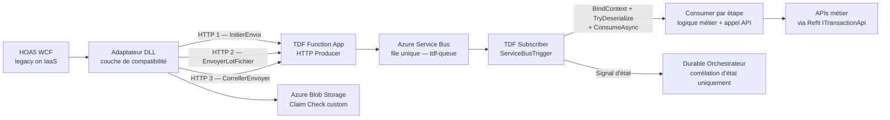
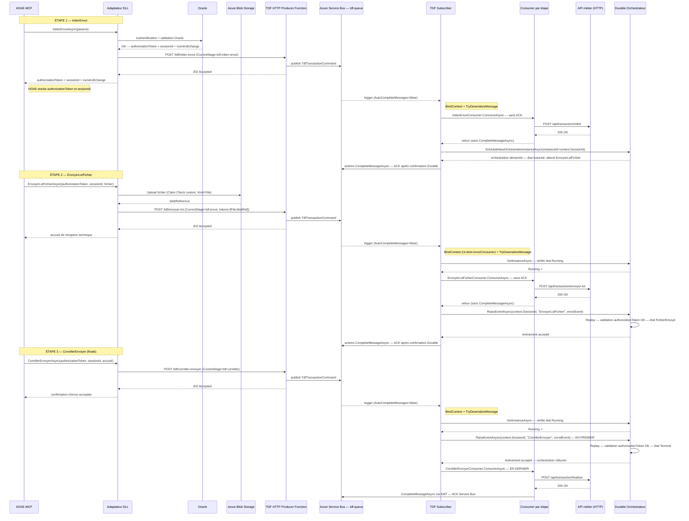
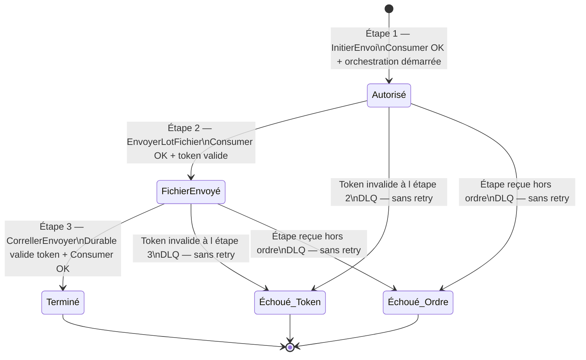

# Scénario d'intégration TDF — HOA5 legacy via EnterpriseMessageTransit

## 1. Contexte et objectif

Ce document décrit le scénario d'intégration complet entre **HOA5** (application legacy WCF sur VM IaaS) et **TDF** (Transfert de Données de Fichiers), en s'appuyant sur **EnterpriseMessageTransit** (EMT) comme couche messaging Azure Service Bus.

TDF orchestre une transaction en **3 étapes séquentielles et obligatoires** :

| Étape | Opération | Rôle |
|---|---|---|
| 1 | `InitierEnvoi` | Authentification, génération du jeton d'autorisation — le `sessionId` est l'identifiant de corrélation |
| 2 | `EnvoyerLotFichier` | Transfert du lot de fichiers via Claim Check Blob |
| 3 | `CorrellerEnvoyer` | Confirmation et finalisation de la transaction |

**Règle fondamentale** : les 3 étapes doivent être exécutées dans l'ordre exact 1 → 2 → 3, avec le même `sessionId` (identifiant de corrélation) et le même `authorizationToken`. Toute violation de cet ordre ou tout token invalide entraîne une **mise en DLQ immédiate** sans retry.

---

## 2. Architecture des composants



### Rôle de chaque composant

| Composant | Responsabilité | Ce qu'il NE fait PAS |
|---|---|---|
| **HOA5 WCF** | Lance la transaction, effectue 3 appels séquentiels à l'adaptateur | Ne connaît pas Service Bus ni Blob Storage |
| **Adaptateur DLL** | Authentification Oracle, Claim Check Blob, appel HTTP vers TDF, retourne le token à HOA5 | Ne publie pas directement dans Service Bus |
| **HTTP Producer Function** | Positionne `CurrentStage`, publie dans `tdf-queue` via `IMessageProducer` | Aucune logique métier |
| **Subscriber** | `BindContext` + `TryDeserializeMessage`, route selon `CurrentStage`, orchestre séquence Consumer/Durable | Ne contient pas de logique métier |
| **Consumer** | Appel API métier, `CompleteMessageAsync` (étape 3), `DeadLetterAsync` (erreurs non récupérables) | N'est jamais appelé depuis l'orchestrateur Durable |
| **Orchestrateur Durable** | Corrélation des 3 étapes, validation `authorizationToken` inline | Aucun appel API, aucun Consumer, aucune logique métier |

---

## 3. Message unique — `TdfTransactionCommand`

Une seule file `tdf-queue`, un seul type de message. Le champ `CurrentStage` distingue les étapes.

```csharp
public sealed record TdfTransactionCommand(
    string  AuthorizationToken,
    string  NumeroEchange,
    string? BlobReference   = null,
    string? AccuseReception = null);
```

Exemple de payload Service Bus (étape 2 — avec Claim Check) :

```json
{
  "messageType": "TdfTransactionCommand",
  "messageId":   "9c4f7f9c2f5f4cd49f767eb86ec2397a",
  "sessionId":   "d8d6a7fdf16f4f6b9fd7a7f5f3e0aa11",
  "currentStage": "tdf.envoi",
  "variables": {
    "authorizationToken": "auth-abc123",
    "numeroEchange":      "E123456789"
  },
  "tokens": [
    {
      "kind":        "File",
      "reference":   "inter-ppp/E123456789/payload.json",
      "contentType": "application/json",
      "size":        532001
    }
  ],
  "message": null
}
```

> `message` est `null` lorsqu'un Claim Check est utilisé (étape 2). Le payload métier (`TdfTransactionCommand`) est déjà entièrement présent dans `variables` ; la pièce jointe est référencée dans `tokens`. Répéter les données dans `message` serait une duplication inutile et source de divergence.

> **`message` non null** : uniquement quand le producteur inclut un objet métier explicite (`TdfTransactionCommand` sérialisé directement), sans Claim Check. Dans TDF, les étapes 1 et 3 (petits payloads sans pièce jointe) tombent dans ce cas.

> **TokenKind** : `TokenKind.File` = fichier binaire (pièce jointe) stocké en Blob Storage. `TokenKind.Message` = payload JSON/texte volumineux dépassant le seuil de taille de Service Bus.

> **`sessionId` et sessions Service Bus — obligatoires** : les sessions Service Bus sont le mécanisme fondamental garantissant que les messages de la même transaction sont traités **dans l'ordre d'envoi** par le même consommateur. Le `sessionId` (valorisé par l'adaptateur avec l'identifiant de corrélation généré à l'étape 1) est transmis sans changement dans les 3 étapes. C'est **la seule source d'identifiant de corrélation** dans EMT : il n'y a pas de champ `correlationId` dans `TdfTransactionCommand`. Dans le Subscriber et les Consumers, l'identifiant de corrélation est toujours lu depuis `context.SessionId`. La file `tdf-queue` doit être configurée en mode **session activée** et le `[ServiceBusTrigger]` doit inclure `IsSessionsEnabled = true`.

---

## 4. Claim Check — stratégie par type de contenu

### 4.1 Principe et déclenchement

Le pattern Claim Check évite de transiter des données volumineuses ou des pièces jointes directement dans le message Service Bus. Le contenu est stocké dans **Azure Blob Storage** et seule une **référence** (`token`) est incluse dans le message Service Bus.

**`ClaimCheckThresholdBytes`** : paramètre EMT (dans `BlobStorageSetting`) qui définit le seuil de taille en octets au-delà duquel EMT déclenche automatiquement le Claim Check sur le payload JSON. **C'est la seule valeur de référence à utiliser** — le namespace Service Bus étant partagé entre toutes les applications (FinOps), le seuil est piloté par la configuration et non par les limites du tier Azure. La logique interne EMT (`BaseMessageTransit.RequiresClaimCheck`) :

```
ClaimCheck appliqué si : tailleSérialisée >= ClaimCheckThresholdBytes
                     OU  ForceClaimCheck = true
```

Dans TDF, c'est la **présence d'une pièce jointe** (et non uniquement la taille) qui déclenche le Claim Check. L'adaptateur détecte la pièce jointe fournie par HOA5, l'uploade en Blob Storage, et n'inclut que la référence (`blobReference`) dans le message Service Bus — **indépendamment de `ClaimCheckThresholdBytes`** (voir §4.2).

### 4.2 Arbre de décision — quand appliquer le Claim Check

```
Message à publier dans tdf-queue
  │
  ├─ Pièce jointe présente ? (fichier EDI, PDF, ZIP, image binaire, etc.)
  │   └─ OUI → Upload Blob → TokenKind.File → message léger avec blobReference
  │       *** Notre cas TDF : déclenché par la présence de la pièce jointe
  │           (ForceClaimCheck=true dans ClaimCheckOptions.WithAttachment)
  │           → indépendant de ClaimCheckThresholdBytes ***
  │
  ├─ Payload JSON sans pièce jointe, taille serialisée >= ClaimCheckThresholdBytes ?
  │   (configuré dans BlobStorageSetting — valeur partagée entre toutes les applications du namespace)
  │   └─ OUI → Upload Blob → TokenKind.Message → message léger avec blobReference
  │
  └─ Petit message sans pièce jointe → payload inline dans le message (pas de Claim Check)
```

| Étape (`CurrentStage`) | Pièce jointe | Payload JSON | Claim Check | `TokenKind` |
|---|---|---|---|---|
| `tdf.initier-envoi` | Non | Petit (authorizationToken, numeroEchange) | **Non** | — |
| `tdf.envoi` | **Oui** (fichier EDI, PDF, etc.) | Petit | **Oui** — déclenché par la pièce jointe | `TokenKind.File` |
| `tdf.correller` | Non | Petit (accusé de réception) | **Non** | — |

### 4.3 Sémantique de TokenKind

| `TokenKind` | Signification | Cas d'usage |
|---|---|---|
| `TokenKind.File` | Fichier binaire (PDF, EDI, ZIP, image) stocké en Blob | TDF : pièce jointe → Claim Check obligatoire |
| `TokenKind.Message` | Payload JSON/texte volumineux dépassant le seuil SB | Gros JSON → Claim Check déclenché par la taille |

> **Règle TDF** : un message peut contenir simultanément un petit payload JSON inline (champ `message`) **et** une pièce jointe référencée (`tokens[0]` avec `Kind = File`). La présence d'une entrée dans `tokens` avec `Kind = File` indique au Consumer que la pièce jointe doit être récupérée depuis Blob Storage via `BlobReference`.

### 4.4 Flux Claim Check dans l'adaptateur (étape 2)

```
HOA5 → adaptateur.EnvoyerLotFichierAsync(authorizationToken, sessionId, fichier)
  │
  ├─ Pièce jointe fournie (Stream fichier) → Claim Check déclenché
  │   └─> ICustomBlobClaimCheckService.UploadAsync(numeroEchange, fichier, ct)
  │        └─> Blob stocké dans Azure Blob Storage
  │             container  : inter-ppp
  │             chemin     : {numeroEchange}/{timestamp}/payload.ext
  │             blobRef    : "inter-ppp/{no}/{timestamp}/payload.ext"  ← référence relative
  │
  ├─ TokenMessage construit :
  │   { Kind = TokenKind.File, Reference = blobRef, ContentType = "application/octet-stream" }
  │
  ├─ TdfTransactionCommand :
  │   { AuthorizationToken, NumeroEchange, BlobReference = blobRef }
  │
  └─ POST /tdf/envoyer-lot
       Message Service Bus < 1 KB (référence seule — pas le contenu binaire)
         └─> Consumer reçoit BlobReference et la transmet à l'API métier
```

> **Sécurité — référence relative obligatoire** : le `blobRef` stocké dans `TokenMessage.Reference` et dans `TdfTransactionCommand.BlobReference` doit être une **référence relative** au format `"container/chemin/fichier"` (ex. `"inter-ppp/E123456789/payload.json"`), et **non** l'URL absolue retournée par Azure Blob Storage (`https://storage.blob.core.windows.net/...`). L'URL absolue expose le nom du compte de stockage, le container et la structure des chemins — ces informations ne doivent pas transiter dans les messages Service Bus.
>
> **Contrat `IStorageProvider`** : `DownloadAsync(reference, ct)` accepte les deux formats :
> - URL absolue `https://...` → résolu directement via `BlobClient(absoluteUri)`
> - Référence relative `"container/path/blob"` → résolu via `BlobServiceClient.GetBlobContainerClient(container).GetBlobClient(path)`
>
> **Recommandation d'implémentation** — `ICustomBlobClaimCheckService.UploadAsync` doit retourner la référence relative plutôt que l'URL absolue :
>
> ```csharp
> public async Task<string> UploadAsync(string numeroEchange, Stream fichier, CancellationToken ct)
> {
>     var containerName = _settings.ContainerName;  // ex. "inter-ppp"
>     var blobPath      = $"{numeroEchange}/{DateTime.UtcNow:yyyyMMddHHmmss}/payload.bin";
>
>     var container = _blobServiceClient.GetBlobContainerClient(containerName);
>     var blob      = container.GetBlobClient(blobPath);
>
>     if (fichier.CanSeek) fichier.Position = 0;
>     await blob.UploadAsync(fichier, overwrite: true, cancellationToken: ct);
>
>     // Retourner la référence relative — NE PAS retourner blob.Uri.ToString()
>     return $"{containerName}/{blobPath}";
> }
> ```

### 4.5 Gestion côté Consumer

Le `EnvoyerLotFichierConsumer` transmet la référence Blob à l'API métier. Le téléchargement effectif du fichier est à la charge de l'API métier (ou d'une activité Durable si nécessaire) :

```csharp
// Consumer TDF : transmet la référence Blob à l'API métier — pas de download dans le Consumer
var response = await _api.EnvoyerLotAsync(
    new EnvoyerLotRequest(
        context.SessionId,             // sessionId = identifiant de corrélation
        cmd.AuthorizationToken,
        cmd.BlobReference ?? string.Empty),  // L'API métier accède au Blob directement si besoin
    cancellationToken);
```

### 4.6 Gouvernance Blob Storage

- **Container** : dédié par domaine (ex. : `inter-ppp`), accès via Managed Identity (`DefaultAzureCredential`).
- **Chemin** : structuré `{numeroEchange}/{filename}` pour traçabilité.
- **Rétention** : les blobs doivent être purgés après consommation confirmée ou après un TTL (ex. : 30 jours).
- **Aucune clé de stockage** dans le code — accès exclusivement via Managed Identity.

#### Procédure de cleanup — 3 stratégies

| Stratégie | Déclencheur | Avantage | Inconvénient |
|---|---|---|---|
| **A — Azure Lifecycle Policy** | Automatique (daily scan) | Zéro code, coût Azure minime | Délai jusqu'à 24 h après expiration |
| **B — Consumer-triggered** | Après succès de `CorrellerEnvoyerConsumer` | Nettoyage immédiat et garanti | Couplage Consumer/Storage ; retry si suppression échoue |
| **A + B** | TTL automatique + suppression immédiate | Filet de sécurité complet | Légèrement plus de code |

**Stratégie A — Azure Blob Lifecycle Policy (recommandée)**

Configurer dans le portail Azure ou via Bicep/ARM sur le compte de stockage :

```json
{
  "rules": [
    {
      "name": "purge-inter-ppp",
      "enabled": true,
      "type": "Lifecycle",
      "definition": {
        "filters": {
          "blobTypes": ["blockBlob"],
          "prefixMatch": ["inter-ppp/"]
        },
        "actions": {
          "baseBlob": {
            "delete": { "daysAfterModificationGreaterThan": 30 }
          }
        }
      }
    }
  ]
}
```

Aucune modification applicative requise. Le TTL de 30 jours couvre les cas de DLQ prolongés.

**Stratégie B — Suppression après confirmation de `CorrellerEnvoyerConsumer`**

Après l'appel API `FinaliserAsync`, supprimer le blob via `IStorageProvider` si la transaction est un succès :

```csharp
public override async Task<MessageTransitContext<MessageTransitResponse>> ConsumeAsync(
    MessageTransitContext<TdfTransactionCommand> context,
    CancellationToken cancellationToken)
{
    var cmd = context.Message!;

    var response = await _api.FinaliserAsync(
        new FinaliserRequest(
            context.SessionId,
            cmd.NumeroEchange,
            cmd.AccuseReception ?? string.Empty),
        cancellationToken);

    if (!response.IsSuccess)
    {
        await DeadLetterAsync(
            new InvalidOperationException($"Finalisation refusée : {response.ErrorMessage}"),
            cancellationToken);

        return new MessageTransitContext<MessageTransitResponse>
        {
            Message   = new MessageTransitResponse { IsSuccess = false, StatusCode = 422 },
            MessageId = context.MessageId
        };
    }

    // Cleanup du blob après confirmation de la transaction.
    // BlobReference contient le chemin relatif (ex. : "inter-ppp/E123456789/payload.json").
    // Si la suppression échoue, l'exception est propagée → EMT Exponential Retry →
    // le blob sera tenté de nouveau à la prochaine livraison. Idempotent : supprimer
    // un blob déjà supprimé retournera 404, que l'on doit ignorer.
    if (!string.IsNullOrEmpty(cmd.BlobReference))
    {
        try
        {
            await _storageProvider.DeleteAsync(cmd.BlobReference, cancellationToken);
        }
        catch (RequestFailedException ex) when (ex.Status == 404)
        {
            // Déjà supprimé (idempotence) — on continue.
        }
    }

    // CompleteMessageAsync géré par EMT après retour de ConsumeAsync.
    return new MessageTransitContext<MessageTransitResponse>
    {
        Message   = new MessageTransitResponse { IsSuccess = true, StatusCode = 200 },
        MessageId = context.MessageId
    };
}
```

> **Important** : la suppression du blob est idempotente par nature. Si le Consumer est rejoué (retry après une erreur réseau post-suppression), le 404 est ignoré proprement.

**Stratégie A + B (filet de sécurité)**

Combiner les deux : le Consumer supprime immédiatement après succès de l'API, et la Lifecycle Policy purge tout blob résiduel (ex. : cas de DLQ, transactions avortées). C'est l'approche recommandée pour les environnements de production.

#### Résumé du cycle de vie d'un blob TDF

```
Adaptateur HOA5
  → Upload blob (Content-Length > ClaimCheckThreshold)
  → Publie TdfTransactionCommand avec BlobReference

EnvoyerLotFichierConsumer
  → Lit BlobReference depuis context.Message.BlobReference
  → Appelle API avec la référence du blob

CorrellerEnvoyerConsumer
  → Appelle API FinaliserAsync (succès)
  → Supprime blob via IStorageProvider (Stratégie B)

Azure Lifecycle Policy (Stratégie A)
  → Purge les blobs > 30 jours (filet de sécurité pour DLQ / avortés)
```

---

## 5. Règles de validation et gestion des erreurs

### 5.1 Tableau de décision

| Erreur rencontrée | Comportement | Retry EMT ? | Détail |
|---|---|---|---|
| Message illisible / désérialisation impossible | **DLQ immédiate** | Non | Subscriber appelle `DeadLetterMessageAsync` directement |
| `CurrentStage` inconnu | **DLQ immédiate** | Non | Subscriber appelle `DeadLetterMessageAsync` |
| `authorizationToken` invalide (ne correspond pas à l'étape 1) | **DLQ immédiate** | Non | Orchestrateur `throw` → Durable `Failed` → le Subscriber détecte l'échec de `RaiseEventAsync` et DLQ |
| Étapes en mauvais ordre (ex. : étape 3 arrivée avant étape 2) | **DLQ immédiate** | Non | `WaitForExternalEvent` non résolu dans l'ordre prévu → l'orchestrateur rejette |
| Erreur non récupérable de l'API métier (ex. : 422 rejeté) | **DLQ immédiate** | Non | Consumer appelle `DeadLetterAsync` via EMT |
| Erreur transitoire de l'API métier (ex. : timeout, 503) | **Retry Exponentiel EMT** | Oui | Consumer lève une exception → EMT déclenche le retry → Service Bus relivrera le message |
| Erreur d'infrastructure Durable Functions | **Retry Exponentiel EMT** | Oui (étapes 1 et 2) | `ScheduleNew` ou `RaiseEventAsync` échoue → exception propagée → message rélivré par Service Bus |

### 5.2 Token invalide → DLQ sans retry (aucune exception)

Le token est validé par l'orchestrateur Durable de manière inline (comparaison de chaînes dans l'historique de replay — aucun appel réseau). Si le token ne correspond pas :

- L'orchestrateur lève une `InvalidOperationException`.
- L'orchestration passe en état `Failed`.
- Le `RaiseEventAsync` du Subscriber échoue.
- Pour les étapes 1 et 2 : le Subscriber propage l'exception → EMT Exponential Retry → **non désiré pour un token invalide**.

> **Implémentation recommandée** : le Subscriber doit capturer l'échec de `RaiseEventAsync` lié à un token invalide et appeler `DeadLetterMessageAsync` explicitement plutôt que de propager l'exception vers EMT.

```csharp
// Étapes 1 et 2 — gestion de l'échec de RaiseEventAsync (token invalide ou orchestration Failed)
try
{
    await durableClient.RaiseEventAsync(context.SessionId, "EnvoyerLotFichier", envoiEvent, ct);
    await actions.CompleteMessageAsync(message, ct);
}
catch (InvalidOperationException ex) when (ex.Message.Contains("authorizationToken invalide"))
{
    // Token invalide → DLQ sans retry
    await actions.DeadLetterMessageAsync(message,
        deadLetterReason: "Token d'autorisation invalide",
        deadLetterErrorDescription: ex.Message,
        cancellationToken: ct);
}
// Les autres exceptions (infrastructure Durable) se propagent → EMT Exponential Retry
```

### 5.3 Mauvais ordre d'état → DLQ sans retry

Si HOA5 appelle les étapes dans le mauvais ordre (ex. : `CorrellerEnvoyer` reçu alors que l'orchestration attend encore `EnvoyerLotFichier`), l'orchestrateur Durable ne peut pas accepter l'événement hors séquence. Le Subscriber doit détecter cet état et mettre le message en DLQ :

```csharp
// Vérification de l'état de l'orchestration avant d'envoyer le signal (étapes 2 et 3)
var status = await durableClient.GetInstanceAsync(context.SessionId, cancellationToken: ct);

if (status is null)
{
    await actions.DeadLetterMessageAsync(message,
        deadLetterReason: "Orchestration introuvable",
        deadLetterErrorDescription: $"Aucune orchestration active pour sessionId={context.SessionId}",
        cancellationToken: ct);
    return;
}

if (status.RuntimeStatus is OrchestrationRuntimeStatus.Failed
                          or OrchestrationRuntimeStatus.Terminated
                          or OrchestrationRuntimeStatus.Completed)
{
    await actions.DeadLetterMessageAsync(message,
        deadLetterReason: "Orchestration en état invalide pour cette étape",
        deadLetterErrorDescription: $"État={status.RuntimeStatus}, sessionId={context.SessionId}",
        cancellationToken: ct);
    return;
}
```

### 5.4 Erreurs d'infrastructure Durable Functions

Les seules erreurs d'infrastructure Durable (stockage Azure inaccessible, timeout interne, etc.) sont traitées comme des erreurs transitoires :

- `ScheduleNewOrchestrationInstanceAsync` ou `RaiseEventAsync` lèvent une exception infrastructure.
- L'exception se propage hors du Subscriber.
- EMT Exponential Retry est déclenché.
- Service Bus relivrera le message après le délai de retry.
- Une fois l'infrastructure rétablie, le traitement reprend normalement.

---

## 6. Flux détaillé des 3 étapes

### 6.1 Étape 1 — `InitierEnvoi`

**Objectif** : authentification Oracle, initialisation de la corrélation, retour du token HOA5.

**Séquence** :
1. HOA5 appelle `adaptateur.InitierEnvoiAsync(...)`.
2. L'adaptateur valide via Oracle (authentification applicative).
3. L'adaptateur génère `numeroEchange`, `authorizationToken`. Il génère également le `sessionId` (identifiant de corrélation) transmis dans les 3 étapes.
4. L'adaptateur publie `CurrentStage = "tdf.initier-envoi"` via HTTP vers TDF.
5. TDF publie dans `tdf-queue`.
6. Subscriber : `BindContext` + `TryDeserializeMessage` → `InitierEnvoiConsumer.ConsumeAsync` (API, sans ACK) → `ScheduleNewOrchestrationInstanceAsync(instanceId=context.SessionId)` → `actions.CompleteMessageAsync`.
7. Durable : état → `Autorisé`, en attente de l'événement `EnvoyerLotFichier`.

**Retour synchrone HOA5** (réponse de l'adaptateur) :
- `authorizationToken` — **HOA5 doit le stocker** pour les étapes 2 et 3.
- `sessionId` — **HOA5 doit le stocker** et le retransmettre dans les étapes 2 et 3 (c'est l'identifiant de corrélation).
- `numeroEchange` — identifiant technique TDF.

```
ACK Service Bus : émis par le Subscriber APRÈS confirmation de ScheduleNewOrchestrationInstanceAsync.
Si Durable échoue (infrastructure) → exception → Service Bus relivrera le message.
```

### 6.2 Étape 2 — `EnvoyerLotFichier`

**Objectif** : transfert du fichier via Claim Check Blob, validation du token par l'orchestrateur.

**Séquence** :
1. HOA5 appelle `adaptateur.EnvoyerLotFichierAsync(authorizationToken, sessionId, fichier)`.
2. L'adaptateur charge le fichier en Blob Storage (Claim Check custom, `TokenKind.File`).
3. L'adaptateur publie `CurrentStage = "tdf.envoi"` avec `tokens=[{Kind=File, Reference=blobRef}]` via HTTP vers TDF.
4. TDF publie dans `tdf-queue`.
5. Subscriber : `BindContext` (re-bind sur `_envoiConsumer`) + `ConsumeAsync` (API, sans ACK).
6. Subscriber vérifie l'état de l'orchestration (doit être `Running`).
7. Subscriber : `RaiseEventAsync(context.SessionId, "EnvoyerLotFichier", envoiEvent)`.
8. Durable : valide `authorizationToken` (doit correspondre exactement au token de l'étape 1) → état → `FichierEnvoyé`.
9. Subscriber : `actions.CompleteMessageAsync` (ACK Service Bus).

```
Token invalide à l'étape 2 → Durable Failed → Subscriber DLQ le message (aucun retry).
Orchestration introuvable → Subscriber DLQ le message (aucun retry).
Erreur API métier transitoire → EMT Exponential Retry.
```

### 6.3 Étape 3 — `CorrellerEnvoyer`

**Objectif** : confirmation finale, validation du token, exécution de la logique métier terminale.

**Séquence — Durable EN PREMIER, Consumer EN DERNIER** :

1. HOA5 appelle `adaptateur.CorrellerEnvoyerAsync(authorizationToken, sessionId, accuséDeRéception)`.
2. L'adaptateur publie `CurrentStage = "tdf.correller"` via HTTP vers TDF.
3. TDF publie dans `tdf-queue`.
4. Subscriber : `BindContext` + `TryDeserializeMessage`.
5. **Subscriber vérifie l'état de l'orchestration** (doit être `Running`, attendant `CorrellerEnvoyer`).
6. **Subscriber signale Durable EN PREMIER** : `RaiseEventAsync(context.SessionId, "CorrellerEnvoyer", correlEvent)`.
7. **Durable valide le token** : `correlEvent.AuthorizationToken == initData.AuthorizationToken` → si NON → Durable `Failed` → Subscriber DLQ le message.
8. Si token valide → Durable : état → `Terminé`, orchestration clôturée.
9. **Subscriber appelle le Consumer EN DERNIER** : `_correlConsumer.BindContext` + `ConsumeAsync`.
10. `CorrellerEnvoyerConsumer` : appel API finale → si erreur → `DeadLetterAsync` (non récupérable) ou exception (transitoire → EMT Retry).
11. Si succès API → `CompleteMessageAsync` via EMT (ACK Service Bus).

> **Pourquoi Durable EN PREMIER à l'étape 3 ?**
>
> La validation du token et la corrélation finale sont enregistrées dans l'historique Durable **avant** que l'appel API coûteux ne s'exécute. Si le token est invalide, la transaction est rejetée immédiatement sans consommer de ressources API. Si le Consumer échoue ensuite (erreur transitoire), EMT Retry recouvrira : le signal Durable déjà reçu (orchestration terminée) ignorera gracieusement le signal redondant émis lors de la nouvelle tentative.

```
Token invalide à l'étape 3 → Durable Failed → Subscriber DLQ (aucun retry).
Mauvais ordre d'état → Subscriber DLQ (aucun retry).
Erreur API métier transitoire dans ConsumeAsync → EMT Exponential Retry (message non acquitté).
Erreur non récupérable dans ConsumeAsync → Consumer appelle DeadLetterAsync → DLQ.
```

---

## 7. Diagramme de séquence global



---

## 8. Machine d'état de l'orchestration



---

## 9. Cycle de vie Durable Functions — résilience et absence d'instances zombies

### 9.1 Persistance d'état — durabilité sur restart

L'orchestrateur Durable **ne réside pas en mémoire**. Son état complet est persisté dans **Azure Storage** après chaque checkpoint (après chaque `await`) :

| Table Azure Storage | Contenu |
|---|---|
| `DurableTaskInstances` | Métadonnées de chaque orchestration (instanceId, état, horodatage de création/fin) |
| `DurableTaskHistory` | Historique complet des événements (input, signaux reçus, résultats de chaque étape) |

**Ce que cela signifie concrètement** :

- Un restart du Function App (déploiement Azure, crash, scale-in/scale-out) **n'affecte pas** les orchestrations en cours.
- Au redémarrage, le Durable Task Framework (DTFx) lit toutes les orchestrations en état `Running` depuis Azure Storage.
- Pour chaque orchestration active, DTFx déclenche un **Replay** depuis le début de l'historique.
- L'orchestration reprend **exactement là où elle s'était arrêtée**, sans intervention manuelle.

```
Restart Function App (déploiement ou crash)
  └─> DTFx lit les orchestrations Running dans DurableTaskInstances
       └─> Pour chaque orchestration :
            └─> Replay depuis DurableTaskHistory
                 └─> Tous les await déjà résolus → retour immédiat (historique)
                      └─> Premier await non résolu → orchestrateur SUSPENDU (même état qu'avant)
                           └─> Aucune donnée perdue — transaction reprend normalement
```

> L'orchestrateur TDF peut attendre l'étape 2 ou 3 pendant **des heures ou des jours** sans aucune ressource CPU consommée, et survivre à n'importe quel restart du Function App.

### 9.2 Long-running — résistance aux délais entre étapes

Une transaction TDF n'a pas de délai imposé par la plateforme entre l'étape 1 et l'étape 3. Durable Functions supporte nativement des orchestrations de plusieurs jours à plusieurs mois.

Pendant la suspension entre deux étapes :
- **Aucun thread bloqué** — l'orchestrateur est sérialisé dans Azure Storage.
- **Coût quasi nul** — uniquement stockage Azure (quelques octets par orchestration).
- **Aucun timeout implicite** de la plateforme Azure Functions.

### 9.3 Stratégie anti-zombies — timeout explicite sur WaitForExternalEvent

Sans timeout explicite, une orchestration qui n'a jamais reçu l'étape 2 ou 3 resterait en état `Running` **indéfiniment** — c'est une instance zombie. Pour éviter cela, chaque `WaitForExternalEvent` est protégé par un timer Durable :

```csharp
public static class TdfOrchestrator
{
    [Function("TdfTransactionOrchestrator")]
    public static async Task Run([OrchestrationTrigger] TaskOrchestrationContext ctx)
    {
        // Orchestrateur : ctx.InstanceId = sessionId = identifiant de corrélation
        var initData = ctx.GetInput<InitierEnvoiEvent>()
            ?? throw new InvalidOperationException("Input InitierEnvoiEvent manquant.");

        // ════════════════════════════════════════════════════════════════════
        // ATTENTE ÉTAPE 2 avec TIMEOUT — anti-zombie
        //
        // ctx.CreateTimer est un timer Durable persisté dans Azure Storage.
        // Il survit aux restarts du Function App — contrairement à Task.Delay.
        // Si HOA5 n'envoie pas EnvoyerLotFichier dans les 24h, la transaction
        // est abandonnée proprement → état Failed → aucune instance zombie.
        // ════════════════════════════════════════════════════════════════════
        using var cts2      = new CancellationTokenSource();
        var timeoutEtape2   = ctx.CreateTimer(ctx.CurrentUtcDateTime.AddHours(24), cts2.Token);
        var eventEtape2     = ctx.WaitForExternalEvent<EnvoyerLotFichierEvent>("EnvoyerLotFichier");

        if (await Task.WhenAny(eventEtape2, timeoutEtape2) == timeoutEtape2)
        {
            throw new TimeoutException(
                $"Transaction abandonnée : EnvoyerLotFichier non reçu en 24h. InstanceId={ctx.InstanceId}");
        }
        cts2.Cancel(); // Annule le timer Durable — l'événement est arrivé à temps
        var envoiEvent = await eventEtape2;

        if (envoiEvent.AuthorizationToken != initData.AuthorizationToken)
            throw new InvalidOperationException(
                $"authorizationToken invalide à EnvoyerLotFichier. InstanceId={ctx.InstanceId}");

        // ════════════════════════════════════════════════════════════════════
        // ATTENTE ÉTAPE 3 avec TIMEOUT — anti-zombie
        // ════════════════════════════════════════════════════════════════════
        using var cts3      = new CancellationTokenSource();
        var timeoutEtape3   = ctx.CreateTimer(ctx.CurrentUtcDateTime.AddHours(24), cts3.Token);
        var eventEtape3     = ctx.WaitForExternalEvent<CorrellerEnvoyerEvent>("CorrellerEnvoyer");

        if (await Task.WhenAny(eventEtape3, timeoutEtape3) == timeoutEtape3)
        {
            throw new TimeoutException(
                $"Transaction abandonnée : CorrellerEnvoyer non reçu en 24h. InstanceId={ctx.InstanceId}");
        }
        cts3.Cancel();
        var correlEvent = await eventEtape3;

        if (correlEvent.AuthorizationToken != initData.AuthorizationToken)
            throw new InvalidOperationException(
                $"authorizationToken invalide à CorrellerEnvoyer. InstanceId={ctx.InstanceId}");

        // Transaction complète — orchestration terminée proprement → état Completed.
    }
}
```

> **Règle impérative** : toujours utiliser `ctx.CreateTimer(...)`, jamais `Task.Delay` ni `Thread.Sleep`. Le timer Durable est persisté dans Azure Storage et survit aux restarts. `Task.Delay` est perdu au restart → le timeout ne se déclencherait jamais.

### 9.4 Cycle de vie complet d'une instance

```
[Étape 1 reçue]
  └─> ScheduleNewOrchestrationInstanceAsync(instanceId=context.SessionId)
       └─> Instance créée dans DurableTaskInstances → état Running
            └─> Orchestrateur démarré → await (EnvoyerLotFichier | timer 24h)
                 └─> SUSPENDU — zéro CPU — état persisté dans Azure Storage

[Étape 2 reçue dans les 24h]
  └─> RaiseEventAsync → DTFx réveille l'orchestrateur → Replay
       └─> Timer 24h annulé — validation token OK
            └─> await (CorrellerEnvoyer | timer 24h) → SUSPENDU de nouveau

[Étape 3 reçue dans les 24h]
  └─> RaiseEventAsync → DTFx réveille l'orchestrateur → Replay
       └─> Timer 24h annulé — validation token OK
            └─> Orchestrateur terminé → état Completed
                 └─> Purge planifiée (TTL 30 jours)

[Timeout — étape 2 ou 3 non reçue en 24h]
  └─> Timer Durable déclenché → throw TimeoutException → état Failed
       └─> Aucune instance zombie — purge planifiée

[Token invalide]
  └─> throw InvalidOperationException → état Failed
       └─> Aucune instance zombie — message Service Bus en DLQ

[Restart Function App — déploiement ou crash]
  └─> DTFx relit DurableTaskInstances → Replay sur chaque orchestration Running
       └─> Aucune donnée perdue — reprise transparente
            └─> Les timers Durable (anti-zombie) reprennent leur décompte depuis Azure Storage
```

### 9.5 Purge des instances terminées — éviter l'accumulation

Les instances en état `Completed` ou `Failed` persistent dans Azure Storage **indéfiniment** par défaut. Sans purge, la table `DurableTaskInstances` grossit sans limite et dégrade les performances.

**Function Timer de purge quotidienne** :

```csharp
[Function("PurgeDurableInstances")]
public async Task Run(
    [TimerTrigger("0 0 2 * * *")] TimerInfo timer,   // tous les jours à 2h00 UTC
    [DurableClient] DurableTaskClient durableClient,
    ILogger<PurgeDurableInstances> logger,
    CancellationToken ct)
{
    // Purge les instances Completed/Failed/Terminated de plus de 30 jours
    var result = await durableClient.PurgeAllInstancesAsync(
        new PurgeInstancesFilter(
            createdFrom:   DateTime.UtcNow.AddDays(-9999),  // depuis toujours
            createdTo:     DateTime.UtcNow.AddDays(-30),    // âgées de plus de 30 jours
            runtimeStatus: [
                OrchestrationRuntimeStatus.Completed,
                OrchestrationRuntimeStatus.Failed,
                OrchestrationRuntimeStatus.Terminated
            ]),
        cancellationToken: ct);

    logger.LogInformation(
        "Purge Durable : {Count} instances supprimées.", result.PurgedInstanceCount);
}
```

> **Règle** : ne jamais inclure `Running` ou `Pending` dans les statuts de purge. Ces orchestrations sont actives — les purger créerait des transactions perdues. La purge est idempotente et peut être exécutée plusieurs fois sans effet de bord.

### 9.6 Tableau de résilience — référence rapide

| Scénario | Comportement Durable | Impact TDF |
|---|---|---|
| Restart Function App | Replay automatique depuis Azure Storage | Aucun — transaction reprend exactement |
| Timeout étape 2 (24h dépassées) | Timer → `throw` → état `Failed` | Instance proprement clôturée — aucun zombie |
| Timeout étape 3 (24h dépassées) | Timer → `throw` → état `Failed` | Instance proprement clôturée — aucun zombie |
| Token invalide | `throw` → état `Failed` | Message en DLQ — transaction annulée |
| Crash Azure Storage (transitoire) | DTFx retry automatique | Transparent pour TDF |
| Purge quotidienne (30 jours) | Instances Completed/Failed supprimées | Plan de rétention respecté |
| Transaction en attente < 24h | Orchestration `Running` normale | Timer non déclenché — transaction valide |

---

## 10. Scénarios d'erreur détaillés

### 10.1 Token invalide à l'étape 2

```
HOA5 appelle EnvoyerLotFichier avec un authorizationToken différent de celui de l'étape 1
  └─> Subscriber publie RaiseEventAsync("EnvoyerLotFichier", { AuthorizationToken="DIFFERENT" })
       └─> Durable Replay : envoiEvent.AuthorizationToken != initData.AuthorizationToken
            └─> throw InvalidOperationException("authorizationToken invalide")
                 └─> Durable passe en état Failed
                      └─> Subscriber détecte l'échec de RaiseEventAsync
                           └─> DeadLetterMessageAsync("Token d'autorisation invalide")
                                └─> Message en DLQ — PAS de retry EMT
```

### 10.2 Token invalide à l'étape 3

```
HOA5 appelle CorrellerEnvoyer avec un authorizationToken différent
  └─> Subscriber : RaiseEventAsync EN PREMIER ("CorrellerEnvoyer", { AuthorizationToken="DIFFERENT" })
       └─> Durable Replay : correlEvent.AuthorizationToken != initData.AuthorizationToken
            └─> throw → Durable Failed
                 └─> Subscriber : DeadLetterMessageAsync("Token d'autorisation invalide")
                      └─> Consumer PAS appelé — Message en DLQ — PAS de retry EMT
```

### 10.3 Étape 3 reçue avant étape 2 (mauvais ordre)

```
HOA5 appelle CorrellerEnvoyer avant EnvoyerLotFichier
  └─> Subscriber : GetInstanceAsync(context.SessionId)
       └─> Orchestration en état Autorisé (attend EnvoyerLotFichier, pas CorrellerEnvoyer)
            └─> DeadLetterMessageAsync("Orchestration en état invalide pour cette étape")
                 └─> Message en DLQ — PAS de retry EMT
```

### 10.4 Étape 2 - Erreur transitoire de l'API métier

```
EnvoyerLotFichierConsumer.ConsumeAsync → API timeout (503)
  └─> Exception propagée hors de ConsumeAsync
       └─> EMT Exponential Retry déclenché
            └─> Message non acquitté → Service Bus relivrera après délai de backoff
                 └─> Subscriber retraitera : BindContext + ConsumeAsync (idempotence API requise)
```

### 10.5 Étape 3 - Erreur transitoire Consumer (après signal Durable réussi)

```
RaiseEventAsync("CorrellerEnvoyer") → succès (Durable état Terminé)
  └─> CorrellerEnvoyerConsumer.ConsumeAsync → API timeout
       └─> Exception propagée → EMT Exponential Retry
            └─> Service Bus relivrera le message
                 └─> Subscriber : GetInstanceAsync → état Completed
                      └─> RaiseEventAsync réémis → Durable ignore gracieusement (orchestration terminée)
                           └─> Consumer rappelé → appel API rejoué (idempotence requise)
```

### 10.6 Erreur d'infrastructure Durable Functions

```
ScheduleNewOrchestrationInstanceAsync ou RaiseEventAsync → exception Azure Storage (503, timeout réseau)
  └─> Exception propagée hors du Subscriber
       └─> EMT Exponential Retry déclenché
            └─> Service Bus relivrera le message après backoff
                 └─> Une fois l'infrastructure rétablie → traitement normal reprend
```

---

## 11. Idempotence des APIs métier — exigence obligatoire

Les APIs métier (`/api/transaction/initier`, `/api/transaction/envoyer-lot`, `/api/transaction/finaliser`) **doivent être idempotentes**. Un même appel rejoué plusieurs fois avec les mêmes paramètres doit produire le même résultat sans créer de doublon ni d'effet de bord.

Causes de rélivraison possibles :

| Cause | Étape concernée |
|---|---|
| Erreur transitoire API → EMT Retry exponentiel | 1, 2 et 3 |
| Infrastructure Durable défaillante | 1 et 2 |
| Exception entre `ConsumeAsync` et `CompleteMessageAsync` | 1 et 2 |
| Retry étape 3 après Durable déjà terminé | 3 |

### 11.1 `context.MessageId` — clé naturelle d'idempotence

Dans chaque Consumer, `context.MessageId` est le `MessageId` du message Service Bus. Ce champ est **préservé lors de chaque rélivraison** : si EMT abandonne le message et que Service Bus le relivres, `context.MessageId` reste identique. C'est la clé canonique d'idempotence à propager vers l'API métier.

```
Message étape 1 → ConsumeAsync → context.MessageId = "9c4f7f9c..."
    API échoue (timeout) → Abandon → EMT recycle

Message étape 1 (relivré) → ConsumeAsync → context.MessageId = "9c4f7f9c..."  ← même valeur
    API reçoit même Idempotency-Key → retourne résultat précédent sans retraiter
```

Chaque étape publie un **message distinct** dans `tdf-queue`, donc chaque `context.MessageId` est unique par étape — aucun suffixe `:{etape}` n'est nécessaire.

### 11.2 Stratégie A — API native (service sous votre contrôle)

Implémenter l'idempotence **dans l'API** via le header HTTP `Idempotency-Key`. Le Consumer propage `context.MessageId` comme clé.

**Côté Consumer** :

```csharp
var response = await _api.InitierEnvoiAsync(
    new InitierEnvoiRequest(cmd.AuthorizationToken, cmd.NumeroEchange),
    idempotencyKey: context.MessageId,   // propagé comme header HTTP
    cancellationToken);
```

**Contrat Refit** :

```csharp
public interface ITransactionApi
{
    [Post("/api/transaction/initier")]
    Task<TransactionApiResponse> InitierEnvoiAsync(
        [Body]   InitierEnvoiRequest request,
        [Header("Idempotency-Key")] string idempotencyKey,
        CancellationToken ct);

    [Post("/api/transaction/envoyer-lot")]
    Task<TransactionApiResponse> EnvoyerLotAsync(
        [Body]   EnvoyerLotRequest request,
        [Header("Idempotency-Key")] string idempotencyKey,
        CancellationToken ct);

    [Post("/api/transaction/finaliser")]
    Task<TransactionApiResponse> FinaliserAsync(
        [Body]   FinaliserRequest request,
        [Header("Idempotency-Key")] string idempotencyKey,
        CancellationToken ct);
}
```

**Côté API métier** — table de déduplication :

```sql
CREATE TABLE ApiIdempotency (
  IdempotencyKey  NVARCHAR(128) NOT NULL PRIMARY KEY,  -- context.MessageId
  RequestHash     NVARCHAR(128) NOT NULL,               -- hash du payload
  ResponseCode    INT           NOT NULL,
  ResponseBody    NVARCHAR(MAX) NULL,
  CreatedAt       DATETIME2     NOT NULL DEFAULT GETUTCDATE()
);
```

Règles :
- Même `IdempotencyKey` + même `RequestHash` → retourner la réponse stockée (200/201) sans retraiter.
- Même `IdempotencyKey` + `RequestHash` différent → rejeter (409 Conflict) : payload modifié sur le retry.
- Retention : 7 à 30 jours selon le SLA de rélivraison Service Bus.

### 11.3 Stratégie B — API legacy (sans modification du contrat)

Si l'API legacy ne peut pas être modifiée, implémenter la déduplication **dans le Consumer** avant l'appel API. `context.MessageId` sert de clé dans une table `ProcessedMessages`.

**Table côté Consumer** :

```sql
CREATE TABLE ProcessedMessages (
  MessageId     NVARCHAR(128) NOT NULL PRIMARY KEY,  -- context.MessageId
  CurrentStage  NVARCHAR(64)  NOT NULL,              -- context.CurrentStage
  Status        NVARCHAR(16)  NOT NULL,              -- STARTED | SUCCEEDED | FAILED
  LastError     NVARCHAR(1024) NULL,
  ProcessedAt   DATETIME2     NOT NULL DEFAULT GETUTCDATE()
);
```

**Flux Consumer (exemple `InitierEnvoiConsumer`)** :

```csharp
public override async Task<MessageTransitContext<MessageTransitResponse>> ConsumeAsync(
    MessageTransitContext<TdfTransactionCommand> context,
    CancellationToken ct)
{
    var cmd = context.Message!;

    // 1. Déduplication : ce message a-t-il déjà été traité avec succès ?
    var existing = await _db.ProcessedMessages
        .FirstOrDefaultAsync(m => m.MessageId == context.MessageId, ct);

    if (existing?.Status == "SUCCEEDED")
    {
        // Rélivraison détectée — retourner succès sans rappeler l'API
        return new MessageTransitContext<MessageTransitResponse>
        {
            Message   = new MessageTransitResponse { IsSuccess = true, StatusCode = 200 },
            MessageId = context.MessageId
        };
    }

    // 2. Enregistrer STARTED
    _db.ProcessedMessages.Add(new ProcessedMessage
    {
        MessageId    = context.MessageId,
        CurrentStage = context.CurrentStage!,
        Status       = "STARTED",
        ProcessedAt  = DateTime.UtcNow
    });
    await _db.SaveChangesAsync(ct);

    // 3. Appel API legacy
    var response = await _api.InitierEnvoiAsync(
        new InitierEnvoiRequest(cmd.AuthorizationToken, cmd.NumeroEchange),
        ct);

    if (!response.IsSuccess)
    {
        await _db.ProcessedMessages
            .Where(m => m.MessageId == context.MessageId)
            .ExecuteUpdateAsync(s => s
                .SetProperty(m => m.Status,    "FAILED")
                .SetProperty(m => m.LastError, response.ErrorMessage), ct);

        await DeadLetterAsync(
            new InvalidOperationException($"InitierEnvoi refusé : {response.ErrorMessage}"),
            ct);

        return new MessageTransitContext<MessageTransitResponse>
        {
            Message   = new MessageTransitResponse { IsSuccess = false, StatusCode = 422 },
            MessageId = context.MessageId
        };
    }

    // 4. Marquer SUCCEEDED
    await _db.ProcessedMessages
        .Where(m => m.MessageId == context.MessageId)
        .ExecuteUpdateAsync(s => s.SetProperty(m => m.Status, "SUCCEEDED"), ct);

    return new MessageTransitContext<MessageTransitResponse>
    {
        Message   = new MessageTransitResponse { IsSuccess = true, StatusCode = 200 },
        MessageId = context.MessageId
    };
}
```

> **Limite principale** : si l'API répond avec un timeout réseau (HTTP 408 / coupure réseau), l'effet métier peut être réalisé côté API sans que le Consumer le sache. La ligne reste `FAILED` → un retry peut produire un double effet. **Mitigation** : propager `context.MessageId` dans le payload de l'appel API même si l'API ne gère pas `Idempotency-Key` — cela facilite la réconciliation manuelle via runbook.

**Classification des erreurs et actions** :

| Statut HTTP | Action Consumer | Sortie |
|---|---|---|
| 4xx fonctionnel (400, 422) | `DeadLetterAsync` immédiat | DLQ |
| 401 / 403 | `DeadLetterAsync` + alerte | DLQ |
| 408 / 429 / 5xx / timeout | Marquer `FAILED`, laisser Retry EMT | Retry → SUCCEEDED ou DLQ |
| Déjà `SUCCEEDED` en DB | Retourner 200 sans rappeler l'API | Complet (rélivraison ignorée) |

### 11.4 Choix de stratégie

| Stratégie | API modifiable ? | Garantie doublon | Recommandation |
|---|---|---|---|
| **A — Native** | Oui | Forte (côté API) | Préférer pour tout nouveau service |
| **B — Legacy** | Non | Partielle (timeout réseau = risque résiduel) | Acceptable avec runbook de réconciliation |
| **A + B combinés** | Oui | Maximale | Contexte critique (finance, santé, secteur public) |

> **Contexte TDF** : si les APIs TDF sont sous votre contrôle, opter pour la **Stratégie A** — c'est la plus propre et la plus robuste. La `ProcessedMessages` (Stratégie B) reste une option viable pour les APIs legacy HOA5 qui ne peuvent pas être modifiées.

---

## 12. Configuration DI complète

```csharp
var host = new HostBuilder()
    .ConfigureFunctionsWorkerDefaults()
    .ConfigureServices(services =>
    {
        services.AddScoped<IProducerConfigurationService, TdfProducerConfigService>();
        services.AddScoped<IConsumerConfigurationService, TdfConsumerConfigService>();

        services.ConfigureAzureProviders(new DefaultAzureCredential());

        // Producer unique — file unique tdf-queue pour les 3 étapes
        services.AddProducer<TdfTransactionCommand>("tdf-queue");

        // Un Consumer scoped par étape
        services.AddScoped<InitierEnvoiConsumer>();
        services.AddScoped<EnvoyerLotFichierConsumer>();
        services.AddScoped<CorrellerEnvoyerConsumer>();

        // Client Refit partagé par les 3 Consumers
        services.AddRefitClient<ITransactionApi>()
            .ConfigureHttpClient(c =>
                c.BaseAddress = new Uri("https://api.tdf.ramq.qc.ca"));
    })
    .Build();
```

`host.json` — obligatoire :

```json
{
  "version": "2.0",
  "extensions": {
    "serviceBus": {
      "autoCompleteMessages": false,
      "sessionHandlerOptions": {
        "autoCompleteMessages": false,
        "maxConcurrentSessions": 16,
        "maxConcurrentCallsPerSession": 1
      }
    }
  }
}
```

Trigger Subscriber avec sessions — obligatoire :

```csharp
[Function("TdfSubscriber")]
public async Task Run(
    [ServiceBusTrigger(
        "tdf-queue",
        AutoCompleteMessages  = false,
        IsSessionsEnabled     = true)]   // garantit l'ordre FIFO par sessionId
    ServiceBusReceivedMessage message,
    ServiceBusSessionMessageActions actions,  // SessionMessageActions (et non MessageActions) en mode session
    DurableTaskClient durableClient,
    CancellationToken ct)
{
    // context.SessionId = identifiant de corrélation — les 3 étapes
    // de la même transaction sont garanties d'arriver dans l'ordre d'envoi.
    ...
}
```

> **Producteur** : le `sessionId` (identifiant de corrélation généré à l'étape 1 par l'adaptateur) doit être positionné dans `MessageTransitContext.SessionId` pour les 3 étapes. `TdfTransactionCommand` ne contient **pas** de champ `CorrelationId` — le `sessionId` de la session Service Bus joue ce rôle.

```csharp
var context = new MessageTransitContext<TdfTransactionCommand>
{
    Message      = cmd,
    MessageId    = Guid.NewGuid().ToString("N"),
    CurrentStage = "tdf.envoi",
    SessionId    = sessionId   // sessionId = identifiant de corrélation reçu de l'adaptateur
};
```

---

## 13. Checklist d'implémentation

### Obligatoire — comportement correct garanti

- [ ] `AutoCompleteMessages = false` dans `host.json` **ET** dans `[ServiceBusTrigger]`.
- [ ] Subscriber vérifie l'état Durable (`GetInstanceAsync`) avant `RaiseEventAsync` aux étapes 2 et 3.
- [ ] Token invalide détecté → `DeadLetterMessageAsync` directement dans le Subscriber (ne pas propager vers EMT).
- [ ] Orchestration introuvable ou état incorrect → `DeadLetterMessageAsync` directement (ne pas propager).
- [ ] `ScheduleNewOrchestrationInstanceAsync` et `RaiseEventAsync` : les erreurs **infrastructure** se propagent → EMT Retry.
- [ ] `CorrellerEnvoyerConsumer` est appelé **après** `RaiseEventAsync` (jamais avant à l'étape 3).
- [ ] `CompleteMessageAsync` **jamais** appelé dans les Consumers des étapes 1 et 2.
- [ ] `CompleteMessageAsync` appelé **uniquement** dans `CorrellerEnvoyerConsumer` (étape 3).
- [ ] Pièce jointe présente → `TokenKind.File` + upload Blob avant l'appel HTTP (Claim Check).
- [ ] `sessionId` valorisé dans `MessageTransitContext.SessionId` pour les 3 étapes — c'est le seul identifiant de corrélation (pas de champ `CorrelationId` dans `TdfTransactionCommand`).
- [ ] `authorizationToken` transmis dans les 3 étapes (validé inline par l'orchestrateur à chaque transition).
- [ ] **Anti-zombie** : `ctx.CreateTimer(...)` configuré sur chaque `WaitForExternalEvent` (jamais `Task.Delay`).
- [ ] **Purge** : Function Timer de purge quotidienne configurée pour les instances `Completed`/`Failed` (TTL 30 jours).
- [ ] **Sessions Service Bus** : `tdf-queue` configurée en mode session, `[ServiceBusTrigger]` avec `IsSessionsEnabled = true`, `sessionId` commun aux 3 étapes d'une même transaction.

### Qualité et observabilité

- [ ] Journaliser `MessageId`, `SessionId` (`context.SessionId`), `CurrentStage` dans chaque Consumer.
- [ ] Journaliser le motif de DLQ (token invalide, état incorrect, stage inconnu, timeout).
- [ ] APIs métier idempotentes : propager `context.MessageId` comme `Idempotency-Key` (Stratégie A — API native) ou implémenter `ProcessedMessages` dans le Consumer (Stratégie B — API legacy). Voir §11.
- [ ] Aucun appel réseau (`httpClient`, `DbContext`, etc.) dans l'orchestrateur Durable.
- [ ] Aucun `DateTime.Now`, `Guid.NewGuid()`, `Task.Delay`, `Thread.Sleep` dans l'orchestrateur Durable.
- [ ] Purge des blobs Blob Storage configurée via Azure Blob Lifecycle Policy (TTL aligné avec Durable).

### Interdit dans l'orchestrateur Durable — rappel

```csharp
// Ces instructions brisent le déterminisme du Replay et provoquent des bugs difficiles à diagnostiquer
DateTime.Now                     // → ctx.CurrentUtcDateTime
DateTimeOffset.UtcNow            // → ctx.CurrentUtcDateTime
Guid.NewGuid()                   // → générer dans le Consumer, passer en paramètre
await httpClient.GetAsync(...)   // → appeler dans le Consumer
Thread.Sleep / Task.Delay        // → await ctx.CreateTimer(...)
Console.WriteLine / _logger.Log  // → ctx.CreateReplaySafeLogger(logger)
```

---

## 14. Résumé des responsabilités

| Qui | Quoi | Jamais |
|---|---|---|
| **Subscriber** | Route selon `CurrentStage`, orchestre séquence, valide état Durable, DLQ directe sur erreurs de validation | Logique métier, appel API |
| **Consumer** | Appel API métier, `DeadLetterAsync` (non récupérable), `CompleteMessageAsync` (étape 3 seulement) | Appel Durable, décision de routing |
| **Orchestrateur Durable** | Corrélation des 3 étapes, validation `authorizationToken` inline | Appel API, Consumer, logique métier |
| **EMT** | Retry exponentiel, `DeadLetterAsync`, `CompleteMessageAsync` sur pilotage Consumer | — |
| **Durable Functions** | Persistance d'état, gestion du Replay, `WaitForExternalEvent` | — |
