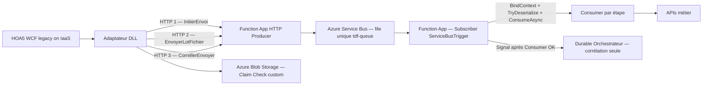
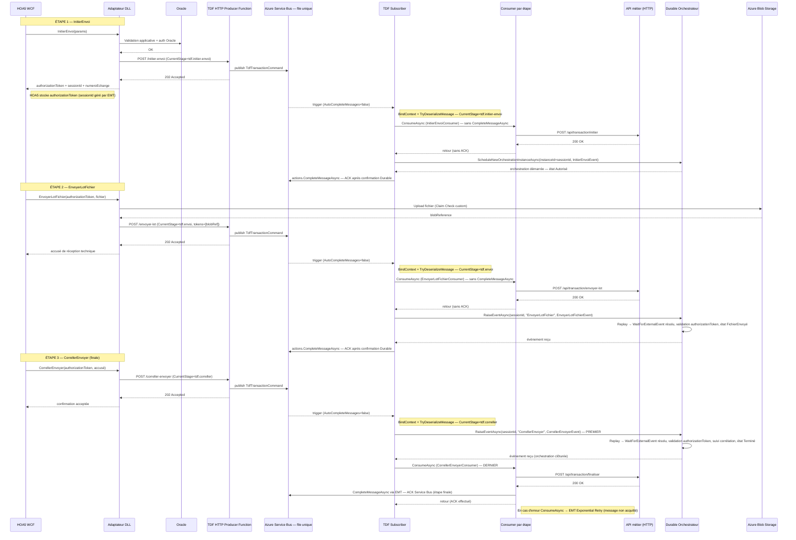
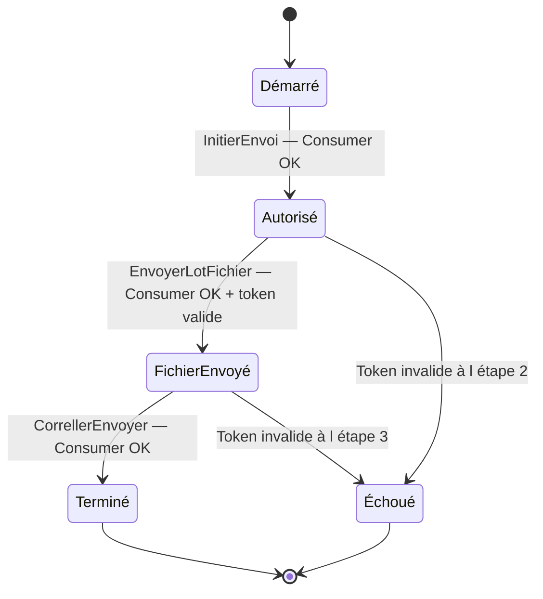

# Présentation technique détaillée — TDF basé sur EnterpriseMessageTransit

## 1. Pourquoi cette solution existe

`TDF` est une solution d'intégration qui s'appuie sur `EnterpriseMessageTransit` pour standardiser la partie messaging.

Objectifs :

- Cacher la complexité d'Azure Service Bus aux applications métier.
- Garder la compatibilité avec des applications legacy (ex. : HOA5 en WCF sur VM IaaS).
- Permettre des intégrations natives et non natives avec le même contrat de message.
- Offrir une architecture robuste pour les traitements long-running (Durable Functions).

## 2. Contexte métier et technique (scénario HOA5 legacy)

Dans ce scénario :

- `HOA5` est une application legacy WCF (hébergée sur VM IaaS).
- HOA5 n'appelle pas directement Azure Service Bus.
- HOA5 appelle un **adaptateur** (DLL).
- Cet adaptateur appelle `TDF` en HTTP (Azure Function App HTTP Trigger), typiquement via Refit.
- `TDF` publie les messages dans Service Bus via EnterpriseMessageTransit.
- Le traitement long-running et la corrélation des étapes sont gérés avec Durable Functions.

Important :

- Dans cette intégration **non native**, le Claim Check d'EnterpriseMessageTransit n'est pas utilisé pour des raisons de performance.
- Le Claim Check est effectué **directement dans l'adaptateur** (upload Blob custom).
- L'adaptateur doit toutefois respecter le **même contrat de sérialisation** qu'EnterpriseMessageTransit (`MessageTransitContext<TMessage>` et `Tokens`).

Résultat :

- Le Consumer TDF est transparent à la source d'émission :
  - source native (Claim Check EMT),
  - source non native via adaptateur custom (Claim Check custom).

## 3. Vue d'architecture cible



## 4. Rôles des composants

### 4.1 HOA5 WCF (legacy)

- Lance une transaction métier.
- Effectue 3 appels à l'adaptateur pour chaque transaction.
- Ne connaît pas Azure Service Bus ni le stockage Blob.

### 4.2 Adaptateur DLL (couche de compatibilité)

- Expose les 3 opérations : `InitierEnvoi`, `EnvoyerLotFichier`, `CorrellerEnvoyer`.
- Effectue la validation et l'authentification applicative Oracle.
- Réalise le Claim Check custom (Blob) dans le cas non natif.
- Construit des `MessageTransitContext<T>` conformes au contrat EMT.
- Appelle TDF en HTTP (Function App Producer Transit).

### 4.3 TDF Producer Transit (HTTP Trigger)

- Reçoit les requêtes HTTP de l'adaptateur.
- Positionne `CurrentStage` dans le `MessageTransitContext` pour identifier l'étape.
- Publie dans Service Bus via `IMessageProducer<TdfTransactionCommand>` (file unique `tdf-queue`).

### 4.4 Subscriber et Durable Functions

**Subscriber (unique — écoute la file `tdf-queue`) :**

1. Lie le Consumer via `BindContext(message, actions)` et désérialise via `TryDeserializeMessage<TdfTransactionCommand>(out context)`.
2. Lit `CurrentStage` du contexte pour sélectionner et appeler le bon Consumer.
3. Appelle `Consumer.ConsumeAsync(context, ct)` : la logique métier de l'étape s'exécute.
4. **Étapes 1 et 2 (intermédiaires)** :
   - Le Consumer exécute l'appel API sans appeler `CompleteMessageAsync`.
   - Si `ConsumeAsync` réussit → le Subscriber signale Durable (`ScheduleNew` ou `RaiseEvent`).
   - Si Durable réussit → le Subscriber appelle `actions.CompleteMessageAsync` → ACK Service Bus.
   - Si n'importe quelle étape échoue → exception → Service Bus relivrera le message.
5. **Étape 3 (finale — séquence intentionnelle : Durable EN PREMIER, Consumer EN DERNIER)** :
   - Le Subscriber signale **d'abord** Durable (`RaiseEventAsync("CorrellerEnvoyer")`) : l'orchestrateur valide le `authorizationToken` et assure le suivi de corrélation → état `Terminé`.
   - Le Subscriber appelle **ensuite** le Consumer (`ConsumeAsync`) pour la logique métier finale et l'ACK Service Bus via EMT.
   - Si `ConsumeAsync` échoue → message **non acquitté** → **EMT Exponential Retry** → le message est rélivré par Service Bus ; le signal Durable sera réémis (l'orchestration déjà terminée gère l'événement redondant gracieusement).

**Orchestrateur Durable :**

- Gère **exclusivement** la corrélation d'état entre les 3 étapes.
- N'appelle ni Consumer, ni API métier, ni logique métier.
- Contient : suivi des états, validation inline du `authorizationToken`, `WaitForExternalEvent` séquentiels.

### 4.5 Consumer TDF

- Contient **toute la logique métier** de chaque étape (appel API via Refit).
- **Appelle uniquement des APIs métier** (HTTP). Aucun accès direct à une base de données.
- Gère les erreurs non récupérables via `DeadLetterAsync` (EMT).
- **Étapes 1 et 2** : ne pas appeler `CompleteMessageAsync` — c'est le Subscriber qui le fait après confirmation Durable.
- **Étape 3** : appellé EN DERNIER (après le signal Durable). Appelle `CompleteMessageAsync` via EMT après succès de l'API finale. En cas d'erreur → EMT Exponential Retry (message non acquitté → rélivraison Service Bus).

## 5. Contrat de message (point clé pour la transparence)

La clé du design est d'imposer le même contrat :

- `MessageTransitContext<TMessage>`
- `MessageId`
- `SessionId` (si sessions)
- `CurrentStage` — identifie l'étape (`tdf.initier-envoi`, `tdf.envoi`, `tdf.correller`)
- `Variables` (ex. : `authorizationToken`, `numeroEchange`)
- `Tokens` (pour le Claim Check)

Exemple de payload (intégration non native via adaptateur) :

```json
{
  "messageType": "TdfTransactionCommand",
  "messageId": "9c4f7f9c2f5f4cd49f767eb86ec2397a",
  "sessionId": "d8d6a7fdf16f4f6b9fd7a7f5f3e0aa11",
  "currentStage": "tdf.envoi",
  "variables": {
    "authorizationToken": "auth-abc123",
    "numeroEchange": "E123456789"
  },
  "tokens": [
    {
      "kind": "File",
      "reference": "inter-ppp/E123456789/payload.json",
      "contentType": "application/json",
      "size": 532001
    }
  ],
  "message": {
    "authorizationToken": "auth-abc123",
    "numeroEchange": "E123456789",
    "blobReference": "inter-ppp/E123456789/payload.json"
  }
}
```

Note :

- Quand l'adaptateur effectue le Claim Check custom, le payload volumineux est référencé via `tokens` et le champ `message` peut contenir `null` pour le contenu binaire.
- Le Consumer n'a pas besoin de savoir si le token vient d'EMT natif ou de l'adaptateur custom.

## 6. Scénario transactionnel exact en 3 étapes

### 6.1 Étape 1 — `InitierEnvoi`

But :

- Authentifier et autoriser la transaction.
- Initialiser la corrélation.

Flux :

1. HOA5 appelle `adaptateur.InitierEnvoi(...)`.
2. L'adaptateur interroge Oracle pour auth/validation applicative.
3. L'adaptateur génère : `numeroEchange`, `authorizationToken` ; le `sessionId` est assigné dans `MessageTransitContext.SessionId` (identifiant de corrélation).
4. L'adaptateur publie avec `CurrentStage = "tdf.initier-envoi"` via HTTP vers TDF.
5. TDF publie dans la file `tdf-queue`.
6. Le Subscriber : `BindContext` + `TryDeserializeMessage` → `InitierEnvoiConsumer.ConsumeAsync` (appel API, sans ACK) → `ScheduleNewOrchestrationInstanceAsync` → `actions.CompleteMessageAsync`.
7. Durable : état → `Autorisé`.

Sortie vers HOA5 (réponse synchrone de l'adaptateur) :

- `authorizationToken` : jeton d'autorisation, HOA5 doit le conserver pour les étapes 2 et 3.
- `sessionId` : identifiant unique de la transaction (propagé dans `MessageTransitContext.SessionId`).
- `numeroEchange` : identifiant technique TDF.

> **Point clé pour les juniors** : `authorizationToken` est critique. Sans lui, TDF rejettera les étapes 2 et 3. HOA5 doit le stocker entre les 3 appels. Le `sessionId` est géré automatiquement par EMT via `MessageTransitContext.SessionId`.

### 6.2 Étape 2 — `EnvoyerLotFichier`

But :

- Transférer le lot/fichier en minimisant la taille du message Service Bus.

Flux :

1. HOA5 appelle `adaptateur.EnvoyerLotFichier(numeroEchange, fichier)`.
2. L'adaptateur réalise un Claim Check custom : upload du fichier en Blob, création d'un `TokenMessage`.
3. L'adaptateur construit `MessageTransitContext<TdfTransactionCommand>` avec `CurrentStage = "tdf.envoi"`, `authorizationToken`, `tokens`.
4. L'adaptateur envoie à TDF via HTTP.
5. TDF publie dans la file `tdf-queue`.
6. Le Subscriber : `BindContext` + `TryDeserializeMessage` → `EnvoyerLotFichierConsumer.ConsumeAsync` (appel API, sans ACK) → `RaiseEventAsync("EnvoyerLotFichier")` → `actions.CompleteMessageAsync`.
7. Durable : valide `authorizationToken`, état → `FichierEnvoyé`.

Sortie vers HOA5 : accusé de réception technique.

### 6.3 Étape 3 — `CorrellerEnvoyer`

But :

- Confirmer que l'étape 2 est acceptée et finaliser la transaction.

Flux :

1. HOA5 appelle `adaptateur.CorrellerEnvoyer(...)`.
2. L'adaptateur publie avec `CurrentStage = "tdf.correller"` via HTTP vers TDF.
3. TDF publie dans la file `tdf-queue`.
4. Le Subscriber : `BindContext` + `TryDeserializeMessage` → signale **d'abord** Durable (`RaiseEventAsync("CorrellerEnvoyer")`).
5. Durable : valide le `authorizationToken` (suivi de corrélation — le même token que l'étape 1 doit être présent) → état → `Terminé` (orchestration clôturée).
6. Le Subscriber appelle **ensuite** `CorrellerEnvoyerConsumer.ConsumeAsync` (le Consumer est appelé EN DERNIER).
7. `CorrellerEnvoyerConsumer` exécute la logique métier de finalisation via l'API métier.
8. `CorrellerEnvoyerConsumer` appelle `CompleteMessageAsync` via EMT (ACK Service Bus).
9. **En cas d'erreur dans `ConsumeAsync`** : le message n'est **pas** acquitté → EMT déclenche le **Exponential Retry** → Service Bus relivrera le message. Lors de la nouvelle tentative, le signal Durable est réémis ; l'orchestration déjà terminée ignore gracieusement l'événement redondant.

> **Pourquoi Durable avant le Consumer pour l'étape 3 ?** L'orchestrateur valide le `authorizationToken` et enregistre l'aboutissement de la corrélation **avant** que la logique métier coûteuse (appel API finale) ne s'exécute. Si le token est invalide, l'orchestration échoue immédiatement. Le Consumer bénéficie du filet de sécurité d'EMT (retry exponentiel) sans interférer avec l'état Durable.

Sortie vers HOA5 : confirmation d'envoi acceptée.

### 6.4 Séquence globale



## 7. Machine d'état durable (pédagogique)



Règle importante :

- La Durable Function gère les états (`Autorisé`, `FichierEnvoyé`, `Terminé`).
- Le Consumer gère la logique métier et l'ACK Service Bus.
- Ces deux responsabilités sont **strictement séparées**.

## 8. Claim Check : natif vs adaptateur custom

### 8.1 Intégration native EMT

- Le producteur utilise `ClaimCheckOptions` d'EMT (`ClaimCheckOptions.WithAttachment(stream, name)` ou `ForceClaimCheck = true`).
- EMT calcule la taille du payload sérialisé (JSON UTF-8) et le compare à `BlobStorageSetting.ClaimCheckThresholdBytes`.
- **Le seuil est piloté uniquement par `ClaimCheckThresholdBytes`** — le namespace Service Bus étant mutualisé entre toutes les applications (FinOps), la valeur doit être calibrée selon la politique interne, pas selon les limites du tier Azure. Configurable dans `appsettings.json` :

```json
{
  "BlobStorageSetting": {
    "BlobServiceUri":            "https://<account>.blob.core.windows.net",
    "ContainerName":             "inter-ppp",
    "FolderName":                "tdf-payloads",
    "ClaimCheckThresholdBytes":  65536
  }
}
```

- La logique interne EMT (`BaseMessageTransit.RequiresClaimCheck`) :

```
ClaimCheck appliqué si : tailleSérialisée >= ClaimCheckThresholdBytes
                     OU  ForceClaimCheck = true
```

- Le paramètre `ForceClaimCheck = true` dans `ClaimCheckOptions.WithAttachment` contourne le seuil et force toujours l'upload Blob.

### 8.2 Intégration non native (HOA5 + adaptateur)

- L'adaptateur effectue le Claim Check custom avant l'appel HTTP.
- EMT reçoit un message déjà tokenisé.
- Avantage : performance et contrôle total côté adaptateur.

### 8.3 Règle de gouvernance

Toujours respecter le contrat de sérialisation EMT pour garantir :

- la compatibilité des Consumers,
- une observabilité homogène,
- une migration progressive legacy → natif sans modifier le traitement Consumer.

## 9. Exemples de référence (orientés juniors)

Les exemples ci-dessous montrent la structure réelle. Ils sont volontairement pédagogiques.

### 9.1 Adaptateur DLL — façade 3 appels

```csharp
public interface ITdfAdapter
{
    Task<InitierEnvoiResponse>       InitierEnvoiAsync(InitierEnvoiRequest request, CancellationToken ct);
    Task<EnvoyerLotFichierResponse>  EnvoyerLotFichierAsync(EnvoyerLotFichierRequest request, Stream fichier, CancellationToken ct);
    Task<CorrellerEnvoyerResponse>   CorrellerEnvoyerAsync(CorrellerEnvoyerRequest request, CancellationToken ct);
}

public sealed class TdfAdapter : ITdfAdapter
{
    private readonly IOracleValidationService      _oracle;
    private readonly ICustomBlobClaimCheckService  _claimCheck;
    private readonly ITdfHttpClient               _tdfHttp;

    public async Task<InitierEnvoiResponse> InitierEnvoiAsync(InitierEnvoiRequest request, CancellationToken ct)
    {
        var auth      = await _oracle.AuthAndValidateAsync(request, ct);
        // Le sessionId est l'identifiant de corrélation généré par l'adaptateur.
        // Il est transmis sans modification dans les étapes 2 et 3 via TdfPublishRequest.SessionId.
        var sessionId = auth.SessionId;  // ou Guid.NewGuid().ToString("N") si Oracle ne le génère pas

        var cmd = new TdfTransactionCommand(
            AuthorizationToken: auth.AuthorizationToken,
            NumeroEchange:      auth.NumeroEchange);

        await _tdfHttp.PostInitierEnvoiAsync(new TdfPublishRequest(sessionId, cmd), ct);

        // Retour synchrone à HOA5 — CONSERVER authorizationToken et sessionId pour les étapes 2 et 3
        return new InitierEnvoiResponse(auth.NumeroEchange, auth.AuthorizationToken, sessionId);
    }

    public async Task<EnvoyerLotFichierResponse> EnvoyerLotFichierAsync(
        EnvoyerLotFichierRequest request, Stream fichier, CancellationToken ct)
    {
        // Claim Check custom : upload avant l'appel HTTP.
        // Kind = TokenKind.File indique explicitement à EMT que ce token référence un fichier binaire
        // stocké en Blob Storage (distinct de TokenKind.Message pour les payloads JSON inline).
        //
        // SÉCURITÉ : ICustomBlobClaimCheckService.UploadAsync doit retourner une référence
        // RELATIVE au format "container/path/blob" (ex. "inter-ppp/E123456789/payload.bin").
        // Ne pas retourner l'URL absolue Azure (blob.Uri.ToString()) — elle expose le nom
        // du compte de stockage. IStorageProvider.DownloadAsync accepte les deux formats.
        var blobRef = await _claimCheck.UploadAsync(request.NumeroEchange, fichier, ct);
        var token   = new TokenMessage
        {
            Kind        = TokenKind.File,
            Reference   = blobRef,   // "inter-ppp/E123456789/payload.bin"
            ContentType = "application/json"
        };

        var cmd = new TdfTransactionCommand(
            AuthorizationToken: request.AuthorizationToken,
            NumeroEchange:      request.NumeroEchange,
            BlobReference:      blobRef);

        await _tdfHttp.PostEnvoyerLotFichierAsync(
            new TdfPublishRequest(request.SessionId, cmd), token, ct);
        return new EnvoyerLotFichierResponse("ACK-TECH-OK");
    }

    public Task<CorrellerEnvoyerResponse> CorrellerEnvoyerAsync(
        CorrellerEnvoyerRequest request, CancellationToken ct)
        => _tdfHttp.PostCorrellerEnvoyerAsync(request, ct);
}
```

### 9.2 TDF HTTP Producer Function

Toutes les étapes publient dans la **même file** avec le même type de message. Le champ `CurrentStage` distingue l'étape. Le Subscriber lit ce champ pour router vers le bon Consumer.

```csharp
// Requête HTTP vers le HTTP Producer — inclut le sessionId (identifiant de corrélation)
// généré par l'adaptateur à l'étape 1 et réutilisé aux étapes 2 et 3.
public sealed record TdfPublishRequest(
    string                SessionId,
    TdfTransactionCommand Command);

// Commande unifiée pour les 3 étapes — CurrentStage indique l'étape en cours.
// Pas de champ CorrelationId : l'identifiant de corrélation transite dans
// MessageTransitContext.SessionId (sessions Service Bus garantissent l'ordre FIFO).
public sealed record TdfTransactionCommand(
    string  AuthorizationToken,
    string  NumeroEchange,
    string? BlobReference    = null,
    string? AccuseReception  = null);

public sealed class TdfProducerHttpFunctions
{
    // Un seul producer : toutes les étapes publient dans la même file "tdf-queue"
    private readonly IMessageProducer<TdfTransactionCommand> _producer;

    public TdfProducerHttpFunctions(IMessageProducer<TdfTransactionCommand> producer)
        => _producer = producer;

    [Function("InitierEnvoiHttp")]
    public async Task<HttpResponseData> InitierEnvoiAsync(
        [HttpTrigger(AuthorizationLevel.Function, "post", Route = "tdf/initier-envoi")] HttpRequestData req,
        CancellationToken ct)
    {
        // L'adaptateur envoie un TdfPublishRequest contenant le sessionId
        // (identifiant de corrélation généré côté adaptateur) et la commande métier.
        var request = await req.ReadFromJsonAsync<TdfPublishRequest>(cancellationToken: ct)
            ?? throw new InvalidOperationException("Payload manquant.");

        var context = new MessageTransitContext<TdfTransactionCommand>
        {
            Message      = request.Command,
            MessageId    = Guid.NewGuid().ToString("N"),
            SessionId    = request.SessionId,    // identifiant de corrélation — commun aux 3 étapes
            CurrentStage = "tdf.initier-envoi"   // Subscriber route sur ce champ
        };

        await _producer.PublishAsync(context, cancellationToken: ct);
        return req.CreateResponse(System.Net.HttpStatusCode.Accepted);
    }

    [Function("EnvoyerLotFichierHttp")]
    public async Task<HttpResponseData> EnvoyerLotFichierAsync(
        [HttpTrigger(AuthorizationLevel.Function, "post", Route = "tdf/envoyer-lot")] HttpRequestData req,
        CancellationToken ct)
    {
        var request = await req.ReadFromJsonAsync<TdfPublishRequest>(cancellationToken: ct)
            ?? throw new InvalidOperationException("Payload manquant.");

        var context = new MessageTransitContext<TdfTransactionCommand>
        {
            Message      = request.Command,
            MessageId    = Guid.NewGuid().ToString("N"),
            SessionId    = request.SessionId,   // même sessionId qu'à l'étape 1
            CurrentStage = "tdf.envoi"
        };

        await _producer.PublishAsync(context, cancellationToken: ct);
        return req.CreateResponse(System.Net.HttpStatusCode.Accepted);
    }

    [Function("CorrellerEnvoyerHttp")]
    public async Task<HttpResponseData> CorrellerEnvoyerAsync(
        [HttpTrigger(AuthorizationLevel.Function, "post", Route = "tdf/correller-envoyer")] HttpRequestData req,
        CancellationToken ct)
    {
        var request = await req.ReadFromJsonAsync<TdfPublishRequest>(cancellationToken: ct)
            ?? throw new InvalidOperationException("Payload manquant.");

        var context = new MessageTransitContext<TdfTransactionCommand>
        {
            Message      = request.Command,
            MessageId    = Guid.NewGuid().ToString("N"),
            SessionId    = request.SessionId,   // même sessionId qu'aux étapes 1 et 2
            CurrentStage = "tdf.correller"
        };

        await _producer.PublishAsync(context, cancellationToken: ct);
        return req.CreateResponse(System.Net.HttpStatusCode.Accepted);
    }
}
```

### 9.3 Subscriber unique — BindContext + TryDeserializeMessage + Consumer + Durable

#### Pourquoi AutoCompleteMessages = false ?

Avec `AutoCompleteMessages = false`, le cycle de vie du message Service Bus est contrôlé explicitement selon l'étape :

- **Étapes 1 et 2 (intermédiaires)** : le Consumer exécute la logique métier sans ACK. Le Subscriber garantit que Durable a bien réceptionné l'événement **avant** d'appeler `actions.CompleteMessageAsync`. Si Durable échoue, le message est rélivré par Service Bus sans perte.
- **Étape 3 (finale)** : le Consumer appelle `CompleteMessageAsync` via EMT après succès de l'API. C'est la dernière étape — le message peut être acquitté dès que la logique métier réussit.

EnterpriseMessageTransit gère automatiquement :

- Le **retry exponentiel** (sur exception non traitée dans `ConsumeAsync`).
- Le **`DeadLetterAsync`** (sur erreur non récupérable déclenchée dans le Consumer).
- Le **`CompleteMessageAsync`** (sur succès dans le Consumer — étape 3 uniquement dans ce scénario).

> **Garantie de livraison** : pour les étapes 1 et 2, si une exception se produit entre `ConsumeAsync` et `actions.CompleteMessageAsync`, le message est rélivré. L'API métier doit donc être **idempotente** (même appel deux fois → même résultat sans effet de bord).

#### Configuration host.json (obligatoire)

```json
{
  "version": "2.0",
  "extensions": {
    "serviceBus": {
      "autoCompleteMessages": false
    }
  }
}
```

#### Modèles de données des événements Durable

Ces modèles sont passés à l'orchestrateur depuis le Subscriber, après que le Consumer a réussi son appel API.

```csharp
// Étape 1 — input de l'orchestrateur au démarrage
// N'inclut PAS de CorrelationId : l'identifiant de corrélation est ctx.InstanceId
// (= sessionId positionné lors de ScheduleNewOrchestrationInstanceAsync).
public sealed record InitierEnvoiEvent(
    string AuthorizationToken,
    string NumeroEchange);

// Étape 2 — événement externe signalé à l'orchestrateur
public sealed record EnvoyerLotFichierEvent(
    string AuthorizationToken,   // doit correspondre au token de l'étape 1
    string BlobReference);

// Étape 3 — événement externe pour clôturer l'orchestration + confirmer la réception
public sealed record CorrellerEnvoyerEvent(
    string AuthorizationToken,
    string AccuseReception);
```

#### Subscriber unique — code complet

```csharp
public sealed class TdfSubscriber
{
    private readonly InitierEnvoiConsumer      _initierConsumer;
    private readonly EnvoyerLotFichierConsumer _envoiConsumer;
    private readonly CorrellerEnvoyerConsumer  _correlConsumer;

    public TdfSubscriber(
        InitierEnvoiConsumer      initierConsumer,
        EnvoyerLotFichierConsumer envoiConsumer,
        CorrellerEnvoyerConsumer  correlConsumer)
    {
        _initierConsumer = initierConsumer;
        _envoiConsumer   = envoiConsumer;
        _correlConsumer  = correlConsumer;
    }

    [Function("TdfSubscriber")]
    public async Task Run(
        [ServiceBusTrigger("tdf-queue", AutoCompleteMessages = false)] ServiceBusReceivedMessage message,
        ServiceBusMessageActions actions,
        DurableTaskClient durableClient,
        CancellationToken ct)
    {
        // ── DÉSÉRIALISATION INITIALE ────────────────────────────────────────────
        // On lie le Consumer de l'étape 1 pour lire CurrentStage depuis l'enveloppe.
        // Tous les Consumers partagent le même type TdfTransactionCommand,
        // donc la désérialisation est identique quel que soit le Consumer utilisé ici.
        _initierConsumer.BindContext(message, actions);

        if (!_initierConsumer.TryDeserializeMessage<TdfTransactionCommand>(out var context) || context is null)
        {
            // Message illisible → DLQ immédiate sans retry
            await actions.DeadLetterMessageAsync(message,
                deadLetterReason: "Désérialisation impossible",
                deadLetterErrorDescription: "Le message n'est pas un MessageTransitContext<TdfTransactionCommand> valide.",
                cancellationToken: ct);
            return;
        }

        var cmd   = context.Message   ?? throw new InvalidOperationException("Message TdfTransactionCommand manquant.");
        var stage = context.CurrentStage ?? throw new InvalidOperationException("CurrentStage absent du message.");

        switch (stage)
        {
            // ══════════════════════════════════════════════════════════════════════
            // ÉTAPE 1 — InitierEnvoi
            // Séquence : ConsumeAsync (sans ACK) → ScheduleNewOrchestration → CompleteMessageAsync
            // L'ACK n'est émis qu'après confirmation de Durable → zéro risque de perte.
            // ══════════════════════════════════════════════════════════════════════
            case "tdf.initier-envoi":
                // _initierConsumer est déjà lié — ConsumeAsync exécute la logique métier.
                // Le Consumer ne doit PAS appeler CompleteMessageAsync (voir InitierEnvoiConsumer).
                await _initierConsumer.ConsumeAsync(context, ct);

                // Passage du contexte à Durable : démarrage d'une nouvelle orchestration.
                // instanceId = sessionId → identifiant utilisé par les étapes 2 et 3
                // pour retrouver cette instance d'orchestrateur.
                await durableClient.ScheduleNewOrchestrationInstanceAsync(
                    "TdfTransactionOrchestrator",
                    new InitierEnvoiEvent(cmd.AuthorizationToken, cmd.NumeroEchange),
                    new StartOrchestrationOptions { InstanceId = context.SessionId },
                    cancellationToken: ct);

                // ACK Service Bus seulement après confirmation Durable.
                await actions.CompleteMessageAsync(message, ct);
                break;

            // ══════════════════════════════════════════════════════════════════════
            // ÉTAPE 2 — EnvoyerLotFichier
            // Séquence : BindContext (re-bind) → ConsumeAsync (sans ACK) → RaiseEvent → CompleteMessageAsync
            // ══════════════════════════════════════════════════════════════════════
            case "tdf.envoi":
                // Re-liaison sur le Consumer de l'étape 2 pour que DeadLetterAsync
                // et CompleteMessageAsync utilisent les bonnes actions Service Bus.
                _envoiConsumer.BindContext(message, actions);
                await _envoiConsumer.ConsumeAsync(context, ct);

                // Réveille l'orchestrateur suspendu sur WaitForExternalEvent("EnvoyerLotFichier").
                // Le contexte désérialisé est passé à Durable pour la validation du token.
                await durableClient.RaiseEventAsync(
                    context.SessionId,
                    "EnvoyerLotFichier",
                    new EnvoyerLotFichierEvent(
                        cmd.AuthorizationToken,
                        cmd.BlobReference ?? string.Empty),
                    cancellationToken: ct);

                // ACK après confirmation Durable.
                await actions.CompleteMessageAsync(message, ct);
                break;

            // ══════════════════════════════════════════════════════════════════════
            // ÉTAPE 3 — CorrellerEnvoyer (finale)
            // Séquence INTENTIONNELLE : Durable EN PREMIER → Consumer EN DERNIER
            //
            // Pourquoi Durable est signalé EN PREMIER ?
            //   • L'orchestrateur valide le authorizationToken (même token qu'étape 1).
            //   • La corrélation de la transaction est enregistrée dans l'historique
            //     Durable AVANT que l'appel API final (coûteux) ne soit exécuté.
            //   • Si le token est invalide, l'orchestration échoue immédiatement et le
            //     Consumer n'est pas sollicité → le message part en DLQ proprement.
            //
            // Pourquoi le Consumer est appelé EN DERNIER ?
            //   • Le message Service Bus n'est PAS encore acquitté
            //     (AutoCompleteMessages=false + Consumer appelle CompleteMessageAsync).
            //   • Si ConsumeAsync lève une exception (timeout API, erreur réseau, etc.),
            //     EMT déclenche le Exponential Retry → Service Bus relivrera le message.
            //   • À chaque nouvelle tentative, RaiseEventAsync est réémis. Si l'orchestration
            //     est déjà terminée (signal précédent reçu avec succès), Durable ignore
            //     gracieusement l'événement redondant — aucun effet de bord.
            //
            // Rappel : RaiseEventAsync est asynchrone du côté Durable (le Subscriber n'attend
            // pas que l'orchestrateur finisse de rejouer). L'appel retourne dès que l'événement
            // est mis en file dans Azure Storage de Durable → le Subscriber enchaîne immédiatement
            // sur le Consumer.
            // ══════════════════════════════════════════════════════════════════════
            case "tdf.correller":
                // PREMIER : signaler Durable — validation authorizationToken + suivi corrélation.
                await durableClient.RaiseEventAsync(
                    context.SessionId,
                    "CorrellerEnvoyer",
                    new CorrellerEnvoyerEvent(
                        cmd.AuthorizationToken,
                        cmd.AccuseReception ?? string.Empty),
                    cancellationToken: ct);

                // DERNIER : lier et exécuter le Consumer pour la logique métier finale.
                // ConsumeAsync réalise l'appel API et appelle CompleteMessageAsync via EMT.
                // Si une exception est levée ici → message NON acquitté → EMT Exponential Retry.
                _correlConsumer.BindContext(message, actions);
                await _correlConsumer.ConsumeAsync(context, ct);
                break;

            default:
                // Stage inconnu → DLQ immédiate — pas de retry infini
                await actions.DeadLetterMessageAsync(message,
                    deadLetterReason: "CurrentStage inconnu",
                    deadLetterErrorDescription: $"Stage reçu : {stage}",
                    cancellationToken: ct);
                break;
        }
    }
}
```

> **Règle de séquencement** :
> - **Étapes 1 et 2** : `ConsumeAsync` (sans ACK) → Signal Durable → `actions.CompleteMessageAsync` (Subscriber). La garantie de cohérence est maximale — l'ACK n'est émis qu'après confirmation Durable.
> - **Étape 3** : Signal Durable **EN PREMIER** (token validation + suivi corrélation) → `ConsumeAsync + CompleteMessageAsync` (Consumer via EMT) **EN DERNIER**. Si le Consumer échoue → EMT Exponential Retry → le message est rélivré → `RaiseEventAsync` réémis sur l'orchestration déjà terminée (ignoré gracieusement par Durable).

### 9.4 Orchestrateur Durable — corrélation d'état uniquement

#### Pourquoi ne pas utiliser les Durable Entities ?

| Critère | Durable Entity | Orchestrateur + WaitForExternalEvent |
|---|---|---|
| Début et fin clairs | Non adapté (vie indéfinie) | **Oui : Démarré → Terminé** |
| Ordre d'étapes garanti | Non (opérateurs concurrents) | **Oui : 1 → 2 → 3** |
| Nettoyage automatique | Manuel (EntityId à gérer) | **Automatique à la fin** |
| Lisibilité pour juniors | Complexe (signal/call model) | **Intuitif (async/await)** |

#### Comprendre `WaitForExternalEvent` (indispensable pour les juniors)

`WaitForExternalEvent<T>(eventName)` est l'instruction centrale de cet orchestrateur. Voici ce qui se passe concrètement quand le code l'atteint :

1. Durable sauvegarde l'état interne de l'orchestration dans **Azure Storage** (table + blob).
2. La fonction se **termine** (elle n'attend pas en mémoire — aucun thread n'est bloqué).
3. Quand le Subscriber appelle `RaiseEventAsync(instanceId, eventName, payload)` :
   - Durable enfile l'événement dans la file de l'orchestration.
   - Durable **redémarre** la fonction orchestrateur (le « Replay »).
4. L'événement attendu est résolu → l'orchestrateur continue vers l'`await` suivant.

> **Point clé** : `WaitForExternalEvent` n'est PAS un `Thread.Sleep`. L'orchestrateur peut attendre des heures ou des jours — Azure ne consomme aucune ressource pendant ce temps. Seul l'enregistrement dans Azure Storage maintient l'état.

#### Comment identifier une instance de l'orchestration ?

L'`instanceId` est positionné lors du `ScheduleNewOrchestrationInstanceAsync` à l'étape 1 :
```
instanceId = sessionId  (ex. : "sess-20260312-001")
```
C'est ce même `sessionId` que le Subscriber utilise pour `RaiseEventAsync` aux étapes 2 et 3. Sans lui, Durable ne saurait pas quelle orchestration réveiller.

#### Le mécanisme de Replay

Lorsqu'un événement externe arrive (ex. : `RaiseEventAsync("EnvoyerLotFichier", ...)`), Durable Functions :

1. **Réexécute la fonction orchestrateur depuis le début** (le « replay »).
2. Pour chaque `await` déjà résolu (présent dans l'historique Azure Storage), retourne **immédiatement la valeur historique** sans refaire d'I/O.
3. Lorsque le code atteint le `await` correspondant au nouvel événement, il s'exécute normalement.
4. Au `await` suivant (pas encore résolu), l'orchestrateur **se suspend** à nouveau.

```
HISTORIQUE après l'étape 1 (InitierEnvoi) :
  [ExecutionStarted] [input: InitierEnvoiEvent{authorizationToken="auth-abc123", numeroEchange="E123456789"}]
  [WaitForExternalEvent("EnvoyerLotFichier")] → EN ATTENTE

Quand EnvoyerLotFichier arrive, Durable rejoue :
  - GetInput<InitierEnvoiEvent>()               → retour immédiat (historique)
  - WaitForExternalEvent("EnvoyerLotFichier")  → retour immédiat (historique)
  - (validation token inline...)
  - WaitForExternalEvent("CorrellerEnvoyer")   → BLOQUE (pas encore dans l'historique)

Quand CorrellerEnvoyer arrive, Durable rejoue encore :
  - GetInput<InitierEnvoiEvent>()               → historique
  - WaitForExternalEvent("EnvoyerLotFichier")  → historique
  - (validation token...)
  - WaitForExternalEvent("CorrellerEnvoyer")   → historique
  - (validation token étape 3...)
  - Orchestration terminée.
```

#### Pourquoi l'orchestrateur valide le token à chaque étape ?

Le token d'autorisation est émis à l'étape 1 et transmis à chaque étape suivante dans le message. L'orchestrateur valide qu'il s'agit **toujours du même token** (pas de substitution, pas de message fantôme d'une autre transaction).

Cette validation est **inline** (sans appel externe) : c'est une simple comparaison de chaînes dans l'historique Durable → elle est déterministe et safe pour le Replay.

> **Pour l'étape 3 spécifiquement** : l'orchestrateur reçoit le signal (`CorrellerEnvoyerEvent`) et valide le token **avant** que le Consumer n'exécute l'appel API. Si le token est invalide → `throw` → orchestration en état `Failed` → le Subscriber voit une exception de `RaiseEventAsync` → le Consumer n'est pas appelé → le message part en DLQ.

#### Règle impérative : le code orchestrateur DOIT être déterministe

Puisque le code est rejoué à chaque événement, les mêmes instructions doivent produire exactement les mêmes résultats.

```csharp
// INTERDIT dans un orchestrateur — valeurs différentes à chaque replay
DateTime.Now               // utiliser ctx.CurrentUtcDateTime
DateTimeOffset.UtcNow      // utiliser ctx.CurrentUtcDateTime
Guid.NewGuid()             // générer dans le Consumer ou une Activity
await httpClient.GetAsync(...)  // faire dans le Consumer
Thread.Sleep / Task.Delay  // utiliser await ctx.CreateTimer(...)
Console.WriteLine(...)     // utiliser ctx.CreateReplaySafeLogger(logger)
```

#### Code de l'orchestrateur

```csharp
public static class TdfOrchestrator
{
    [Function("TdfTransactionOrchestrator")]
    public static async Task Run([OrchestrationTrigger] TaskOrchestrationContext ctx)
    {
        // GetInput : données passées par le Subscriber lors du ScheduleNewOrchestrationInstanceAsync.
        // Au REPLAY, cette ligne retourne immédiatement la valeur stockée dans l'historique Azure Storage.
        // Il n'y a aucun appel réseau — la valeur vient de la mémoire de replay.
        var initData = ctx.GetInput<InitierEnvoiEvent>()
            ?? throw new InvalidOperationException("Input InitierEnvoiEvent manquant.");

        // ═══════════════════════════════════════════════════════════════════════
        // ATTENTE ÉTAPE 2 — EnvoyerLotFichier
        // L'orchestrateur se SUSPEND ici. Il ne consomme aucune ressource pendant l'attente.
        // Azure Storage conserve l'état. La durée d'attente peut être de quelques
        // millisecondes comme de plusieurs heures — Durable s'en moque.
        //
        // Il est réveillé quand le Subscriber (étape 2) appelle :
        //   RaiseEventAsync(context.SessionId, "EnvoyerLotFichier", envoiEvent)
        //
        // Lors du REPLAY suivant (déclenché par cet événement), cette ligne retourne
        // immédiatement l'événement depuis l'historique Azure Storage.
        //
        // Anti-zombie : si l'étape 2 n'arrive pas en 24 h, l'orchestrateur expire proprement
        // via ctx.CreateTimer + Task.WhenAny — aucune ressource n'est gaspillée.
        // ═══════════════════════════════════════════════════════════════════════
        using var cts1  = new CancellationTokenSource();
        var timeout1    = ctx.CreateTimer(ctx.CurrentUtcDateTime.AddHours(24), cts1.Token);
        var waitEtape2  = ctx.WaitForExternalEvent<EnvoyerLotFichierEvent>("EnvoyerLotFichier");
        if (await Task.WhenAny(waitEtape2, timeout1) == timeout1)
            throw new TimeoutException($"EnvoyerLotFichier non reçu en 24h. InstanceId={ctx.InstanceId}");
        cts1.Cancel();
        var envoiEvent = await waitEtape2;

        // Validation inline du token entre l'étape 1 et l'étape 2.
        // Déterministe (comparaison de chaînes) → safe pour le Replay.
        // Si le token de l'étape 2 ne correspond pas à celui de l'étape 1
        // → throw → orchestration Failed → Subscriber Durable échoue
        //   → Consumer PAS appelé → message en DLQ.
        if (envoiEvent.AuthorizationToken != initData.AuthorizationToken)
        {
            throw new InvalidOperationException(
                $"authorizationToken invalide à l'étape EnvoyerLotFichier. InstanceId={ctx.InstanceId}");
        }

        // ═══════════════════════════════════════════════════════════════════════
        // ATTENTE ÉTAPE 3 — CorrellerEnvoyer
        // Deuxième suspension. L'orchestrateur attend que le Subscriber (étape 3) appelle
        //   RaiseEventAsync(context.SessionId, "CorrellerEnvoyer", correlEvent)
        //
        // IMPORTANT pour l'étape 3 : le Subscriber envoie ce signal EN PREMIER,
        // AVANT d'appeler le Consumer. Ainsi, si la validation du token échoue ici,
        // le Consumer n'est jamais appelé. Si la validation réussit mais le Consumer
        // échoue ensuite, le Replay suivant (sur retry EMT) ignorera gracieusement
        // l'événement redondant car l'orchestration est déjà terminée.
        //
        // Anti-zombie : si l'étape 3 n'arrive pas en 24 h, l'orchestrateur expire proprement.
        // ═══════════════════════════════════════════════════════════════════════
        using var cts2  = new CancellationTokenSource();
        var timeout2    = ctx.CreateTimer(ctx.CurrentUtcDateTime.AddHours(24), cts2.Token);
        var waitEtape3  = ctx.WaitForExternalEvent<CorrellerEnvoyerEvent>("CorrellerEnvoyer");
        if (await Task.WhenAny(waitEtape3, timeout2) == timeout2)
            throw new TimeoutException($"CorrellerEnvoyer non reçu en 24h. InstanceId={ctx.InstanceId}");
        cts2.Cancel();
        var correlEvent = await waitEtape3;

        // Validation du token à l'étape 3 — même principe que l'étape 2.
        // Assure le suivi de corrélation : les 3 étapes utilisent bien le même token initial.
        if (correlEvent.AuthorizationToken != initData.AuthorizationToken)
        {
            throw new InvalidOperationException(
                $"authorizationToken invalide à l'étape CorrellerEnvoyer. InstanceId={ctx.InstanceId}");
        }

        // ═══════════════════════════════════════════════════════════════════════
        // COORDINATION COMPLÈTE
        // Les 3 étapes sont corrélées. L'orchestrateur a accompli sa mission :
        //   1. Maintenir l'ordre des étapes (WaitForExternalEvent séquentiels).
        //   2. Valider le token inline à chaque transition.
        //   3. Fournir un historique traçable dans Azure Storage.
        //
        // Les Consumers ont chacun exécuté leur logique métier indépendamment.
        // L'orchestrateur n'a jamais appelé d'API, de Consumer, ni de logique métier.
        // Durable nettoie l'historique Azure Storage automatiquement.
        // ═══════════════════════════════════════════════════════════════════════
    }
}
```

> **Rappel fondamental** : l'orchestrateur ne contient **aucun appel API, aucun Consumer, aucune logique métier**. Il se contente de corréler les étapes et de valider le token inline. Toute déviation de ce principe rend l'orchestrateur non déterministe et provoque des bugs de Replay difficiles à diagnostiquer.

#### Comportement en cas de restart du Function App

Un restart du Function App (redéploiement, scale-out, crash) n'entraîne **aucune perte d'état** pour les orchestrations en cours. L'état complet est persisté dans Azure Storage (table `DurableTask`). Au prochain déclenchement (message EMT ou `RaiseEventAsync`), Durable rejoue l'orchestrateur depuis le début et reconstitue l'état exact.

**Points clés du restart** :

| Scénario | Comportement Durable |
|---|---|
| Restart entre étape 1 et étape 2 | L'orchestration reste `Running`. À l'arrivée du message étape 2, Durable rejoue l'orchestrateur, `WaitForExternalEvent("EnvoyerLotFichier")` se résout immédiatement depuis l'historique. |
| Restart en cours de `RaiseEventAsync` | Si le Subscriber n'a pas encore acquitté le message SB, EMT Exponential Retry relivrera le message. Durable ignore l'événement redondant si l'orchestration est déjà terminée. |
| Restart pendant `CompleteMessageAsync` | Le message SB n'est pas acquitté → Service Bus relivrera le message → Subscriber réémet le signal Durable (ignoré si déjà traité) puis rappelle le Consumer (idempotence requise). |
| Function App crashe entre `RaiseEventAsync` et `CompleteMessageAsync` (étape 3) | Même comportement : Consumer rappelé avec idempotence. Voir §11 pour les stratégies d'idempotence. |

> Pour la documentation complète du comportement durable en cas de restart (incluant les timers anti-zombie, la purge de l'historique et le comportement multi-instance), voir **ScenarioIntegration-TDF.md §9.1 à §9.6**.

### 9.5 Consumers — logique métier par étape

#### InitierEnvoiConsumer — Étape 1 (sans CompleteMessageAsync)

> L'étape 1 est intermédiaire. `CompleteMessageAsync` est appelée par le **Subscriber** après confirmation Durable, pas par le Consumer.

```csharp
public sealed class InitierEnvoiConsumer : BaseConsumer<TdfTransactionCommand>
{
    private readonly ITransactionApi _api;

    public InitierEnvoiConsumer(
        IMessagingProvider messagingProvider,
        ILogger<InitierEnvoiConsumer> logger,
        IConsumerConfigurationService config,
        IMessageSerializer serializer,
        IStorageProvider storageProvider,
        ITransactionApi api)
        : base(messagingProvider, logger, config, serializer, storageProvider,
               target: "tdf-queue", consumer: "TdfConsumer", action: "InitierEnvoi")
    {
        _api = api;
    }

    public override async Task<MessageTransitContext<MessageTransitResponse>> ConsumeAsync(
        MessageTransitContext<TdfTransactionCommand> context,
        CancellationToken cancellationToken)
    {
        var cmd = context.Message!;

        var response = await _api.InitierEnvoiAsync(
            new InitierEnvoiRequest(context.SessionId, cmd.AuthorizationToken, cmd.NumeroEchange),
            cancellationToken);

        if (!response.IsSuccess)
        {
            // Erreur non récupérable → DLQ via EMT
            // DeadLetterAsync gère l'ACK négatif Service Bus — pas besoin d'en faire plus.
            await DeadLetterAsync(
                new InvalidOperationException($"InitierEnvoi refusé : {response.ErrorMessage}"),
                cancellationToken);

            return new MessageTransitContext<MessageTransitResponse>
            {
                Message   = new MessageTransitResponse { IsSuccess = false, StatusCode = 422 },
                MessageId = context.MessageId
            };
        }

        // PAS de CompleteMessageAsync ici.
        // C'est le Subscriber qui appellera actions.CompleteMessageAsync après confirmation Durable.
        return new MessageTransitContext<MessageTransitResponse>
        {
            Message   = new MessageTransitResponse { IsSuccess = true, StatusCode = 200 },
            MessageId = context.MessageId
        };
    }
}
```

#### EnvoyerLotFichierConsumer — Étape 2 (sans CompleteMessageAsync)

> Même pattern que l'étape 1. Le Subscriber gère l'ACK après Durable.

```csharp
public sealed class EnvoyerLotFichierConsumer : BaseConsumer<TdfTransactionCommand>
{
    private readonly ITransactionApi _api;

    public EnvoyerLotFichierConsumer(
        IMessagingProvider messagingProvider,
        ILogger<EnvoyerLotFichierConsumer> logger,
        IConsumerConfigurationService config,
        IMessageSerializer serializer,
        IStorageProvider storageProvider,
        ITransactionApi api)
        : base(messagingProvider, logger, config, serializer, storageProvider,
               target: "tdf-queue", consumer: "TdfConsumer", action: "EnvoyerLot")
    {
        _api = api;
    }

    public override async Task<MessageTransitContext<MessageTransitResponse>> ConsumeAsync(
        MessageTransitContext<TdfTransactionCommand> context,
        CancellationToken cancellationToken)
    {
        var cmd = context.Message!;

        var response = await _api.EnvoyerLotAsync(
            new EnvoyerLotRequest(
                context.SessionId,
                cmd.AuthorizationToken,
                cmd.BlobReference ?? string.Empty),
            cancellationToken);

        if (!response.IsSuccess)
        {
            await DeadLetterAsync(
                new InvalidOperationException($"EnvoyerLot refusé : {response.ErrorMessage}"),
                cancellationToken);

            return new MessageTransitContext<MessageTransitResponse>
            {
                Message   = new MessageTransitResponse { IsSuccess = false, StatusCode = 422 },
                MessageId = context.MessageId
            };
        }

        // PAS de CompleteMessageAsync ici.
        return new MessageTransitContext<MessageTransitResponse>
        {
            Message   = new MessageTransitResponse { IsSuccess = true, StatusCode = 200 },
            MessageId = context.MessageId
        };
    }
}
```

#### CorrellerEnvoyerConsumer — Étape 3, finale (Consumer appelé EN DERNIER — CompleteMessageAsync via EMT)

> **Séquence étape 3** : le Subscriber signale Durable EN PREMIER (validation du token + suivi corrélation), puis appelle ce Consumer EN DERNIER. Le Consumer finalise la transaction via l'API métier et acquitte le message via `CompleteMessageAsync` (EMT). Si l'appel API échoue, `ConsumeAsync` lève une exception → le message n'est **pas** acquitté → **EMT Exponential Retry** → Service Bus relivrera le message automatiquement. Le Subscriber réémetttra le signal Durable à chaque nouvelle tentative ; l'orchestration déjà terminée l'ignorera gracieusement.

```csharp
public sealed class CorrellerEnvoyerConsumer : BaseConsumer<TdfTransactionCommand>
{
    private readonly ITransactionApi _api;

    public CorrellerEnvoyerConsumer(
        IMessagingProvider messagingProvider,
        ILogger<CorrellerEnvoyerConsumer> logger,
        IConsumerConfigurationService config,
        IMessageSerializer serializer,
        IStorageProvider storageProvider,
        ITransactionApi api)
        : base(messagingProvider, logger, config, serializer, storageProvider,
               target: "tdf-queue", consumer: "TdfConsumer", action: "Correller")
    {
        _api = api;
    }

    public override async Task<MessageTransitContext<MessageTransitResponse>> ConsumeAsync(
        MessageTransitContext<TdfTransactionCommand> context,
        CancellationToken cancellationToken)
    {
        var cmd = context.Message!;

        // Appel API final — finalisation de la transaction côté métier.
        // Le Subscriber a déjà signalé Durable (validation token + état Terminé) avant
        // d'appeler ce Consumer. Si cet appel API échoue → exception → le message
        // n'est PAS acquitté → EMT déclenche le Exponential Retry.
        // À la tentative suivante, le Subscriber réémit le signal Durable (ignoré car
        // orchestration déjà terminée), puis rappelle ce ConsumeAsync.
        // L'API doit donc être IDEMPOTENTE : un même appel rejoué → même résultat.
        var response = await _api.FinaliserAsync(
            new FinaliserRequest(
                context.SessionId,
                cmd.NumeroEchange,
                cmd.AccuseReception ?? string.Empty),
            cancellationToken);

        if (!response.IsSuccess)
        {
            // Erreur non récupérable (ex. : 422 rejeté par l'API métier) → DLQ via EMT.
            // DeadLetterAsync acquitte négativement le message → pas de retry EMT infini.
            await DeadLetterAsync(
                new InvalidOperationException($"Finalisation refusée : {response.ErrorMessage}"),
                cancellationToken);

            return new MessageTransitContext<MessageTransitResponse>
            {
                Message   = new MessageTransitResponse { IsSuccess = false, StatusCode = 422 },
                MessageId = context.MessageId
            };
        }

        // CompleteMessageAsync via EMT : ACK Service Bus après succès de l'API finale.
        // C'est l'unique point d'ACK pour l'étape 3 — aucun other CompleteMessageAsync
        // ne doit être appelé dans le Subscriber pour cette étape.
        await CompleteMessageAsync(context, cancellationToken);

        return new MessageTransitContext<MessageTransitResponse>
        {
            Message   = new MessageTransitResponse { IsSuccess = true, StatusCode = 200 },
            MessageId = context.MessageId
        };
    }
}
```

### 9.6 Interface API métier partagée

```csharp
// Client HTTP Refit — utilisé par les 3 Consumers
public interface ITransactionApi
{
    [Post("/api/transaction/initier")]
    Task<TransactionApiResponse> InitierEnvoiAsync(
        [Body] InitierEnvoiRequest request, CancellationToken ct);

    [Post("/api/transaction/envoyer-lot")]
    Task<TransactionApiResponse> EnvoyerLotAsync(
        [Body] EnvoyerLotRequest request, CancellationToken ct);

    [Post("/api/transaction/finaliser")]
    Task<TransactionApiResponse> FinaliserAsync(
        [Body] FinaliserRequest request, CancellationToken ct);
}

public sealed record TransactionApiResponse(bool IsSuccess, string? ErrorMessage);
```

## 10. Configuration DI pour TDF

```csharp
var host = new HostBuilder()
    .ConfigureFunctionsWorkerDefaults()
    .ConfigureServices(services =>
    {
        services.AddScoped<IProducerConfigurationService, TdfProducerConfigService>();
        services.AddScoped<IConsumerConfigurationService, TdfConsumerConfigService>();

        services.ConfigureAzureProviders(new DefaultAzureCredential());

        // Producer unique — toutes les étapes publient dans la même file
        services.AddProducer<TdfTransactionCommand>("tdf-queue");

        // Un Consumer par étape — instancié par le Subscriber selon CurrentStage
        services.AddScoped<InitierEnvoiConsumer>();
        services.AddScoped<EnvoyerLotFichierConsumer>();
        services.AddScoped<CorrellerEnvoyerConsumer>();

        // Client HTTP Refit vers l'API métier (injecté dans chaque Consumer)
        services.AddRefitClient<ITransactionApi>()
            .ConfigureHttpClient(c =>
                c.BaseAddress = new Uri("https://api.tdf.ramq.qc.ca"));
    })
    .Build();
```

## 11. Multi-target map (rappel)

Quand plusieurs types de messages partent vers des entités différentes :

```csharp
services.AddProducer<MessagePharmacie>("pharmacie");
services.AddProducer<MessageIndividu>("individu");
services.AddProducer<MessageDispensateur>("dispensateur");
```

Le target est résolu automatiquement par `IMessageTargetMap` en fonction du type.

## 12. Checklist juniors (implémentation sans erreurs)

1. Toujours utiliser `context.SessionId` dans les 3 étapes — c'est le lien entre Subscriber, Consumer et Durable.
2. Ne jamais perdre `authorizationToken` entre l'étape 1 et l'étape 2 (validé dans l'orchestrateur).
3. En mode adaptateur non natif, uploader le payload en Blob **avant** l'appel HTTP.
4. Respecter le contrat `MessageTransitContext<TdfTransactionCommand>` avec `CurrentStage` correct.
5. **Étapes 1 et 2** : ne **pas** appeler `CompleteMessageAsync` dans le Consumer. C'est le Subscriber qui le fait après confirmation Durable.
6. **Étape 3** : le Subscriber signale Durable **EN PREMIER** (`RaiseEventAsync`) pour la validation du token et le suivi de corrélation. Le Consumer est appelé **EN DERNIER** ; il gère l'appel API et `CompleteMessageAsync` via EMT. En cas d'erreur dans `ConsumeAsync` → EMT Exponential Retry (message non acquitté → rélivré par Service Bus).
7. Ne jamais appeler de Consumer, d'API ou de logique métier dans l'orchestrateur Durable.
8. `AutoCompleteMessages = false` dans `host.json` ET dans `[ServiceBusTrigger]`.
9. Journaliser `MessageId`, `SessionId`, `CurrentStage` dans chaque Consumer.
10. Rendre les APIs métier **idempotentes** : pour les étapes 1 et 2, un même appel rejoué ne doit pas créer de doublon.
11. Valider l'idempotence pour les étapes 2 et 3 (le Replay Durable peut provoquer des rélivraisons).

## 13. Ce qu'il faut retenir

- TDF utilise EnterpriseMessageTransit comme socle messaging.
- HOA5 legacy passe par un adaptateur DLL et 3 appels HTTP vers une **file unique** (`tdf-queue`).
- `CurrentStage` distingue les étapes dans le message — un seul Subscriber, un seul type de message.
- Le **Subscriber** lie le Consumer via `BindContext` + `TryDeserializeMessage`, appelle `ConsumeAsync`, puis signale Durable.
- **Étapes 1 et 2** : le Consumer exécute la logique métier sans ACK. Le Subscriber garantit que Durable est mis à jour avant l'ACK Service Bus → **zéro perte de message**.
- **Étape 3** : Durable est signalé **EN PREMIER** (validation du token, suivi de corrélation → état `Terminé`). Le Consumer est appelé **EN DERNIER** pour la logique finale et l'ACK via EMT. En cas d'erreur → EMT Exponential Retry ; Durable gère gracieusement le signal redondant.
- L'**orchestrateur Durable** coordonne uniquement les états et valide le token inline. Aucune API, aucun Consumer.
- EnterpriseMessageTransit gère automatiquement : retry exponentiel, `DeadLetterAsync`, `CompleteMessageAsync`.
