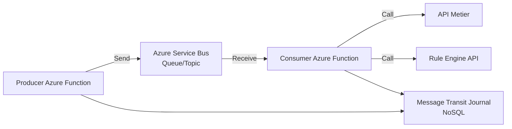
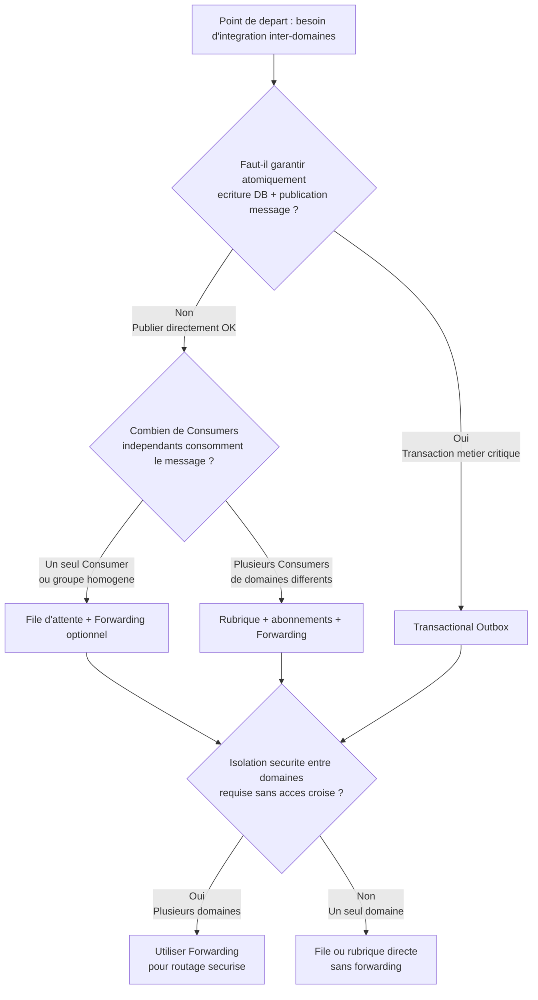
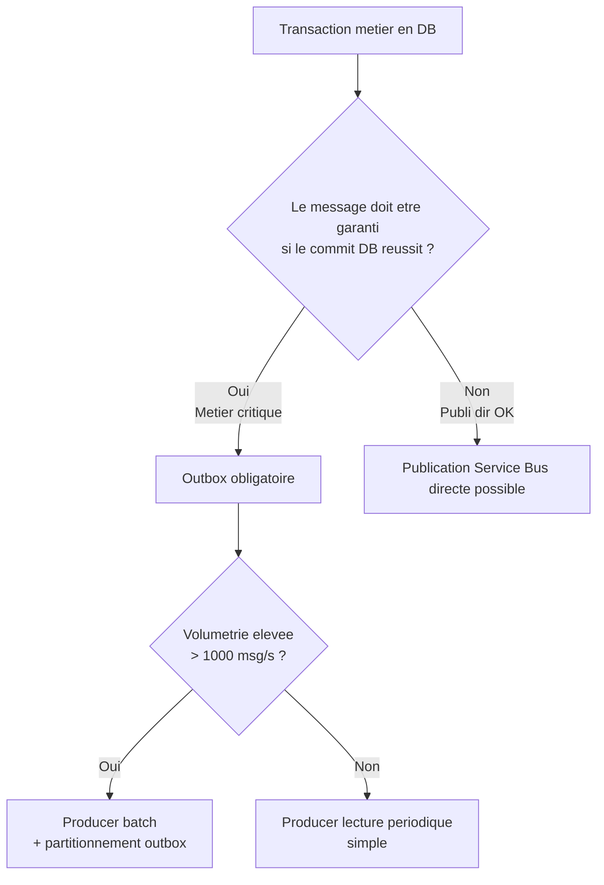
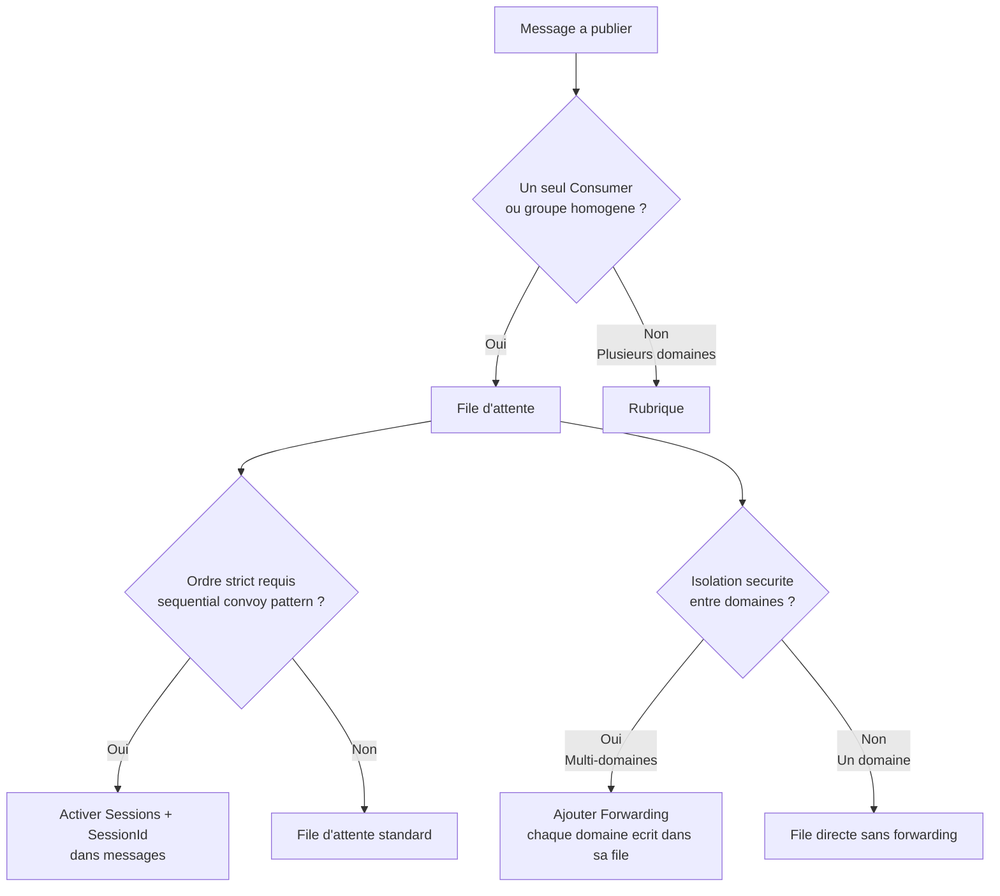
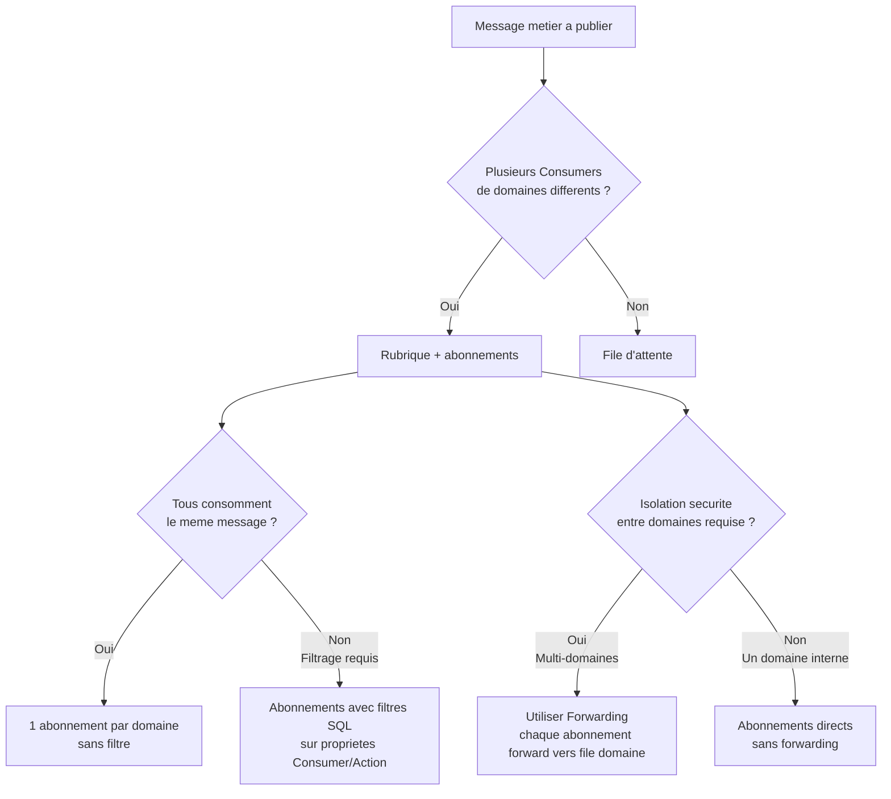
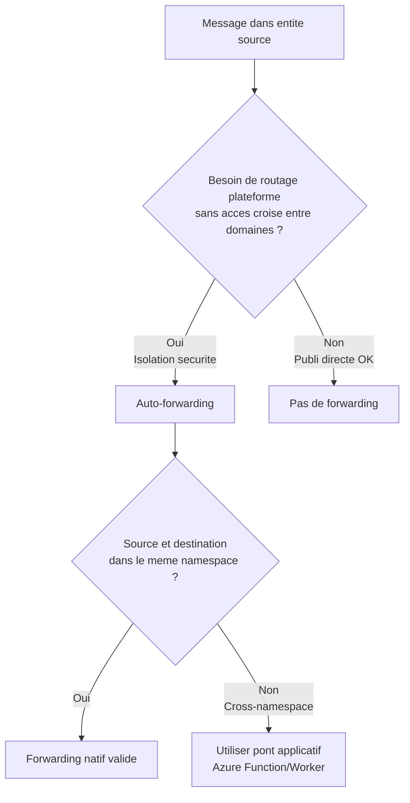
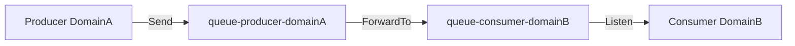

# Orientations pratiques d'integration inter-domaines (intra-applications)

Ce document aide a choisir entre quatre approches d'integration pour des **applications appartenant a des domaines metier differents** au sein d'un systeme d'information d'entreprise :

1. Pattern **Transactional Outbox**
2. **Azure Service Bus - File d'attente (Queue)**
3. **Azure Service Bus - Rubrique (Topic + subscriptions)**
4. **Azure Service Bus - Forwarding (auto-forwarding)**

**Contexte entreprise** : Dans une architecture multi-domaines, chaque domaine possede sa propre application, son propre modele de donnees et ses propres permissions d'acces. L'integration doit garantir l'isolation securitaire : un domaine ne peut pas acceder directement aux ressources (bases de donnees, tables, files) d'un autre domaine. Les mecanismes d'integration doivent preserver cette separation tout en permettant les echanges de **messages** (egalement appeles **evenements** dans ce contexte - les deux termes sont synonymes).

**Architecture d'integration (reference projet)** :
- Le **Producer** et le **Consumer** sont des **Azure Functions**.
- La **logique metier** ne vit ni dans le Producer ni dans le Consumer : elle reside dans des **API** exposees par les domaines.
- Les composants **VETRO** (Validate, Enrich, Transform, Route, Orchestrate) sont executes dans le Producer/Consumer pour preparer le message ou adapter l'appel API.
- Les **moteurs de regles** (Rule Engines) sont exposes comme **API** et appeles par le Consumer.
- Le bus de messaging est un **contrat d'API** : chaque message est un appel asynchrone contractuel vers une API metier.

Cette architecture permet de garder la logique metier centralisee dans les API, tout en offrant un pipeline d'integration robuste, observable et gouvernable.

**Schema d'architecture (simplifie)** :



---

## Message Transit Journal (journalisation bout-a-bout)

Le composant **Message Transit Journal** stocke la trace bout-a-bout des traitements (Producer et Consumer). Il est utilise pour le diagnostic, l'audit, et le calcul d'indicateurs (latence, taux de retry, DLQ, etc.).

**Hypothese initiale** : `PartitionKey` contient le nom de l'application.

**Structure de la table NoSQL** :

| Nom | Option | Type | Description |
|---|---|---|---|
| PartitionKey | Requis | Systeme | Regroupe les entites dans une meme partition logique (ex. nom application). |
| RowKey | Requis | Systeme | Identifiant unique de l'entite dans une partition donnee. |
| Timestamp | Requis | Systeme | Moment exact d'ecriture dans la table. |
| MessageId | Requis | Applicative | `MessageId` du message Service Bus. |
| CorrelationId | Optionnel | Applicative | Non applicable pour RAMQ si pas de transactions distribuees. |
| SessionId | Optionnel | Applicative | Session utilisee dans le pattern Sequential Convoy. |
| Target | Requis | Applicative | Adresse logique de l'entite Service Bus (resolu par Message Transit). |
| Mode | Requis | Applicative | Etat de la transaction : Complete, Retry, etc. |
| StatusCode | Requis | Applicative | Code retour du service downstream appele par le Consumer. |
| DeliveryCount | Requis | Applicative | Tentative courante. |
| MaxDeliveryCount | Requis | Applicative | Nombre maximal de tentatives. |
| DeadLetterSource | Optionnel | Applicative | Source DLQ (ImmediateDLQ, ExponentialRetryDLQ). |
| DeadLetterReason | Optionnel | Applicative | Raison business de mise en DLQ. |
| EnqueuedTimeUtc | Requis | Applicative | Horodatage d'enqueue Service Bus (utile pour latence bout-a-bout). |
| ApplicationName | Requis | Applicative | Nom de l'application (ex. PPP/SFU). |
| Consumer | Requis | Applicative | Consumer cible. |
| Action | Requis | Applicative | Action metier (operation). |


L'objectif est de fournir un guide comprehensible meme pour des non-specialistes :
- arbre de decision,
- avantages/inconvenients,
- modele de securite,
- points operationnels (diagnostic, tracage, correlation),
- recommandations pratiques,
- scenarios combines,
- limitations connues.

---

## 1) Vue d'ensemble rapide

**Legende contexte entreprise** :
- **Effort d'implementation** : temps et expertise necessaires pour mettre en oeuvre et operer la solution (faible, moyen, eleve).
- **Risque operationnel cle** : le defi principal a surveiller en exploitation pour eviter incidents ou degradations.
- **Defi securite** : principal point de vigilance pour maintenir l'isolation entre domaines.

| Choix | Meilleur usage | Effort d'implementation | Risque operationnel cle | Defi securite |
|---|---|---|---|---|
| Outbox | Garantir l'atomicite DB + message (aucun message perdu si commit DB reussi) | Moyen (table outbox + Producer dedie + purge) | Producer mal concu ou en panne -> retard/doublons | Separer droits DB (app metier vs Producer) et droits Service Bus |
| File d'attente | Un Producer envoie des messages ; un seul Consumer logique (ou groupe de Consumers identiques) traite ces messages | Faible (creation file + RBAC) | Accumulation de messages non traites si Consumer trop lent (backlog croissant) | Isolation Send (Producer) et Listen (Consumer) ; eviter droits Manage sauf admin |
| Rubrique | Un Producer publie ; plusieurs Consumers independants (domaines differents) recoivent chacun une copie via leur abonnement (subscription) | Moyen (gestion des abonnements + regles filtrage) | Explosion du nombre d'abonnements et backlog par abonnement difficiles a surveiller | Chaque Consumer lit uniquement son abonnement ; utiliser forwarding pour eviter acces croise |
| Forwarding | Routage plateforme entre files/rubriques du meme namespace sans code applicatif et sans donner de droits d'ecriture croises entre domaines | Moyen (configuration topologie + tracabilite distribuee) | Diagnostic difficile si topologie mal documentee (messages transitent par plusieurs entites) | Domaine A ecrit dans sa file ; plateforme route vers domaine B sans acces croise |

---

## 2) Arbre de decision global



**Regles simples** :
- Besoin d'atomicite metier avec base de donnees -> **Outbox**,
- Un seul Consumer (ou groupe homogene) -> **File d'attente** (avec forwarding si isolation domaines requise),
- Plusieurs Consumers de domaines differents -> **Rubrique** (avec forwarding pour isolation securite),
- Besoin de routage sans acces croise (domaine A ne peut pas ecrire dans la file de domaine B) -> **Forwarding**.

---

## 3) Option A - Transactional Outbox

### 3.1 Quand choisir Outbox

Le pattern Outbox est essentiel quand la base de donnees est le systeme de verite et que vous devez garantir : "si la transaction metier est commit, le message sera publie tot ou tard" - aucun message perdu meme en cas de crash entre `SaveChanges()` et envoi vers Service Bus.

### 3.2 Arbre de decision specifique Outbox



### 3.3 Avantages

- **Garantie de livraison au moins une fois** : si la transaction DB commit, le message sera publie (meme si le Producer redemarre ou echoue temporairement).
- **Decouplage temporel** : la transaction metier n'attend pas la confirmation Service Bus.
- **Reprise apres incident** : le Producer peut relire la table outbox pour publier les messages non encore traites.

### 3.4 Inconvenients

- **Composants additionnels** : table outbox, Producer dedie pour lire/publier, strategie de purge des messages publies.
- **Risque de doublons** : si le Producer republie un message deja envoye (l'idempotence cote Consumer est obligatoire).
- **Latence potentiellement superieure** : le message n'est publie qu'apres le commit DB + cycle de lecture du Producer (delai configurable).

### 3.5 Structure de la table Outbox et enjeux de contention

La table `Outbox` doit etre concue pour minimiser les conflits d'acces (contention) et optimiser les performances en environnement multi-domaines.

**Schema recommande** :

```sql
CREATE TABLE Outbox (
    OutboxId BIGINT IDENTITY PRIMARY KEY,
    MessageId NVARCHAR(128) NOT NULL UNIQUE,
    Consumer NVARCHAR(64) NOT NULL,
    Action NVARCHAR(64) NOT NULL,
    Payload NVARCHAR(MAX) NOT NULL,
    CreatedAt DATETIME2 NOT NULL DEFAULT GETUTCDATE(),
    PublishedAt DATETIME2 NULL,
    PublishAttempts INT NOT NULL DEFAULT 0,
    LastError NVARCHAR(1024) NULL,
    PartitionKey NVARCHAR(32) NOT NULL,
    INDEX IX_Outbox_NotPublished (PublishedAt, PartitionKey, CreatedAt)
        WHERE PublishedAt IS NULL
);
```

**Enjeux de contention et locks** :

Si le Producer lit toute la table en `SELECT *`, un lock partage peut bloquer les `INSERT` metier. Pour eviter cela, utiliser un index filtre `WHERE PublishedAt IS NULL` et lire par batch avec `TOP(100)`.

Si plusieurs Producers lisent en parallele (scalabilite), risque de traiter deux fois le meme message. Utiliser `UPDLOCK, READPAST` pour lock exclusif sans bloquer autres Producers :

```sql
BEGIN TRANSACTION;
SELECT TOP (100) OutboxId, MessageId, Consumer, Action, Payload
FROM Outbox WITH (UPDLOCK, READPAST)
WHERE PublishedAt IS NULL
  AND PartitionKey = @CurrentPartition
ORDER BY CreatedAt;
-- publier messages
UPDATE Outbox SET PublishedAt = GETUTCDATE(), PublishAttempts = PublishAttempts + 1
WHERE OutboxId IN (...);
COMMIT;
```

**Retentions et purge** : les messages publies doivent etre purges apres une fenetre de retention (ex. 7 jours) pour eviter croissance infinie de la table. Un job planifie `DELETE FROM Outbox WHERE PublishedAt < DATEADD(day, -7, GETUTCDATE())` execute hors heures de pointe reduit la contention.

### 3.6 Partitionnement Outbox (pour volumetrie elevee)

Dans un contexte entreprise avec plusieurs domaines et volumetrie elevee (> 1000 messages/seconde), une seule table `Outbox` devient un goulot d'etranglement. Le partitionnement permet de repartir la charge.

**Strategies de partitionnement** :
1. **Partitionnement logique par cle** : ajouter une colonne `PartitionKey` (hash du `Consumer` ou modulo de l'`OutboxId`) et deployer N Producers specialises qui lisent chacun une partition.
2. **Tables Outbox separees par domaine** : chaque domaine possede sa propre table `Outbox_DomainA`, `Outbox_DomainB`. Avantage : isolation totale des locks. Inconvenient : gestion multi-tables.
3. **Table partitionnee SQL Server** : utiliser le partitionnement physique de SQL Server pour distribuer les lignes sur plusieurs filegroups.

**Enjeux operationnels du partitionnement** :
- **Coordination de purge** : si plusieurs Producers purgent, eviter conflit d'acces en assignant une partition par Producer.
- **Failure d'un Producer** : si le Producer de la partition 3 tombe, les messages de cette partition s'accumulent -> monitoring actif du backlog par partition.
- **Trade-off complexite/performance** : introduire le partitionnement ajoute de la complexite operationnelle ; ne le faire que si le besoin de scalabilite est quantifie (mesures de charge reelles).

### 3.7 Modele de securite Outbox

**Separation des droits** (principe du moindre privilege) :

- **Application metier** : droits `INSERT` sur table Outbox uniquement (pas `UPDATE`, pas `DELETE`). L'app metier ecrit dans Outbox lors de la transaction mais ne lit jamais. Cela empeche l'application metier de manipuler les messages deja crees ou de les marquer comme publies, preservant l'integrite du processus de publication.

- **Producer** : droits `SELECT`, `UPDATE` sur table Outbox (pour marquer PublishedAt) + droits `Send` sur Service Bus. Le Producer ne peut pas modifier les donnees metier. Cette separation garantit que meme si le Producer est compromis, il ne peut pas alterer les donnees metier de l'application.

- **Job de purge** : droits `DELETE` sur table Outbox, execute avec un compte de service dedie. Aucun droit sur les donnees metier ni sur Service Bus.

Chaque composant possede uniquement les droits necessaires a sa fonction. Cela limite l'impact en cas de compromission d'un composant : si l'application metier est compromise, elle ne peut pas publier directement vers Service Bus (bypass de l'atomicite) ; si le Producer est compromis, il ne peut pas alterer les donnees metier.

### 3.8 Points operationnels Outbox

**Tracage et correlation** :
- Chaque ligne Outbox contient `OutboxId` (unique en DB) et `MessageId` (propage dans Service Bus).
- **Correlation bout-en-bout** : dans le log applicatif, tracer `OutboxId` lors du `INSERT` ; dans Service Bus, tracer `MessageId` lors de la publication ; cote Consumer, tracer `MessageId` lors du traitement. Cela permet de suivre un message de l'ecriture DB jusqu'au Consumer final.
- Exemple de requete de diagnostic : "le message `MessageId=abc123` a-t-il ete publie ?" -> `SELECT PublishedAt FROM Outbox WHERE MessageId='abc123'`.

**Metriques cles** :
- **Taille table Outbox** : nombre de lignes non publiees (`WHERE PublishedAt IS NULL`). Alerte si > seuil (ex. 10000).
- **Age maximum message non publie** : `MAX(DATEDIFF(second, CreatedAt, GETUTCDATE())) WHERE PublishedAt IS NULL`. Alerte si > 5 minutes (indique Producer en panne ou trop lent).
- **Taux d'echec Producer** : `SUM(PublishAttempts > 3) / COUNT(*)`. Alerte si taux eleve -> Service Bus indisponible ou configuration erronnee.
- **Nombre de retries** : messages avec `PublishAttempts > 1` indiquent instabilites reseau ou Service Bus ; investiguer `LastError`.

**Runbook operationnel** (procedures detaillees pour l'exploitation) :
1. **Rejouer messages en erreur** : si des messages ont `PublishAttempts > 5` et `PublishedAt IS NULL`, verifier `LastError`, corriger la cause (ex. Service Bus down, permissions manquantes), puis reinitialiser `PublishAttempts = 0` pour declencher nouvelle tentative.
2. **Purger messages publies** : executer job quotidien `DELETE FROM Outbox WHERE PublishedAt < DATEADD(day, -7, GETUTCDATE())` pour liberer espace disque et maintenir index compacts.
3. **Surveiller derive temporelle** : comparer `CreatedAt` et `PublishedAt` ; si ecart > 10 minutes en moyenne, scaler horizontalement le Producer (deployer plus d'instances ou partitionner).

### 3.9 Idempotence Legacy API (sans modifier l'API existante)

Dans votre design, le Consumer appelle une API. Quand cette API est legacy et difficile a rendre idempotente, on peut implementer l'idempotence **dans la couche Consumer** en utilisant `MessageId` et une table de deduplication (adossee a la logique Outbox).

**Principe** :
- Le `MessageId` est la cle fonctionnelle d'idempotence.
- Avant d'appeler l'API legacy, le Consumer tente d'enregistrer `MessageId` dans une table `ProcessedMessages` (index unique sur `MessageId`).
- Si insertion reussit : c'est le premier traitement -> appel API.
- Si contrainte unique violee : message deja traite -> ne pas rappeler l'API, completer le message Service Bus.

**Schema recommande** :

```sql
CREATE TABLE ProcessedMessages (
  MessageId NVARCHAR(128) NOT NULL PRIMARY KEY,
  Consumer NVARCHAR(64) NOT NULL,
  Action NVARCHAR(64) NOT NULL,
  FirstSeenAt DATETIME2 NOT NULL DEFAULT GETUTCDATE(),
  Status NVARCHAR(16) NOT NULL,           -- STARTED | SUCCEEDED | FAILED
  LastError NVARCHAR(1024) NULL,
  LastUpdatedAt DATETIME2 NOT NULL DEFAULT GETUTCDATE()
);
```

**Flux robuste recommande** :
1. Lire message, extraire `MessageId`, `Consumer`, `Action`.
2. Upsert atomique en DB :
  - si `MessageId` absent -> inserer `STARTED`.
  - si `MessageId` present avec `SUCCEEDED` -> skip (deja traite).
  - si `MessageId` present avec `STARTED` ancien -> appliquer politique de reprise (timeout).
3. Appeler API legacy.
4. Si succes API -> marquer `SUCCEEDED`, puis `CompleteMessageAsync`.
5. Si echec API -> marquer `FAILED`, puis `AbandonMessageAsync` (ou DLQ selon politique).

**Pourquoi cette approche est adaptee au legacy** :
- Aucune modification de contrat API legacy.
- Idempotence geree par Enterprise Message Transit.
- Le tracage/correlation (`MessageId`) sert a la fois au diagnostic et a la prevention des doubles appels.

**Limites et risques de l'idempotence non native** :
- **Ambiguite en cas de timeout** : l'API legacy peut avoir traite la requete, mais le Consumer ne le sait pas. Le statut reste `STARTED`, ce qui peut declencher un retry et un double effet metier.
- **Etat orphelin** : un `STARTED` peut rester bloque si l'instance Consumer meurt avant de marquer `FAILED` ou `SUCCEEDED`.
- **Verification metier difficulte** : sans endpoint d'etat, il est impossible de verifier si l'operation a deja ete appliquee.

**Cas typique "FAILED mais traite" (HTTP)** :
- Un traitement cote API reussit, mais la reponse HTTP est perdue (timeout reseau, reset de connexion, coupure reverse proxy).
- Le Consumer enregistre `FAILED` alors que l'effet metier est deja applique.
- Sans verification metier, un retry peut produire un doublon.

**Mitigations recommandees** :
- Definir un **timeout fonctionnel** sur `STARTED` (ex. 5 a 15 minutes) avant reprise.
- Propager **MessageId jusqu'a l'API** (header ou champ applicatif), meme si l'API n'est pas idempotente.
- Ajouter un **endpoint de verification** (si l'API le permet) pour confirmer l'effet metier avant retry.
- En dernier recours, traiter ces cas dans un **runbook** (verification manuelle ou compensation metier).

**Que faire face aux messages orphelins (`STARTED`)** :
- **Identifier** : requete quotidienne sur `Status=STARTED` et `LastUpdatedAt < now - T`.
- **Verifier** : si un endpoint d'etat existe, verifier l'effet metier avec `MessageId`.
- **Decider** :
  - si effet metier confirme -> marquer `SUCCEEDED`, completer le message.
  - si effet metier absent -> re-essayer une seule fois, puis `FAILED`/DLQ.
- **Journaliser** : tracer l'action humaine ou automatique (audit client).

**Politique de reprise recommandee (exemple concret)** :
- **Fenetre de securite** : `T = 10 min` (ajuster selon SLA API).
- Si `Status=STARTED` est **recent** (`LastUpdatedAt >= now - T`) -> ne pas relancer (risque de doublon).
- Si `Status=STARTED` est **ancien** (`LastUpdatedAt < now - T`) -> verifier etat metier ; si inconnu -> retry unique.
- Si `Status=FAILED` -> appliquer la classification d'erreurs (voir ci-dessous).

**Explication simple de la condition `LastUpdatedAt >= now - T`** :
- `now - T` signifie "il y a T minutes".
- Si `LastUpdatedAt` est **apres** `now - T`, le traitement est recent (ex. une mise a jour il y a 5 minutes avec `T=10`).
- Dans ce cas, on **n relance pas** pour eviter un doublon.

**Exemple horaire** (T = 10 minutes) :
- Heure actuelle `now = 10:30`.
- `now - T = 10:20`.
- Si `LastUpdatedAt = 10:25` -> recent -> ne pas relancer.
- Si `LastUpdatedAt = 10:10` -> ancien -> verifier etat metier, puis retry unique si besoin.

**Classification des erreurs (HTTP)** :
- **Erreurs applicatives (4xx fonctionnelles)** : mettre en **DLQ** immediat (ex. 400, 422). Ces erreurs sont definitives, le retry n'aide pas.
- **Erreurs d'auth/autorisation (401/403)** : alerte + **DLQ** (configuration invalide).
- **Erreurs techniques transitoires (408, 429, 5xx, timeout)** : retry avec backoff, puis DLQ si depassement de `MaxDeliveryCount`.
- **Erreurs inconnues** : traiter comme transitoire avec un nombre limite de retries.

**Tableau synthese (idempotence legacy)** :

| Etat DB | Condition | Action | Risque principal | Sortie |
|---|---|---|---|---|
| STARTED | recent (`LastUpdatedAt >= now - T`) | ne pas relancer | doublon si retry trop tot | attendre |
| STARTED | ancien (`LastUpdatedAt < now - T`) | verifier etat metier ; sinon retry unique | re-execution d'une operation deja faite | SUCCEEDED ou FAILED/DLQ |
| FAILED | 4xx fonctionnel | DLQ immediat | boucle inutile | DLQ |
| FAILED | 401/403 | alerte + DLQ | mauvaise config persiste | DLQ |
| FAILED | 408/429/5xx/timeout | retry backoff | surcharge/instabilite | SUCCEEDED ou DLQ |
| SUCCEEDED | n/a | completer message | aucun | Complete |

### 3.10 Idempotence native (API from scratch)

Pour une API neuve, la meilleure approche est de rendre l'API elle-meme idempotente via une cle d'idempotence explicite.

**Contrat HTTP recommande** :
- Le Consumer envoie `Idempotency-Key: <MessageId>`.
- L'API persiste la cle avec empreinte de la requete et resultat de traitement.
- Si la meme cle revient avec la meme requete : l'API retourne le resultat precedent (200/201) sans retraiter.

**Table cote API** :

```sql
CREATE TABLE ApiIdempotency (
  IdempotencyKey NVARCHAR(128) NOT NULL PRIMARY KEY,
  RequestHash NVARCHAR(128) NOT NULL,
  ResponseCode INT NOT NULL,
  ResponseBody NVARCHAR(MAX) NULL,
  CreatedAt DATETIME2 NOT NULL DEFAULT GETUTCDATE()
);
```

**Regles importantes** :
- Rejeter une meme `Idempotency-Key` avec un `RequestHash` different (409 Conflict).
- Definir une retention (ex. 7 a 30 jours) selon SLA de redelivery.
- Garder `MessageId` comme cle canonique entre Service Bus, Consumer et API.

Cette approche est plus propre pour les nouveaux services, car l'idempotence devient un comportement natif du domaine API, independant du transport.

**Inconvenients a assumer (idempotence native)** :
- Stockage supplementaire (table idempotence + purge).
- Conception plus rigoureuse (hash de requete, gestion des collisions, policy 409).
- Couplage au contrat HTTP (exige un `Idempotency-Key` uniforme sur tous les clients).
- Risque de mauvaise configuration de retention (trop courte -> doublons, trop longue -> couts stockage).
- Complexite de compatibilite client (tous les producteurs/consumers doivent propager la cle).
- Risque de divergence si la logique de reponse change sans invalider les cles existantes.

---

## 4) Option B - Azure Service Bus File d'attente (Queue)

### 4.1 Quand choisir File d'attente

Utiliser une file d'attente quand un Producer envoie des messages et qu'un seul Consumer (ou groupe de Consumers identiques - meme code, meme logique) traite ces messages. La file fournit buffering, retries automatiques, DLQ (Dead-Letter Queue) et permet le decouplage temporel sans fan-out natif.

### 4.2 Arbre de decision specifique File d'attente



**Pattern Sequential Convoy** : quand les messages doivent etre traites dans l'ordre strict d'arrivee pour une meme entite metier (ex. toutes les commandes d'un client), Azure Service Bus utilise les **Sessions**. Chaque message recoit une propriete `SessionId` (valeur identique pour messages du meme groupe logique). Service Bus garantit qu'un seul Consumer traite les messages d'une session a la fois, preservant l'ordre FIFO dans cette session.

**Implementation** :
```csharp
// Producer
var message = new ServiceBusMessage(payload) {
    SessionId = "Customer-12345"
};
await sender.SendMessageAsync(message);

// Consumer
await using var processor = client.CreateSessionProcessor(queueName, options);
processor.ProcessMessageAsync += async args => {
    // messages traites en ordre pour SessionId = "Customer-12345"
};
```

### 4.3 Avantages File d'attente

- **Simplicite d'exploitation** : une seule entite a monitorer, pas de gestion d'abonnements multiples.
- **Resilience native** : lock automatique du message pendant traitement, retries configurables, DLQ pour messages non traitables.
- **Pattern "send now / process later"** : le Producer n'attend pas de reponse ; le Consumer traite a son rythme.

### 4.4 Inconvenients File d'attente

- **Pas de fan-out metier natif** : un message est consomme par un seul Consumer logique. Si domaine A et domaine B doivent tous deux recevoir le meme message, le Producer doit dupliquer l'envoi (anti-pattern) ou utiliser une rubrique.
- **Backlog croissant si Consumer lent** : si le Consumer traite 10 msg/s mais le Producer envoie 50 msg/s, la file accumule 40 msg/s -> temps d'attente croissant. Solution : scaler horizontalement le Consumer (ajouter instances) ou optimiser traitement.

### 4.5 Modele de securite File d'attente

**Isolation des droits** (RBAC Azure Service Bus) :

- **Producer** : role `Azure Service Bus Data Sender` sur la file -> droit `Send` uniquement. Le Producer ne peut pas lire ni gerer la file. Cela empeche le Producer de consulter les messages en attente (potentielle fuite d'information) ou de modifier la configuration.

- **Consumer** : role `Azure Service Bus Data Receiver` sur la file -> droit `Listen` uniquement (recevoir, completer, abandonner messages). Tant qu'il conserve uniquement ce role sur **la file**, le Consumer ne peut pas envoyer de messages.

- **Administrateur** : role `Azure Service Bus Data Owner` ou `Manage` -> pour creer/supprimer files, configurer forwarding, consulter metriques. Limiter strictement aux comptes d'administration (equipe plateforme, DevOps).

**Utiliser Managed Identity** : chaque application (Producer/Consumer) s'authentifie via son identite managée Azure AD, eliminant les secrets partages (connection strings) et facilitant la rotation. Azure AD fournit audit natif de chaque acces.

**Eviter acces croise entre domaines** : si domaine A et domaine B utilisent la meme file, les deux peuvent lire tous les messages -> risque de fuite d'information. Preferer une file par domaine + forwarding pour routage securise (domaine A ecrit dans `queue-domainA`, forwarding route vers `queue-domainB`, domaine B lit uniquement `queue-domainB`).

**Clarification importante (retry et rubrique)** :
- Avec `Data Receiver`, un Consumer peut faire des operations de reception/settlement (`Complete`, `Abandon`, `Defer`, `DeadLetter`) sur la file/subscription qu'il lit.
- En revanche, s'il implemente un retry par **republication** vers une rubrique (nouveau message), il lui faut alors un droit `Send` sur cette rubrique.
- Donc l'affirmation "un Consumer ne peut pas envoyer" est vraie uniquement si on lui attribue strictement `Receiver` et aucun `Sender` additionnel.
- Pour eviter tout envoi par le Consumer, preferer le modele : abonnement de rubrique avec **forwarding vers file d'attente** et Consumer limite a `Listen` sur sa file cible.

### 4.6 Points operationnels File d'attente

**Metriques cles a surveiller** :
- **Longueur de la file (active message count)** : nombre de messages en attente de traitement. Alerte si > seuil (ex. 1000) -> Consumer trop lent, scaler.
- **Age des messages (oldest message age)** : temps ecoule depuis l'envoi du message le plus ancien. Alerte si > 10 minutes -> Consumer bloque ou en panne.
- **DLQ count** : nombre de messages dans Dead-Letter Queue. Alerte si > 0 -> investiguer cause (erreur de traitement, message malforme, depassement MaxDeliveryCount).
- **Ratio Abandon/Complete** : `AbandonCount / CompleteCount`. Ratio eleve indique instabilite Consumer ou messages problematiques.

**Diagnostic avec tracage** :
- Tracer `MessageId` de bout en bout (Producer log `MessageId` lors envoi, Consumer log `MessageId` lors reception/traitement).
- Tracer `SessionId` si sequential convoy active.
- Utiliser les proprietes applicatives `Consumer` et `Action` pour filtrer logs et metriques par type de message.

**Exploitation - strategie DLQ** :
Un message arrive en DLQ apres echec de traitement (MaxDeliveryCount atteint, ex. 10 tentatives). Procedure :
1. **Triage** : lire messages DLQ, classifier erreurs (ex. erreur temporaire reseau vs erreur metier permanente).
2. **Correction** : si erreur code Consumer, corriger et redeployer ; si message malforme, archiver/alerter Producer.
3. **Replay controle** : relire message DLQ, le renvoyer dans la file principale (avec `ServiceBusAdministrationClient.PeekMessagesAsync` + `SendMessageAsync`).

---

## 5) Option C - Azure Service Bus Rubrique (Topic)

### 5.1 Quand choisir Rubrique

Utiliser une rubrique quand un Producer publie un message et que plusieurs Consumers independants (de domaines metier differents) doivent chacun recevoir une copie du message. Chaque domaine consomme via son propre abonnement (subscription), permettant des rythmes et traitements differents sans interference.

### 5.2 Arbre de decision specifique Rubrique



**Pourquoi integrer forwarding avec rubriques (isolation securite)** :
Dans un contexte multi-domaines, donner a chaque Consumer le droit `Listen` direct sur son abonnement expose un risque : si les permissions sont mal configurees, un Consumer pourrait lire l'abonnement d'un autre domaine (fuite d'informations). Le forwarding renforce l'isolation : chaque abonnement forward automatiquement son message vers une file dediee au domaine ; le Consumer ne lit que sa file (pas l'abonnement de la rubrique). Ainsi, meme erreur de configuration RBAC ne permet pas acces croise.

### 5.3 Avantages Rubrique

- **Fan-out naturel** : un seul `SendMessageAsync` du Producer -> N copies recues par N abonnements (un par Consumer/domaine).
- **Isolation des Consumers** : chaque Consumer lit son abonnement a son rythme ; si Consumer A est lent, cela n'impacte pas Consumer B.
- **Filtres/regles sans modifier Producer** : on peut ajouter un abonnement avec filtre SQL (ex. `Consumer = 'DomainX'`) sans changer le code du Producer.

### 5.4 Inconvenients Rubrique

- **Gouvernance complexe** : avec 10 domaines, 10 abonnements a creer/monitorer/configurer. Erreur possible : oublier un abonnement -> domaine ne recoit jamais les messages.
- **Cout operationnel** : surveillance de backlog par abonnement, DLQ par abonnement, dashboards par domaine.
- **Explosion du nombre d'abonnements** : dans une grande entreprise avec 50 domaines et 20 types d'evenements -> potentiellement 1000 abonnements a gerer (naming, lifecycle, archivage).

### 5.5 Modele de securite Rubrique

**Isolation des droits par role** :

- **Producer** : role `Azure Service Bus Data Sender` sur la rubrique -> droit `Send` uniquement. Le Producer ne peut pas lire les abonnements. Cela empeche le Producer de consulter quels Consumers ont recu les messages (information sensible en environnement reglemente).

- **Consumers** : chaque Consumer recoit role `Azure Service Bus Data Receiver` sur **son abonnement uniquement** (ex. `DomainA-Consumer` lit `topic/subscriptions/DomainA-sub`). Consumer A ne peut pas lire `DomainB-sub`. Cette isolation garantit que meme erreur de configuration ne permet pas a un domaine de lire les messages d'un autre.

- **Separation des identites par domaine** : chaque domaine utilise sa propre Managed Identity Azure AD. Cela permet audit distinct (qui accede a quel abonnement) et rotation independante (si compromission domaine A, revoquer uniquement identite A sans impacter B).

**Clarification "separer identites par domaine pour audit et rotation independants"** :

Chaque application Consumer se voit attribuer une Managed Identity unique (ex. `mi-consumer-domainA`, `mi-consumer-domainB`). Dans Azure RBAC, attribuer `mi-consumer-domainA` le role `Receiver` sur `topic/subscriptions/DomainA-sub`, et `mi-consumer-domainB` sur `DomainB-sub`.

**Avantage audit** : Azure Monitor logs montrent quelle identite accede a quel abonnement ; facile d'identifier activite suspecte (ex. `mi-consumer-domainA` tente d'acceder a `DomainB-sub` -> alerte securite).

**Avantage rotation** : si l'identite `mi-consumer-domainA` est compromise, revoquer son acces et recreer l'identite sans toucher aux autres domaines. Les operations des domaines B, C, D continuent sans interruption.

**Utilisation de forwarding pour renforcer isolation** :

Au lieu de donner aux Consumers le droit de lire directement l'abonnement, chaque abonnement forward vers une file dediee au domaine (ex. `forward-to: queue-domainA`). Le Consumer lit uniquement `queue-domainA` avec droits `Listen`.

Avantages :
- Le Consumer ne voit jamais la topologie de la rubrique (nombre d'abonnements, noms).
- Meme erreur de configuration RBAC sur la rubrique ne permet pas acces croise (le Consumer n'a aucun droit sur la rubrique ni les autres abonnements).
- Separation claire : rubrique = espace du Producer ; files domaines = espaces des Consumers. Facilite governance et audit.

**Nuance securite sur le retry** :

Dans certains designs, un Consumer republie sur la rubrique pour relancer un traitement (retry applicatif). Dans ce cas, ce Consumer doit recevoir `Send` en plus de `Listen`, ce qui augmente sa surface de privilege.

Recommandation de securite :
- Eviter le retry par republication depuis le Consumer quand l'objectif est le moindre privilege.
- Preferer retries natifs Service Bus (lock renouvelable, abandon, redelivery, DLQ).
- Si un reroutage est necessaire, utiliser forwarding plateforme (subscription -> queue cible) plutot qu'un `Send` applicatif du Consumer.

### 5.6 Points operationnels Rubrique

**Metriques cles par abonnement** :
- **Backlog par abonnement** : active message count sur `topic/subscriptions/DomainA-sub`. Alerte si backlog domaine A > seuil mais backlog domaine B faible -> Consumer A trop lent, scaler uniquement Consumer A.
- **DLQ par abonnement** : dead-letter count sur chaque abonnement. Permet d'identifier quel domaine a des erreurs de traitement sans impacter les autres.
- **Drift de consommation entre domaines** : comparer l'age moyen des messages entre abonnements. Si domaine A traite messages en < 1 minute mais domaine B > 10 minutes, investiguer Consumer B.

**Clarification "drift de consommation entre domaines"** :

Le drift (derive) mesure l'ecart de performance entre Consumers. Exemple concret : un message publie a 10:00 est traite par Consumer A a 10:01 (latence 1 minute) mais par Consumer B a 10:15 (latence 15 minutes). Cela indique que Consumer B est surcharge, bloque ou mal dimensionne. Action : scaler Consumer B (ajouter instances) ou optimiser son code (profiling, reduction de requetes DB).

**Tracage avec proprietes Consumer et Action** :

Chaque message publie dans la rubrique contient les proprietes applicatives `Consumer` et `Action` (definies dans le code Producer).

Exemple :
```csharp
var message = new ServiceBusMessage(payload);
message.ApplicationProperties["Consumer"] = "DomainA";
message.ApplicationProperties["Action"] = "OrderCreated";
await sender.SendMessageAsync(message);
```

Ces proprietes sont propagees aux abonnements et permettent :
- **Filtrage SQL** : abonnement avec regle `Consumer = 'DomainA'` ne recoit que messages pour DomainA. Reduit charge si un abonnement ne traite qu'un sous-ensemble d'evenements.
- **Tracage** : logs cote Consumer incluent `Consumer` et `Action` pour diagnostiquer type de message traite (`[Consumer=DomainA, Action=OrderCreated, MessageId=abc123] Processing started`).
- **Metriques** : dashboard Grafana filtre par `Action = 'OrderCreated'` pour voir uniquement ce type d'evenement. Permet d'identifier quel type d'evenement cause erreurs.

**Note** : Dans votre contexte, les proprietes standards sont `Consumer` et `Action`. Les proprietes `Target`, `ConsumerDomain`, `CorrelationId` mentionnees dans certaines documentations externes ne sont pas utilisees ici.

**Runbook - replay par abonnement sans impacter autres domaines** :

Si Consumer A echoue de traiter les messages pendant 1 heure (panne, deploiement rate), son abonnement accumule backlog. Apres correction :

1. **Rejeu cible** : Consumer A redemarre et traite backlog de son abonnement. Les autres domaines (B, C) continuent normalement sans interruption (leurs abonnements sont independants).

2. **DLQ isole** : si messages en DLQ pour abonnement A, relire et republier uniquement dans `queue-domainA` ou reinjecter dans abonnement A. Domaines B et C non affectes.

3. **Pas d'impact transverse** : l'architecture rubrique + abonnements garantit que defaillance d'un Consumer n'empeche pas les autres de consommer. Chaque abonnement possede son propre curseur de lecture et DLQ.

**Clarification "rejouer subscription par subscription, sans impacter autres domaines"** :

Chaque abonnement possede son propre etat (curseur de lecture, DLQ). "Rejouer" signifie retraiter les messages d'un abonnement specifique. Procedure concrete :
- Identifier abonnement problematique (ex. `DomainA-sub` a 5000 messages en backlog, `DomainB-sub` a 0).
- Scaler Consumer A (ajouter 5 instances) ou corriger bug, puis laisser Consumer A lire normalement son abonnement.
- Les autres abonnements (`DomainB-sub`, `DomainC-sub`) sont independants ; leurs Consumers continuent de traiter leurs messages sans delai ajoute.

---

## 6) Option D - Azure Service Bus Forwarding

### 6.1 Quand choisir Forwarding

Utiliser le forwarding (auto-forwarding) quand vous voulez chainer des entites Service Bus (files, rubriques, abonnements) pour router automatiquement les messages **sans ecrire de code applicatif** et surtout **sans donner de droits d'ecriture croises** entre domaines. Le forwarding renforce l'isolation securite : domaine A ecrit uniquement dans sa file source ; la plateforme Service Bus route automatiquement vers la file de domaine B.

### 6.2 Arbre de decision specifique Forwarding



### 6.3 Avantages Forwarding

- **Routage centralise par la plateforme** : aucun code applicatif (Producer/Consumer) ne gere le routage. Configuration declarative (ARM template, Terraform, ou portail Azure).
- **Reduction du couplage applicatif** : le Producer ne connait pas l'existence de la file de destination ; il ecrit dans sa file source. La logique de routage est externalisee (gere par l'equipe plateforme).
- **Isolation securite renforcee** : domaine A ne possede aucun droit `Send` sur la file de domaine B. Impossible pour A d'ecrire directement dans l'espace de B -> modele "domaines cloisonnes".

### 6.4 Inconvenients Forwarding

- **Diagnostic complexe** : un message transite par plusieurs entites (file source -> file intermediaire -> file destination). Si echec, identifier a quelle etape necessite tracage distribue (correlation IDs propages).
- **Visibilite operationnelle reduite** : la topologie de forwarding n'est pas visible dans le code applicatif ; il faut documenter explicitement (diagrammes, README) pour que les equipes comprennent le flux.
- **Latence additionnelle** : chaque hop de forwarding ajoute quelques millisecondes (generalement negligeable < 10ms par hop, mais peut s'accumuler si 5+ hops).

### 6.5 Modele de securite Forwarding (point cle - isolation forte)

**Principe de base** :

- Domaine A possede sa propre file `queue-domainA` avec droits `Send` uniquement sur cette file.
- Domaine B possede sa propre file `queue-domainB` avec droits `Listen` uniquement sur cette file.
- Un abonnement ou file intermediaire est configure pour forward automatiquement de `queue-domainA` vers `queue-domainB` (configuration plateforme, pas code applicatif).
- **Resultat** : domaine A ne peut jamais ecrire directement dans `queue-domainB` (aucun droit `Send` sur cette file) ; la plateforme Service Bus effectue le routage.

**Clarification "acces croise expose la securite"** :

Si domaine A possede droits `Send` sur `queue-domainB`, cela cree un **acces croise** : domaine A peut injecter des messages arbitraires dans l'espace de domaine B. Risques :
- **Injection malveillante** : domaine A compromis injecte messages malformes pour crash Consumer B.
- **Pollution de file** : domaine A envoie par erreur messages dans file de B, causant traitement errone.
- **Conformite** : violation de separation de domaines (reglementation RGPD, SOC2, etc. exigent isolation stricte).

Le forwarding elimine ce risque : domaine A ecrit uniquement dans son espace ; la plateforme route selon regles pre-configurees par l'administration (pas par le code applicatif). Aucun secret partage, aucun droit croise.

**Exemple concret** :

- File `queue-producer-domainA` (domaine A ecrit ici).
- Abonnement `topic-central/subscriptions/routeA-to-B` configure avec `ForwardTo = queue-consumer-domainB`.
- File `queue-consumer-domainB` (domaine B lit ici).
- Domaine A n'a aucun droit sur `queue-consumer-domainB` ni sur `topic-central`. Domaine B n'a aucun droit sur `queue-producer-domainA`.

**Avantage audit** : Azure Monitor logs montrent que la plateforme Service Bus (identite systeme) effectue le forwarding, pas l'application. Cela simplifie les audits de securite (pas de secrets partages dans code, pas de droits croises dans RBAC).

### 6.6 Points operationnels Forwarding

**Tracage obligatoire avec MessageId** :

Le forwarding preserve `MessageId` du message lors du transit entre entites. Tracer `MessageId` + proprietes `Consumer` et `Action` permet de suivre le message a travers les etapes :

- Log Producer : `[Published MessageId=abc123, Consumer=DomainB, Action=OrderCreated to queue-producer-domainA]`
- Log Service Bus (optionnel, via diagnostic settings) : `[Forwarded MessageId=abc123 from queue-producer-domainA to queue-consumer-domainB]`
- Log Consumer : `[Received MessageId=abc123, Consumer=DomainB, Action=OrderCreated from queue-consumer-domainB]`

Cette tracabilite bout-en-bout est **critique** pour diagnostic : si Consumer B ne recoit pas message, verifier si message est arrive en `queue-producer-domainA` (Producer OK), puis si forwarding a route vers `queue-consumer-domainB` (config OK), puis si Consumer B est connecte (Consumer OK).

**Metriques par etape** :

- **Backlog source** : active message count sur file source. Si backlog source croit mais backlog destination vide, forwarding fonctionne ; sinon, verifier configuration `ForwardTo` (peut-etre typo dans nom file destination).
- **Backlog destination** : active message count sur file destination. Indique charge du Consumer final.
- **Latence de transit** : comparer timestamp `EnqueuedTimeUtc` (file source) et horodatage reception Consumer. Latence elevee (> 30 secondes) -> bottleneck reseau ou Service Bus surcharge (contacter support Azure).
- **Erreurs DLQ sur chaque etape** : si message atteint DLQ en file source, il n'est jamais forwarde (ex. message trop gros, ForwardTo mal configure) ; si message atteint DLQ en file destination, il a ete forwarde mais echec traitement Consumer.

**Documentation topologique obligatoire** :

Creer un diagramme (Mermaid, Visio) montrant toutes les routes de forwarding :



Maintenir ce diagramme a jour a chaque ajout/suppression de route. Inclure dans README ou wiki interne pour onboarding des nouvelles recrues. Exemple : fichier `docs/forwarding-topology.md` avec tous les chemins de routage.

### 6.7 Limitations du forwarding (contrainte namespace)

**Limitation technique Azure Service Bus** :

L'auto-forwarding natif (`ForwardTo` property) fonctionne **uniquement entre entites du meme namespace Service Bus**. On ne peut pas configurer `ForwardTo = queue-in-another-namespace`.

**Pourquoi cette limitation ?** :

Azure Service Bus gere le forwarding au niveau du namespace ; les namespaces sont isoles (chaque namespace possede son propre endpoint, RBAC, quotas). Pour router entre namespaces (ex. multi-tenant, cross-region), il faut un composant applicatif intermediaire.

**Alternative cross-namespace** :

Utiliser un pont applicatif (bridge) :
- **Azure Function** declenchee par file source (namespace A).
- Function lit message, transforme si necessaire (ex. enrichissement, filtrage), publie dans file destination (namespace B).
- **Avantage** : flexibilite (transformation, routage conditionnel base sur logique metier, retry custom).
- **Inconvenient** : composant a operer (monitoring, scaling, cout compute, latence additionnelle).

**Recommandation** :

Si vous avez besoin de cross-namespace, documentez clairement le pont applicatif comme un composant critique et monitorez sa disponibilite (SLA, alertes). Preferer rester dans un seul namespace si possible pour beneficier du forwarding natif (zero code, latence minimale).

---

## 7) Recommandations pratiques (tres importantes)

Ces recommandations sont issues des bonnes pratiques d'integration multi-domaines et visent a eviter les pieges courants.

### 7.1 Eviter le pattern "table partagee"

**Anti-pattern** : deux applications de domaines independants lisent et ecrivent dans la meme table SQL.

**Pourquoi c'est problematique** :

- **Couplage structurel fort** : tout changement de schema (ajout colonne, modification type, nouvel index) impacte les deux domaines simultanement. Necessite coordination entre equipes, ralentit deploiements independants (perte d'agilite).

- **Securite faible** : les deux applications ont droits `SELECT`/`UPDATE` sur la table -> risque qu'application A modifie par erreur (ou malice) donnees metier de domaine B. Violation du principe de responsabilite unique (chaque domaine possede ses donnees).

- **Contention elevee** : les deux applications creent des locks sur la meme table lors d'ecritures concurrentes, reduisant performances et creant blocages (deadlocks). Impact direct sur temps de reponse utilisateur final.

**Recommandation** :

Favoriser les **APIs** (REST, gRPC) ou la **messagerie asynchrone** (Service Bus) pour limiter le couplage. Chaque domaine possede sa propre base de donnees (pattern Database-per-Service) ; les echanges passent par messages asynchrones (events) ou appels API synchrones (requetes ponctuelles). Cela preserve autonomie et evolutivite de chaque domaine.

### 7.2 Strategie d'idempotence obligatoire

**Contexte** : Service Bus garantit livraison **au moins une fois** (at-least-once). Un message peut etre recu plusieurs fois (retry apres timeout, failover reseau, redemarrage Consumer).

**Consequence** : si Consumer n'est pas idempotent, traiter deux fois le meme message cause doublons metier. Exemples concrets :
- Facture creee deux fois -> surfacturation client.
- Paiement deduit deux fois -> compte debite en double.
- Email envoye deux fois -> mauvaise experience utilisateur.

**Solution technique** :

Stocker `MessageId` dans une table de deduplication avant traitement :

```csharp
// Avant de traiter message
var exists = await dbContext.ProcessedMessages
    .AnyAsync(m => m.MessageId == receivedMessage.MessageId);

if (exists) {
    await args.CompleteMessageAsync(receivedMessage);
    return;
}

// Traiter message
await ProcessOrder(receivedMessage);

// Marquer comme traite
await dbContext.ProcessedMessages.AddAsync(new ProcessedMessage {
    MessageId = receivedMessage.MessageId,
    ProcessedAt = DateTime.UtcNow
});
await dbContext.SaveChangesAsync();
await args.CompleteMessageAsync(receivedMessage);
```

**Purge** : purger table `ProcessedMessages` apres retention suffisante (ex. 30 jours) pour eviter croissance infinie.

### 7.3 Standardiser les proprietes de correlation

Definir un **contrat de metadonnees uniforme** pour tous les messages (dans guidelines d'equipe) :

- `MessageId` : identifiant unique du message (genere par Producer, type GUID).
- `Consumer` : domaine destinataire (ex. `DomainA`, `DomainB`, `Billing`).
- `Action` : type d'evenement metier (ex. `OrderCreated`, `PaymentProcessed`, `UserRegistered`).
- `SessionId` (si sequential convoy requis) : identifiant de groupe logique (ex. `Customer-12345`, `Order-67890`).

**Avantage** : tracabilite homogene (logs structures coherents), filtres RBAC coherents (abonnements SQL), metriques agregees par `Action` (dashboards Grafana). Facilite troubleshooting et audit.

### 7.4 Mettre en place un runbook DLQ

Chaque equipe Consumer doit avoir une **procedure documentee** pour gerer Dead-Letter Queue :

1. **Qui analyse** : equipe proprietaire du Consumer (on-call, support niveau 2).
2. **Qui corrige** : developpeur Consumer si bug code ; equipe infra/plateforme si erreur config (ex. DLQ atteinte car Consumer pas de droits Listen).
3. **Qui rejoue** : script automatise (prefere) ou procedure manuelle pour relire DLQ et reinjecter messages dans file principale.

**Runbook exemple** (fichier Markdown dans repo) :

```markdown
# Runbook DLQ queue-consumer-domainA

## Alerte
Alerte Grafana : "DLQ count > 10 for queue-consumer-domainA"

## Etapes diagnostic
1. Lire messages DLQ : `az servicebus queue show-dlq --namespace myNamespace --queue-name queue-consumer-domainA`
2. Identifier erreur recurrente dans `DeadLetterReason` property (ex. "MaxDeliveryCountExceeded", "Timeout", "Malformed").
3. Si erreur temporaire (ex. DB down) -> attendre retablissement, rejouer messages.
4. Si erreur permanente (ex. message malforme, changement schema non retrocompatible) -> archiver message dans Blob Storage (forensics), alerter equipe Producer pour corriger.

## Rejeu
Script PowerShell : `Replay-DLQ.ps1 -Queue queue-consumer-domainA -Count 100 -Namespace myNamespace`
Valider traitement sur premiers 10 messages avant rejouer batch complet.

## Escalade
Si DLQ > 1000 messages ou DLQ croit > 50 msg/min, escalader vers equipe plateforme (peut indiquer incident systemique).
```

### 7.5 Commencer simple, evoluer progressivement

**Regle d'or** : ne pas sur-architecturer des le debut (principe YAGNI - You Aren't Gonna Need It).

Approche recommandee par phase :

- **Phase 1** : un Producer, un Consumer, une file d'attente. Valider le flux de bout en bout avec volumetrie reelle (test de charge). Objectif : prouver viabilite technique.

- **Phase 2** : si besoin d'atomicite DB demontre (ex. perte de message = impact financier), ajouter pattern Outbox. Mesurer latence ajoutee (acceptable ?).

- **Phase 3** : si nouveaux domaines doivent consommer le meme message (ex. domaine Facturation + domaine Livraison + domaine Analytics), migrer vers rubrique avec abonnements. Tester fan-out.

- **Phase 4** : si audit securite exige isolation stricte (ex. conformite reglementaire), ajouter forwarding pour cloisonner domaines. Documenter topologie.

**Eviter** : deployer Outbox + Rubrique + Forwarding des le jour 1 sans besoin quantifie -> complexite inutile, couts operationnels eleves (surveillance, maintenance), risque d'erreurs de configuration, equipe surchargee.

### 7.6 Outbox recommande pour transactions critiques

**Critere decisionnel** :

Si une transaction metier en base de donnees necessite la publication d'un message **et que la perte de ce message a un impact metier grave** (revenu, conformite, experience utilisateur), alors Outbox est **obligatoire**.

**Exemples de scenarios critiques** :

- **Creation commande** -> publier evenement `OrderCreated` pour declencher workflow de facturation. Si message perdu, client non facture -> perte revenu.
- **Paiement recu** -> publier evenement `PaymentReceived` pour declencher livraison. Si message perdu, client paye mais commande jamais livree -> litige, remboursement.
- **Inscription utilisateur** -> publier evenement `UserRegistered` pour envoi email bienvenue + provisioning compte. Si message perdu, utilisateur jamais notifie -> mauvaise experience.

**Scenarios ou Outbox n'est pas requis** :

- Evenements de telemetrie (ex. `PageViewed`) : perte acceptable, pas d'impact metier critique.
- Notifications non critiques (ex. `NewCommentOnPost`) : si perdu, utilisateur verra notification avec retard mais pas d'impact financier.

### 7.7 Guide de choix idempotence (legacy vs from scratch)

Utiliser ce guide pratique (clair et actionnable) :

- **API legacy difficile a changer** :
  - Mettre l'idempotence **dans le Consumer** (table `ProcessedMessages`).
  - Accepter la limite principale : risque de double effet en cas de timeout legacy.
  - Ajouter un runbook de verification et, si possible, un endpoint de verification metier.

- **API nouvelle (from scratch)** :
  - Implementer l'idempotence **dans l'API** via `Idempotency-Key`.
  - Conserver la dedup Consumer comme filet de securite si l'impact metier est critique.

- **Contexte critique (finance, sante, secteur public)** :
  - Combiner **idempotence API + dedup Consumer**.
  - Exiger une retention idempotence longue et une observabilite stricte.

**Decision rapide** :
- Si l'API cible ne peut pas evoluer -> idempotence Consumer obligatoire.
- Si l'API cible est sous votre controle -> idempotence native obligatoire, dedup Consumer recommande.

### 7.8 Idempotence et strategie de deploiement (Deployment Slots)

Dans notre scenario, nous adoptons **Deployment Slots**. Cela renforce encore l'importance de l'idempotence :

- Lors d'un swap de slot, deux versions de Consumer/API peuvent traiter des messages en parallele pendant un court intervalle.
- En cas de rollback, un message peut etre traite par l'ancienne version apres avoir ete partiellement traite par la nouvelle.
- L'idempotence garantit qu'un meme `MessageId` ne provoque pas un double effet metier lors des transitions de version.

**Recommandations** :
- Garder la meme logique d'idempotence entre slots (schema DB identique, memes cles).
- Ne pas vider la table d'idempotence lors d'un deploiement.
- Surveiller les metriques de duplicates autour des swaps (fenetre de 15-30 min).

---

## 8) Securite comparee (synthese)

| Option | Niveau d'isolation | Droits minimaux recommandes | Risque principal si mal configure |
|---|---|---|---|
| Outbox | **Bonne** (si Producer separe) | App metier : DB `INSERT` Outbox ; Producer : DB `SELECT/UPDATE` Outbox + Service Bus `Send` | App metier recoit droits `Send` Service Bus -> bypass Outbox (perte atomicite) |
| File d'attente | **Bonne** (Producer/Consumer isoles) | Producer : `Send` file ; Consumer : `Listen` file | Comptes partages avec droits `Manage` -> modification config file par erreur (ex. change TTL, supprime file) |
| Rubrique | **Tres bonne** (par abonnement) | Producer : `Send` rubrique ; Consumer : `Listen` abonnement specifique domaine | Consumer A recoit droits sur abonnement B -> fuite d'information cross-domaine (lecture messages d'autre domaine) |
| Forwarding | **Excellente** (cloisonnement domaines) | Domaine A : `Send` file A uniquement ; Domaine B : `Listen` file B uniquement ; plateforme route | Topologie mal documentee -> erreur config forwarding vers mauvaise file (routage messages sensibles vers domaine non autorise) |

---

## 9) Scenarios de combinaison recommandes

Les architectures robustes combinent souvent plusieurs options. Voici des patterns eprouves en production.

### Scenario 1 - Outbox + File d'attente

**Usage** : application metier critique avec transaction DB locale et traitement asynchrone par un seul Consumer (ou groupe de Consumers identiques).

**Architecture** :
1. Application metier commit transaction DB + ligne Outbox (atomicite garantie).
2. Producer dedie lit Outbox periodiquement (ex. toutes les 5 secondes), publie messages dans file d'attente Service Bus.
3. Consumer traite messages de la file (idempotence obligatoire).

**Avantages** :
- Atomicite DB + message garantie (zero perte si commit DB reussit).
- Workflow interne unique et robuste (retry, DLQ natifs Service Bus).
- Simple a monitorer (une seule file, metriques standard).

**Cas d'usage typique** : systeme de commande e-commerce ou creation commande (DB) doit toujours declencher workflow facturation (message).

### Scenario 2 - Outbox + Rubrique + Forwarding

**Usage** : application metier critique publiant evenements consommes par plusieurs domaines independants avec isolation securite stricte.

**Architecture** :
1. Application metier commit transaction DB + ligne Outbox.
2. Producer lit Outbox, publie dans rubrique Service Bus.
3. Chaque domaine (A, B, C) possede un abonnement sur la rubrique (avec filtre SQL optionnel).
4. Chaque abonnement forward vers file dediee du domaine (`queue-domainA`, `queue-domainB`, `queue-domainC`).
5. Consumers lisent uniquement leur file dediee (droits `Listen` sur leur file uniquement).

**Avantages** :
- Atomicite DB + message (Outbox).
- Fan-out naturel (rubrique -> N abonnements).
- Isolation securite maximale (forwarding -> aucun acces croise).

**Inconvenients** :
- Complexite operationnelle elevee (Outbox + rubrique + N files + N abonnements + forwarding config).
- **Obligatoire uniquement** si les trois besoins (atomicite + fan-out + isolation securite) sont requis simultanement. Ne pas deployer par defaut.

**Cas d'usage typique** : systeme bancaire ou transaction financiere (DB) genere evenement consomme par domaines Audit, Reporting, Notification avec isolation reglementaire stricte.

### Scenario 3 - File d'attente + Forwarding (isolation multi-domaines point-a-point)

**Usage** : domaine A envoie messages a domaine B ; isolation securite requise (A ne peut pas ecrire directement dans file de B).

**Architecture** :
1. Domaine A ecrit dans `queue-producer-domainA` (droits `Send` uniquement sur cette file).
2. Configuration forwarding plateforme : `queue-producer-domainA` -> `ForwardTo = queue-consumer-domainB`.
3. Domaine B lit `queue-consumer-domainB` (droits `Listen` uniquement sur cette file).

**Avantages** :
- Simple (deux files + une regle forwarding, pas de rubrique).
- Isolation securite forte (A ne possede aucun droit sur file de B, B ne possede aucun droit sur file de A).
- Audit clair (logs montrent plateforme effectue routage, pas applications).

**Usage typique** : integration point-a-point entre deux domaines avec contrainte securite stricte (ex. domaine Paiement -> domaine Comptabilite, conformite SOC2).

### Scenario 4 - Rubrique + Forwarding (multi-domaines avec filtres metier)

**Usage** : un Producer central publie evenements ; plusieurs domaines consomment avec filtres metier specifiques et isolation securite.

**Architecture** :
1. Producer central publie dans `topic-central` (messages avec proprietes `Consumer` et `Action`).
2. Abonnement `sub-domainA` avec filtre SQL `Consumer = 'DomainA'` forward vers `queue-domainA`.
3. Abonnement `sub-domainB` avec filtre SQL `Consumer = 'DomainB'` forward vers `queue-domainB`.
4. Consumers de chaque domaine lisent uniquement leur file respective.

**Avantages** :
- Filtrage metier declaratif (regles SQL cote Service Bus, pas de code Producer duplique).
- Isolation securite (forwarding -> Consumers ne voient jamais rubrique ni autres abonnements).
- Scalabilite (ajouter domaine C = creer abonnement `sub-domainC` + file `queue-domainC` + regle forwarding, **zero modification Producer ou autres Consumers**).

**Cas d'usage typique** : bus d'evenements d'entreprise (ESB) ou evenements metier (OrderCreated, UserRegistered, PaymentProcessed) sont publies par applications sources et consommes par N domaines avec filtres specifiques.

---

## 10) Multi Target (Enterprise Message Transit)

Enterprise Message Transit introduit le concept **Multi Target** : un meme Producer peut publier vers plusieurs cibles du meme domaine applicatif (plusieurs files d'attente et/ou plusieurs rubriques) selon le type de message, l'action, ou une regle metier.

### 10.1 Pourquoi Multi Target est utile

- Centraliser la logique de publication dans un seul Producer.
- Eviter de dupliquer N Producers quasi identiques (maintenance simplifiee).
- Mieux gouverner le routage (configuration cible par `Action`, `Consumer`, ou policy).

### 10.2 Multi Target + Outbox (avantage cle)

Avec Outbox, Multi Target permet d'avoir **un seul couple Producer + table Outbox** qui publie differents messages vers differentes files/rubriques.

Exemple :
- `Action=OrderCreated` -> `queue-order-processing`
- `Action=OrderCreated` -> `topic-order-events`
- `Action=InvoiceReady` -> `queue-billing`

Le message est stocke une seule fois dans Outbox puis route vers la cible appropriee au moment de la publication, selon la configuration Multi Target.

### 10.3 Bonnes pratiques Multi Target

- Garder un mapping explicite `Target -> Endpoint` versionne en configuration (liste `Itinerary`).
- Utiliser `Action` et `Consumer` au runtime pour selectionner la cible, sans les rendre obligatoires en configuration.
- Journaliser `MessageId`, `Action`, `TargetEntity` a chaque publication.
- Eviter les routes dynamiques non controlees (risque de mauvaise destination).
- Valider les droits RBAC par cible (Producer `Send` uniquement sur les entites autorisees).

### 10.4 Vigilances

- Plus de cibles = plus de points de supervision (backlog, DLQ par cible).
- En cas d'echec partiel multi-cibles, definir une strategie claire (retry cible en erreur, compensation, alerte).

### 10.5 Modele de configuration recommande (client-ready)

Pour faciliter la maintenance client, recommander une configuration declarative versionnee plutot qu'un routage code en dur.

Exemple de configuration (format AppSettings) :

```json
{
  "AppSettings": {
    "ServiceBusNamespace": "sb-wrapca.servicebus.windows.net",
    "Itinerary": [
      {
        "Endpoint": {
          "EntityName": "queue-app1",
          "EntityType": "Queue"
        },
        "Target": "Target1"
      },
      {
        "Endpoint": {
          "EntityName": "queue-app2",
          "EntityType": "Queue"
        },
        "Target": "Target2"
      },
      {
        "Endpoint": {
          "EntityName": "topic-notification",
          "EntityType": "Topic"
        },
        "Target": "Target3"
      }
    ]
  }
}
```

**Note importante** : `Action` et `Consumer` ne sont pas disponibles dans la configuration Multi Target. Ils sont utilises au moment de la publication, dans le code. Ils ne sont **pas obligatoires**, mais **recommandes** pour :
- Faire du **context-based routing** (notamment sur rubrique avec filtres SQL).
- Exposer le systeme de messaging comme un **contrat d'API** (tracabilite et gouvernance).

Recommandations d'implementation :
- Valider le mapping au demarrage (entites existantes, droits `Send` disponibles, doublons de routes).
- Refuser la publication si `Action` inconnue (fail-fast) et journaliser une alerte metier exploitable.
- Inclure `TargetEntity` et `RouteVersion` dans les logs pour faciliter l'audit client.

### 10.6 Strategie d'echec partiel Multi Target

Quand un message doit partir vers plusieurs cibles, definir explicitement la strategie retenue avec le client :

- **Best-effort** : publier toutes les cibles possibles, remonter alerte si au moins une cible echoue.
- **All-or-alert** : publier, puis escalader si une cible echoue ; reprise automatique par retries sur cible en erreur.
- **Compensation metier** : si la cohérence inter-cibles est critique, emettre un evenement de compensation pour traitements deja lances.

Pour un contexte entreprise, recommander `All-or-alert` avec monitoring et runbook de reprise par cible.

---

## 11) Checklist de mise en oeuvre (projet)

### Checklist architecture
- [ ] Le besoin d'atomicite DB + message est-il **documente et justifie** avec scenarios metier critiques quantifies (ex. perte message = XEUR de revenu) ?
- [ ] Le nombre de Consumers independants est-il connu et stable (file d'attente), ou evolutif/inconnu (rubrique) ?
- [ ] La necessite de routage intermediaire (forwarding) est-elle justifiee par **contraintes securite** (audit, conformite reglementaire) ?
- [ ] Les limites namespace (forwarding natif intra-namespace uniquement) sont-elles prises en compte dans design ?

### Checklist securite
- [ ] **Identite managée** par application/domaine definie et configuree dans Azure AD (pas de connection strings en code).
- [ ] **RBAC minimum** applique : `Send` ou `Listen` uniquement, **jamais `Manage`** pour applications (reserve admin plateforme).
- [ ] **Secretless auth** privilegiee (Managed Identity) documentee dans runbook deploiement.
- [ ] **Journal d'audit** des acces Azure Monitor configure (diagnostic settings actives) et alertes actives sur acces non autorises.

### Checklist operationnelle
- [ ] **Dashboard** Grafana/Azure Monitor avec metriques cles : backlog, DLQ count, latence p95, taux erreurs (par file/abonnement) en place et accessible equipe on-call.
- [ ] **Correlation** `MessageId` + `Consumer` + `Action` tracee de bout en bout dans logs centralises (Application Insights ou equivalent).
- [ ] **Procedure replay DLQ** documentee (runbook par Consumer, scripts testes en pre-prod).
- [ ] **Test de charge** effectue (volumetrie max attendue x 2, test sustained load 1h) et **test de reprise apres incident** valide (kill Consumer -> messages DLQ -> rejouer -> succes).

---

## 12) Conclusion

Pour l'integration **inter-domaines intra-applications** (applications de domaines metier differents au sein d'un SI d'entreprise) :

- **Transactional Outbox** garantit l'atomicite transactionnelle DB + message (aucun message perdu si commit reussi). Obligatoire pour scenarios critiques ou perte message = impact metier grave.

- **File d'attente** est le choix le plus simple et robuste pour un flux asynchrone avec un seul Consumer (ou groupe de Consumers homogenes/identiques). Privilegier en premier lieu (principe KISS).

- **Rubrique** (Topic) permet la diffusion a plusieurs Consumers independants (fan-out naturel). Utiliser quand N domaines doivent recevoir le meme message sans dupliquer envois.

- **Forwarding** renforce l'isolation securite en cloisonnant les domaines : chaque domaine ecrit uniquement dans son espace ; la plateforme Service Bus route automatiquement. Aucun acces croise, aucun secret partage. Essentiel en environnement reglemente (finance, sante, secteur public).

**Pattern recommande en entreprise** : combiner **Outbox** (coherence/atomicite), **Service Bus** (resilience/decouplage), et **Forwarding** (isolation securite).

**Principe de progressivite** : commencer simple (file d'attente seule), valider en production avec volumetrie reelle, puis evoluer progressivement selon besoins **quantifies et documentes** (pas de sur-architecture prematuree -> couts et complexite inutiles).

**Contrainte technique cle** : le forwarding natif Azure Service Bus fonctionne **uniquement dans le meme namespace**. Pour routage cross-namespace (multi-tenant, multi-region), utiliser un pont applicatif (Azure Function, Worker) et le documenter comme composant critique dans architecture.

---

## 13) Annexe client - perimetre, hypotheses, exclusions

### 13.1 Perimetre couvert

Ce document couvre :
- Integration asynchrone inter-domaines via Azure Service Bus.
- Garanties de livraison et robustesse transactionnelle avec Outbox.
- Isolation securitaire par RBAC et forwarding.
- Idempotence Consumer/API pour prevenir les doubles traitements.
- Gouvernance de routage multi-cibles avec Multi Target.

### 13.2 Hypotheses de reference

- Azure Service Bus Standard/Premium est disponible et opere par l'equipe plateforme.
- Authentification privilegiee via Microsoft Entra ID (Managed Identity), avec RBAC minimum.
- Les messages incluent au minimum : `MessageId`, `Consumer`, `Action`.
- Les Consumers implementent un niveau minimal d'idempotence avant traitement metier.

### 13.3 Exclusions explicites

- Orchestration BPM longue duree (hors scope de ce document).
- Transformations metier complexes cross-domaines (a traiter par services dedies).
- Gouvernance MDM et qualite de donnees (hors scope technique de transport).

---

## 14) Plan de validation client (UAT/Pre-Prod)

### 14.1 Jeux de tests minimaux

1. **Test nominal** : publication et consommation de bout en bout sur chaque pattern choisi.
2. **Test duplication** : envoi volontaire du meme `MessageId` pour verifier l'idempotence.
3. **Test indisponibilite consumer** : arreter le Consumer, accumuler backlog, redemarrer, verifier reprise.
4. **Test DLQ** : injecter message invalide, verifier triage et replay via runbook.
5. **Test securite RBAC** : verifier qu'un Consumer sans `Send` ne peut pas publier.
6. **Test Multi Target** : verifier routage correct vers toutes les cibles configurees.

### 14.2 Evidence attendue pour recette client

- Captures des dashboards (backlog, DLQ, latence, erreurs) pendant les tests.
- Extraits de logs correles par `MessageId` sur Producer/Service Bus/Consumer/API.
- Rapport de tests avec statut PASS/FAIL et actions correctives.
- Validation conjointe runbook d'exploitation (incident + reprise).

---

## 15) Criteres d'acceptation client (mesurables)

- **Disponibilite flux** : traitement nominal reussi > 99% sur campagne de tests.
- **Idempotence** : 0 double effet metier observe pour messages dupliques.
- **Securite** : aucun acces croise entre domaines valide lors tests RBAC.
- **Observabilite** : 100% des messages de tests tracables via `MessageId`.
- **Exploitabilite** : runbook DLQ execute avec succes par l'equipe support.
- **Multi Target** : 100% des routes configurees verifiees en pre-production.

Ces criteres peuvent etre contractualises et ajustes selon les SLA/SLO du client.
