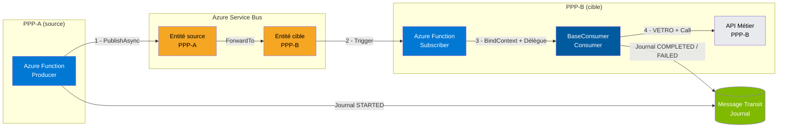
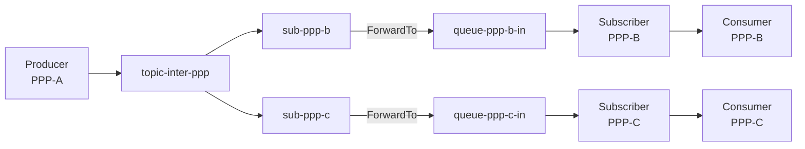

# EnterpriseMessageTransit — Intégration inter-PPP

> **Public cible :** développeurs et architectes intégrant deux applications PPP distinctes via Azure Service Bus.  
> **Prérequis :** avoir lu [Vue d'ensemble.md](Vue%20d'ensemble.md).  
> **Dernière mise à jour :** 2026-03-19

---

## Table des matières

1. [Principe](#1-principe)
2. [Architecture](#2-architecture)
3. [Flux bout-en-bout](#3-flux-bout-en-bout)
4. [Sécurité et RBAC](#4-sécurité-et-rbac)
5. [Variante fan-out](#5-variante-fan-out)
6. [Observabilité](#6-observabilité)
7. [Contraintes](#7-contraintes)
8. [Critères de conformité](#8-critères-de-conformité)
9. [Alternatives rejetées](#9-alternatives-rejetées)

---

## 1. Principe

L'intégration inter-PPP repose sur **Azure Service Bus Forwarding**. Chaque PPP publie uniquement dans ses propres entités Service Bus. La plateforme se charge d'acheminer automatiquement le message vers le PPP destinataire via `ForwardTo`.

**Règles absolues :**

- Un PPP source n'a **jamais** de droit d'écriture sur les entités d'un PPP cible.
- Un PPP cible n'a **jamais** de droit de lecture sur les entités d'un PPP source.
- Tout échange inter-PPP passe **obligatoirement** par le forwarding, gouverné par la plateforme.

---

## 2. Architecture



**Composants et responsabilités :**

| Composant | PPP | Responsabilité |
|-----------|-----|----------------|
| **Producer** (Azure Function) | PPP-A | Applique VETRO, publie dans l'entité source de PPP-A via `PublishAsync`. |
| **Entité source** (file ou rubrique) | PPP-A | Propriété de PPP-A. Le Producer de PPP-A y écrit. |
| **ForwardTo** | Plateforme | Achemine automatiquement le message de l'entité source vers l'entité cible. Configuré par la plateforme, pas par les applications. |
| **Entité cible** (file ou abonnement) | PPP-B | Propriété de PPP-B. Le Subscriber de PPP-B y lit. |
| **Subscriber** (Azure Function `[ServiceBusTrigger]`) | PPP-B | Reçoit le trigger, appelle `BindContext`, désérialise, délègue au Consumer. |
| **Consumer** (`BaseConsumer<TMessage>`) | PPP-B | Applique VETRO, appelle l'API Métier de PPP-B, gère complétion / retry / DLQ. |

> Le forwarding est **transparent** pour le Subscriber : il voit uniquement son entité locale (`QB`), sans savoir d'où vient le message.

---

## 3. Flux bout-en-bout

| Étape | Acteur | Action | Remarque |
|-------|--------|--------|----------|
| **1** | Producer (PPP-A) | Applique VETRO. Renseigne `MessageId`, `Consumer`, `Action`. Publie via `PublishAsync`. | Le développeur de PPP-A implémente cette étape. |
| **2** | Azure Service Bus | Achemine le message de l'entité source vers l'entité cible via `ForwardTo`. | Géré par la plateforme. Aucun code applicatif. |
| **3** | Subscriber (PPP-B) | Reçoit le trigger, appelle `BindContext`, désérialise le payload, délègue au Consumer. | Le développeur de PPP-B implémente cette étape. |
| **4** | Consumer (PPP-B) | Applique VETRO, appelle l'API Métier de PPP-B. Complète, retry ou dead-letter selon le résultat. | Le développeur de PPP-B implémente cette étape. |
| **5** | EnterpriseMessageTransit | Écrit automatiquement dans le Message Transit Journal à chaque opération Producer et Consumer. | Entièrement géré par la bibliothèque. Aucun code applicatif. |

---

## 4. Sécurité et RBAC

### 4.1 Modèle de droits

Chaque identité applicative (Managed Identity) reçoit les droits **minimaux** sur ses propres entités uniquement.

| Composant | Rôle Azure RBAC | Périmètre |
|-----------|-----------------|-----------|
| **Producer (PPP-A)** | `Azure Service Bus Data Sender` | Entité source de PPP-A uniquement |
| **Subscriber / Consumer (PPP-B)** | `Azure Service Bus Data Receiver` | Entité cible de PPP-B uniquement |
| **Consumer jouant aussi Producer** (réponse en chaîne) | `Data Receiver` + `Data Sender` | Entité cible de PPP-B + entité de réponse |
| **Plateforme** | `Azure Service Bus Data Owner` | Namespace (configuration du forwarding) |
| **Message Transit Journal** | `Storage Table Data Contributor` | Table de journal Azure Storage |

### 4.2 Authentification

- **Managed Identity** (system-assigned ou user-assigned) pour toutes les identités applicatives.
- **Aucun secret partagé** entre PPP (pas de connection string applicative).
- Configuration du forwarding réservée à la plateforme (`Data Owner`).

### 4.3 Principe du moindre privilège

PPP-A n'a aucun droit sur les entités de PPP-B, et inversement. Cela garantit :
- qu'une compromission de l'identité de PPP-A ne donne pas accès aux entités de PPP-B ;
- que la séparation des responsabilités entre PPP est techniquement imposée, pas seulement organisationnelle.

---

## 5. Variante fan-out

Quand **plusieurs PPP** doivent recevoir le même événement, on utilise une rubrique commune avec un abonnement par PPP destinataire. Chaque abonnement forward vers la file dédiée du PPP cible.



**Règles pour cette variante :**
- La rubrique commune (`topic-inter-ppp`) et ses abonnements sont configurés par la plateforme.
- Chaque PPP destinataire ne lit que sa propre file (`queue-ppp-b-in`, `queue-ppp-c-in`).
- Les droits RBAC restent identiques à la variante nominale : chaque PPP est isolé sur ses entités.

---

## 6. Observabilité

### 6.1 Message Transit Journal

Le journal est écrit automatiquement par EnterpriseMessageTransit. Il couvre les deux PPP impliqués dans l'échange.

> **Important :** dans un scénario inter-PPP, PPP-A ne dispose **pas** de Consumer. Son Producer écrit uniquement `STARTED`. Il n'y aura jamais d'entrée `COMPLETED` ni `DLQ` dans le journal de PPP-A. C'est le Consumer de PPP-B qui écrit `COMPLETED` ou `DLQ`. Le lien entre ces deux entrées est le `MessageId`, propagé de bout en bout.

**Corrélation inter-PPP :** le `MessageId` permet de retrouver l'entrée `STARTED` (PPP-A, `ApplicationName="PPP-A"`) et l'entrée `COMPLETED` ou `DLQ` (PPP-B, `ApplicationName="PPP-B"`) dans le même journal.

```
MessageId = "abc-123"
  → Journal : STARTED   (PPP-A, Producer,  ApplicationName="PPP-A", t=10:00:00)
  → Journal : COMPLETED (PPP-B, Consumer,  ApplicationName="PPP-B", t=10:00:03, StatusCode=200)
```

### 6.2 Indicateurs opérationnels cibles

| Indicateur | Description | Seuil d'alerte |
|------------|-------------|----------------|
| **Taux de succès bout-en-bout** | % de messages avec `Mode=COMPLETED` | < 99 % → investigation |
| **Latence p95 / p99** | Écart entre `EnqueuedTimeUtc` et `Timestamp (COMPLETED)` | > SLA défini |
| **Taux de retry** | % de messages avec au moins un `Mode=RETRY` | Hausse soudaine → instabilité |
| **Volume DLQ** | Nombre de `Mode=DLQ` par PPP | Tout DLQ → triage requis |
| **Messages orphelins** | `STARTED` dans PPP-A sans `COMPLETED` ni `DLQ` correspondant dans PPP-B (même `MessageId`) | > 15 min → incident forwarding ou Consumer PPP-B en panne |

### 6.3 Détection d'une défaillance du forwarding

Le forwarding est géré par la plateforme — EnterpriseMessageTransit ne le contrôle pas. En cas de défaillance, **aucune exception n'est levée côté Producer** : le message est accepté dans l'entité source (PPP-A), mais il ne parvient jamais à l'entité cible (PPP-B). La panne est silencieuse et invisible depuis PPP-B.

**Symptômes caractéristiques :**

| Symptôme | Où observer |
|----------|-------------|
| Le journal de PPP-A contient une entrée `STARTED` pour un `MessageId` donné, mais aucune entrée `COMPLETED` ni `DLQ` n'existe pour ce même `MessageId` dans le journal de PPP-B | Message Transit Journal — filtrer par `MessageId` et comparer `ApplicationName="PPP-A"` (STARTED) et `ApplicationName="PPP-B"` (aucun résultat) |
| Accumulation de messages dans l'entité source de PPP-A | Métriques Service Bus — `Active Message Count` sur `queue-ppp-a-out` / abonnement |
| Aucun trigger déclenché côté PPP-B | Absence totale d'entrées dans le journal de PPP-B pour ce `MessageId` |
| Messages en DLQ sur l'entité **source** | Service Bus dead-letter l'entité source si le forwarding échoue après épuisement des tentatives |

**Causes les plus fréquentes :**

| Cause | Diagnostic |
|-------|-----------|
| Forwarding non configuré ou entité cible mal nommée | Vérifier la configuration `ForwardTo` en infrastructure (Bicep/Terraform/portail) |
| Entité cible désactivée ou supprimée | Vérifier l'existence et l'état de l'entité dans le namespace |
| Droits insuffisants pour le forwarding | `Data Owner` plateforme requis pour configurer `ForwardTo` — vérifier le RBAC de la plateforme |

> **Point clé :** dans un forwarding défaillant, les messages orphelins — `STARTED` dans le journal de PPP-A sans `COMPLETED` correspondant dans le journal de PPP-B pour le même `MessageId` — sont le **seul signal visible** dans EnterpriseMessageTransit. La surveillance des métriques Service Bus côté entité source est donc indispensable en complément du Message Transit Journal.

### 6.4 Runbook minimal en cas d'incident

1. **Triage DLQ** : distinguer erreur technique (réseau, timeout) et erreur applicative (400 Bad Request).
2. **Replay contrôlé** : republier les messages en DLQ après correction de la cause racine.
3. **Vérification des STARTED orphelins** : identifier les messages publiés mais jamais consommés.
4. **Forwarding silencieux** : si pas de DLQ mais `STARTED` orphelins → vérifier l'entité source (Active Message Count), la configuration `ForwardTo` et l'état de l'entité cible.
5. **Escalade RBAC** : si le Consumer ne peut pas lire l'entité cible, vérifier l'attribution des rôles Managed Identity.

---

## 7. Contraintes

| Contrainte | Détail |
|------------|--------|
| **Intra-namespace uniquement** | Le forwarding natif Azure Service Bus fonctionne uniquement au sein d'un même namespace. |
| **Cross-namespace / cross-region** | Nécessite un bridge applicatif (Azure Function ou Worker dédié). Hors périmètre de ce document. |
| **Topologie versionnée** | La configuration des entités et du forwarding doit être gérée en IaC (Bicep ou Terraform) et versionnée. |
| **Aucune logique métier dans Producer/Consumer** | Seul VETRO est autorisé. Toute logique métier doit être encapsulée dans les API. |

---

## 8. Critères de conformité

Un échange inter-PPP est **conforme** si toutes les conditions suivantes sont réunies :

- [ ] Tous les flux inter-PPP passent par forwarding configuré en infrastructure.
- [ ] Aucun Producer d'un PPP n'a de droit d'écriture direct sur les entités d'un autre PPP.
- [ ] Toutes les identités applicatives utilisent Managed Identity — aucun secret partagé.
- [ ] Le RBAC minimal est appliqué (Producer = `Sender` sur son entité, Consumer = `Receiver` sur son entité).
- [ ] Chaque message est traçable dans le Message Transit Journal via son `MessageId`.
- [ ] Le runbook DLQ/replay est opérationnel et testé.

---

## 9. Alternatives rejetées

| Alternative | Raison du rejet |
|-------------|-----------------|
| **File/rubrique directe sans forwarding** | Introduit des droits d'écriture croisés entre PPP. Viole l'isolation sécuritaire. |
| **Topic avec abonnements consommés directement par l'autre PPP** | Surface de privilèges plus large ; le PPP cible doit avoir accès à la rubrique du PPP source. |
| **Table technique partagée inter-PPP** | Crée un couplage fort entre PPP et contrevient à la séparation des responsabilités. |
| **Retry par republication côté Consumer** | Nécessite `Data Sender` côté Consumer, ce qui augmente les privilèges applicatifs. |

---

*Documents connexes :*

- [Vue d'ensemble.md](Vue%20d'ensemble.md) — Architecture générale, Producer, Consumer, Subscriber.
