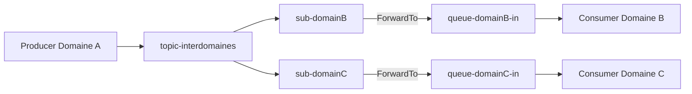

# Solution cible d’intégration inter-domaines (inter PPP)

## 1) Résumé exécutif

La solution cible inter PPP repose sur **Azure Service Bus Forwarding**.

Cette décision garantit :
- une **isolation sécuritaire stricte** entre domaines,
- l’absence de **droits d’écriture croisés**,
- une gouvernance claire des permissions,
- une exploitabilité robuste (audit, supervision, reprise).

Ce document présente **uniquement la cible retenue**. Les alternatives sont rappelées en fin de document avec justification de rejet.

---

## 2) Contexte d’architecture

Principes d’architecture conservés :
- **Producer** et **Consumer** sont des **Azure Functions** ;
- la logique métier est implémentée dans les **API** ;
- Producer/Consumer réalisent les étapes **VETRO** (Validate, Enrich, Transform, Route, Orchestrate) ;
- les Rule Engines sont exposés comme API ;
- `MessageId` est propagé de bout en bout (bus, journal, API).

Principe directeur : le bus est un **contrat d’appel asynchrone** vers des API métiers, sans accès direct aux ressources d’un autre domaine.

---

## 3) Architecture cible : Forwarding

### 3.1 Principe de fonctionnement

Dans ce document, une **entité Service Bus** désigne une **file d'attente** ou une **rubrique** (et ses abonnements). Le **forwarding** est appliqué vers une **file d'attente** ou vers une **rubrique** du domaine destinataire ; dans le cas d'une rubrique, il est configuré via un abonnement.

Chaque domaine publie dans sa propre entité. Le routage inter-domaines est assuré par la plateforme via `ForwardTo`, et non par un envoi direct entre applications de domaines distincts.

- Domaine source : droit `Send` sur son entité source uniquement.
- Domaine destination : droit `Listen` sur son entité destination uniquement.
- Plateforme : routage via forwarding (même namespace).

### 3.2 Schéma nominal

:::mermaid
flowchart LR
  P[Producer Azure Function - Domaine A] -->|Send| QA[queue-domainA-out]
  QA -->|ForwardTo| QB[queue-domainB-in]
  QB -->|Receive| C[Consumer Azure Function - Domaine B]
  C -->|Call| API[API Métier Domaine B]
  P --> J[(Message Transit Journal)]
  C --> J
:::

### 3.3 Variante fan-out inter-domaines

Quand plusieurs domaines doivent consommer le même événement :
- publication dans une rubrique commune,
- chaque abonnement forward vers une file dédiée de domaine,
- chaque Consumer lit uniquement sa file.

---

## 4) Flux cible bout-en-bout

1. Producer prépare le message (VETRO) et renseigne `MessageId`, `Consumer`, `Action`.
2. Producer publie dans l'entité source de son domaine (file d'attente ou rubrique).
3. Service Bus achemine automatiquement le message via forwarding.
4. Consumer du domaine cible traite puis appelle l’API métier.
5. Producer/Consumer alimentent le **Message Transit Journal**.
6. En cas d’échec, application des politiques retry/DLQ avec traçabilité complète.

Note : Les étapes 1, 2, 3, 4 et 6 demandent des interventions de la part du développeur. Seule l'étape 5 est totalement gérée implicitement par EntrepriseMessageTransit.
---

## 5) Modèle de sécurité cible

### 5.1 RBAC minimal obligatoire

- Producer : `Azure Service Bus Data Sender` (source uniquement).
- Plateforme : `Data Owner/Manage` pour configuration et exploitation.

**Rôles Consumer selon le scénario** :

| Scénario Consumer | Rôle requis |
|---|---|
| Réception et traitement de messages (cas nominal) | `Azure Service Bus Data Receiver` |
| Consumer jouant aussi le rôle de Producer (envoi en réponse ou en chaîne) | `Azure Service Bus Data Receiver` + `Azure Service Bus Data Sender` sur l'entité cible |
| Retry par republication sur une rubrique (abonnement cible) | `Azure Service Bus Data Receiver` + `Azure Service Bus Data Sender` sur la rubrique |

Dans un scénario de rubrique, si le retry doit cibler explicitement un abonnement, la republication est une option valide à condition de renseigner correctement les propriétés de message (notamment `Consumer` et `Action`). Dans ce cas, le Consumer doit disposer de `Sender` en plus de `Receiver`.

### 5.2 Justification sécurité

Le forwarding est imposé car il :
- empêche le schéma non conforme « A écrit directement chez B » ;
- réduit la portée d’une compromission d’identité applicative ;
- renforce la séparation des responsabilités et l’auditabilité.

### 5.3 Authentification

- Priorité à **Microsoft Entra ID / Managed Identity**.
- Aucun secret applicatif partagé entre domaines.

---

## 6) Exploitabilité et observabilité

### 6.1 Message Transit Journal (obligatoire)

Le journal bout-en-bout est la source de référence opérationnelle.

Hypothèse de partitionnement :
- `PartitionKey = ApplicationName` (ex. PPP, SFU).

Champs critiques :
- `MessageId`, `ApplicationName`, `Consumer`, `Action` ;
- `Mode`, `StatusCode`, `DeliveryCount`, `MaxDeliveryCount` ;
- `DeadLetterSource`, `DeadLetterReason`, `EnqueuedTimeUtc`, `Timestamp`.

### 6.2 Indicateurs cibles

- taux de succès bout-en-bout,
- latence **p95/p99** : seuil de temps de traitement en dessous duquel se situent 95 % et 99 % des messages ; permet de détecter les dégradations qui n'affectent qu'une minorité de traitements mais révèlent des problèmes structurels,
- taux de retry,
- volume DLQ par domaine,
- nombre de messages orphelins/ambigus.

Le dispositif permet également d’obtenir des informations de **performance bout-à-bout** par `MessageId` (temps de transit, temps de traitement Consumer, délais de reprise), à partir du Message Transit Journal et des métriques Service Bus.

### 6.3 Runbook minimal

- triage DLQ (erreur technique vs applicative),
- replay contrôlé,
- vérification des `STARTED` anciens,
- escalade sécurité/RBAC.

---

## 7) Contraintes et limites connues

- Le forwarding natif est **intra-namespace** uniquement.
- En cross-namespace ou cross-region : bridge applicatif (Function/Worker) nécessaire.
- La topologie de forwarding doit être versionnée et gouvernée.

---

## 8) Critères d’acceptation de la cible

La cible inter PPP est considérée conforme si :
- tous les flux inter-domaines passent par forwarding ;
- aucun Producer de domaine n’a de droit d’écriture direct vers une entité d’un autre domaine ;
- les identités applicatives respectent le RBAC minimal ;
- chaque transaction est traçable dans le journal avec `MessageId` ;
- le runbook DLQ/replay est opérationnel et testé.

---

## 9) Décision finale

Décision d’architecture :
- **Forwarding imposé** pour tous les échanges inter-domaines inter PPP ;
- **Queue/Topic directs sans forwarding non autorisés** pour l’intégration inter-domaines ;
- **RBAC minimal + Managed Identity** obligatoires ;
- **Message Transit Journal** obligatoire pour audit et exploitation.

---

## 10) Solutions alternatives écartées (synthèse)

| Solution alternative | Pourquoi écartée pour inter PPP |
|---|---|
| Queue directe (sans forwarding) | Introduit des droits croisés (source vers cible) et affaiblit l’isolation sécuritaire. |
| Topic directe (abonnements consommés directement) | Surface de privilèges plus large, gouvernance RBAC plus fragile en inter-domaines. |
| Outbox seule (sans forwarding) | Utile pour l’atomicité locale, mais ne répond pas à l’exigence d’isolation entre domaines. |
| Retry applicatif par republication Consumer | Nécessite souvent `Send` côté Consumer, ce qui augmente les privilèges et les risques. |
| Table technique partagée inter-applications | Crée un couplage fort et contrevient à la séparation stricte des domaines. |

**Conclusion de rejet** : ces options ne garantissent pas le niveau requis d’isolation, de traçabilité et de gouvernance pour l’inter PPP.
