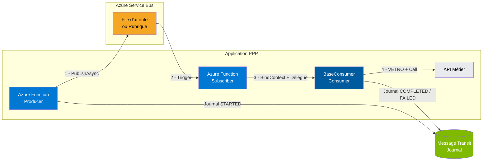
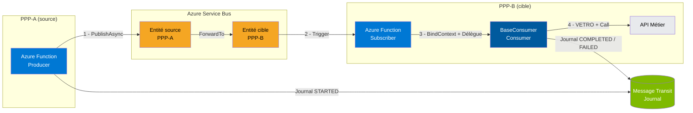
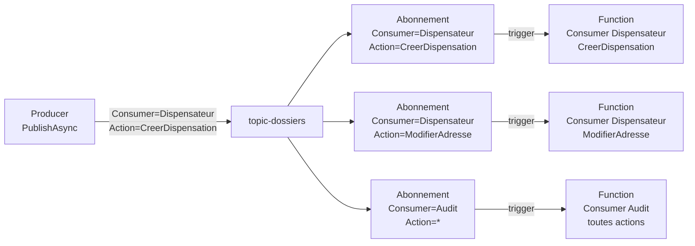
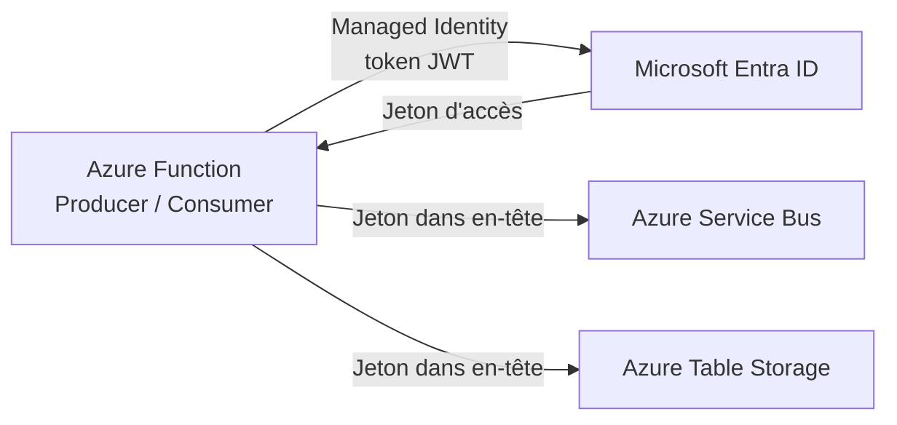

# EnterpriseMessageTransit — Vue d'ensemble

> **Public cible :** développeurs intégrant EnterpriseMessageTransit dans leurs Azure Functions.  
> **Prérequis :** connaissance de base de C# et Azure Functions. La connaissance d'Azure Service Bus **n'est pas requise** : EnterpriseMessageTransit abstrait entièrement le SDK.  
> **Dernière mise à jour :** 2026-03-19

---

## Table des matières

1. [Contexte Architecture](#1-contexte-architecture)
2. [Entités Azure Service Bus](#2-entités-azure-service-bus)
3. [Propriétés de message : Consumer et Action](#3-propriétés-de-message--consumer-et-action)
4. [Producer](#4-producer)
5. [Consumer et Subscriber](#5-consumer-et-subscriber)
6. [Sécurité](#6-sécurité)
7. [Journal et Observabilité](#7-journal-et-observabilité)

---

## 1. Contexte Architecture

### 1.1 Vue d'ensemble

**EnterpriseMessageTransit** est une bibliothèque .NET (NuGet d'entreprise) qui standardise l'envoi et la réception de messages sur Azure Service Bus. Elle offre une couche d'abstraction qui permet aux développeurs de se concentrer sur la logique métier, sans gérer directement les détails du SDK Azure.

> **Le développeur n'a pas besoin de connaître Azure Service Bus.** Toute la complexité du protocole, de l'authentification et de la gestion des messages est prise en charge par la bibliothèque.

Principaux bénéfices :
- **Abstraction complète** du SDK `Azure.Messaging.ServiceBus` (pas de couplage direct).
- **Patrons d'intégration** prêts à l'emploi : Claim Check, Request/Reply, Sequential Convoy, Saga.
- **Journalisation bout-en-bout** automatique (Message Transit Journal).
- **Gestion des erreurs** standardisée (retry immédiat, retry exponentiel, dead-lettering).
- **Sécurité** basée sur Managed Identity (aucun secret partagé).

**Principe architectural fondamental :** Producer et Consumer sont des Azure Functions dont la seule logique autorisée est le traitement **VETRO** (Validate, Enrich, Transform, Route, Orchestrate) — préparation et adaptation du message. **Toute autre logique métier doit être encapsulée dans des API** appelées par le Consumer.

### 1.2 Diagrammes d'architecture

#### Cas standard — sans forwarding (intra-PPP)

Le cas le plus courant : Producer et Consumer appartiennent à la même application PPP. Le message transite directement via une file d'attente ou une rubrique.



#### Cas inter-PPP — avec forwarding

Utilisé **uniquement** dans un contexte d'intégration entre deux applications PPP distinctes. Le message est publié dans l'entité du PPP source, puis acheminé automatiquement par Service Bus vers l'entité du PPP cible, **sans droits d'écriture croisés**.



**Légende du flux (commun aux deux cas) :**

| Étape | Description |
|-------|-------------|
| **1** | Le Producer applique les traitements VETRO (validation, enrichissement, transformation), définit les propriétés `Consumer` / `Action` pour le routage, puis publie via `PublishAsync`. |
| **2** | Azure Service Bus déclenche le **Subscriber** (Azure Function avec `[ServiceBusTrigger]`). En cas inter-PPP, le forwarding est transparent : le Subscriber voit toujours son entité locale. |
| **3** | Le Subscriber appelle `BindContext`, tente la désérialisation, gère les échecs de désérialisation (dead-letter immédiat), puis délègue au **Consumer**. |
| **4** | Le Consumer applique ses propres traitements VETRO si nécessaire, puis appelle l'API Métier. |
| **J** | Producer et Consumer écrivent automatiquement dans le Message Transit Journal pour la traçabilité bout-en-bout. |

> Pour l'architecture complète du scénario inter-PPP (RBAC, sécurité, variante fan-out, critères de conformité), voir [inter-PPP.md](inter-PPP.md).

---

### 1.3 Patrons d'intégration disponibles

#### Côté Producer

| Patron | Description courte |
|--------|--------------------|
| **Publication simple** | Envoi d'un message vers une file ou une rubrique. Cas le plus fréquent. |
| **Multi-cible** | Un Producer peut publier vers plusieurs entités Service Bus selon le type de message (`IMessageTargetMap`). |
| **Claim Check** | Si le payload dépasse un seuil configurable, le corps du message est déposé dans Azure Blob Storage et remplacé par un jeton de référence. |
| **Request / Reply** | Le Producer envoie un message et attend une réponse synchrone (session Service Bus). Utile pour les intégrations synchrones sur un bus asynchrone. |
| **Sequential Convoy** | Les messages d'un même groupe logique (ex. dossier patient) sont traités dans l'ordre strict d'arrivée, avec exclusivité de traitement par groupe. |

> **Sequential Convoy — SessionId :** Le développeur doit définir `MessageTransitContext<TMessage>.SessionId` **avant** d'appeler `PublishAsync` (ex. numéro de dossier). EnterpriseMessageTransit propage cette valeur vers Azure Service Bus. EnterpriseMessageTransit ne génère **pas** le `SessionId`.

#### Côté Consumer

| Patron | Description courte |
|--------|--------------------|
| **Complétion** | Le Consumer traite le message avec succès et appelle `CompleteMessageAsync`. |
| **Dead-lettering** | En cas d'erreur définitive (ex. 400 Bad Request), le message est envoyé en DLQ via `DeadLetterAsync`. |
| **Retry immédiat** | Abandon du message pour le remettre immédiatement en file (utile pour erreurs transitoires légères). |
| **Retry exponentiel** | Backoff croissant configurable avant de remettre le message en circulation. Protection contre les surcharges. |
| **Routage Saga** | Le Consumer peut enchaîner les étapes d'un flux multi-étapes (Saga) via `RouteToNextStageAsync`, en transmettant le contexte à l'étape suivante. |
| **Context-based routing** | Sur une rubrique, les abonnements filtrent les messages selon les propriétés `Consumer` et `Action`, permettant de router un seul événement vers plusieurs Consumers spécialisés. |

---

### 1.4 Subscriber vs Consumer : deux composants distincts

Dans EnterpriseMessageTransit, **deux composants distincts** participent à la réception d'un message.

| Composant | Type | Rôle |
|-----------|------|------|
| **Subscriber** | Azure Function (`[ServiceBusTrigger]`) | Point d'entrée Service Bus. Appelle `BindContext`, tente la désérialisation, gère les échecs (dead-letter immédiat), puis délègue au Consumer. |
| **Consumer** | Classe héritant de `BaseConsumer<TMessage>` | Implémente `ConsumeAsync`. Contient la logique VETRO, l'appel à l'API Métier, et les décisions de complétion / retry / dead-letter. |

> **Règle :** Un **Subscriber** est lié à **une entité Service Bus** (une file d'attente ou un abonnement d'une rubrique). Un **Consumer** est lié à **un type de message** (`TMessage`). Dans une même DLL, plusieurs paires Subscriber/Consumer peuvent coexister de façon indépendante.

---

## 2. Entités Azure Service Bus

> Les concepts suivants sont décrits brièvement ici. Un document dédié détaille ces entités et leur configuration dans la plateforme.

| Entité | Description |
|--------|-------------|
| **Namespace** | Conteneur racine de toutes les entités Service Bus d'une application (files, rubriques). Correspond à un point d'entrée réseau unique (`<nom>.servicebus.windows.net`). |
| **File d'attente (Queue)** | Canal FIFO entre un Producer et un Consumer (ou groupe homogène). Messages persistés jusqu'à traitement ou expiration (TTL). |
| **Rubrique (Topic)** | Canal de diffusion. Un Producer publie un message une seule fois ; plusieurs abonnements en reçoivent chacun une copie indépendante. Idéal pour le fan-out (un événement → plusieurs Consumers indépendants). |
| **Abonnement (Subscription)** | Sous-entité d'une rubrique. Chaque abonnement possède sa propre file de messages et peut appliquer des filtres (propriétés `Consumer` / `Action`). |
| **Forwarding (ForwardTo)** | Mécanisme natif Service Bus : un message reçu dans une entité source est automatiquement redirigé vers une entité cible. Utilisé dans un contexte **inter-PPP** pour router les messages sans droits d'écriture croisés entre PPP. |

---

## 3. Propriétés de message : Consumer et Action

### 3.1 Rôle des propriétés

Chaque message publié via EnterpriseMessageTransit peut transporter deux propriétés applicatives clés :

| Propriété | Obligatoire | Rôle |
|-----------|-------------|------|
| **`Consumer`** | Oui (Topic) | Identifie le consommateur logique cible (ex. `"dispensateur"`, `"individu"`). Permet de filtrer les abonnements d'une rubrique. |
| **`Action`** | Non | Identifie l'opération métier (ex. `"CreerDossier"`, `"ModifierAdresse"`). Permet un routage plus fin au sein d'un même Consumer. |

**Comment ça fonctionne en pratique :**

- Le **Producer** définit `Consumer` et `Action` comme **propriétés du message** dans `PublishOptions.Properties` lors de la publication.
- **Azure Service Bus** achemine le message vers les abonnements dont le filtre SQL correspond à ces propriétés (ex. `Consumer = 'Dispensateur' AND Action = 'CreerDossier'`). Cette configuration de filtre est réalisée au niveau de l'infrastructure (portail Azure ou IaC), non dans le code.
- Le **Consumer** déclare les valeurs attendues dans sa configuration (`SubscriptionInfoSettings` dans l'`Itinerary`). Ces valeurs doivent correspondre exactement aux propriétés envoyées par le Producer et aux filtres SQL configurés en infrastructure.

### 3.2 Context-based routing : rubrique + abonnements

Le context-based routing permet à un seul événement d'être traité par plusieurs Consumers autonomes, chacun filtré par ses propriétés `Consumer` / `Action`.



**Principe :** le Producer renseigne `Consumer` et `Action` dans les propriétés du message. Chaque abonnement de la rubrique filtre selon ces propriétés. Seul l'abonnement correspondant reçoit le message.

### 3.3 Configuration de l'abonnement (Consumer)

Dans la configuration d'un Consumer branché sur une rubrique, `SubscriptionInfoSettings` déclare le filtre attendu :

```json
"Itinerary": [
  {
    "Target": "dispensateur-creer",
    "Endpoint": {
      "EntityName": "topic-dossiers",
      "EntityType": "Topic",
      "Subscription": {
        "Consumer": "Dispensateur",
        "Action": "CreerDispensation"
      }
    }
  }
]
```

**Relation entre `SubscriptionInfoSettings` et le filtre SQL de l'abonnement :**

Les valeurs `Consumer` et `Action` déclarées dans la configuration **ne créent pas** le filtre SQL automatiquement. Elles permettent à EnterpriseMessageTransit d'identifier l'étape courante dans l'itinéraire. Le filtre SQL est une configuration d'**infrastructure** (portail Azure, Bicep, Terraform) qui doit correspondre exactement aux propriétés envoyées par le Producer.

| `Consumer` dans config | `Action` dans config | Filtre SQL à configurer en infrastructure |
|------------------------|----------------------|-------------------------------------------|
| `Dispensateur` | `CreerDispensation` | `Consumer = 'Dispensateur' AND Action = 'CreerDispensation'` |
| `Dispensateur` | _(omis)_ | `Consumer = 'Dispensateur'` |

> **Note :** si `Action` est omise, le filtre SQL en infrastructure doit porter uniquement sur `Consumer` (ex. `Consumer = 'Dispensateur'`). L'abonnement recevra alors **tous les messages** ciblant ce `Consumer`, quelle que soit leur `Action`.

---

## 4. Producer

### 4.1 Rôle

Le Producer est responsable de :
1. **Préparer** le message (enrichissement, transformation — étapes VETRO).
2. **Résoudre** l'entité Service Bus cible via l'`Itinerary` (`AppSettings`).
3. **Publier** le message via `IMessageProducer<TMessage>.PublishAsync`.
4. **Journaliser** automatiquement l'opération dans le Message Transit Journal.
5. **Gérer** le Claim Check si le payload dépasse le seuil configuré.

Le Producer est une **Azure Function** (typiquement trigger HTTP ou timer). La **seule logique autorisée** dans le Producer est le traitement **VETRO** (Validate, Enrich, Transform, Route, Orchestrate) servant à préparer le message avant publication. Toute autre logique métier doit être encapsulée dans les API.

### 4.2 Configuration (`IProducerConfigurationService`)

L'application doit fournir une implémentation de `IProducerConfigurationService` (hérite de `IMessageTransitConfigurationService`) qui expose un objet `AppSettings` :

```json
// appsettings.json
{
  "AppSettings": {
    "ServiceBusNamespace": "mon-namespace.servicebus.windows.net",
    "ApplicationName": "PPP",
    "MessageTransitJournalName": "MessageTransitJournal",
    "MessageTransitJournalStoreUri": "https://monstorage.table.core.windows.net",
    "Itinerary": [
      {
        "Target": "dispensateur",
        "Endpoint": {
          "EntityName": "queue-dispensateur-in",
          "EntityType": "Queue"
        }
      },
      {
        "Target": "individu",
        "Endpoint": {
          "EntityName": "topic-individu",
          "EntityType": "Topic"
        }
      }
    ],
    "RetryPolicy": {
      "InitialDelay": "00:00:05",
      "MaxDelay": "00:05:00",
      "MaxDeliveryCount": 5
    }
  }
}
```

**Enregistrement DI :**

```csharp
// Program.cs / Startup.cs
services.AddSingleton<IProducerConfigurationService, MonProducerConfigurationService>();

// Enregistrer un Producer par type de message — chaque type est lié à un target distinct.
services.AddProducer<MessageDispensateur>("dispensateur");
services.AddProducer<MessageIndividu>("individu");
services.AddProducer<MessagePharmacie>("pharmacie");
```

> `AddProducer<TMessage>("target")` enregistre `IMessageProducer<TMessage>` et lie le type `TMessage` au target dans `IMessageTargetMap`. La valeur `"target"` doit correspondre **exactement** à un `Target` déclaré dans l'`Itinerary` de la configuration — sinon une exception sera levée au premier envoi. **Aucune classe C# à créer par le développeur** : le Producer générique `Producer<TMessage>` fourni par EnterpriseMessageTransit est utilisé directement.

### 4.3 Pseudo-code : Publication vers une cible unique

```csharp
// Azure Function (trigger HTTP ou timer)
public class DispenserProducerFunction
{
    private readonly IMessageProducer<MessageDispensateur> _producer;

    public DispenserProducerFunction(IMessageProducer<MessageDispensateur> producer)
        => _producer = producer;

    [Function("PublierDispensateur")]
    public async Task<IActionResult> Run([HttpTrigger(...)] HttpRequest req)
    {
        // 1. Construire le payload métier
        var payload = new MessageDispensateur
        {
            NoDossier = "12345",
            Action    = "CreerDispensation"
        };

        // 2. Construire le contexte de transit
        var context = new MessageTransitContext<MessageDispensateur>(payload);

        // Pour le patron Sequential Convoy uniquement : définir le SessionId AVANT PublishAsync.
        // EnterpriseMessageTransit ne génère PAS le SessionId — c'est la responsabilité du développeur.
        // Utiliser un identifiant métier du groupe logique (ex. numéro de dossier ou de transaction).
        // context.SessionId = payload.NoDossier; // ← identifiant métier du groupe logique

        // 3. Définir les propriétés applicatives (Consumer / Action pour routing Topic)
        var options = new PublishOptions
        {
            Properties = new Dictionary<string, object>
            {
                ["Consumer"] = "Dispensateur",
                ["Action"]   = "CreerDispensation"
            }
        };

        // 4. Publier — le target "dispensateur" est résolu automatiquement via IMessageTargetMap
        var response = await _producer.PublishAsync(context, options, cancellationToken);

        // 5. Exploiter la réponse
        // response.MessageId                  → identifiant du message publié (réutilisable pour audit bout-en-bout dans le Journal)
        // response.Message?.StatusCode        → code HTTP de résultat (200 si succès)
        // response.Message?.CorrelationId     → identifiant de corrélation
        // response.Message?.IsClaimCheckApplied → true si le payload a été déporté vers Blob Storage
        // response.Message?.ErrorMessage      → détail de l'erreur si StatusCode != 200
        return response.Message?.StatusCode == 200
            ? new OkResult()
            : new StatusCodeResult(500);
    }
}
```

### 4.4 Pseudo-code : Publication vers plusieurs cibles (Multi-Target)

```csharp
// Deux Producers injectés — chacun résout son propre target via IMessageTargetMap
public class MultiTargetProducerFunction
{
    private readonly IMessageProducer<MessageDispensateur> _dispensateurProducer;
    private readonly IMessageProducer<MessageIndividu>     _individuProducer;

    public MultiTargetProducerFunction(
        IMessageProducer<MessageDispensateur> dispensateurProducer,
        IMessageProducer<MessageIndividu>     individuProducer)
    {
        _dispensateurProducer = dispensateurProducer;
        _individuProducer     = individuProducer;
    }

    [Function("PublierMultiCible")]
    public async Task Run([TimerTrigger("0 */5 * * * *")] TimerInfo timer, CancellationToken ct)
    {
        // Publier vers la file dispensateur
        var ctxDispensateur = new MessageTransitContext<MessageDispensateur>(
            new MessageDispensateur { NoDossier = "12345" });
        await _dispensateurProducer.PublishAsync(ctxDispensateur, PublishOptions.Default, ct);

        // Publier vers la rubrique individu — Consumer + Action pour routing
        var ctxIndividu = new MessageTransitContext<MessageIndividu>(
            new MessageIndividu { NoAssure = "A98765" });
        var optsIndividu = new PublishOptions
        {
            Properties = new Dictionary<string, object>
            {
                ["Consumer"] = "Individu",
                ["Action"]   = "ModifierAdresse"
            }
        };
        await _individuProducer.PublishAsync(ctxIndividu, optsIndividu, ct);
    }
}
```

> **Règle clé :** un type de message (`TMessage`) est lié à un seul target. Pour publier vers N cibles différentes, déclarez N types de messages distincts, chacun enregistré avec son propre `AddProducer<TMessage>("target")`.

---

## 5. Consumer et Subscriber

> Voir la [section 1.4](#14-subscriber-vs-consumer--deux-composants-distincts) pour la définition et la distinction entre Subscriber et Consumer.

### 5.1 Rôle du Consumer

Le Consumer est responsable de :
1. **Appliquer les étapes VETRO** (Validate, Enrich, Transform, Route, Orchestrate) — validation du contenu, enrichissement, transformation de format — pour préparer l'appel à l'API.
2. **Appeler l'API Métier.** C'est la seule logique autorisée dans le Consumer ; toute logique supplémentaire doit être encapsulée dans les API.
3. **Gérer le résultat** : complétion (`CompleteMessageAsync`), retry (`ExponentialRetryAsync`) ou dead-letter (`DeadLetterAsync`) selon le statut HTTP retourné.
4. **Journaliser** automatiquement l'opération dans le Message Transit Journal.

> La réception du trigger Service Bus, l'appel à `BindContext` et la désérialisation sont assurés par le **Subscriber**. Voir la [section 1.4](#14-subscriber-vs-consumer--deux-composants-distincts).

### 5.2 Configuration (`IConsumerConfigurationService`)

L'`Itinerary` doit déclarer **un endpoint par Subscriber/Consumer** de l'application. Chaque entrée correspond à une entité Service Bus écoutée (file d'attente ou abonnement d'une rubrique).

`SubscriptionInfoSettings` — attributs d'un abonnement (rubrique uniquement) :

| Attribut | Obligatoire | Description |
|----------|-------------|-------------|
| `Consumer` | Oui | Identifiant logique du consommateur. Doit correspondre au filtre SQL `Consumer = '...'` configuré sur l'abonnement en infrastructure. |
| `Action` | Non | Opération métier. Si défini, le filtre SQL est `Consumer = '...' AND Action = '...'`. Omis = abonnement ne filtre pas sur l'Action. |

```json
// appsettings.json
{
  "AppSettings": {
    "ServiceBusNamespace": "mon-namespace.servicebus.windows.net",
    "ApplicationName": "PPP",
    "MessageTransitJournalName": "MessageTransitJournal",
    "MessageTransitJournalStoreUri": "https://monstorage.table.core.windows.net",
    "Itinerary": [
      {
        "Target": "dispensateur-creer",
        "Endpoint": {
          "EntityName": "topic-dossiers",
          "EntityType": "Topic",
          "Subscription": {
            "Consumer": "Dispensateur",
            "Action":   "CreerDispensation"
          }
        }
      },
      {
        "Target": "individu-modifier",
        "Endpoint": {
          "EntityName": "topic-dossiers",
          "EntityType": "Topic",
          "Subscription": {
            "Consumer": "Individu",
            "Action":   "ModifierAdresse"
          }
        }
      }
    ]
  }
}
```

**Enregistrement DI :**

```csharp
// Program.cs / Startup.cs
services.AddSingleton<IConsumerConfigurationService, MonConsumerConfigurationService>();

// Enregistrer chaque Consumer dans le DI.
// Chaque Subscriber (Azure Function) reçoit son Consumer par injection de dépendances.
services.AddScoped<DispenserConsumer>();
services.AddScoped<IndividuConsumer>();
```

> Chaque **Consumer** est une sous-classe de `BaseConsumer<TMessage>` qui implémente `ConsumeAsync`. Chaque **Subscriber** est une Azure Function `[ServiceBusTrigger]` qui délègue à son Consumer. Le paramètre `target` passé au constructeur de `BaseConsumer` doit correspondre **exactement** à un `Target` dans l'`Itinerary`.

**Relation entre `Itinerary`, abonnements Service Bus et filtres SQL :**

Les deux entrées de l'`Itinerary` pointent vers le **même topic** (`topic-dossiers`) mais vers deux **abonnements distincts**. Chaque abonnement est identifié par son nom (ex. `dispensateur-creer-subscription`) et porte un **filtre SQL** configuré en infrastructure qui détermine quels messages il reçoit.

```
topic-dossiers
├── dispensateur-creer-subscription   ← SQL Filter: Consumer = 'Dispensateur' AND Action = 'CreerDispensation'
│     └── Subscriber 1 (DispenserSubscriberFunction) → Consumer 1 (DispenserConsumer)
└── individu-modifier-subscription    ← SQL Filter: Consumer = 'Individu'     AND Action = 'ModifierAdresse'
      └── Subscriber 2 (IndividuSubscriberFunction)  → Consumer 2 (IndividuConsumer)
```

Lorsque le Producer publie un message avec `Consumer = 'Dispensateur'` et `Action = 'CreerDispensation'`, seul l'abonnement `dispensateur-creer-subscription` reçoit ce message (son filtre SQL correspond). L'abonnement `individu-modifier-subscription` ne le reçoit pas.

> **Responsabilité infrastructure vs code :**
> - **Infrastructure (portail Azure / Bicep / Terraform)** : créer le topic, les abonnements et leurs filtres SQL. Cette configuration est hors du périmètre d'EnterpriseMessageTransit.
> - **Code applicatif (configuration + Subscriber + Consumer)** : déclarer le nom du topic, du target et les valeurs `Consumer`/`Action` dans l'`Itinerary`. Les valeurs doivent correspondre exactement aux filtres SQL configurés en infrastructure.

### 5.3 Pseudo-code : deux Consumer et leurs Subscriber dans la même DLL

Exemple complet avec deux Consumer (Dispensateur et Individu) et leurs deux Subscriber correspondants, déclarés dans la même DLL.

```csharp
// ================================================================
// Consumer 1 : traitement des messages Dispensateur/CreerDispensation
// ================================================================
public class DispenserConsumer : BaseConsumer<MessageDispensateur>
{
    private readonly IApiMetierClient _apiClient;

    public DispenserConsumer(
        IMessagingProvider messagingProvider,
        ILogger<DispenserConsumer> logger,
        IConsumerConfigurationService config,
        IMessageSerializer serializer,
        IStorageProvider storageProvider,
        IApiMetierClient apiClient)
        // "dispensateur-creer" doit correspondre exactement à un Target dans l'Itinerary
        : base(messagingProvider, logger, config, serializer, storageProvider,
               target: "dispensateur-creer")
    {
        _apiClient = apiClient;
    }

    public override async Task<MessageTransitContext<MessageTransitResponse>> ConsumeAsync(
        MessageTransitContext<MessageDispensateur> context,
        CancellationToken cancellationToken)
    {
        try
        {
            // Étapes VETRO si nécessaire (validation, enrichissement, transformation)
            // puis appel de l'API Métier
            var result = await _apiClient.CreerDispensation(context.Message!, cancellationToken);

            if (result.IsSuccess)
                await CompleteMessageAsync(cancellationToken);
            else if (result.IsTransientError)
                await ExponentialRetryAsync(cancellationToken: cancellationToken);
            else
                await DeadLetterAsync(
                    new Exception($"Erreur définitive : {result.ErrorMessage}"),
                    cancellationToken);
        }
        catch (Exception ex)
        {
            await DeadLetterAsync(ex, cancellationToken);
        }

        return BuildResponse(context);
    }
}

// ================================================================
// Consumer 2 : traitement des messages Individu/ModifierAdresse
// ================================================================
public class IndividuConsumer : BaseConsumer<MessageIndividu>
{
    private readonly IApiMetierClient _apiClient;

    public IndividuConsumer(
        IMessagingProvider messagingProvider,
        ILogger<IndividuConsumer> logger,
        IConsumerConfigurationService config,
        IMessageSerializer serializer,
        IStorageProvider storageProvider,
        IApiMetierClient apiClient)
        // "individu-modifier" doit correspondre exactement à un Target dans l'Itinerary
        : base(messagingProvider, logger, config, serializer, storageProvider,
               target: "individu-modifier")
    {
        _apiClient = apiClient;
    }

    public override async Task<MessageTransitContext<MessageTransitResponse>> ConsumeAsync(
        MessageTransitContext<MessageIndividu> context,
        CancellationToken cancellationToken)
    {
        try
        {
            var result = await _apiClient.ModifierAdresse(context.Message!, cancellationToken);

            if (result.IsSuccess)
                await CompleteMessageAsync(cancellationToken);
            else if (result.IsTransientError)
                await ExponentialRetryAsync(cancellationToken: cancellationToken);
            else
                await DeadLetterAsync(
                    new Exception($"Erreur définitive : {result.ErrorMessage}"),
                    cancellationToken);
        }
        catch (Exception ex)
        {
            await DeadLetterAsync(ex, cancellationToken);
        }

        return BuildResponse(context);
    }
}

// ================================================================
// Subscriber 1 : Azure Function déclenchée par l'abonnement Dispensateur/CreerDispensation
// ================================================================
public class DispenserSubscriberFunction
{
    private readonly DispenserConsumer _consumer;

    public DispenserSubscriberFunction(DispenserConsumer consumer) => _consumer = consumer;

    [Function("SubscriberDispensateur")]
    public async Task Run(
        [ServiceBusTrigger("topic-dossiers", "dispensateur-creer-subscription",
                            Connection = "ServiceBusConnection")]
        ServiceBusReceivedMessage message,
        ServiceBusMessageActions   messageActions,
        CancellationToken          cancellationToken)
    {
        // DOIT être appelé EN PREMIER.
        // Ne jamais utiliser messageActions directement — tout passe par _consumer.
        _consumer.BindContext(message, messageActions);

        if (!_consumer.TryDeserializeMessage<MessageDispensateur>(out var context) || context == null)
        {
            await _consumer.DeadLetterAsync(
                new Exception("Désérialisation impossible : message malformé ou type inattendu."),
                cancellationToken);
            return;
        }

        await _consumer.ConsumeAsync(context, cancellationToken);
    }
}

// ================================================================
// Subscriber 2 : Azure Function déclenchée par l'abonnement Individu/ModifierAdresse
// ================================================================
public class IndividuSubscriberFunction
{
    private readonly IndividuConsumer _consumer;

    public IndividuSubscriberFunction(IndividuConsumer consumer) => _consumer = consumer;

    [Function("SubscriberIndividu")]
    public async Task Run(
        [ServiceBusTrigger("topic-dossiers", "individu-modifier-subscription",
                            Connection = "ServiceBusConnection")]
        ServiceBusReceivedMessage message,
        ServiceBusMessageActions   messageActions,
        CancellationToken          cancellationToken)
    {
        _consumer.BindContext(message, messageActions);

        if (!_consumer.TryDeserializeMessage<MessageIndividu>(out var context) || context == null)
        {
            await _consumer.DeadLetterAsync(
                new Exception("Désérialisation impossible : message malformé ou type inattendu."),
                cancellationToken);
            return;
        }

        await _consumer.ConsumeAsync(context, cancellationToken);
    }
}
```

> **Règles importantes :**
> - `BindContext(message, messageActions)` **doit être appelé en premier** dans chaque Subscriber, avant toute autre opération.
> - **Ne jamais utiliser `messageActions` directement** : toutes les actions (complétion, retry, dead-letter) passent par `_consumer` pour que EnterpriseMessageTransit puisse journaliser et gérer l'idempotence.
> - `CompleteMessageAsync` et `DeadLetterAsync` sont **idempotents** : les appeler plusieurs fois sur le même message ne génère pas d'exception.
> - Le paramètre `target` du constructeur doit correspondre **exactement** à un `Target` déclaré dans l'`Itinerary` de la configuration. Une valeur incorrecte lève une exception au premier traitement.

---

## 6. Sécurité

### 6.1 Principe général

EnterpriseMessageTransit repose sur **Microsoft Entra ID (Managed Identity)** pour l'authentification vers Azure Service Bus et Azure Storage. Aucun secret applicatif (connection string, clé d'accès) n'est partagé entre les applications.

> Les détails de configuration, la gestion des rôles et les politiques d'accès conditionnels sont décrits dans le document dédié à la sécurité.

### 6.2 Managed Identity

Chaque Azure Function reçoit une **identité managée** (system-assigned ou user-assigned). Cette identité est utilisée pour s'authentifier auprès de Service Bus et de Azure Table Storage sans stocker de secret dans la configuration.



### 6.3 RBAC minimal requis

| Composant | Rôle Azure RBAC requis | Entité ciblée |
|-----------|------------------------|---------------|
| **Producer** | `Azure Service Bus Data Sender` | Entité source (sa propre file ou rubrique) |
| **Consumer (réception)** | `Azure Service Bus Data Receiver` | Entité cible (sa propre file ou abonnement) |
| **Consumer (réception + renvoi)** | `Data Receiver` + `Data Sender` | Entités destination si renvoi en chaîne |
| **Message Transit Journal — Producer** | `Storage Table Data Contributor` | Table de journal Azure Storage |
| **Message Transit Journal — Consumer** | `Storage Table Data Contributor` | Table de journal Azure Storage |
| **Claim Check** | `Storage Blob Data Contributor` | Conteneur Blob dédié |
| **Plateforme (configuration)** | `Azure Service Bus Data Owner` | Namespace (admin uniquement) |

> Pour le détail des droits dans un scénario inter-PPP, voir [inter-PPP.md](inter-PPP.md).

---

## 7. Journal et Observabilité

### 7.1 Message Transit Journal

Le **Message Transit Journal** est une table Azure Table Storage écrite automatiquement par EnterpriseMessageTransit à chaque opération Producer et Consumer. C'est la source de référence pour le diagnostic opérationnel.

**Flux d'écriture :**

```
Producer publie → Journal : Mode=STARTED, MessageId, Consumer, Action, Target
Consumer traite :
  → Succès    : Journal : Mode=COMPLETED, StatusCode=200
  → Retry     : Journal : Mode=RETRY, DeliveryCount++
  → DLQ       : Journal : Mode=DLQ, DeadLetterReason, DeadLetterSource
```

**Champs clés enregistrés :**

| Champ | Description |
|-------|-------------|
| `MessageId` | Identifiant unique du message — clé de corrélation bout-en-bout |
| `SessionId` | Identifiant de session Service Bus (patron Sequential Convoy). Vide si la session n'est pas utilisée. |
| `Target` | Identifiant logique de l'entité Service Bus cible (valeur du `Target` dans l'`Itinerary`, résolu automatiquement par EnterpriseMessageTransit). |
| `ApplicationName` | Nom de l'application (ex. `PPP`, `SFU`). Correspond à la valeur `ApplicationName` dans la configuration. |
| `Consumer` | Consommateur logique ciblé |
| `Action` | Opération métier |
| `Mode` | État du traitement : `STARTED`, `COMPLETED`, `RETRY`, `DLQ` |
| `StatusCode` | Code HTTP retourné par l'API Métier |
| `DeliveryCount` | Tentative courante |
| `MaxDeliveryCount` | Nombre maximal de tentatives configuré |
| `DeadLetterSource` | Source de la mise en DLQ (`ImmediateDLQ`, `ExponentialRetryDLQ`) |
| `DeadLetterReason` | Raison fonctionnelle de la mise en DLQ |
| `EnqueuedTimeUtc` | Horodatage d'entrée dans Service Bus (utile pour la latence) |
| `Timestamp` | Horodatage d'écriture dans le journal |

### 7.2 Corrélation bout-en-bout par `MessageId`

Le `MessageId` est propagé de la publication jusqu'à la consommation. Il permet de reconstituer la chronologie complète d'un message :

```
MessageId = "abc-123"
  → Journal[0] : STARTED  (Producer, t=10:00:00)
  → Journal[1] : RETRY    (Consumer, t=10:00:05, DeliveryCount=1)
  → Journal[2] : COMPLETED (Consumer, t=10:00:35, StatusCode=200)
```

Pour interroger le journal d'un message spécifique :

```csharp
// Requête Azure Table Storage
var entités = tableClient.Query<MessageTransitJournalEntity>(
    e => e.PartitionKey == "PPP" && e.MessageId == "abc-123"
);
```

### 7.3 Indicateurs opérationnels cibles

| Indicateur | Description | Alerte suggérée |
|------------|-------------|-----------------|
| **Taux de succès bout-en-bout** | % de messages avec `Mode=COMPLETED` | < 99 % → investigation |
| **Latence p95 / p99** | Écart entre `EnqueuedTimeUtc` et `Timestamp` (COMPLETED) | > SLA défini |
| **Taux de retry** | % de messages avec au moins un `Mode=RETRY` | Hausse soudaine → instabilité |
| **Volume DLQ** | Nombre de `Mode=DLQ` par domaine | Tout DLQ → triage requis |
| **Messages orphelins** | `Mode=STARTED` anciens sans suite | > 15 min → Producer ou Consumer en panne |

> **Note :** Application Insights n'est pas intégré dans EnterpriseMessageTransit. L'instrumentation APM (Application Performance Monitoring) est à la discrétion de chaque application consommatrice. Le Message Transit Journal (section 7.1) constitue la source principale d'observabilité fournie par la bibliothèque.

---

**Documents connexes :**

- [inter-PPP.md](inter-PPP.md) — Architecture, sécurité et observabilité pour l'intégration entre deux applications PPP distinctes.
